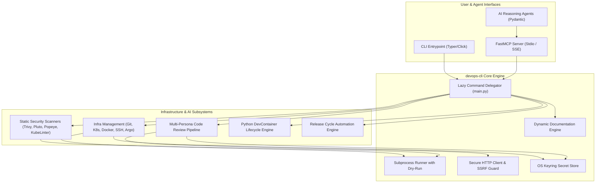
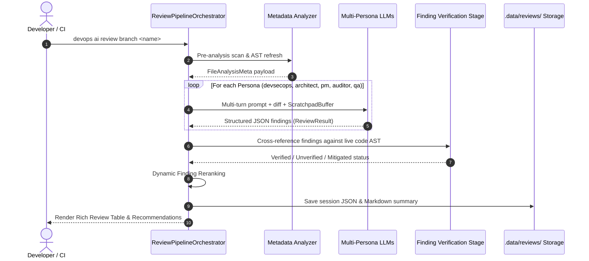
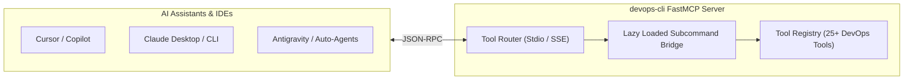
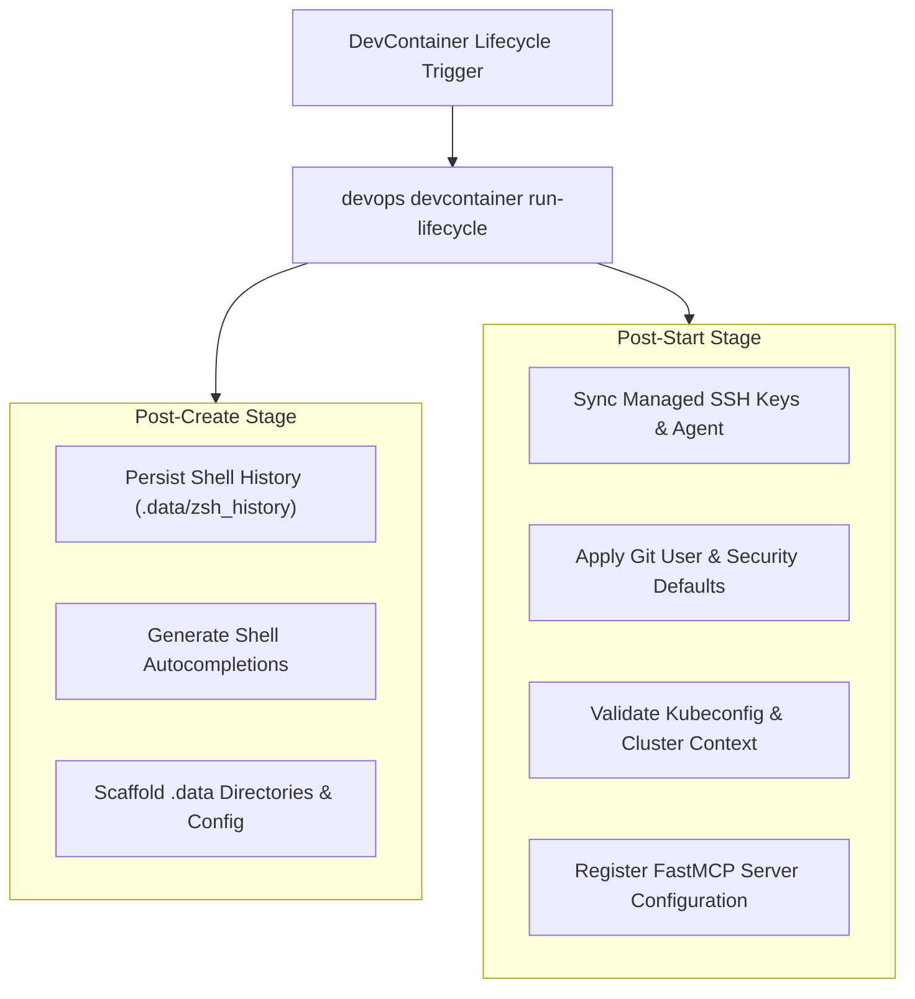

# System Architecture & Technical Design — devops-cli

This document outlines the architecture, subsystem design, data flow, and security boundaries of `devops-cli`.

---

## 1. High-Level System Architecture

`devops-cli` is architected as a modular infrastructure automation CLI and multi-agent code analysis platform.

---

## 2. Multi-Persona Code Review Pipeline

The Agentic Code Review engine splits code analysis across specialized domain personas with structured reasoning context and deterministic verification.

### Review Personas & Specializations
- **`devsecops`**: Static vulnerability scanning, secret detection, and IAM least-privilege analysis.
- **`architect`**: Scalability, SOLID design principles, structural coupling, and boundary cohesion.
- **`pm`**: Feature completeness, requirement traceability, and non-functional guarantees.
- **`auditor`**: Compliance, governance, audit trail logging, and regulatory controls.
- **`qa`**: Edge cases, error handling paths, test mocking adherence, and regression risk.

---

## 3. FastMCP Integration & Bridge Architecture

`devops-cli` exposes its complete infrastructure and review capabilities over the **Model Context Protocol (FastMCP)**, enabling seamless integration with external AI IDEs, autonomous subagents, and Claude/Cursor tools.

---

## 4. Native DevContainer Lifecycle Engine

Replacing fragile bash scripts (`postCreate.sh`, `postStart.sh`), `devops devcontainer run-lifecycle` executes cross-platform Python lifecycle tasks:

---

## 5. Security & Threat Model

1. **Zero-Plaintext Secret Storage**:
   - Secrets are managed exclusively through OS Keyring (`keyring`), isolating API tokens and credentials from git commits, environment dumps, and config files.
2. **SSRF Guardrails (`validate_service_url`)**:
   - Outbound network requests evaluate resolved IP addresses against RFC 1918, loopback, and cloud metadata ranges to prevent SSRF vulnerabilities.
3. **Safe Subprocess Execution**:
   - All external binary invocations (`git`, `kubectl`, `trivy`, `docker`) use explicit argument arrays with `shell=False` and deterministic timeout boundaries.

---

## 6. SRE Reliability, Observability & Quality Gates

- **Structured Metrics & Telemetry**: Integrates with Prometheus query endpoints (`devops prometheus`) and Grafana dashboards (`devops grafana`) to monitor workstation and cluster health.
- **7-Gate CI Quality Gate**: Automated enforcement of Python 3.14 runtime, Ruff formatting, Mypy strict typing, documentation freshness, test coverage, and static security scanning (`devops ci run`).
- **Release Verification & Introspection**: Built-in release cycle management (`devops release status`, `devops release check`, `devops release tag`) ensures consistent versioning and documentation synchronization across releases.

---

## 7. Universal Architectural Standards & Consistency Blueprint

To ensure complete stylistic cohesion, maintainability, and zero boilerplate project-wide, the codebase enforces five core architectural design patterns:

### 1. Declarative CLI Command Dispatch (`@cli_command_handler`)
Every CLI subcommand across all 30+ Typer command modules follows a single declarative decorator pattern:
- Automatic `--dry-run` inspection and `render_dry_run_result()` response generation.
- Automatic OpenTelemetry span wrapping (`@trace_span`) with standardized span attributes (`domain`, `operation`, `arguments`).
- Centralized domain exception interception with formatted Rich diagnostics output.
- Unified multi-format serialization (`--format json|yaml|table|markdown`) mapped directly to domain Pydantic `*Result` models.

### 2. End-to-End Pydantic Resource Model Interoperability
All data exchange across CLI commands, FastMCP tools, PydanticAI multi-agent turns, and FastAPI REST endpoints (`/api/v1/...`) binds to identical typed Pydantic models in `devops_cli.models`:
- **Strict Typing**: Mandatory field descriptions, `Field(default_factory=...)` mutable defaults, and zero hardcoded synthetic scoring floats.
- **Bi-Directional JSON Schema Generation**: Clean schema generation for IDE completions and LLM tool calling.

### 3. Universal Process Execution Pipeline (`ProcessExecutionPipeline`)
All external tool and binary invocations (`tofu`, `kubectl`, `helm`, `dive`, `trivy`, `semgrep`, `gitleaks`) utilize a single subprocess pipeline:
- Strict command argument list verification (rejecting hyphen-prefixed injection payloads).
- Explicit bounded timeouts with standardized `TimeoutExpired` domain error translation.
- Structured SIEM audit trail recording (`.data/logs/audit.jsonl`).
- Deterministic mock isolation protocols for fast offline unit testing.

### 4. Universal Multi-Stage Workflow Protocol (`StagePipeline[ContextT, ResultT]`)
All multi-step agentic workflows (`review`, `analyze`, `spec`, `benchmark`, `diagram`, `test-gen`) implement a standardized stage protocol:
- Partitioned into single-responsibility stage modules under `stages/` (e.g. `pre_analysis.py`, `static_scan.py`, `persona_review.py`).
- Standardized stage lifecycle hooks (`before_stage`, `after_stage`, `on_stage_error`).
- Scratchpad buffer reasoning state handover between stages.

### 5. Unified Async HTTP/2 Connection & Security Broker (`HttpClientBroker`)
All outbound HTTP operations (LLM APIs, OSV.dev, Shodan, Cloudflare Radar, GitHub API) share a single connection broker:
- Native HTTP/2 connection pooling with persistent keepalive and backoff retries.
- SSRF private-network isolation and egress endpoint validation.
- Automatic W3C `traceparent` header injection for distributed trace waterfalls.
