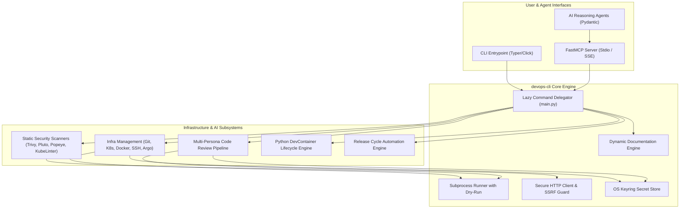
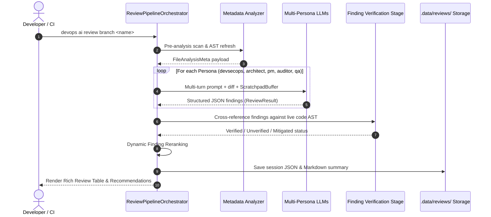
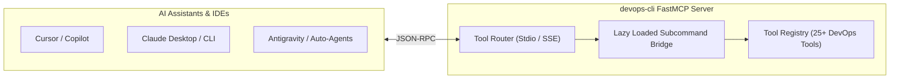
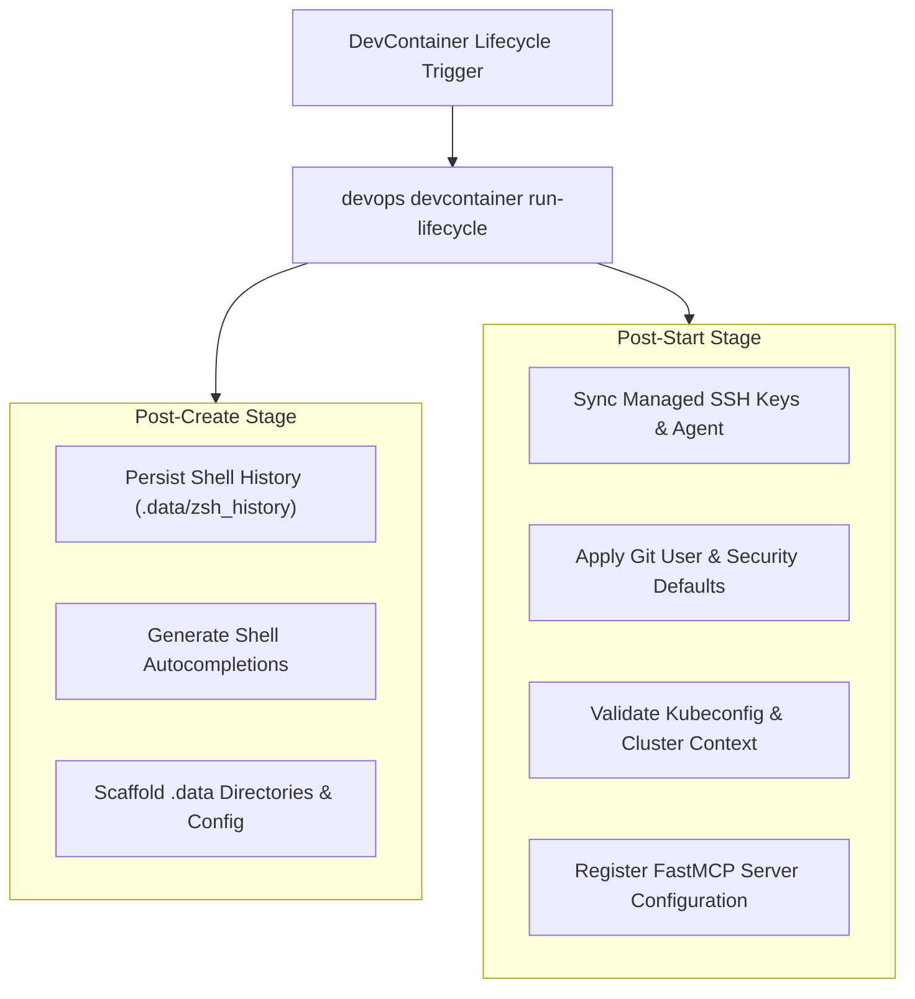

# System Architecture & Technical Design — devops-cli

This document outlines the architecture, subsystem design, data flow, and security boundaries of `devops-cli`.

---

## 1. High-Level System Architecture

`devops-cli` is architected as a modular infrastructure automation CLI and multi-agent code analysis platform.

---

## 2. Multi-Persona Code Review Pipeline

The Agentic Code Review engine splits code analysis across specialized domain personas with structured reasoning context and deterministic verification.

### Review Personas & Specializations
- **`devsecops`**: Static vulnerability scanning, secret detection, and IAM least-privilege analysis.
- **`architect`**: Scalability, SOLID design principles, structural coupling, and boundary cohesion.
- **`pm`**: Feature completeness, requirement traceability, and non-functional guarantees.
- **`auditor`**: Compliance, governance, audit trail logging, and regulatory controls.
- **`qa`**: Edge cases, error handling paths, test mocking adherence, and regression risk.

---

## 3. FastMCP Integration & Bridge Architecture

`devops-cli` exposes its complete infrastructure and review capabilities over the **Model Context Protocol (FastMCP)**, enabling seamless integration with external AI IDEs, autonomous subagents, and Claude/Cursor tools.

---

## 4. Native DevContainer Lifecycle Engine

Replacing fragile bash scripts (`postCreate.sh`, `postStart.sh`), `devops devcontainer run-lifecycle` executes cross-platform Python lifecycle tasks:

---

## 5. Security & Threat Model

1. **Zero-Plaintext Secret Storage**:
   - Secrets are managed exclusively through OS Keyring (`keyring`), isolating API tokens and credentials from git commits, environment dumps, and config files.
2. **SSRF Guardrails (`validate_service_url`)**:
   - Outbound network requests evaluate resolved IP addresses against RFC 1918, loopback, and cloud metadata ranges to prevent SSRF vulnerabilities.
3. **Safe Subprocess Execution**:
   - All external binary invocations (`git`, `kubectl`, `trivy`, `docker`) use explicit argument arrays with `shell=False` and deterministic timeout boundaries.

---

## 6. SRE Reliability, Observability & Quality Gates

- **Structured Metrics & Telemetry**: Integrates with Prometheus query endpoints (`devops prometheus`) and Grafana dashboards (`devops grafana`) to monitor workstation and cluster health.
- **7-Gate CI Quality Gate**: Automated enforcement of Python 3.14 runtime, Ruff formatting, Mypy strict typing, documentation freshness, test coverage, and static security scanning (`devops ci run`).
- **Release Verification & Introspection**: Built-in release cycle management (`devops release status`, `devops release check`, `devops release tag`) ensures consistent versioning and documentation synchronization across releases.
