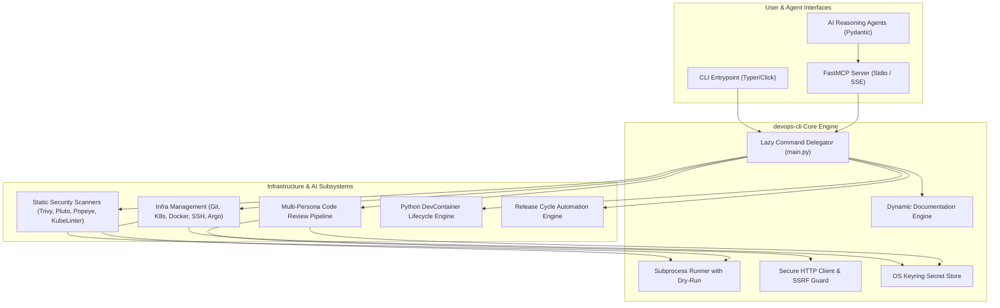
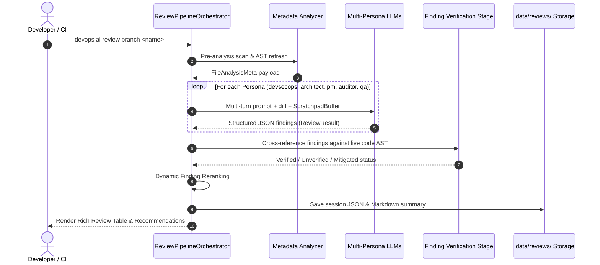
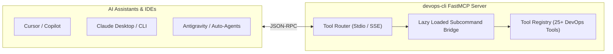
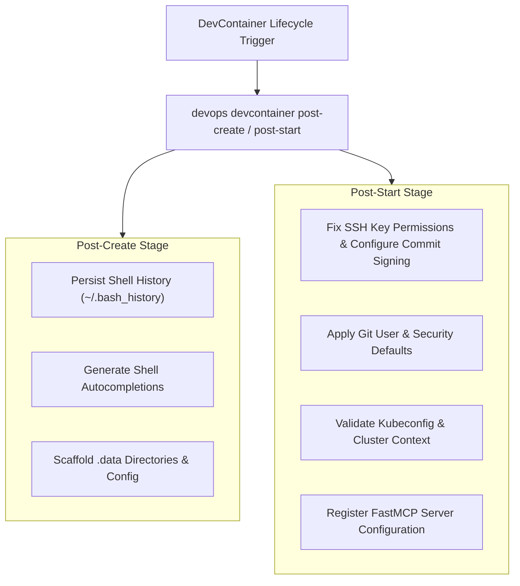

# System Architecture & Technical Design — devops-cli

This document outlines the architecture, subsystem design, data flow, and security boundaries of `devops-cli`.

---

## 1. High-Level System Architecture

`devops-cli` is architected as a modular infrastructure automation CLI and multi-agent code analysis platform.

```mermaid
flowchart TD
    subgraph UserInterface["User & Agent Interfaces"]
        CLI["CLI Entrypoint (Typer/Click)"]
        MCP["FastMCP Server (Stdio / SSE)"]
        AI_AGENT["AI Reasoning Agents (Pydantic)"]
    end

    subgraph CoreEngine["devops-cli Core Engine"]
        MAIN["Lazy Command Delegator (main.py)"]
        PROCESS["Subprocess Runner with Dry-Run"]
        HTTP_SEC["Secure HTTP Client & SSRF Guard"]
        KEYRING["OS Keyring Secret Store"]
        DOCS_GEN["Dynamic Documentation Engine"]
    end

    subgraph Subsystems["Infrastructure & AI Subsystems"]
        SUB_INFRA["Infra Management (Git, K8s, Docker, SSH, Argo)"]
        SUB_SECOPS["Static Security Scanners (Trivy, Pluto, Popeye, KubeLinter)"]
        SUB_AI_REV["Multi-Persona Code Review Pipeline"]
        SUB_DEVCONTAINER["Python DevContainer Lifecycle Engine"]
        SUB_RELEASE["Release Cycle Automation Engine"]
    end

    CLI --> MAIN
    MCP --> MAIN
    AI_AGENT --> MCP

    MAIN --> SUB_INFRA
    MAIN --> SUB_SECOPS
    MAIN --> SUB_AI_REV
    MAIN --> SUB_DEVCONTAINER
    MAIN --> SUB_RELEASE

    SUB_AI_REV --> HTTP_SEC
    SUB_INFRA --> PROCESS
    SUB_SECOPS --> PROCESS
    SUB_INFRA --> KEYRING
    SUB_AI_REV --> KEYRING
    MAIN --> DOCS_GEN
```

---

## 2. Multi-Persona Code Review Pipeline

The Agentic Code Review engine splits code analysis across specialized domain personas with structured reasoning context and deterministic verification.

```mermaid
sequenceDiagram
    autonumber
    actor Dev as Developer / CI
    participant Orch as ReviewPipelineOrchestrator
    participant Meta as Metadata Analyzer
    participant LLM as Multi-Persona LLMs
    participant Verify as Finding Verification Stage
    participant Store as .data/reviews/ Storage

    Dev->>Orch: devops ai review branch <name>
    Orch->>Meta: Pre-analysis scan & AST refresh
    Meta-->>Orch: FileAnalysisMeta payload
    loop For each Persona (devsecops, architect, pm, auditor, qa)
        Orch->>LLM: Multi-turn prompt + diff + ScratchpadBuffer
        LLM-->>Orch: Structured JSON findings (ReviewResult)
    end
    Orch->>Verify: Cross-reference findings against live code AST
    Verify-->>Orch: Verified / Unverified / Mitigated status
    Orch->>Orch: Dynamic Finding Reranking
    Orch->>Store: Save session JSON & Markdown summary
    Orch-->>Dev: Render Rich Review Table & Recommendations
```

### Review Personas & Specializations
- **`devsecops`**: Static vulnerability scanning, secret detection, and IAM least-privilege analysis.
- **`architect`**: Scalability, SOLID design principles, structural coupling, and boundary cohesion.
- **`pm`**: Feature completeness, requirement traceability, and non-functional guarantees.
- **`auditor`**: Compliance, governance, audit trail logging, and regulatory controls.
- **`qa`**: Edge cases, error handling paths, test mocking adherence, and regression risk.

---

## 3. FastMCP Integration & Bridge Architecture

`devops-cli` exposes its complete infrastructure and review capabilities over the **Model Context Protocol (FastMCP)**, enabling seamless integration with external AI IDEs, autonomous subagents, and Claude/Cursor tools.

```mermaid
flowchart LR
    subgraph ExternalAgents["AI Assistants & IDEs"]
        Cursor["Cursor / Copilot"]
        Claude["Claude Desktop / CLI"]
        Subagents["Antigravity / Auto-Agents"]
    end

    subgraph FastMCPServer["devops-cli FastMCP Server"]
        Router["Tool Router (Stdio / SSE)"]
        Bridge["Lazy Loaded Subcommand Bridge"]
        Registry["Tool Registry (25+ DevOps Tools)"]
    end

    ExternalAgents <-->|JSON-RPC| Router
    Router --> Bridge
    Bridge --> Registry
```

---

## 4. Native DevContainer Lifecycle Engine

Replacing fragile bash scripts, `devops devcontainer post-create` and `devops devcontainer post-start` (wrapped together by `devops devcontainer run-lifecycle`) execute cross-platform Python lifecycle tasks:

```mermaid
flowchart TD
    DC_HOOK["DevContainer Lifecycle Trigger"] --> PY_ENGINE["devops devcontainer post-create / post-start"]

    subgraph PostCreateTasks["Post-Create Stage"]
        T1["Persist Shell History (~/.bash_history)"]
        T2["Generate Shell Autocompletions"]
        T3["Scaffold .data Directories & Config"]
    end

    subgraph PostStartTasks["Post-Start Stage"]
        T4["Fix SSH Key Permissions & Configure Commit Signing"]
        T5["Apply Git User & Security Defaults"]
        T6["Validate Kubeconfig & Cluster Context"]
        T7["Register FastMCP Server Configuration"]
    end

    PY_ENGINE --> PostCreateTasks
    PY_ENGINE --> PostStartTasks
```

---

## 5. Security & Threat Model

1. **Zero-Plaintext Secret Storage**:
   - Secrets are managed exclusively through OS Keyring (`keyring`), isolating API tokens and credentials from git commits, environment dumps, and config files.
2. **SSRF Guardrails (`devops_cli.http.egress`)**:
   - HTTP clients built by `devops_cli.http.client` resolve each host once, at the connect, and dial only the addresses their egress level admits (public, loopback or private), checked against RFC 1918, loopback, link-local and cloud metadata ranges. Cloud metadata is refused at every level, and TLS still verifies the hostname.
3. **Safe Subprocess Execution**:
   - All external binary invocations (`git`, `kubectl`, `trivy`, `docker`) use explicit argument arrays with `shell=False` and deterministic timeout boundaries.

---

## 6. SRE Reliability, Observability & Quality Gates

- **Structured Metrics & Telemetry**: Integrates with Prometheus query endpoints (`devops prometheus`) and Grafana dashboards (`devops grafana`) to monitor workstation and cluster health.
- **Gated CI Quality Gate**: Automated enforcement of Python 3.14 runtime, Ruff formatting, Mypy strict typing, documentation freshness, test coverage, and static security scanning (`devops ci`).
- **Release Verification & Introspection**: Built-in release cycle management (`devops release status`, `devops release check`, `devops release tag`) ensures consistent versioning and documentation synchronization across releases.

---

## 7. Universal Architectural Standards & Consistency Blueprint

To ensure complete stylistic cohesion, maintainability, and zero boilerplate project-wide, the codebase follows core architectural design patterns:

### 1. Declarative CLI Command Dispatch & OpenTelemetry Instrumentation
Every command is registered on a `new_typer()` app (`OTelTyper`, `devops_cli/core/cli.py`), which wraps it in a `cli.<command>` OpenTelemetry span:
- Each command handles `--dry-run` itself via `is_dry_run()` / `render_dry_run_result()`.
- Automatic OpenTelemetry span wrapping with standardized span attributes (`domain`, `operation`, `arguments`).
- Centralized domain exception interception with formatted Rich diagnostics output.
- Commands that offer machine-readable output declare their own `--format` (table/json/yaml via `devops_cli.output.serialization.emit_serialized`) or `--json` flag. There is no global `--format` option.

### 2. End-to-End Pydantic Resource Model Interoperability
Domain results are modelled with Pydantic in `devops_cli.models`. The REST routes define their own response models in `server/routes/`, and MCP tools return the CLI's text output:
- **Strict Typing**: Mandatory field descriptions, `Field(default_factory=...)` mutable defaults, and zero hardcoded synthetic scoring floats.
- **Bi-Directional JSON Schema Generation**: Clean schema generation for IDE completions and LLM tool calling.

### 3. Safe Subprocess Execution & Process Group Management
All external binaries run through `run_subprocess` / `run_subprocess_async` (`devops_cli.core.process`):
- Strict command argument list verification (rejecting hyphen-prefixed injection payloads) with `shell=False`.
- Explicit bounded timeouts (default 1800 s) with standardized `TimeoutExpired` domain error translation.
- An audit-record writer (`devops_cli.core.audit.record_audit_event`, `.data/logs/audit.jsonl`) exists but is not yet called from command or subprocess execution.
- Deterministic mock isolation protocols for fast offline unit testing, dry-run reporting, environment isolation, and OpenTelemetry spans.

### 4. Multi-Stage Workflow Architecture
The review workflow runs as `ReviewPipelineOrchestrator` methods (pre-analysis, payload init, persona review, verification, re-ranking, reporting), and `ai/review/stages/` holds `adversarial_debate.py` and `reporting.py`:
- Partitioned into single-responsibility stage modules under `stages/` (e.g. `adversarial_debate.py`, `reporting.py`).
- Standardized stage lifecycle hooks (`before_stage`, `after_stage`, `on_stage_error`).
- Scratchpad buffer reasoning state handover between stages.

### 5. HTTP Connection Management & Security Broker
`HttpClientBroker` (`devops_cli.http.broker`) serves agent tools and Vault with HTTP/2 and W3C `traceparent` injection. Its clients, and the shared LLM connection pool in `devops_cli.http.pool`, are built by `devops_cli.http.client`, so each address they dial is checked at the connect and on every redirect hop (see SSRF Guardrails above). The GitHub, vulnerability-lookup and Cloudflare clients still create their own `httpx2` clients until #1381 moves them:
- Native HTTP/2 connection pooling with persistent keepalive and backoff retries where supported.
- Connect-time egress checks by level (public, loopback-allowed, private-allowed), with cloud metadata addresses refused at every level.
- Automatic W3C `traceparent` header injection for distributed trace waterfalls.
