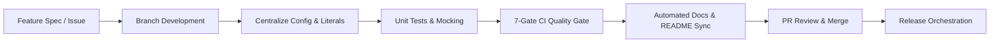
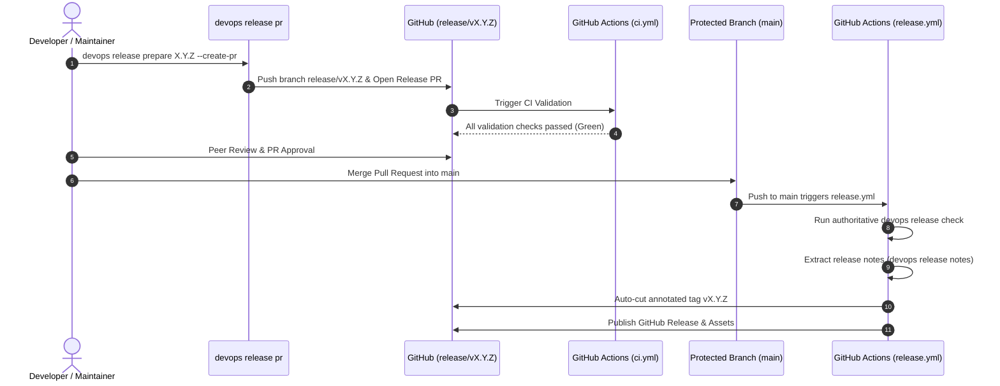

# Release Cycle & Engineering Workflow — devops-cli

This document defines the end-to-end lifecycle for implementing features, verifying system integrity, and orchestrating releases for `devops-cli`.

---

## 1. Release Philosophy & Versioning Scheme

`devops-cli` adheres strictly to [Semantic Versioning 2.0.0](https://semver.org/spec/v2.0.0.html) (`MAJOR.MINOR.PATCH`):
- **MAJOR (`X.0.0`)**: Incompatible API or breaking CLI command syntax changes.
- **MINOR (`0.Y.0`)**: Backward-compatible new functionality (e.g., new subcommands, security scanners, or FastMCP tools).
- **PATCH (`0.0.Z`)**: Backward-compatible bug fixes, performance optimizations, or prompt refinements.

### Ecosystem & Runtime Alignment
- **Bleeding-Edge Python**: Builds track Python 3.14+ runtime features (e.g., modern syntax, typing improvements, `pydantic v2`).
- **Zero-Plaintext Policy**: Secrets (GitHub tokens, OpenAI API keys, Grafana credentials) are managed exclusively through OS Keyring.
- **Network Egress Guardrails**: SSRF mitigation logic (`validate_service_url`) is enforced across all outbound network calls.

---

## 2. Feature Implementation Lifecycle



### Stage 1: Design & Branch Creation
1. Create a dedicated feature branch from the active release branch (`release/v<version>`) or `main`:
   ```bash
   git checkout -b feature/<feature-name>
   # or
   git checkout -b fix/<bug-name>
   ```
2. Ensure environment synchronization using `uv`:
   ```bash
   uv sync
   ```
3. **PR Base Branch Targeting**: When opening Pull Requests, target the active release branch (`--base release/v<version>`). Only release branches target `main`.
4. **Agent Non-Merge Rule**: Automated agents must update PR branches with new commits without autonomously merging. Merging is reserved for human maintainers.
5. **No Commits to Merged/Unrelated Branches**: Never commit or push work to a topic branch that has already been merged or is unrelated to the current task. Always branch off fresh from the active release branch (`git checkout -b <type>/<name> origin/release/v<version>`).


### Stage 2: Code Implementation & Architectural Standards
- **Modular Subcommand Pattern**: New CLI subcommands must be implemented under `src/devops_cli/commands/` and registered in `src/devops_cli/main.py` via `_COMMAND_SPECS`.
- **FastMCP Tool Parity**: Infrastructure commands should expose corresponding lazy MCP tools under `src/devops_cli/ai/mcp/` where appropriate.
- **Literal & Constant Centralization**:
  - Centralize timeouts and defaults in [`src/devops_cli/config/defaults.py`](file:///workspaces/devops-cli/src/devops_cli/config/defaults.py).
  - Centralize static paths, regex patterns, and protocol constants in [`src/devops_cli/config/constants.py`](file:///workspaces/devops-cli/src/devops_cli/config/constants.py).
  - Centralize user-facing help messages, summaries, and error logs in [`src/devops_cli/lang/`](file:///workspaces/devops-cli/src/devops_cli/lang/).
- **Dry-Run Support**: All state-modifying subcommands must support the `--dry-run` flag via `devops_cli.dry_run`.

### Stage 3: Automated Testing & Mocking Standards
- **Mocking Policy**: All unit tests must isolate external side-effects using `unittest.mock`, `pytest-mock`, or generic mock placeholders (e.g., `http://node1.example.test`). Live provider calls or hardcoded personal credentials in tests are strictly prohibited.
- **Parallel Test Execution**: Run tests with `pytest-xdist`:
  ```bash
  uv run pytest
  ```

---

## 3. Documentation & Verification Standards

Documentation is dynamic and verified in CI. Handcrafted drift in CLI references is prevented by automated introspection.

### Automated Documentation Generation
When adding or modifying subcommands, options, environment variables, or FastMCP tools:
1. Regenerate Markdown documentation and update the Command Matrix in `README.md`:
   ```bash
   uv run devops docs generate --sync-readme
   ```
2. Verify documentation freshness:
   ```bash
   uv run devops docs check
   ```
## 3. Documentation Standards & Generation

The `devops-cli` maintains living, introspected documentation:

| Document | Purpose |
| :--- | :--- |
| [`README.md`](file:///workspaces/devops-cli/README.md) | Project introduction, architecture overview, and command matrix. |
| [`docs/CLI_REFERENCE.md`](file:///workspaces/devops-cli/docs/CLI_REFERENCE.md) | Complete reference of all subcommands, options, and parameters. |
| [`docs/ENV_VARS.md`](file:///workspaces/devops-cli/docs/ENV_VARS.md) | Environment variables, defaults, types, and descriptions. |
| [`docs/MCP_TOOLS.md`](file:///workspaces/devops-cli/docs/MCP_TOOLS.md) | FastMCP tools, input schemas, and execution parameters. |
| `docs/commands/<group>.md` | Dedicated per-command-group reference manuals. |

---

## 4. CI Validation Suite

The `devops ci` suite is the authoritative validation gate. All checks must pass cleanly before any merge or release. See [**`docs/ROUTINE_TASKS.md`**](docs/ROUTINE_TASKS.md) for the complete routine task order, frequency, and methodology.

```bash
# Run full CI validation suite
uv run devops ci
```

### Core Validation Checks
1. **Python Version Check**: Strictly enforces Python 3.14+ runtime.
2. **Unit Tests (`pytest -n auto --maxprocesses=4`)**: Parallel unit test execution with full mock isolation.
3. **Code Coverage (`pytest-cov`)**: Enforces branch and line coverage thresholds.
4. **Linting (`ruff check .`)**: Strict PEP 8 linting, import sorting, and unused symbol elimination.
5. **Formatting (`ruff format --check .`)**: Enforces 100-character line length standards.
6. **Type Checking (`mypy --strict src`)**: Full static type checking in strict mode across all source files.
7. **Dependency Audit (`uv audit`)**: Automated vulnerability scanning of lockfile packages against OSV.
8. **Security Scan (`bandit`)**: Static vulnerability, subshell safety, and code analysis.
9. **Workflow Linting (`actionlint`)**: Validates GitHub Actions workflow schemas and script syntax.
10. **DevContainer Smoke Test (`devops devcontainer validate`)**: Smoke-tests DevContainer manifests prior to publication.
11. **Documentation Validation (`devops docs check`)**: Asserts all CLI markdown docs and README matrices are synchronized.

---

## 5. Release Subcommands Suite (`devops release`)

The `devops-cli` provides native first-class subcommands to automate every stage of the release lifecycle:

| Subcommand | Description | Example |
| :--- | :--- | :--- |
| `devops release status` | Displays release version consistency, git tag, changelog state, and docs freshness. | `devops release status` |
| `devops release prepare <ver>` | Bumps versions in `pyproject.toml` and `__init__.py`, updates `CHANGELOG.md`, and syncs docs/README. | `devops release prepare 0.1.10 [-p]` |
| `devops release pr [-v <ver>]` | Creates a release branch (`release/vX.Y.Z`), commits bumps, and opens a GitHub Release PR. | `devops release pr -v 0.1.10` |
| `devops release check` | Authoritative verification gate: asserts version matching, clean git tree, docs freshness, and CI validation. | `devops release check` |
| `devops release notes [-v <ver>]` | Extracts and renders formatted markdown release notes from `CHANGELOG.md`. | `devops release notes -v 0.1.10` |
| `devops release tag [-v <ver>]` | Creates release commit and annotated git tag (used by CI release automation on `main`). | `devops release tag 0.1.10` |

---

## 6. GitHub Pull Request Merge Controls & Release Orchestration

Releases in `devops-cli` enforce **GitHub Pull Request Merge Controls** and Branch Protection rules on `main`. Direct manual pushes to `main` and direct developer tagging are prohibited; every release is gated behind peer review and automated CI validation checks.



---

## 7. Step-by-Step Release Procedure

### Step 1: Check Current Status
```bash
uv run devops release status
```

### Step 2: Prepare Release & Open GitHub Release PR
Use the unified `--create-pr` flag (or `devops release pr`) to automate version bumping, changelog updating, docs regeneration, branch creation, commit, and PR submission:
```bash
# Prepares version, commits changes to branch 'release/vX.Y.Z', and opens GitHub PR
uv run devops release prepare X.Y.Z --create-pr
```

### Step 3: CI Quality Gate & PR Review Gate
1. The opened Pull Request triggers `.github/workflows/ci.yml` which validates:
   - Python 3.14 runtime environment
   - Ruff linting & formatting (`ruff check`, `ruff format --check`)
   - Mypy strict type checking (`mypy --strict src`)
   - Documentation freshness (`devops docs check`)
   - Pytest unit tests and test coverage thresholds
   - Bandit static security scanning
2. Maintainers review the release diff, changelog, and documentation updates.

### Step 4: Merge PR into `main` (Maintainer Gate)
Once all automated CI checks pass and reviews are complete, repository maintainers squash-merge the approved Release Pull Request into `main` via the GitHub Web UI or CLI (`gh pr merge --squash`). Automated AI agents do not perform merges autonomously.


### Step 5: Automated Release Publishing (GitHub Actions)
Upon PR merge into `main`, [`.github/workflows/release.yml`](.github/workflows/release.yml) automatically:
1. Detects the release commit (`chore(release): bump version to vX.Y.Z`).
2. Runs authoritative verification (`devops release check --allow-dirty`).
3. Cuts and pushes the annotated git tag `vX.Y.Z`.
4. Extracts release notes using `devops release notes` and creates the official GitHub Release.

### Step 6: Post-Release DevContainer Validation
Verify DevContainer lifecycle operations:
```bash
uv run devops devcontainer run-lifecycle --all
```

---

## 8. Upcoming Version Roadmap

### v0.1.9 — OpenTofu Multi-Cloud Infrastructure & Kubernetes Cloud Provisioning
- **OpenTofu CLI Integration (`devops tofu` / `devops tf`)**: Infrastructure-as-Code command suite automating OpenTofu initialization, planning, applying, state inspection, and outputs.
- **Multi-Cloud Cloud Resource Modules (`tf/`)**: Production OpenTofu manifests for provisioning Kubernetes clusters and cloud networking across AWS (EKS), Azure (AKS), and Google Cloud (GKE) tailored for deploying project `k8s/` resources.
- **Automated Multi-Cloud Kubeconfig Synchronization**: Direct integration between cloud cluster provisioning outputs and `devops k8s bootstrap` / `devops k8s deploy-stack`.
