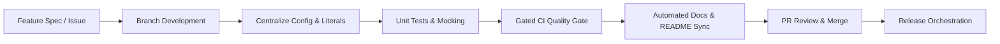
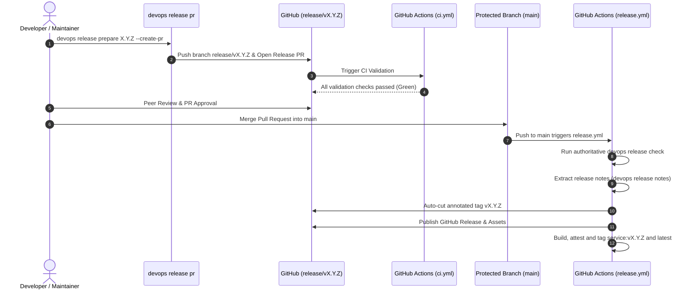

# Release Cycle & Engineering Workflow — devops-cli

This document defines the end-to-end lifecycle for implementing features, verifying system integrity, and orchestrating releases for `devops-cli`.

---

## 1. Release Philosophy & Versioning Scheme

### Pre-1.0 Alpha Lifecycle & Zero Backwards Compatibility Guarantee
`devops-cli` is active **alpha software** prior to release `1.0.0`:
- **Zero Backwards Compatibility Guarantee**: Until at least release `1.0.0`, there is **no intention of maintaining backwards compatibility**. Breaking changes, interface evolutions, parameter alterations, and schema redesigns may occur across any release cycle without legacy shims.
- **Zero Legacy Remnants**: The codebase must remain clean of legacy references, obsolete shims, deprecated aliases, and vestigial fallback paths at all times so that it can reach architectural maturity at a reasonable rate.
- **Clean Solutions Over Zombie Code**: Features and interfaces are designed cleanly for current and future needs rather than burdened with compatibility workarounds.

### Post-1.0 Semantic Versioning & Enterprise Change Management
Any version released after `1.0.0` will strictly adhere to [Semantic Versioning 2.0.0](https://semver.org/spec/v2.0.0.html) (`MAJOR.MINOR.PATCH`):
- **MAJOR (`X.0.0`)**: Incompatible API or breaking CLI command syntax changes.
- **MINOR (`X.Y.0`)**: Backward-compatible new functionality (e.g., new subcommands, security scanners, or FastMCP tools).
- **PATCH (`X.Y.Z`)**: Backward-compatible bug fixes, performance optimizations, or prompt refinements.
- **Change Management Best Practices**: Post-1.0 releases will utilize all enterprise change management mechanisms, including runtime feature flags, structured multi-release deprecation warnings (emitted for at least one minor release cycle before removal), and automated migration tooling.

### Ecosystem & Runtime Alignment
- **Bleeding-Edge Python**: Builds track Python 3.14+ runtime features (e.g., modern syntax, typing improvements, `pydantic v2`).
- **Zero-Plaintext Policy**: Secrets (GitHub tokens, OpenAI API keys, Grafana credentials) are managed exclusively through OS Keyring.
- **Network Egress Guardrails**: SSRF mitigation logic (`validate_service_url`) is enforced across all outbound network calls.

---

## 2. Feature Implementation Lifecycle


```mermaid
flowchart LR
    A[Feature Spec / Issue] --> B[Branch Development]
    B --> C[Centralize Config & Literals]
    C --> D[Unit Tests & Mocking]
    D --> E[Gated CI Quality Gate]
    E --> F[Automated Docs & README Sync]
    F --> G[PR Review & Merge]
    G --> H[Release Orchestration]
```

### Stage 1: Design & Branch Creation
1. Create a dedicated feature branch from the active release branch (`release/v<version>`) or `main`:
   ```bash
   git checkout -b feature/<feature-name>
   # or
   git checkout -b fix/<bug-name>
   ```
2. Ensure environment synchronization using `uv`:
   ```bash
   uv sync
   ```
3. **PR Base Branch Targeting**: When opening Pull Requests, target the active release branch (`--base release/v<version>`). Only release branches target `main`.
4. **Agent Non-Merge Rule**: Automated agents must update PR branches with new commits without autonomously merging. Merging is reserved for human maintainers.
5. **No Commits to Merged/Unrelated Branches**: Never commit or push work to a topic branch that has already been merged or is unrelated to the current task. Always branch off fresh from the active release branch (`git checkout -b <type>/<name> origin/release/v<version>`).
6. **Changelog Fragments**: Add the item's changelog entry as `changelog.d/<issue>.md` (see [`changelog.d/README.md`](changelog.d/README.md)). Do not edit `CHANGELOG.md` or `docs/ROADMAP.md` in an item PR: `devops release prepare` collects the fragments into the version's section at the cut, `devops roadmap render` regenerates the roadmap, and `devops pr check-readiness` blocks a PR into a release branch that changes either file. Only the release PR (`chore/cut-vX.Y.Z` into `main`) and cycle-open PRs (`chore/open-vX.Y.Z`, optionally followed by `-<slug>`, into `release/vX.Y.Z`) edit them.


### Stage 2: Code Implementation & Architectural Standards
- **Modular Subcommand Pattern**: New CLI subcommands must be implemented under `src/devops_cli/commands/` and registered in `src/devops_cli/main.py` via `_COMMAND_SPECS`.
- **FastMCP Tool Parity**: Infrastructure commands should expose corresponding lazy MCP tools under `src/devops_cli/ai/mcp/` where appropriate.
- **Literal & Constant Centralization**:
  - Centralize timeouts and defaults in [`src/devops_cli/config/defaults.py`](src/devops_cli/config/defaults.py).
  - Centralize static paths, regex patterns, and protocol constants in [`src/devops_cli/config/constants.py`](src/devops_cli/config/constants.py).
  - Centralize user-facing help messages, summaries, and error logs in [`src/devops_cli/lang/`](src/devops_cli/lang/).
- **Dry-Run Support**: All state-modifying subcommands must support the `--dry-run` flag via `devops_cli.dry_run`.

### Stage 3: Automated Testing & Mocking Standards
- **Mocking Policy**: All unit tests must isolate external side-effects using `unittest.mock`, `pytest-mock`, or generic mock placeholders (e.g., `http://node1.example.test`). Live provider calls or hardcoded personal credentials in tests are strictly prohibited.
- **Parallel Test Execution**: Run tests with `pytest-xdist`:
  ```bash
  uv run pytest
  ```

---

## 3. Documentation & Verification Standards

Documentation is dynamic and verified in CI. Handcrafted drift in CLI references is prevented by automated introspection.

### Automated Documentation Generation
When adding or modifying subcommands, options, environment variables, or FastMCP tools:
1. Regenerate Markdown documentation and update the Command Matrix in `README.md`:
   ```bash
   uv run devops docs generate --sync-readme
   ```
2. Verify documentation freshness:
   ```bash
   uv run devops docs check
   ```
## 3. Documentation Standards & Generation

The `devops-cli` maintains living, introspected documentation:

| Document | Purpose |
| :--- | :--- |
| [`README.md`](README.md) | Project introduction, architecture overview, and command matrix. |
| [`docs/CLI_REFERENCE.md`](docs/CLI_REFERENCE.md) | Complete reference of all subcommands, options, and parameters. |
| [`docs/ENV_VARS.md`](docs/ENV_VARS.md) | Environment variables, defaults, types, and descriptions. |
| [`docs/MCP_TOOLS.md`](docs/MCP_TOOLS.md) | FastMCP tools, input schemas, and execution parameters. |
| `docs/commands/<group>.md` | Dedicated per-command-group reference manuals. |

---

## 4. CI Validation Suite

The `devops ci` suite is the authoritative validation gate. All checks must pass cleanly before any merge or release. See [**`docs/ROUTINE_TASKS.md`**](docs/ROUTINE_TASKS.md) for the complete routine task order, frequency, and methodology.

```bash
# Run full CI validation suite
uv run devops ci
```

### Core Validation Checks
1. **Python Version Check**: Strictly enforces Python 3.14+ runtime.
2. **Unit Tests (`pytest -n auto --maxprocesses=8`)**: Parallel unit test execution with dynamic worker auto-scaling and full mock isolation.
3. **Code Coverage (`pytest-cov`)**: Enforces the 90% line coverage threshold.
4. **Linting (`ruff check .`)**: Strict PEP 8 linting, import sorting, and unused symbol elimination.
5. **Formatting (`ruff format --check .`)**: Enforces 100-character line length standards.
6. **Type Checking (`mypy --strict src`)**: Full static type checking in strict mode across all source files.
7. **Dependency Audit (`uv audit`)**: Automated vulnerability scanning of lockfile packages against OSV.
8. **Security Scan (`bandit`)**: Static vulnerability, subshell safety, and code analysis.
9. **Workflow Linting (`actionlint`)**: Validates GitHub Actions workflow schemas and script syntax.
10. **Documentation Validation (`devops docs check`)**: Asserts all CLI markdown docs and README matrices are synchronized.
11. **Project Environment Validation (`uv check`)**: Verifies project dependencies and Python environment consistency.
12. **Lockfile Validation (`uv lock --check`)**: Verifies `uv.lock` remains strictly synchronized with `pyproject.toml`.
13. **Dependency Freshness (`uv tree --outdated`)**: Inspects dependency tree for outdated packages.

CI (`ci.yml`) additionally runs `devops devcontainer validate --workspace .`. On pull requests, the Tests & Coverage job also writes an advisory changed-line coverage report (diff-cover) against the base branch to its job summary.

---

## 5. Release Subcommands Suite (`devops release`)

The `devops-cli` provides native first-class subcommands to automate every stage of the release lifecycle:

| Subcommand | Description | Example |
| :--- | :--- | :--- |
| `devops release status` | Displays release version consistency, git tag, changelog state, and docs freshness. | `devops release status` |
| `devops release prepare <ver>` | Bumps version in `pyproject.toml` (`__init__.py` derives `__version__` from it), collects `changelog.d/` into `CHANGELOG.md`, and syncs docs/README. | `devops release prepare 0.1.10 [-p]` |
| `devops release pr [-v <ver>]` | Creates a release branch (`release/vX.Y.Z`), commits bumps, and opens a GitHub Release PR. | `devops release pr -v 0.1.10` |
| `devops release check` | Authoritative verification gate: asserts version matching, clean git tree, docs freshness, and CI validation. | `devops release check` |
| `devops release notes [-v <ver>]` | Extracts and renders formatted markdown release notes from `CHANGELOG.md`. | `devops release notes -v 0.1.10` |
| `devops release tag [-v <ver>]` | Creates release commit and annotated git tag locally (release.yml tags with git directly). | `devops release tag -v 0.1.10` |

---

## 6. GitHub Pull Request Merge Controls & Release Orchestration

Releases in `devops-cli` enforce **GitHub Pull Request Merge Controls** and Branch Protection rules on `main`. Direct manual pushes to `main` and direct developer tagging are prohibited; every release is gated behind peer review and automated CI validation checks.


```mermaid
sequenceDiagram
    autonumber
    actor Dev as Developer / Maintainer
    participant CLI as devops release pr
    participant Git as GitHub (release/vX.Y.Z)
    participant CI as GitHub Actions (ci.yml)
    participant Main as Protected Branch (main)
    participant Rel as GitHub Actions (release.yml)

    Dev->>CLI: devops release prepare X.Y.Z --create-pr
    CLI->>Git: Push branch release/vX.Y.Z & Open Release PR
    Git->>CI: Trigger CI Validation
    CI-->>Git: All validation checks passed (Green)
    Dev->>Git: Peer Review & PR Approval
    Dev->>Main: Merge Pull Request into main
    Main->>Rel: Push to main triggers release.yml
    Rel->>Rel: Run authoritative devops release check
    Rel->>Rel: Extract release notes (devops release notes)
    Rel->>Git: Auto-cut annotated tag vX.Y.Z
    Rel->>Git: Publish GitHub Release & Assets
    Rel->>Rel: Build, attest and tag service:vX.Y.Z and latest
```

### Automated Release Cutting & Ruleset Bypass (`roadmap-service`)

When all deliverables in an active release milestone are delivered and closed, `roadmap-service` automatically cuts the release in its background closure job: it renders `docs/ROADMAP.md` on `release/vX.Y.Z`, bumps the version, pushes directly to `release/vX.Y.Z`, and opens the release pull request into `main`.

Because GitHub branch ruleset 23059172 enforces pull request requirements on `refs/heads/release*/**`, direct pushes to `release/vX.Y.Z` by automated background services require that the ruleset includes a bypass entry for the machine account's repository role (**Write**), mode **Always** (configured in **Settings → Rules → Rulesets → ruleset 23059172**). If a push is attempted without this bypass permission, GitHub refuses the push with `GH013`, and the cut raises a typed `ReleasePushRefusedError` explaining the ruleset refusal and bypass requirement.

---

## 7. Step-by-Step Release Procedure

### Step 1: Check Current Status
```bash
uv run devops release status
```

### Step 2: Prepare Release & Open GitHub Release PR
Use the unified `--create-pr` flag (or `devops release pr`) to automate version bumping, changelog updating, docs regeneration, branch creation, commit, and PR submission:
```bash
# Prepares version, commits changes to branch 'release/vX.Y.Z', and opens GitHub PR
uv run devops release prepare X.Y.Z --create-pr
```

### Step 3: CI Quality Gate & PR Review Gate
1. The opened Pull Request triggers `.github/workflows/ci.yml` which validates:
   - Python 3.14 runtime environment
   - Ruff linting & formatting (`ruff check`, `ruff format --check`)
   - Mypy strict type checking (`mypy --strict src`)
   - Documentation freshness (`devops docs check`)
   - Pytest unit tests and test coverage thresholds
   - Changed-line coverage against the pull request's base branch (diff-cover, advisory, in the job summary)
   - Bandit static security scanning
   - On pull requests, the advisory **Changed-Test Independence** job: each added or modified test file runs three times, one run after another, each in a shuffled order (`devops ci test --repeat 3`)
2. `ci.yml`'s **Service Image** job builds, smoke-tests and scans the release PR's image without pushing; `release.yml` publishes it after the merge (Step 5).
3. Maintainers review the release diff, changelog, and documentation updates.

### A Critical Fix While the Release PR Is Open
Opening the release PR cuts the release, and a critical fix (P0 with `type/bug` or `type/security`) still joins it, so the release branch holds every change before the release PR merges:
1. `devops roadmap intake` places the fix in the cut release, and `devops roadmap reprioritize` keeps it there with an "is cut, and a critical fix still joins it" comment. Intake places any other candidate with no milestone in the backlog, as after the start, and the start of a release a person cut before it pulls nothing in.
2. The fix's pull request targets `release/vX.Y.Z`. `devops pr check-readiness` accepts it because the issue it closes is in release vX.Y.Z.
3. The release PR's head is `release/vX.Y.Z`, so it picks up the fix's commit and its checks run again. Its description is not regenerated yet ([#1346](https://github.com/dan-petty/devops-cli/issues/1346)), so a person edits its list of deliverables and its notes.
4. The fix adds `changelog.d/<issue>.md` like any item. Once the release's fragments were collected into its `CHANGELOG.md` section, a person collects the late one before the release PR merges: a `chore/open-vX.Y.Z-collate-<issue>` pull request into `release/vX.Y.Z` moves its entries into the version's section and deletes it, as #1293 did for #1290 in v0.2.28. A fragment left behind is collected into the next release's section. [#1103](https://github.com/dan-petty/devops-cli/issues/1103) moves the collection to the release merge, which ends this step.
5. Merge the release PR only once its milestone holds no open item. [#1425](https://github.com/dan-petty/devops-cli/issues/1425) adds the check that enforces this, and makes `devops pr check-readiness` refuse a pull request into a release branch whose release PR has merged. If the release PR merged while an admitted fix was still open, move the fix to the next release: set its issue's milestone to vNEXT, and retarget its pull request with `uv run devops pr edit <pr> --base release/vNEXT`. Otherwise the fix stays in the shipped release, whose milestone `release.yml` closes, because no job moves an item out of a shipped release.

Once the release PR has merged, a critical fix filed then goes first into the next release, with a "the release pull request of vX.Y.Z has merged" comment, even before the release is published.

### Step 4: Merge PR into `main` (Maintainer Gate)
Once all automated CI checks pass and reviews are complete, repository maintainers squash-merge the approved Release Pull Request into `main` via the GitHub Web UI or CLI (`gh pr merge --squash`). Automated AI agents do not perform merges autonomously.


### Step 5: Automated Release Publishing (GitHub Actions)
Upon PR merge into `main`, [`.github/workflows/release.yml`](.github/workflows/release.yml) automatically:
1. Runs on every push to `main` and reads the target version from `pyproject.toml`.
2. Runs release verification without the CI suite (`devops release check --allow-dirty --skip-ci`).
3. Cuts and pushes the annotated git tag `vX.Y.Z`.
4. Extracts release notes using `devops release notes` and creates the official GitHub Release.
5. Builds, smoke-tests and scans the Service image from the merged tree, pushes it by digest, attests its build provenance, then tags it `vX.Y.Z` and `latest`. Within one poll, Argo CD Image Updater moves Application `devops` to the new digest, and nothing is committed ([#1486](https://github.com/dan-petty/devops-cli/issues/1486)). Every run on `main`, such as a push that recovers a failed release run, rebuilds the image and moves both tags.

### Step 6: Post-Release DevContainer Validation
Verify DevContainer lifecycle operations:
```bash
uv run devops devcontainer run-lifecycle --all
```

---

## 8. Strategic Roadmap & Milestone Progression

For active release milestones, architectural technical specifications, and the portfolio prioritization matrix, consult the canonical [Strategic Roadmap](docs/ROADMAP.md).

Current and scheduled milestones: see [docs/ROADMAP.md](docs/ROADMAP.md) and the GitHub milestones page. Follow test-first progressive verification, active GitHub Projects v2 issue population, and automated milestone closure on release merge.
