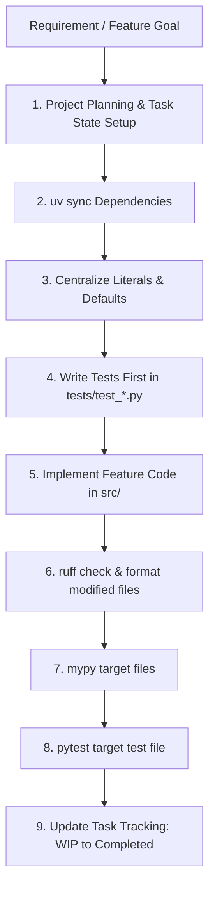
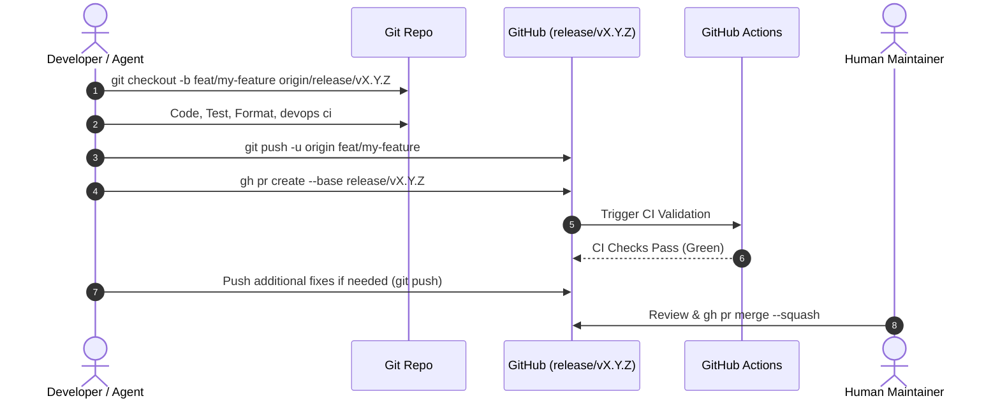
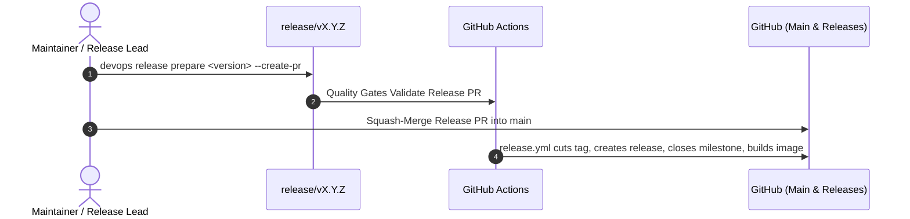

# Routine Tasks, Order, Frequency & Methodology — devops-cli

This document serves as the authoritative operational manual for developers, maintainers, and AI agents contributing to `devops-cli`. It defines the exact **order of operations**, **execution frequency**, and **engineering methodology** across all routine maintenance, development, security, and release workflows.

---

## 1. Engineering Principles & Methodology

All routine operations in `devops-cli` adhere to six core engineering tenets:
1. **Deterministic Execution**: Workflows run through standardized CLI commands (`devops ci`, `devops release`, `devops docs`, `uv`) to guarantee reproducible outcomes across local DevContainers and GitHub Actions CI.
2. **Zero-Plaintext Credentials**: All authentication tokens (GitHub, OpenAI, Claude, Grafana, ArgoCD) are stored exclusively in the OS Keyring via `devops config set` and retrieved programmatically via Python `keyring`.
3. **Strict Quality Assurance**: Changes must pass the automated CI validation suite (`python_version`, `test`, `coverage`, `lint`, `format`, `typecheck`, `audit`, `security`, `actionlint`, `docs`) before merging.
4. **Target Branch Hierarchy & Non-Merge Policy**: Feature/bugfix PRs strictly target active release branches (`release/vX.Y.Z`). Direct pushes to `main` are blocked. AI agents stage commits and open/update PRs, while PR merge actions are strictly reserved for human maintainers.
5. **Dynamic Documentation Freshness**: Command matrices, CLI reference guides, and FastMCP schemas are generated dynamically through code introspection (`devops docs generate`) and verified in CI (`devops docs check`).
6. **Mandatory Defect Incident Tracking (Zero Unrecorded CLI Errors/Warnings)**: Whenever a CLI command produces an unhandled error, subcommand failure, crash, diagnostic warning, or unexpected behavior, agents and maintainers must promptly file a formal tracking issue using the standardized bug report template, apply taxonomy labels (`type/bug`, `scope/*`, `priority/*`, `status/triage`), link the active milestone, and sync to GitHub Projects.


---

## 2. Master Routine Tasks Matrix

The following matrix categorizes all project routine tasks by operational layer, defining their exact sequence, cadence, and verification criteria:

| Operational Cadence | Routine Task | Sequence Order | Primary Command(s) | Methodology & Scope | Success Verification Gate |
| :--- | :--- | :--- | :--- | :--- | :--- |
| **Inner Loop (Daily / Per Edit)** | Task Grounding & Project Card WIP Transition | Step 1 | `devops gh project status` && `devops gh project sync` | Query project tracking, verify/author issue card, move to In Progress | Task grounded in active issue and project card moved to In Progress |
| **Inner Loop (Daily / Per Edit)** | Dependency Synchronization | Step 2 | `uv sync` | Synchronizes virtual environment with `uv.lock` | Clean exit; all dependencies resolved |
| **Inner Loop (Daily / Per Edit)** | Constant & Config Centralization | Step 3 | Manual / Refactor | Centralize literals in `constants.py`, `defaults.py`, `lang/en/` | No hardcoded string literals in command code |
| **Inner Loop (Daily / Per Edit)** | Targeted Linting & Formatting | Step 4 | `uv run ruff check --fix <file>` | Fast focused linting on modified files | `ruff check` reports 0 errors |
| **Inner Loop (Daily / Per Edit)** | Targeted Type Checking | Step 5 | `uv run mypy --strict <file>` | Strict type validation on modified modules | 0 type errors across modified files |
| **Inner Loop (Daily / Per Edit)** | Targeted Unit Testing | Step 6 | `uv run pytest tests/test_<module>.py` | Fast isolated testing of active features/fixes | Targeted tests pass |
| **Inner Loop (Daily / Per Edit)** | Telemetry, Log & CLI Output Review | Step 7 | `devops telemetry status` / log inspection | Inspect CLI command outputs, `.data/logs/`, metrics, and tracing spans for performance bottlenecks, misconfigurations, and warnings | Clean logs, no warnings, nominal latencies |
| **Final Pre-Commit / Pre-PR** | Documentation & README Sync | Step 1 | `uv run devops docs generate --sync-readme` | CLI introspection & README Command Matrix update | `uv run devops docs check` passes |
| **Final Pre-Commit / Pre-PR** | Full Parallel Test Suite | Step 2 | `uv run pytest` | Complete parallel test run (`--maxprocesses=4`) | All tests pass |
| **Final Pre-Commit / Pre-PR** | Full CI Validation Suite | Step 3 | `uv run devops ci` | Runs full automated verification suite | All checks show `✓ pass` |
| **Final Pre-Commit / Pre-PR** | Observability, Log & Trace Audit | Step 4 | `devops telemetry status` / `.data/logs/` | Audit CLI command outputs, application logs, metrics, and OpenTelemetry tracing data for performance issues and misconfigurations | Zero unhandled exceptions or warnings in logs/spans |
| **Feature / PR Lifecycle** | Branch Creation | Step 1 | `git checkout -b <type>/<name> origin/release/vX.Y.Z` | Dedicated topic branch branching off active release branch | Clean branch tracking origin release branch |
| **Feature / PR Lifecycle** | PR Submission | Step 2 | `gh pr create --base release/vX.Y.Z` | Opens PR targeting active release branch | PR opened with Conventional Commit title |
| **Feature / PR Lifecycle** | Taxonomy & Milestone Linking | Step 3 | `devops gh labels audit` | Audits PR for mandatory `type/*` and `scope/*` labels & milestone link | Zero taxonomy audit findings |
| **Feature / PR Lifecycle** | Project Item Linkage & Field Sync | Step 4 | `devops gh project sync` | Links PR to project board, reconciles custom fields from taxonomy labels, moves card to In Review | PR card created, fields populated, status set to In Review |
| **Feature / PR Lifecycle** | PR Monitoring & Review Resolution | Step 5 | `devops pr monitor <pr_number>` | Actively monitors checks, waits for Copilot reviews, remediates in-thread | All checks green, Copilot review settled, 0 unresolved threads |
| **Feature / PR Lifecycle** | AI Code Review | Step 6 | `devops ai review branch <name> --dry-run` | Multi-persona analysis (`devsecops`, `architect`, `qa`) | Findings inspected in `.data/reviews/` |
| **Feature / PR Lifecycle** | Human Squash Merge | Step 7 | `gh pr merge <id> --squash` | Maintainer merges approved PR into release branch | PR merged and topic branch deleted |
| **Feature / PR Lifecycle** | Remote Branch Audit & Pruning | Step 8 | `git fetch --prune origin` | Prunes merged, closed, or superseded remote tracking branches | Zero orphan remote branches on origin |
| **Release Lifecycle** | Release Status Assessment | Step 1 | `uv run devops release status` | Checks version consistency, git tags, and docs state | Clean working tree and version clarity |
| **Release Lifecycle** | Release Preparation | Step 2 | `uv run devops release prepare <version> --create-pr` | Bumps version, updates changelog, syncs docs, opens PR | Release PR opened targeting `main` |
| **Release Lifecycle** | Authoritative Release Check | Step 3 | `uv run devops release check` | Validates git tree, version matching, CI validation | All checks green |
| **Release Lifecycle** | Maintainer Release PR Merge | Step 4 | `gh pr merge <id> --squash` | Human maintainer squash-merges release PR into `main` | Push event on `main` branch |
| **Release Lifecycle** | Automated Tagging & Publish | Step 5 | Automated (`release.yml`) | Cuts annotated git tag `vX.Y.Z`, generates notes, publishes GH Release | GitHub Release published with assets |
| **Release Lifecycle** | Milestone Issue Population | Step 6 | `gh issue create` / `devops gh project sync` | Proactively creates GitHub issues for active milestone deliverables | Open issues populated with zero empty state |
| **Release Lifecycle** | Historical Documentation Compaction | Step 7 | Automated / Manual | Compacts historical milestone docs in `docs/ROADMAP.md` and `RELEASE_NOTES.md` on major/minor releases | Expressive, token-efficient docs with zero bloat |
| **Security & Audits** | Dependency Security Audit | Weekly / Pre-Release | `uv run devops ci audit` (`uv audit`) | Scans installed packages for known vulnerabilities | 0 known vulnerabilities |
| **Security & Audits** | Static Security Scan (SAST) | Weekly / Pre-Release | `uv run devops ci security` (`bandit`) | Static security scan for code vulnerabilities | 0 high/medium issues identified |
| **Security & Audits** | Kubernetes Manifest Scans | Per Manifest Change | `devops scan [kubelinter\|popeye\|pluto\|trivy]` | Validates manifests against K8s security best practices | Zero deprecated APIs or misconfigurations |
| **Security & Audits** | Codebase Deduplication & Invariant Audit | Weekly / Pre-PR | `devops scan complexity` && `pytest tests/test_architectural_invariants.py` | Enforces complexity <= 10, nesting <= 5, and shared helper adoption | Zero invariant violations |
| **Observability & Diagnostics** | Command Output, Logs, Metrics & Trace Audit | Continuous / On Execution | `devops telemetry status` / `devops telemetry logfire-status` | Comprehensive review of command outputs, application logs (`.data/logs/`), metrics, and tracing spans for latency, misconfigurations, and warnings | Nominal latencies, zero unhandled errors/warnings |
| **Workspace & Sync** | DevContainer Lifecycle Hooks | Daily / On Start | `devops devcontainer run-lifecycle --post-start` | Cross-platform container initialization tasks | All lifecycle tasks complete successfully |
| **Workspace & Sync** | Multi-Repo Synchronization | Daily / On Demand | `devops repos sync` / `devops repos status` | Pulls upstream changes across all managed repos | All repositories up to date |
| **Workspace & Sync** | GitHub Pages Publishing & Readiness Audit | Pre-PR / Pre-Release | `devops gh pages status` / `devops gh pages verify` | Inspects live publishing health, HTTPS enforcement, and validates local Jekyll `docs/github-pages.config.yaml` / `docs/` | Clean verification; HTTPS strictly enforced |
| **Workspace & Sync** | GitHub Issues Lifecycle & Triage Audit | Daily / Pre-PR | `devops gh issues triage` / `devops gh issues status` | Audits open issues for mandatory taxonomy labels (`type/*`, `scope/*`, `priority/*`) and milestone linkage | Zero untriaged or unmilestoned open issues |
| **Workspace & Sync** | GitHub Projects & Issues Views Sync & Audit | On Demand / Pre-PR | `devops gh project sync` / `devops gh project audit` / `devops gh views audit` | Reconciles and audits 4 declarative project views, boards, and links projects/views | All projects and views populated with zero drift or empty state (`projects` & `issues/views`) |
| **Workspace & Sync** | SSH Keys & Host Audit | On Demand | `devops ssh status` / `devops ssh audit` | Validates ED25519 keys, permissions, and GitHub keys | All keys secure with correct 0600/0700 perms |


---

## 3. Detailed Workflow Methodologies

### Cadence A: Inner Loop (Test-First Iterative Feature Development)

The Inner Development Loop follows a strict **Test-First Development (TDD)** methodology. Author tests first as living specifications of intended functionality before writing implementation code. Run targeted tests and linters for immediate feedback; do NOT run the full test suite during this inner loop.



#### Step-by-Step Order:
1. **GitHub Project Bootstrap, Issue Grounding & Task State Setup**:
   - **Inspect Project Status**: Query active board and views via `devops gh project status` (or FastMCP `gh_project_status`) and triage queue via `devops gh issues triage` (or FastMCP `gh_issue_triage`).
   - **Ground Requirement in GitHub Issue Card**: Every feature, bug fix, or refactor must map to an active tracking issue and project item.
     - If a matching issue card exists: link task to it, verify milestone and taxonomy labels, and transition its card to `In Progress` (`devops gh project sync`).
     - If no issue exists: **IMMEDIATELY CREATE THE TRACKING ISSUE** (`gh issue create` or FastMCP `gh_issue_create`), assign active milestone (`--milestone "v<version>"`), assign taxonomy labels (`type/*`, `scope/*`, `priority/*`, `status/in-progress`), and sync to project board (`devops gh project sync`).
   - For multi-step or architectural work, author an implementation plan (`implementation_plan.md`, `docs/agent/tasks/task-<issue>-<slug>.md`, or update [`docs/ROADMAP.md`](ROADMAP.md)).
   - Explicitly track task progression across five lifecycle states:
     - **Backlog**: Queued items awaiting milestone assignment.
     - **Ready**: Scoped items ready for immediate development.
     - **In-Progress Tasks (WIP)**: Active work items currently being modified. **Card MUST be moved to In Progress before editing code in `src/`**. Mirrored in `docs/agent/tasks/task-<issue>-<slug>.md`.
     - **In Review**: PR opened with CI checks and reviews running.
     - **Completed Tasks**: Verified implementations, green test gates, and merged PRs.
2. **Sync Dependencies (`uv sync`)**: Always ensure `.venv` is aligned with `uv.lock` before starting work.
3. **Centralize Constants, Config & Defaults**:
   - Put configuration options and environment variable schemas in [`src/devops_cli/config/settings.py`](../src/devops_cli/config/settings.py).
   - Put constants, regexes, and protocol strings in [`src/devops_cli/config/constants.py`](../src/devops_cli/config/constants.py).
   - Put timeouts and numeric defaults in [`src/devops_cli/config/defaults.py`](../src/devops_cli/config/defaults.py).
   - Put user-facing messages, summaries, and error logs in [`src/devops_cli/lang/en/`](../src/devops_cli/lang/en/).
4. **Leverage Shared Domain Helpers & Declarative Frameworks**:
   - Before writing ad-hoc subprocess calls, path containment checks, binary verification, or secret sanitization, always leverage the shared helper ecosystem:
     - `devops_cli.core.binaries.check_binary` / `require_binary` for external tool checks.
     - `devops_cli.core.paths.safe_resolve_subpath` for filesystem containment and traversal prevention.
     - `devops_cli.core.process.run_json_subprocess` and `devops_cli.core.serialization.extract_json_block` for robust JSON subprocess handling.
     - `devops_cli.security.sanitizer.mask_secrets` for credential masking.
     - `devops_cli.dry_run.decorator.dry_run_command` for state-mutating command dry-runs.
     - `devops_cli.security.base.BaseSecurityScanner` for security linters.
5. **Write Tests First (Living Functional Specification)**:
   - Create or update `tests/test_<feature>.py` to document the intended public interfaces, command-line arguments, expected return structures, edge cases, error conditions, and mocks.
6. **Implement Feature Logic**:
   - Author clean, concise, domain-driven implementation code in `src/` specifically to satisfy the pre-written tests with zero extraneous boilerplate.
7. **Format & Lint Target Files**:
   ```bash
   uv run ruff check --fix <modified_paths>
   uv run ruff format <modified_paths>
   ```
8. **Verify Static Types for Target Files**:
   ```bash
   uv run mypy --strict <modified_paths>
   ```
9. **Run Targeted Unit Tests**:
   ```bash
   uv run pytest tests/test_<feature>.py -k <test_name>
   ```
10. **Review CLI Command Outputs, Application Logs, Metrics & Tracing Data**:
   - Actively inspect terminal command outputs, application logs (under `.data/logs/`), metrics, and distributed tracing spans (`@trace_span` / Logfire / OpenTelemetry) emitted during execution.
   - Check for performance regressions, latency bottlenecks, misconfigurations, unhandled exceptions, and deprecation or diagnostic warnings.
   - If any error or warning is discovered, immediately file a tracking issue per Tenet 6 and resolve before proceeding.
11. **Update Task Status Tracking**:
   - Transition completed items from **In-Progress (WIP)** to **Completed** with reference to passing test verifications and code artifacts.

---

### Cadence B: Final Pre-Commit / Pre-PR Validation Stage

Executed at the final stage of work after all iterative feature modifications and targeted tests pass:

1. **Regenerate Documentation & Check Freshness**:
   ```bash
   uv run devops docs generate --sync-readme
   uv run devops docs check
   ```
2. **Run Full Local CI Validation Suite (Primary Gate)**:
   ```bash
   uv run devops ci
   ```
3. **Audit Observability, Telemetry & Application Logs**:
   - Review execution durations, OpenTelemetry spans, metric gauges, and application log output generated during test runs and CLI executions.
   - Verify absence of performance bottlenecks, resource leaks, configuration warnings, or suppressed exceptions.
4. **Validate GitHub Governance, Pages Readiness & Issues Triage**:
   - Verify local Jekyll `docs/github-pages.config.yaml` syntax and `docs/` publishing root existence via `devops gh pages verify`.
   - Audit open issues for mandatory taxonomy labels (`type/*`, `scope/*`, `priority/*`) and milestone linkage via `devops gh issues triage`.
   - Inspect issue portfolio distribution via `devops gh issues status`.
   - Validate remote project views template compliance via `devops gh views audit`.


---

### Cadence B: Feature & Pull Request Lifecycle

Executed for every new feature, bug fix, refactor, or documentation update.



#### Rules & Methodology:
- **Dedicated Branch Naming**:
  - Features: `feat/<name>` or `feature/<name>`
  - Fixes: `fix/<name>`
  - Docs: `docs/<name>`
  - Chores/Refactors: `chore/<name>` or `refactor/<name>`
- **Base Branch Targeting**: PRs must target the active release branch (`--base release/vX.Y.Z`). Only release branches target `main`.
- **Strict Remote Branch Lifecycle & PR Governance (Zero Orphan Remote Branches)**:
  - Every remote topic or feature branch on `origin` MUST have an associated, open Pull Request targeting the active release branch (`--base release/vX.Y.Z`) or `main` (for official release PRs). If work is actively in progress or not yet fully implemented and ready for review, open the PR as a draft (`gh pr create --draft` or `draft: true`).
  - **Immediate Deletion of Merged or Superseded Branches**: Once a PR is merged into its target branch, or if a branch's changes have been incorporated or superseded, the remote branch MUST be deleted immediately (`git push origin --delete <branch>`) and local tracking references pruned (`git fetch --prune origin`).
  - **No Orphan Remote Branches**: Remote branches without an active PR or active development purpose are strictly prohibited. If updates from an old or dormant branch are still required, apply or cherry-pick them to the active release branch / active PR, and delete the obsolete remote branch immediately.
- **Mandatory Draft PRs for In-Progress Work**: Whenever opening a pull request for work that is not yet fully implemented, tested, and ready for review, agents MUST create it as a draft PR (`gh pr create --draft`). Convert to ready for review (`gh pr ready <pr_number>`) only once all code, tests, and CI quality gates pass cleanly.
- **Agent Non-Merge Rule**: AI agents must push commits and create/update PRs, but never execute `gh pr merge`.
- **Active PR Monitoring Gate (`devops pr monitor`) (Zero Premature Completions & Unmonitored PRs)**:
  - After opening or pushing updates to a PR, agents and developers **MUST ALWAYS** actively monitor remote GitHub Actions status and code reviews via `devops pr monitor <pr_number>` (or `devops pr wait <pr_number>`).
  - **Strict Prohibition of Premature Completion**: Never conclude a turn or declare a task done while CI checks are pending/failing, or while automated code review sessions (e.g. GitHub Copilot code review) are in progress or unresolved.
  - **Wait for Copilot Review Sessions to Settle**: Automated code review bots submit reviews asynchronously (typically 1–3 minutes after code push). `devops pr monitor` automatically enforces settling windows and checks timeline activity. Agents must wait for this review session to complete.
  - **Remediate Check Failures Immediately**: If any check fails (exit code 1), immediately inspect failed logs (`gh run view --log-failed`), apply remediation commits directly to the PR source branch with concise effect-driven commit messages, push to origin, and re-run `devops pr monitor <pr_number>`.
  - **Review Comment Remediation & Direct In-Thread Reply Mandate**: If Copilot or reviewers leave comments (exit code 2):
    1. Inspect all open threads: `devops pr threads list <pr_number> --unresolved-only`.
    2. Author test-first fixes in `src/` and `tests/`.
    3. Commit with concise message stating the direct effect and push.
    4. Post direct in-thread replies to each specific comment addressed: `devops pr threads reply <thread_id> "<body>"`. Never rely solely on top-level PR summary comments.
    5. Resolve threads: `devops pr threads resolve <thread_id>`.
    6. Re-run `devops pr monitor <pr_number>` until exit code 0 is achieved.
  - **Merge Readiness Guarantee**: A PR is ONLY ready for merging when `devops pr monitor` exits with code 0: all CI checks are 100% green, Copilot review session is settled, and 0 unresolved review discussion threads remain.
- **No Commits to Merged Branches**: Once a PR is merged, create a fresh topic branch from `origin/release/vX.Y.Z` for the next task.
- **Updating Open PRs**: When revisions are needed, push commits directly to the active topic branch. Do not open duplicate PRs.
- **Commit Standards & Message Hygiene**:
  - All commits must follow Conventional Commits (`feat(scope): ...`, `fix(scope): ...`, `refactor(scope): ...`, `docs(scope): ...`).
  - **Concise, Effect-Driven Commit Messages**: Commit messages MUST be concise and simply state the direct effect of the specific change. Avoid overly verbose summaries, compound multi-clause sentences, redundant narrative preambles, or sprawling lists in commit subjects. State clearly and directly what the change accomplishes.
  - **No Internal References or Numeric IDs**: Never include internal review session timestamps (e.g. `164259`, `003105`), review session IDs, subagent IDs, prompt phase numbers (`Phase 48.5`), or arbitrary numeric identifiers in commit subjects or messages. Use clear, descriptive technical terminology.
  - **No Standalone Agent Tracking Commits**: Updates to internal agent tracking files under `docs/agent/` (`docs/agent/tasks/`, `docs/agent/task.md`) must NEVER be committed in isolation; they must always be bundled atomically into the corresponding feature, fix, or refactoring deliverable commit.
- **Issue Linkage, GitHub Projects & Issues Views Lifecycle (`https://github.com/dan-petty/devops-cli/projects` & `https://github.com/dan-petty/devops-cli/issues/views`)**:
  - **Zero Disconnected PRs**: Every PR addressing an issue MUST explicitly link to it using canonical closing keywords (`Fixes #<id>`, `Closes #<id>`, `Resolves #<id>`), be added as a project item to the project board, and possess taxonomy labels (`type/*`, `scope/*`).
  - **Automated Field Sync & State Progression**: Run `devops gh project sync` (or FastMCP `gh_project_sync`) after opening or updating PRs to reconcile the 6 custom project fields (`Status`, `Milestone`, `Priority`, `Category`, `Value`, `Effort`) and transition the card to `In Review`.
  - Reconcile task state transitions (`Backlog` $\to$ `Ready` $\to$ `In Progress` $\to$ `In Review` $\to$ `Done`) in [`docs/agent/tasks/`](agent/tasks/README.md) and verify alignment with `.github/project-template.json` across the 4 canonical views (*Sprint Kanban*, *Roadmap Timeline*, *Triage & Quality Table*, *Value vs Effort Priority Matrix*) displayed under `https://github.com/dan-petty/devops-cli/issues/views`.
  - Ensure the project board is linked to the repository via `devops gh project link <number>` so it appears on `https://github.com/dan-petty/devops-cli/projects` and its views on `https://github.com/dan-petty/devops-cli/issues/views`. Audit views via `devops gh views list`, `devops gh views audit`, and `devops gh views spec`.
  - Enforce taxonomy labels via `devops gh labels audit`, milestone alignment via `devops gh milestones sync`, and milestone closure upon release merge via `devops gh milestones close <version>`.

---

### Cadence C: Release Lifecycle & Orchestration

Executed per scheduled release (patch/minor) or upon milestone completion.



#### Step-by-Step Procedure:
1. **Audit Open Tasks & Issues**: Ensure all milestone deliverables in `docs/ROADMAP.md` and `docs/agent/tasks/` are completed.
2. **Execute Release Preparation**: Run `devops release prepare <version> --create-pr`.
   - Bumps version in `pyproject.toml` and `src/devops_cli/__init__.py`.
   - Updates `CHANGELOG.md` converting `[Unreleased]` into the target version release block.
   - Regenerates docs and updates README Command Matrix.
   - Creates topic branch `release/v<version>`, commits bumps, and opens a GitHub Release PR targeting `main` titled `feat(release): v<version>`.
3. **Run Authoritative Release Check**: Run `uv run devops release check` to verify tree cleanliness, version matching, and CI validation.
4. **Human Maintainer Merge**: The maintainer reviews and squash-merges the Release PR into `main`.
5. **Automated Publishing & Milestone Closure**: GitHub Actions (`release.yml`) cuts the git tag, extracts release notes with `devops release notes`, creates the GitHub Release, closes the release milestone via `devops gh milestones close <version>`, and publishes the pre-built DevContainer image to GHCR.
6. **Post-Release DevContainer Validation**: Run `uv run devops devcontainer run-lifecycle --all` to verify container lifecycle tasks.
7. **Next Active Milestone Initialization & Issue/Views Population**:
   - Cut and push the next release branch (`release/vX.Y.Z`) from `main`.
   - Update `.github/dependabot.yml` target branch to the new active release branch.
   - Initialize `## [Unreleased]` section in `CHANGELOG.md`.
   - Proactively author GitHub issues for all planned deliverables in `docs/ROADMAP.md`, assigning each to the active milestone with full taxonomy labels (`type/*`, `scope/*`, `priority/*`).
   - Ensure the open issues queue (`https://github.com/dan-petty/devops-cli/issues?q=is%3Aissue+state%3Aopen`), projects tab (`https://github.com/dan-petty/devops-cli/projects`), and issue views (`https://github.com/dan-petty/devops-cli/issues/views`) are populated with zero empty state.
   - Synchronize items and custom fields into GitHub Projects v2 (`https://github.com/dan-petty/devops-cli/projects`) and repository issue views (`https://github.com/dan-petty/devops-cli/issues/views`) via `devops gh project sync`, link the board (`devops gh project link <number>`), and prune all stale remote tracking branches (`git fetch --prune origin`).
8. **Automated Historical Documentation Compaction & Task Archival**:
   - When transitioning across major or minor release boundaries, run `uv run devops docs compact --series <series>` to automatically compact historical documentation across `docs/ROADMAP.md` (consolidating completed milestone subsections and matrix rows into summary blocks) and `docs/RELEASE_NOTES.md` (consolidating highlight sections into unified series blocks).
   - As a separate post-release procedure, archive completed modular task records from `docs/agent/tasks/` corresponding to the finished release series into `docs/agent/archive/` and update the active index in `docs/agent/task.md`.
   - Re-verify documentation freshness via `uv run devops docs generate --sync-readme` and `uv run devops docs check`.

---

### Cadence D: Security, Vulnerability & Dependency Audits

Executed weekly, prior to major releases, or when dependencies are updated.

#### 1. Python Dependency Vulnerability Audit (`uv audit`)
- **Frequency**: Weekly & in every CI run.
- **Methodology**: Scans packages in `uv.lock` against Open Source Vulnerabilities (OSV) database.
- **Command**: `uv run devops ci audit` or `uv audit`.

#### 2. Static Application Security Testing (SAST - `bandit`)
- **Frequency**: Pre-commit / CI gate.
- **Methodology**: Analyzes AST for common security pitfalls (unsafe subshell calls, hardcoded passwords, weak crypto).
- **Command**: `uv run devops ci security` or `uv run bandit -c pyproject.toml -r src`.

#### 3. Kubernetes & IaC Security Scans
- **Frequency**: Whenever `k8s/` or `tf/` manifests are modified.
- **Methodology**: Uses Kube-linter, Pluto (deprecated API versions), Popeye (cluster sanitization), and Trivy (misconfigurations and vulnerabilities).
- **Commands**:
  ```bash
  devops scan kubelinter -p k8s/
  devops scan pluto -p k8s/
  devops scan trivy -p k8s/
  ```

#### 4. SSRF Guardrails & OS Keyring Audit
- **Methodology**: Outbound requests must pass through `validate_service_url()` to reject private IPs (RFC 1918), loopbacks, and cloud metadata IPs unless `DEVOPS_CLI_AI_ALLOW_PRIVATE_NETWORK=true` is explicitly set.

#### 5. AI Code Review Verification, Feedback Export & Self-Improvement Loop
- **Frequency**: After running AI code reviews or before PR approval.
- **Methodology**:
  1. Inspect structured review findings across sessions:
     ```bash
     devops ai review findings --session <session-id>
     ```
  2. Perform deterministic AST verification and human verification:
     - The verification pipeline automatically executes deterministic syntax assertions (`ast.parse`) and template placeholder mitigations.
     - Reviewers and agents verify or invalidate remaining findings with specific rationale:
     ```bash
     devops ai review verify <session-id> --index 1 --status INVALIDATED --reason "False positive on valid exception tuple"
     ```
  3. Export benchmark feedback datasets for prompt tuning, DPO alignment, and model calibration:
     ```bash
     devops ai review export-feedback --status ALL --output .data/feedback.jsonl
     ```
  4. Continuous Self-Improvement Loop:
     - Regularly analyze exported feedback in `.data/feedback.jsonl` to identify recurring false positives and refine persona domain prompts (`devsecops`, `architect`, `auditor`, `pm`, `qa`) and verification directives (`verify_finding.md`).

---

### Cadence E: Workspace & Infrastructure Synchronization

Executed on workspace initialization (DevContainer startup) or on-demand.

#### 1. DevContainer Lifecycle Hooks
- **Frequency**: On container creation (`postCreateCommand`) and container startup (`postStartCommand`).
- **Methodology**: Executes native Python lifecycle engine to install CLI in editable mode, sync `uv` dependencies, configure git safe directories, and verify tools.
- **Commands**:
  ```bash
  devops devcontainer run-lifecycle --post-create
  devops devcontainer run-lifecycle --post-start
  ```

#### 2. Multi-Repository Synchronization
- **Frequency**: Daily or before multi-repo reviews.
- **Methodology**: Discovers all configured git repositories in workspace, pulls latest commits from tracked remotes, and reports branch statuses.
- **Commands**:
  ```bash
  devops repos sync
  devops repos status
  ```

#### 3. SSH Key & Host Security Audit
- **Frequency**: On-demand / Monthly.
- **Methodology**: Checks that managed SSH keys use modern ED25519 cryptography, have strict permissions (`0600` for private keys, `0700` for `.ssh`), and match registered GitHub public keys.
- **Commands**:
  ```bash
  devops ssh status
  devops ssh audit
  ```

#### 4. GitHub Governance, Pages, Issues & Views Auditing
- **Frequency**: Pre-PR, Pre-Release, or On-Demand.
- **Methodology**:
  - Validates GitHub Pages deployment health and verifies local publishing assets (`docs/github-pages.config.yaml` and `docs/`).
  - Audits live open issues for missing taxonomy labels (`type/*`, `scope/*`, `priority/*`) and milestone links.
  - Audits remote GitHub Projects v2 boards and views against `.github/project-template.json` to prevent configuration drift.
- **Commands**:
  ```bash
  devops gh pages status
  devops gh pages verify
  devops gh issues triage
  devops gh issues status
  devops gh project audit
  devops gh views audit
  ```

---

## 4. Failure Recovery & Troubleshooting Matrix

| Failure Scenario | Root Cause | Remediation Procedure |
| :--- | :--- | :--- |
| `devops ci` fails at `format` | Unformatted code or non-compliant line lengths | Run `uv run ruff format .` and re-run `devops ci`. |
| `devops ci` fails at `lint` | Unused imports, bad syntax, or sorting violations | Run `uv run ruff check --fix .` and resolve manual warnings. |
| `devops ci` fails at `typecheck` | Missing type annotations or strict type mismatch | Run `uv run mypy --strict src` to pinpoint offending line and type. |
| `devops ci` fails at `docs` | CLI commands or flags changed without updating docs | Run `uv run devops docs generate --sync-readme` and verify with `devops docs check`. |
| `pytest` intermittent test failures | Non-deterministic test ordering in multi-threaded code | Ensure assertions use order-independent checks (`any(...)` or sets) rather than fixed array indices. |
| `uv audit` reports vulnerability | A dependency has a known security advisory | Run `uv lock --upgrade-package <name>` and verify compatibility. |
| Agent PR targeting error | Topic branch opened against `main` instead of release branch | Update PR base branch via `gh pr edit <id> --base release/vX.Y.Z`. |
