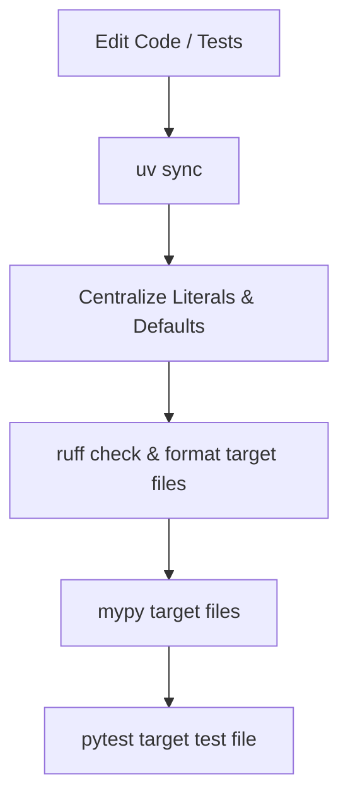
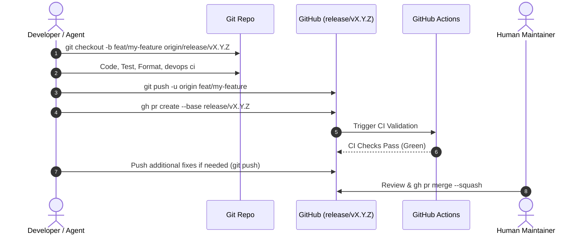
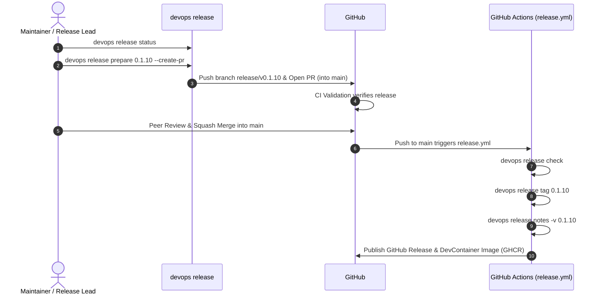

# Routine Tasks, Order, Frequency & Methodology — devops-cli

This document serves as the authoritative operational manual for developers, maintainers, and AI agents contributing to `devops-cli`. It defines the exact **order of operations**, **execution frequency**, and **engineering methodology** across all routine maintenance, development, security, and release workflows.

---

## 1. Engineering Principles & Methodology

All routine operations in `devops-cli` adhere to five core engineering tenets:
1. **Deterministic Execution**: Workflows run through standardized CLI commands (`devops ci`, `devops release`, `devops docs`, `uv`) to guarantee reproducible outcomes across local DevContainers and GitHub Actions CI.
2. **Zero-Plaintext Credentials**: All authentication tokens (GitHub, OpenAI, Claude, Grafana, ArgoCD) are stored exclusively in the OS Keyring via `devops config set` and retrieved programmatically via Python `keyring`.
3. **Strict Quality Assurance**: Changes must pass the automated CI validation suite (`python_version`, `test`, `coverage`, `lint`, `format`, `typecheck`, `audit`, `security`, `actionlint`, `docs`) before merging.
4. **Target Branch Hierarchy & Non-Merge Policy**: Feature/bugfix PRs strictly target active release branches (`release/vX.Y.Z`). Direct pushes to `main` are blocked. AI agents stage commits and open/update PRs, while PR merge actions are strictly reserved for human maintainers.
5. **Dynamic Documentation Freshness**: Command matrices, CLI reference guides, and FastMCP schemas are generated dynamically through code introspection (`devops docs generate`) and verified in CI (`devops docs check`).

---

## 2. Master Routine Tasks Matrix

The following matrix categorizes all project routine tasks by operational layer, defining their exact sequence, cadence, and verification criteria:

| Operational Cadence | Routine Task | Sequence Order | Primary Command(s) | Methodology & Scope | Success Verification Gate |
| :--- | :--- | :--- | :--- | :--- | :--- |
| **Inner Loop (Daily / Per Edit)** | Dependency Synchronization | Step 1 | `uv sync` | Synchronizes virtual environment with `uv.lock` | Clean exit; all dependencies resolved |
| **Inner Loop (Daily / Per Edit)** | Constant & Config Centralization | Step 2 | Manual / Refactor | Centralize literals in `constants.py`, `defaults.py`, `lang/en.py` | No hardcoded string literals in command code |
| **Inner Loop (Daily / Per Edit)** | Targeted Linting & Formatting | Step 3 | `uv run ruff check --fix <file>` | Fast focused linting on modified files | `ruff check` reports 0 errors |
| **Inner Loop (Daily / Per Edit)** | Targeted Type Checking | Step 4 | `uv run mypy --strict <file>` | Strict type validation on modified modules | 0 type errors across modified files |
| **Inner Loop (Daily / Per Edit)** | Targeted Unit Testing | Step 5 | `uv run pytest tests/test_<module>.py` | Fast isolated testing of active features/fixes | Targeted tests pass |
| **Final Pre-Commit / Pre-PR** | Documentation & README Sync | Step 1 | `uv run devops docs generate --sync-readme` | CLI introspection & README Command Matrix update | `uv run devops docs check` passes |
| **Final Pre-Commit / Pre-PR** | Full Parallel Test Suite | Step 2 | `uv run pytest` | Complete parallel test run (`--maxprocesses=4`) | All tests pass |
| **Final Pre-Commit / Pre-PR** | Full CI Validation Suite | Step 3 | `uv run devops ci` | Runs full automated verification suite | All checks show `✓ pass` |
| **Feature / PR Lifecycle** | Branch Creation | Step 1 | `git checkout -b <type>/<name> origin/release/vX.Y.Z` | Dedicated topic branch branching off active release branch | Clean branch tracking origin release branch |
| **Feature / PR Lifecycle** | PR Submission | Step 2 | `gh pr create --base release/vX.Y.Z` | Opens PR targeting active release branch | PR opened with Conventional Commit title |
| **Feature / PR Lifecycle** | PR Iteration & Updates | Step 3 | `git push origin <branch>` | Pushes revisions directly to existing PR branch | Remote CI checks trigger and pass |
| **Feature / PR Lifecycle** | AI Code Review | Step 4 | `devops ai review branch <name> --dry-run` | Multi-persona analysis (`devsecops`, `architect`, `qa`) | Findings inspected in `.data/reviews/` |
| **Feature / PR Lifecycle** | Human Squash Merge | Step 5 | `gh pr merge <id> --squash` | Maintainer merges approved PR into release branch | PR merged and topic branch deleted |
| **Release Lifecycle** | Release Status Assessment | Step 1 | `uv run devops release status` | Checks version consistency, git tags, and docs state | Clean working tree and version clarity |
| **Release Lifecycle** | Release Preparation | Step 2 | `uv run devops release prepare <version> --create-pr` | Bumps version, updates changelog, syncs docs, opens PR | Release PR opened targeting `main` |
| **Release Lifecycle** | Authoritative Release Check | Step 3 | `uv run devops release check` | Validates git tree, version matching, CI validation | All checks green |
| **Release Lifecycle** | Maintainer Release PR Merge | Step 4 | `gh pr merge <id> --squash` | Human maintainer squash-merges release PR into `main` | Push event on `main` branch |
| **Release Lifecycle** | Automated Tagging & Publish | Step 5 | Automated (`release.yml`) | Cuts annotated git tag `vX.Y.Z`, generates notes, publishes GH Release | GitHub Release published with assets |
| **Security & Audits** | Dependency Security Audit | Weekly / Pre-Release | `uv run devops ci audit` (`uv audit`) | Scans installed packages for known vulnerabilities | 0 known vulnerabilities |
| **Security & Audits** | Static Security Scan (SAST) | Weekly / Pre-Release | `uv run devops ci security` (`bandit`) | Static security scan for code vulnerabilities | 0 high/medium issues identified |
| **Security & Audits** | Kubernetes Manifest Scans | Per Manifest Change | `devops scan [kubelinter\|popeye\|pluto\|trivy]` | Validates manifests against K8s security best practices | Zero deprecated APIs or misconfigurations |
| **Workspace & Sync** | DevContainer Lifecycle Hooks | Daily / On Start | `devops devcontainer run-lifecycle --post-start` | Cross-platform container initialization tasks | All lifecycle tasks complete successfully |
| **Workspace & Sync** | Multi-Repo Synchronization | Daily / On Demand | `devops repos sync` / `devops repos status` | Pulls upstream changes across all managed repos | All repositories up to date |
| **Workspace & Sync** | SSH Keys & Host Audit | On Demand | `devops ssh status` / `devops ssh audit` | Validates ED25519 keys, permissions, and GitHub keys | All keys secure with correct 0600/0700 perms |

---

## 3. Detailed Workflow Methodologies

### Cadence A: Inner Loop (Iterative Feature Development)

The Inner Development Loop is executed continuously while writing or modifying code. Run targeted tests and linters for immediate feedback; do NOT run the full test suite during this loop.



#### Step-by-Step Order:
1. **Sync Dependencies (`uv sync`)**: Always ensure `.venv` is aligned with `uv.lock` before starting work.
2. **Centralize Constants, Config & Defaults**:
   - Put configuration options and environment variable schemas in [`src/devops_cli/config/settings.py`](file:///workspaces/devops-cli/src/devops_cli/config/settings.py).
   - Put constants, regexes, and protocol strings in [`src/devops_cli/config/constants.py`](file:///workspaces/devops-cli/src/devops_cli/config/constants.py).
   - Put timeouts and numeric defaults in [`src/devops_cli/config/defaults.py`](file:///workspaces/devops-cli/src/devops_cli/config/defaults.py).
   - Put user-facing messages, summaries, and error logs in [`src/devops_cli/lang/en.py`](file:///workspaces/devops-cli/src/devops_cli/lang/en.py).
3. **Format & Lint Target Files**:
   ```bash
   uv run ruff check --fix <modified_paths>
   uv run ruff format <modified_paths>
   ```
4. **Verify Static Types for Target Files**:
   ```bash
   uv run mypy --strict <modified_paths>
   ```
5. **Run Targeted Unit Tests**:
   ```bash
   uv run pytest tests/test_<feature>.py -k <test_name>
   ```

---

### Cadence B: Final Pre-Commit / Pre-PR Validation Stage

Executed at the final stage of work after all iterative feature modifications and targeted tests pass:

1. **Regenerate Documentation & Check Freshness**:
   ```bash
   uv run devops docs generate --sync-readme
   uv run devops docs check
   ```
2. **Run Full Parallel Unit Test Suite**:
   ```bash
   uv run pytest
   ```
3. **Run Full Local CI Validation Suite**:
   ```bash
   uv run devops ci
   ```

---

### Cadence B: Feature & Pull Request Lifecycle

Executed for every new feature, bug fix, refactor, or documentation update.



#### Rules & Methodology:
- **Dedicated Branch Naming**:
  - Features: `feat/<name>` or `feature/<name>`
  - Fixes: `fix/<name>`
  - Docs: `docs/<name>`
  - Chores/Refactors: `chore/<name>` or `refactor/<name>`
- **Base Branch Targeting**: PRs must target the active release branch (`--base release/vX.Y.Z`). Only release branches target `main`.
- **Agent Non-Merge Rule**: AI agents must push commits and create/update PRs, but never execute `gh pr merge`.
- **Active PR Monitoring & Fix-on-Branch Protocol**: After opening or pushing updates to a PR, agents and developers must actively monitor remote GitHub Actions status (`gh pr checks <pr_number>` or `gh run list --branch <branch>`). If any check fails, immediately inspect failed logs (`gh run view <run_id> --log-failed`), apply remediation commits directly to the PR source branch, push to origin, and verify all checks pass green before closing out the task.
- **No Commits to Merged Branches**: Once a PR is merged, create a fresh topic branch from `origin/release/vX.Y.Z` for the next task.
- **Updating Open PRs**: When revisions are needed, push commits directly to the active topic branch. Do not open duplicate PRs.

---

### Cadence C: Release Lifecycle & Orchestration

Executed per scheduled release (patch/minor) or upon milestone completion.



#### Order of Operations:
1. **Status Inspection**: Run `uv run devops release status` to check version alignment across `pyproject.toml`, `__init__.py`, `CHANGELOG.md`, and git tags.
2. **Prepare Release PR**: Run `uv run devops release prepare <version> --create-pr`. This command:
   - Bumps version in `pyproject.toml` and `src/devops_cli/__init__.py`.
   - Updates `CHANGELOG.md` converting `[Unreleased]` into the target version release block.
   - Regenerates docs and updates README Command Matrix.
   - Creates topic branch `release/v<version>`, commits bumps, and opens a GitHub PR targeting `main`.
3. **Run Authoritative Release Check**: Run `uv run devops release check` to verify tree cleanliness, version matching, and CI validation.
4. **Human Maintainer Merge**: The maintainer reviews and squash-merges the Release PR into `main`.
5. **Automated Publishing**: GitHub Actions (`release.yml`) cuts the git tag, extracts release notes with `devops release notes`, creates the GitHub Release, and publishes the pre-built DevContainer image to GHCR.
6. **Post-Release DevContainer Validation**: Run `uv run devops devcontainer run-lifecycle --all` to verify container lifecycle tasks.

---

### Cadence D: Security, Vulnerability & Dependency Audits

Executed weekly, prior to major releases, or when dependencies are updated.

#### 1. Python Dependency Vulnerability Audit (`uv audit`)
- **Frequency**: Weekly & in every CI run.
- **Methodology**: Scans packages in `uv.lock` against Open Source Vulnerabilities (OSV) database.
- **Command**: `uv run devops ci audit` or `uv audit`.

#### 2. Static Application Security Testing (SAST - `bandit`)
- **Frequency**: Pre-commit / CI gate.
- **Methodology**: Analyzes AST for common security pitfalls (unsafe subshell calls, hardcoded passwords, weak crypto).
- **Command**: `uv run devops ci security` or `uv run bandit -c pyproject.toml -r src`.

#### 3. Kubernetes & IaC Security Scans
- **Frequency**: Whenever `k8s/` or `tf/` manifests are modified.
- **Methodology**: Uses Kube-linter, Pluto (deprecated API versions), Popeye (cluster sanitization), and Trivy (misconfigurations and vulnerabilities).
- **Commands**:
  ```bash
  devops scan kubelinter -p k8s/
  devops scan pluto -p k8s/
  devops scan trivy -p k8s/
  ```

#### 4. SSRF Guardrails & OS Keyring Audit
- **Methodology**: Outbound requests must pass through `validate_service_url()` to reject private IPs (RFC 1918), loopbacks, and cloud metadata IPs unless `DEVOPS_CLI_AI_ALLOW_PRIVATE_NETWORK=true` is explicitly set.

#### 5. AI Code Review Verification & Feedback Dataset Export
- **Frequency**: After running AI code reviews or before PR approval.
- **Methodology**:
  1. Inspect structured review findings:
     ```bash
     devops ai review findings --session <session-id>
     ```
  2. Validate or invalidate findings with specific rationale:
     ```bash
     devops ai review verify <session-id> --index 1 --status INVALIDATED --reason "False positive on modern syntax"
     ```
  3. Export benchmark feedback datasets for prompt tuning, DPO alignment, and prompt regression testing:
     ```bash
     devops ai review export-feedback --status ALL --output .data/feedback.jsonl
     ```

---

### Cadence E: Workspace & Infrastructure Synchronization

Executed on workspace initialization (DevContainer startup) or on-demand.

#### 1. DevContainer Lifecycle Hooks
- **Frequency**: On container creation (`postCreateCommand`) and container startup (`postStartCommand`).
- **Methodology**: Executes native Python lifecycle engine to install CLI in editable mode, sync `uv` dependencies, configure git safe directories, and verify tools.
- **Commands**:
  ```bash
  devops devcontainer run-lifecycle --post-create
  devops devcontainer run-lifecycle --post-start
  ```

#### 2. Multi-Repository Synchronization
- **Frequency**: Daily or before multi-repo reviews.
- **Methodology**: Discovers all configured git repositories in workspace, pulls latest commits from tracked remotes, and reports branch statuses.
- **Commands**:
  ```bash
  devops repos sync
  devops repos status
  ```

#### 3. SSH Key & Host Security Audit
- **Frequency**: On-demand / Monthly.
- **Methodology**: Checks that managed SSH keys use modern ED25519 cryptography, have strict permissions (`0600` for private keys, `0700` for `.ssh`), and match registered GitHub public keys.
- **Commands**:
  ```bash
  devops ssh status
  devops ssh audit
  ```

---

## 4. Failure Recovery & Troubleshooting Matrix

| Failure Scenario | Root Cause | Remediation Procedure |
| :--- | :--- | :--- |
| `devops ci` fails at `format` | Unformatted code or non-compliant line lengths | Run `uv run ruff format .` and re-run `devops ci`. |
| `devops ci` fails at `lint` | Unused imports, bad syntax, or sorting violations | Run `uv run ruff check --fix .` and resolve manual warnings. |
| `devops ci` fails at `typecheck` | Missing type annotations or strict type mismatch | Run `uv run mypy --strict src` to pinpoint offending line and type. |
| `devops ci` fails at `docs` | CLI commands or flags changed without updating docs | Run `uv run devops docs generate --sync-readme` and verify with `devops docs check`. |
| `pytest` intermittent test failures | Non-deterministic test ordering in multi-threaded code | Ensure assertions use order-independent checks (`any(...)` or sets) rather than fixed array indices. |
| `uv audit` reports vulnerability | A dependency has a known security advisory | Run `uv lock --upgrade-package <name>` and verify compatibility. |
| Agent PR targeting error | Topic branch opened against `main` instead of release branch | Update PR base branch via `gh pr edit <id> --base release/vX.Y.Z`. |
