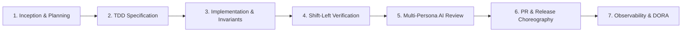
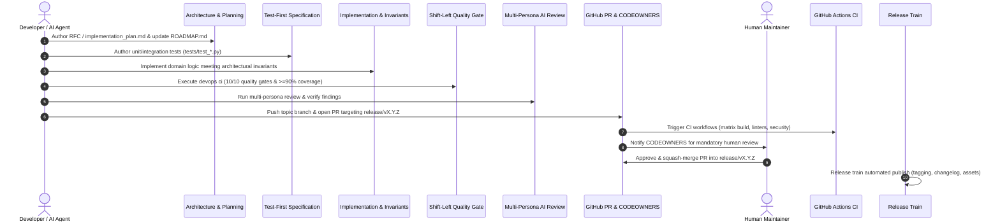
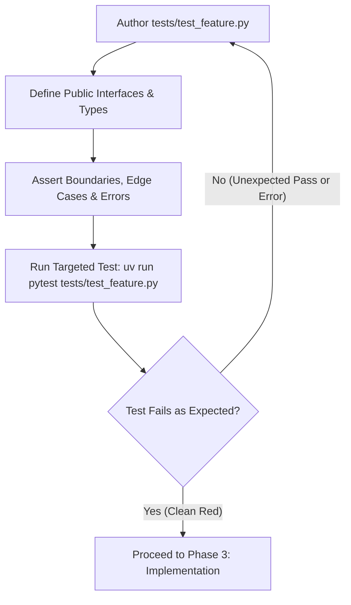
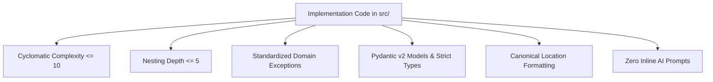
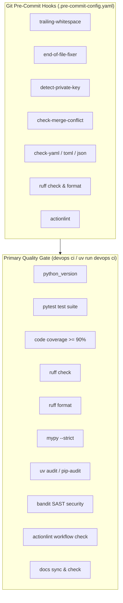
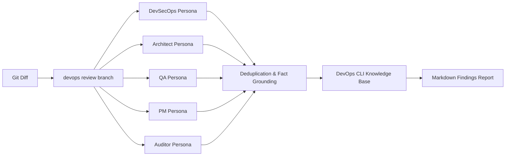
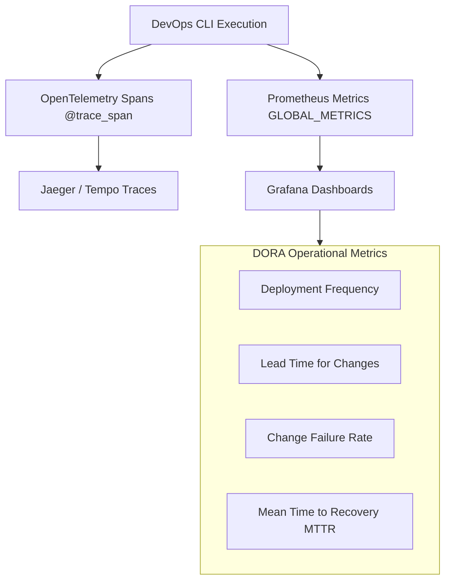

# Enterprise Software Development Life Cycle (SDLC) Framework — DevOps CLI

This document defines the comprehensive **Enterprise Software Development Life Cycle (SDLC)** architecture, operational procedures, quality gates, and governance policies governing `devops-cli`. It synthesizes industry-standard frameworks—including OpenSSF Best Practices, SLSA Level 3 supply chain security, Google Engineering Practices, and DORA operational metrics—into a unified, deterministic development lifecycle for human engineers and agentic AI assistants.

---

## 1. Executive Summary & Core SDLC Tenets

`devops-cli` implements a **Shift-Left, Zero-Trust, Test-First Enterprise SDLC**. All code and infrastructure changes progress through seven rigorously gated lifecycle phases:



### The Seven Pillars of DevOps CLI Engineering
1. **Test-Driven Specification (TDD as Living Contract)**: Implementation code is never written without pre-existing executable tests establishing functional expectations, interfaces, and boundary conditions.
2. **Strict Architectural Invariant Gates**: Continuous compliance verification enforces Cyclomatic Complexity $\le 10$, Nesting Depth $\le 5$ (< 6 indentation levels), standardized domain exceptions, and $\ge 90\%$ branch code coverage.
3. **Zero-Trust Security & Egress Safety**: No plaintext secrets anywhere in code, configuration, or logs (OS Keyring / Vault isolation); SSRF endpoint validation; bounded subprocess timeouts; least-privilege containers.
4. **Supply Chain Integrity (SLSA Level 3)**: Locked dependency graph (`uv.lock`), weekly Dependabot vulnerability audits, cryptographic hash validation, and automated static security analysis (`bandit`, `pip-audit`, `detect-private-key`).
5. **Multi-Persona AI Review & Fact Grounding**: Multi-agent code review pipeline evaluates all changes across five specialized personas (`devsecops`, `architect`, `pm`, `auditor`, `qa`), grounded by the local DevOps CLI Knowledge Base (`src/devops_cli/ai/knowledge_base/`).
6. **Branch Isolation & Human-in-the-Loop Governance**: Strict Git hierarchy isolating features to topic branches targeting active release branches (`release/vX.Y.Z`). AI agents cannot merge code autonomously; maintainers approve and squash-merge.
7. **Production Telemetry & DORA Observability**: OpenTelemetry tracing spans and Prometheus metrics instrument every CLI subcommand, background runner, and agentic review stage.

---

## 2. Seven-Phase Enterprise SDLC Framework



---

### Phase 1: Inception, Architecture & Strategic Planning

Every significant feature, structural refactoring, or tooling upgrade begins with formal architectural planning and roadmap alignment before code is written.

#### Operational Requirements
1. **Planning Artifacts**:
   - For multi-step or architectural modifications, author an `implementation_plan.md` in the agent artifacts tier (`.data/agent/brain/<plan-name>/`) or documentation RFC.
   - Outline problem motivation, architectural diagrams, component impacts, and proposed file modifications categorized with `[NEW]`, `[MODIFY]`, or `[DELETE]` annotations.
2. **Roadmap & Backlog Synchronization**:
   - Register milestones and strategic features in the Master Strategic Roadmap ([`docs/ROADMAP.md`](ROADMAP.md)).
   - Prioritize deliverables using the **Value vs. Effort Prioritization Matrix** (Quick Wins, Major Projects, Fill-Ins, Reconsider).
   - Synchronize pending milestones in [`docs/PENDING_FEATURES.md`](PENDING_FEATURES.md).
3. **Transparent Task Status Tracking**:
   - Maintain dynamic task status in [`docs/agent/task.md`](agent/task.md) divided into:
     - **Pending Tasks**: Queued deliverables and backlog milestones.
     - **In-Progress Tasks (WIP)**: Active focus items and files currently under modification.
     - **Completed Tasks**: Verified implementations, green test gates, and synchronized documentation.
4. **Target Branch Selection**:
   - Identify active release branch (`git fetch origin`, inspect `origin/release/vX.Y.Z`).
   - Create isolated topic branch from fresh upstream: `git checkout -b feat/<description> origin/release/vX.Y.Z`.

---

### Phase 2: Test-First Behavioral Specification (TDD as Living Contract)

`devops-cli` strictly enforces **Test-Driven Development (TDD)** as an authoritative specification mechanism. Feature or fix implementation code in `src/` must never precede its corresponding tests.



#### Test Architecture & Standards
- **Living Documentation**: Tests authoritatively document expected arguments, return schemas, error handling, and behavioral boundaries.
- **Deterministic Mock Isolation**: External dependencies (LLM APIs, Docker daemon, Kubernetes clusters, GitHub API, network calls) must be isolated using `pytest-mock` or mock fixtures. Real credentials or live endpoints must never be queried in unit test suites.
- **Test Collection Hygiene**: Any mock classes or helper structures defined in `src/devops_cli` must declare `__test__ = False` to prevent pytest collection warnings.
- **Domain Exception Assertions**: Verify that all domain error paths raise strongly typed exceptions inheriting from `DevOpsCLIError`, verifying the exit code and machine-readable error code constant.

---

### Phase 3: Implementation, Zero Boilerplate & Architectural Invariants

Implementation code must satisfy pre-authored tests while adhering to modern Python standards and strict architectural invariants.



#### Invariant Gates & Engineering Rules
1. **Cyclomatic Complexity $\le 10$ & Nesting Depth $\le 5$**:
   - Every function, method, and code block must maintain cyclomatic complexity $\le 10$ and nesting depth $\le 5$ (< 6 indentation levels).
   - Decompose multi-step branching into pure predicate helpers, table-driven dispatch dictionaries, or functional pipelines (`functools`, `itertools`, `pathlib`).
   - Validated continuously by `devops scan complexity` and `tests/test_architectural_invariants.py`.
2. **Standardized Domain Exception Taxonomy**:
   - Raising bare Python built-ins (`ValueError`, `RuntimeError`, `TypeError`, `Exception`) in domain logic is strictly prohibited.
   - All domain errors must inherit from `DevOpsCLIError` under `src/devops_cli/exceptions/`, supplying an exit code, machine-readable code (`CONST_ERROR_CODE_*`), and contextual details.
   - Idiomatic multiple inheritance is permitted to preserve standard exception catches (e.g. `class KubernetesContextError(KubernetesError, ValueError): ...`).
3. **Zero Inline Prompts Policy**:
   - All LLM system prompts, task instructions, and evaluation rubrics must reside in dedicated Markdown files under `src/devops_cli/ai/` and be loaded via `load_task_prompt()`. Inline prompt strings in Python code are forbidden.
4. **Canonical Location Formatting (`filename.ext:n-n`)**:
   - All CLI terminal outputs, Rich tables, Markdown review reports, and audit logs must use the canonical `filename.ext:n-n` or `filename.ext:line` format for IDE clickability and automated parsing.
5. **Zero Hardcoded Scoring or Synthetic Confidence Metrics**:
   - Never hardcode arbitrary numerical scores or confidence weights. Scores must originate directly from external security tools (CVSS, Trivy, Bandit) or structured AI model outputs. When unavailable, values remain `None` or `0.0`.

---

### Phase 4: Shift-Left Verification & Pre-Commit Quality Gates

Verification occurs continuously in the local environment, shifting defect discovery as far left as possible.



#### Pre-Commit Hardening
The `.pre-commit-config.yaml` suite intercepts flawed commits before they enter git history:
- `detect-private-key`: Scans staged files for RSA, SSH, and EC private keys (excluding synthetic mock test keys in `^tests/`).
- `check-merge-conflict`: Blocks accidental commits containing unresolved conflict markers (`<<<<<<<`, `=======`, `>>>>>>>`).
- `check-yaml`, `check-toml`, `check-json`: Validates configuration syntax across all structured files.
- `ruff`: Enforces lint rules and code formatting.
- `actionlint`: Statically analyzes GitHub Actions workflow files.

#### The Primary CI Verification Gate (`devops ci`)
Before opening or updating a PR, engineers and agents execute `devops ci` (or `uv run devops ci`). This command runs the definitive 10-check quality suite:
1. `python_version`: Verifies Python runtime compatibility.
2. `test`: Executes all unit and integration tests via `pytest`.
3. `coverage`: Enforces strict $\ge 90\%$ code coverage across `src/`.
4. `lint`: Executes `ruff check` across the entire codebase.
5. `format`: Verifies formatting compliance with `ruff format --check`.
6. `typecheck`: Enforces strict static type analysis with `mypy --strict`.
7. `audit`: Validates dependencies against known vulnerabilities via `uv audit`.
8. `security`: Scans for security antipatterns using `bandit`.
9. `actionlint`: Validates `.github/workflows/` against GitHub Actions schema.
10. `docs`: Verifies documentation generation freshness (`devops docs check`).

---

### Phase 5: Multi-Persona AI & Peer Review Governance

Code reviews combine automated multi-persona AI analysis with human-in-the-loop maintainer oversight.



#### Multi-Persona Review Engine
- **Five Specialized Personas**:
  - `devsecops`: Evaluates credential exposure, SSRF vulnerabilities, least-privilege containers, and subprocess safety.
  - `architect`: Assesses modular design, separation of concerns, cyclomatic complexity, nesting depth, and exception taxonomy.
  - `qa`: Analyzes test coverage, deterministic isolation, edge cases, and boundary condition validation.
  - `pm`: Evaluates documentation alignment, user-facing error messages, and release notes accuracy.
  - `auditor`: Verifies license compliance, supply chain provenance, and invariant gate conformance.
- **Knowledge Base Fact Grounding**: Review personas cross-reference findings against the DevOps CLI Knowledge Base (`src/devops_cli/ai/knowledge_base/`) to eliminate hallucinations (such as flagging verified dependencies like `httpx2` as suspicious).
- **Finding Verification Engine**: `devops review verify` inspects findings using AST analysis and git diff validation before presenting recommendations to developers.

---

### Phase 6: Pull Request & Release Choreography

Code promotion follows a structured branch hierarchy, automated dependency management, declarative code ownership, and semantic releases.

```mermaid
gitGraph
    commit id: "release-v0.2.11"
    branch feat/sdlc
    checkout feat/sdlc
    commit id: "feat(sdlc): add templates"
    commit id: "docs(sdlc): add manual"
    checkout release/v0.2.11
    merge feat/sdlc id: "squash-merge PR #36"
    branch release/v0.2.12
    checkout release/v0.2.12
    commit id: "chore(release): v0.2.12"
    checkout main
    merge release/v0.2.12 id: "release PR merge"
    commit id: "tag: v0.2.12"
```

#### Branch Governance & Hierarchy
- **Zero Direct Commits to `main`**: All work occurs on dedicated topic branches (`feat/<desc>`, `fix/<desc>`, `docs/<desc>`, `refactor/<desc>`).
- **PR Base Branch Targeting**: Topic PRs must target the active release branch (`--base release/vX.Y.Z`). Only release preparation PRs target `main`.
- **Atomic Conventional Commits**: All commit messages and PR titles must follow Conventional Commits: `feat(scope): ...`, `fix(scope): ...`, `docs(scope): ...`, `refactor(scope): ...`, `chore(scope): ...`.
- **Declarative Code Ownership (`.github/CODEOWNERS`)**: Pull requests automatically assign reviews based on touched file paths (Core CLI, AI/MCP, K8s, Security, CI/CD).
- **Automated Dependency Updates (`.github/dependabot.yml`)**: Dependabot monitors `github-actions` and `pip` dependencies weekly, targeting active release branches with prefix `chore(deps)`.
- **Human-in-the-Loop Merging**: AI agents prepare PRs, monitor remote GitHub Actions CI, and remediate failures. AI agents **never merge PRs autonomously**. Maintainers approve and squash-merge.

---

### Phase 7: Observability, DORA Metrics & Continuous Improvement

The SDLC cycle closes with real-time operational telemetry and DORA performance tracking.



#### Distributed Tracing & Telemetry
- All CLI subcommands, background tasks, and AI pipeline stages are instrumented with OpenTelemetry distributed spans via `@trace_span`.
- Distributed context propagates across network boundaries using W3C `traceparent` headers.
- Real-time command durations, error frequencies, and LLM token usage are tracked in-memory and emitted to Prometheus endpoints.

#### DORA Metrics Standards
| Metric | Definition | DevOps CLI Target | Measurement Mechanism |
| :--- | :--- | :--- | :--- |
| **Deployment Frequency (DF)** | Rate of successful production/release releases | Weekly release train | GitHub Releases tag frequency (`vX.Y.Z`) |
| **Lead Time for Changes (LT)** | Time from commit creation to release tag | $< 48$ hours | Git commit timestamp to GitHub Release event |
| **Change Failure Rate (CFR)** | Percentage of releases requiring hotfixes | $< 5\%$ | Ratio of `fix(release)` commits to total releases |
| **Mean Time to Recovery (MTTR)** | Time to resolve pipeline or release defects | $< 2$ hours | GitHub Issue / Hotfix PR lifecycle duration |

---

## 3. Routine Operations & Quality Gate Reference Matrix

| SDLC Phase | Activity | Primary Tool / Command | Verification Gate |
| :--- | :--- | :--- | :--- |
| **1. Inception** | RFC & Task Tracking | `docs/agent/task.md`, `ROADMAP.md` | Clear backlog categorization (Pending, WIP, Done) |
| **2. Specification** | Test-First Authoring | `pytest tests/test_<feature>.py` | Clean initial failure (asserting new behavior) |
| **3. Implementation**| Invariant Enforcement | `tests/test_architectural_invariants.py` | Complexity $\le 10$, Nesting $\le 5$, zero bare exceptions |
| **4. Verification**  | Full CI Suite | `devops ci` (or `uv run devops ci`) | 10/10 green quality gates, coverage $\ge 90\%$ |
| **4. Pre-Commit**    | Git Hook Interception | `uv run pre-commit run --all-files` | 12/12 hooks passing |
| **5. AI Review**     | Multi-Persona Review | `devops review branch <branch> --dry-run` | Zero high/critical unmitigated findings |
| **6. PR Lifecycle**  | Branch Governance | `gh pr create --base release/vX.Y.Z` | CODEOWNERS notified; remote CI checks green |
| **6. Release**       | Release Train | `devops release prepare <version> --create-pr` | Automated changelog, tag, and GitHub Release |
| **7. Observability** | Telemetry Audit | `devops telemetry status` | Active trace spans and Prometheus counters |

---

## 4. Related Architecture & Documentation References

- **Routine Operations Manual**: [`docs/ROUTINE_TASKS.md`](ROUTINE_TASKS.md)
- **Release Management Runbook**: [`docs/RELEASE_RUNBOOK.md`](RELEASE_RUNBOOK.md)
- **Master Strategic Roadmap**: [`docs/ROADMAP.md`](ROADMAP.md)
- **Pending Features & Milestones**: [`docs/PENDING_FEATURES.md`](PENDING_FEATURES.md)
- **Contributing Guidelines**: [`CONTRIBUTING.md`](../CONTRIBUTING.md)
- **Enterprise Security Policy**: [`SECURITY.md`](../SECURITY.md)
- **AI Agent Instructions & Invariants**: [`AGENTS.md`](../AGENTS.md)
