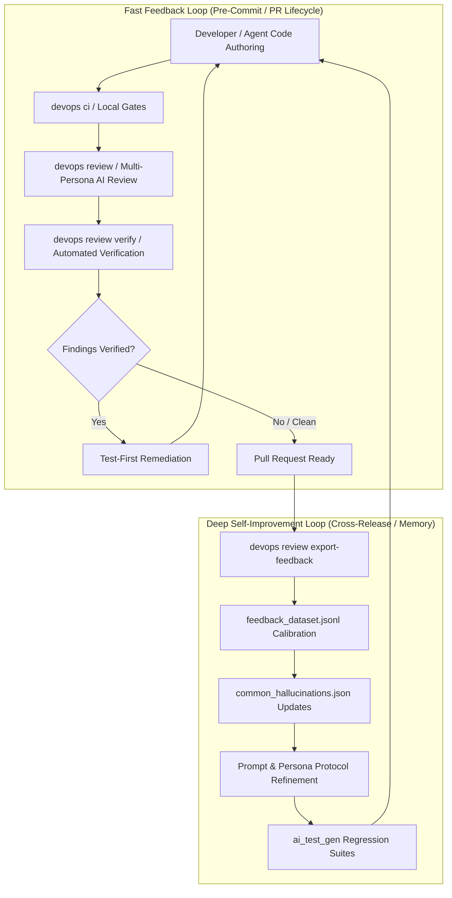
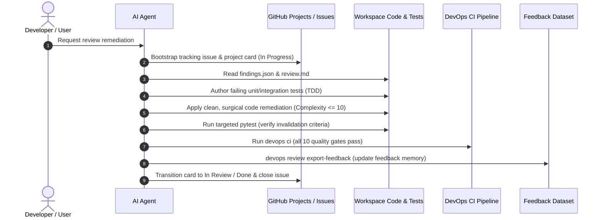

# AI Feedback, Review, and Self-Improvement Loop

This document defines the architecture, operational workflows, and engineering conventions governing the DevOps CLI AI Feedback, Review, and Self-Improvement Loop.

---

## 1. Architectural Principles & Objectives

The primary objective of the self-improvement loop is to achieve **continuous, compounding code quality and security resilience** through structured automated feedback, reproducible verification, and historical memory calibration.

### Dual-Loop Architecture

The self-improvement system operates across two complementary timescales:

1. **Fast Feedback Loop (Synchronous & Per-Branch)**:
   - **Local Quality Gates**: `devops ci` aggregates formatters, linters (`ruff`), static typing (`mypy`), security scanners (`bandit`, `actionlint`), and test suites ($\ge 90\%$ coverage).
   - **Multi-Persona Review Ensemble**: `devops review` synthesizes findings across specialized personas (`devsecops`, `architect`, `qa`, `performance`, `sre`) using a 5-phase chain-of-thought protocol.
   - **Automated Verification**: `devops review verify` evaluates concrete verification criteria against the target repository, automatically filtering out false alarms.
   - **Test-First Remediation**: Verified findings are immediately converted into failing regression tests before implementation code is updated.

2. **Deep Self-Improvement Loop (Asynchronous & Cross-Release)**:
   - **Feedback Export**: `devops review export-feedback` extracts verified findings, false positives, developer overrides, and remediation diffs into structured datasets (`.data/agent/feedback_dataset.jsonl`).
   - **Hallucination Calibration**: Patterns consistently proven false or invalid are incorporated into `common_hallucinations.json`, teaching review models to disarm recurrent false alerts.
   - **Prompt Evolution**: Persona prompts, review instructions (`src/devops_cli/ai/tasks/review.md`), and system guidelines (`AGENTS.md`) are refined to eliminate blind spots and reinforce verified heuristics.
   - **Continuous Regression Guarding**: Remediated defects are converted into enduring invariant checks (`tests/test_architectural_invariants.py`) and domain test suites.

### Deterministic Mechanical Oracles & Closed-Loop Feedback Inversion

As documented in systemic engineering retrospectives and agent post-mortems, self-improvement mechanisms cannot rely on stochastic language generation alone. They require deterministic mechanical oracles coupled with a closed-loop feedback inversion dynamic:

1. **Phase 1: Reactive Remediation**: When invariant violations, test failures, or verified review findings exist, the agent focuses 100% of priority on minimal, surgical defect resolution.
2. **Phase 2: Proactive Quality Elevation**: As soon as quality gates pass and repository health reaches 100.0/100, the feedback loop dynamically inverts:
   - **Proactive Headroom Optimization**: Decomposing functions approaching the complexity ceiling ($7 \le M \le 10$) down to safe headroom ($M \le 6$, depth $\le 3$).
   - **Public Contract Completeness**: Elevating docstring coverage and parameter type hints across all public interfaces to 100%.
   - **Structural Assertion Consolidation**: Converting linear test assertion sequences into structural tuple comparisons (`assert (a, b) == (x, y)`) to prevent false-positive complexity alarms while preserving Pytest element-level diff diagnostics.
3. **Phase 3: Continuous Self-Hardening**: Every debugging struggle, unexpected failure, missing parameter/API inconsistency, bad pattern or deficiency, and constructive suggestion is immediately codified into [`AGENTS.md`](../AGENTS.md) and ingested into [`docs/ROADMAP.md`](./ROADMAP.md) as permanent systemic roadmap tasks and guardrails.

---

## 2. Review Protocol & Persona Guidelines

Review models must follow the **5-Phase Chain-of-Thought Protocol** specified in [`src/devops_cli/ai/tasks/review.md`](../src/devops_cli/ai/tasks/review.md):

### Phase 1: Context & Target Grounding
- Ground evaluations in universal software engineering standards (OWASP Top 10, CIS benchmarks, SOLID, DRY) and target project conventions (`AGENTS.md`, `CLAUDE.md`).
- Respect authoritative lockfiles (`uv.lock`, `package-lock.json`). Never hallucinate CVEs against verified dependencies.
- Distinguish production code from test fixtures, mocks (`tests/`), documentation, or configuration templates (`*.example.*`).

### Phase 2: Semantic & AST Inspection
- **Network Egress & DNS SSRF**: In outbound HTTP requests and web scrapers, verify that both the initial URL and post-redirect response URLs perform DNS resolution and check that all resolved IPs are public (`validate_url_egress`), guarding against DNS rebinding.
- **Path Traversal Containment**: Enforce path parameter validation (`validate_no_path_traversal`) and ensure paths never resolve to forbidden system directories (`is_forbidden_system_path`).
- **HTTP Client Timeouts**: Ensure numeric timeouts configure the `read` timeout (`request_timeout(read=...)`), keeping short connect timeouts to prevent hung connections (CWE-400).
- **Algorithmic Complexity & Memory Bounds**: Bound JSON parsing inputs ($\le 5\text{ MiB}$) and ensure string lengths in exception details are bounded ($\le 256$ chars) with user credentials scrubbed.
- **Architectural Invariants**: Strictly enforce cyclomatic complexity $\le 10$ and maximum nesting depth $\le 5$ project-wide.

### Phase 3: Falsification & Anti-Hallucination
- Actively search surrounding guards, upstream sanitizers, and lockfile constraints to disprove candidate findings.
- Cross-reference candidate alerts against `common_hallucinations.json` (e.g. Python 3.14 PEP 758 syntax, masked placeholder tokens, synthetic test fixtures).
- Dismiss theoretical or already-mitigated alerts; prioritize high-signal, reproducible flaws.
- **Prefer the cheapest mechanical oracle over model judgement.** Before a finding is put to the model verifier, ask which existing tool already decides it. A claim of a `None` dereference is decided by `mypy --strict`; a claim of invalid syntax by the parser; a claim that a symbol is missing by reading the module. A verifier asked to confirm something a tool has already disproved will sometimes confirm it.
- **A finding describes the code as it is now.** Claims that a guard was "removed", "no longer present", or "dropped" must be confirmed against the current file. An assertion about an earlier state, remembered or inferred, is not a finding.

#### Calibration Record: Session `20260921-212653`

This session produced 42 findings (4 CRITICAL, 6 HIGH). Of the ten highest-severity, four were false positives, and **two of those were marked `VERIFIED` at 0.94-0.95 confidence**:

| Claim | Why it was false |
| --- | --- |
| `AttributeError` when `dashboard.uid`/`title` is `None` | Both are declared `str`, not `str \| None`. `mypy --strict` passes on the module. |
| `AttributeError` when `panel.datasource` is `None` | The cited line dereferences `Target.datasource`, which is non-Optional; the one genuinely Optional field is already `None`-guarded. |
| `_are_findings_duplicate` no longer checks same-file/same-line | Both checks are present and reachable in the current source. |
| Unpinned `:latest` image in the release workflow | The reference is `cacheFrom`, a build-cache hint, not a deployed image. |

Two of these were verifiable by a tool the repository already runs on every commit. The verification stage was reasoning about types instead of consulting the type checker, so `_check_none_dereference_hallucination` now invalidates a claimed `None` dereference whenever the cited module passes `mypy --strict`, before the model verifier sees it. The remaining two classes were added to the verifier prompt as falsification rules.

The general lesson, and the reason this record exists: **a high-confidence `VERIFIED` is not evidence.** Confidence measures the model's agreement with itself. When a deterministic oracle for a claim exists, it outranks any confidence score, and the loop should consult it first rather than asking a second model to agree with the first.

#### Calibration Record: Session `20260922-034125`

This session produced 33 findings (2 CRITICAL, 11 HIGH, 15 MEDIUM, 5 LOW) and marked **all 33 `VERIFIED`**, eleven of them at 0.95 confidence. Hand-checking against the source found five real defects. The rest failed for reasons that had nothing to do with how hard the claims were to check:

| Claim | Why it was false |
| --- | --- |
| FastAPI `0.141.1` and Uvicorn `0.53.0` are "several major releases behind" 0.110.x / 0.29.x | Version strings compared as decimals. Both pins are *ahead* of the versions cited as current, the supporting evidence was `CVE-2023-xxxx` — a placeholder, twice — and the same `findings.json` lists both packages `CLEAN` with an empty vulnerability list. |
| `StrEnum` import breaks on Python 3.10 | `requires-python = ">=3.14"`. The installer refuses that interpreter before any import runs. |
| Valkey pool caps idle connections at `max_size - 1` | At `len(idle) == max_size - 1` the guard is false and the append runs, giving exactly `max_size`. |
| Token bucket permits drive the balance negative | That is the pacing mechanism: the returned delay is exactly the refill time for the shortfall, so a caller that waits leaves the bucket at zero. Clamping would forgive the overdraft and let oversized requests exceed the configured rate. |
| SSRF via unvalidated `gateway_url` (CRITICAL) | The cited range is a display property returning a host string for a status panel; it issues no request. The suggested fix also rejected public addresses in `172.0`–`172.15` as private. |
| Jinja2 injection in `devcontainer.json.j2` | Fixed in #378, merged before the finding was triaged. The review ran against a checkout that was already behind. |

Two patterns generalize, and both now short-circuit before the model verifier:

- **Unfalsifiable evidence.** `CVE-2023-xxxx` is the shape of evidence written where evidence belongs. A verifier asked to confirm it has nothing to look up, so it agrees with the shape. `_check_placeholder_advisory_hallucination` now invalidates any finding whose advisory identifier is a placeholder.
- **Invented context.** A compatibility claim about Python 3.10 in a project declaring `>=3.14` describes a configuration that cannot be installed. `_check_unsupported_runtime_hallucination` reads the declared floor from `pyproject.toml` and invalidates claims below it.
- **Evidence the run already had.** The dependency finding is the sharpest case, because the artifact refutes itself: `external_dependencies` in the same file resolves both packages to `CLEAN` with no advisory records. The pipeline held the answer and never put the question to it. `_check_scanned_clean_dependency` now invalidates a vulnerability claim naming a package this run scanned clean, before the model verifier sees it.

Three further classes became verifier prompt rules — sink grounding for injection claims, boundary arithmetic stated as a traced sequence rather than a reading of an operator, and deliberate mechanisms reported as documentation gaps rather than defects.

The last row is a different failure and deserves naming separately: the finding was *true when written*. The Present-State Invariant added after the previous session tells the verifier to read the current file, but the verifier read the same stale checkout the reviewer did. A review is a claim about a commit, and a finding triaged against a later commit needs that commit recorded to be worth anything.

The lesson this record adds to the previous one: **the failures are not distributed like the difficulty.** Every false positive above was refutable in under a minute by reading one file, running one comparison, or noticing a placeholder — while the five real defects each took real tracing. Confidence tracked neither. A loop that spends its verification budget uniformly spends nearly all of it on the claims that needed none.

### Phase 4: Root Cause & Severity Classification
- Isolate exact failure mechanisms and categorize severity:
  - **CRITICAL**: Exploitable vulnerability, auth bypass, credential leak, SSRF, arbitrary file write outside root, or fatal crash.
  - **HIGH**: Preconditioned vulnerability, data corruption, race condition, unvalidated path write, or resource leak.
  - **MEDIUM**: Bounded flaw, unhandled error state, or incomplete mitigation.
  - **LOW**: Hardening, observability, defense-in-depth, or maintainability improvement.

### Phase 5: Self-Healing Remediation & Verification Synthesis
- Author drop-in replacements (`fix`) resolving the defect cleanly without breaking API contracts.
- Define 1–3 concrete `verification_criteria` proving defect presence and 1–3 `invalidation_criteria` proving defect resolution.

---

## 3. Step-by-Step AI Agent Remediation Workflow

When an AI agent or automated workflow is tasked with addressing review findings, the following sequence is mandatory:

### Step 1: Ingest & Categorize Findings
Read `.data/reviews/<session-id>/findings.json` and `review.md`. Group findings by severity (Critical $\rightarrow$ High $\rightarrow$ Medium $\rightarrow$ Low) and target component. Filter for verified findings (`"verified": true` or `"status": "VERIFIED"`).

### Step 2: Ground in GitHub Projects & Issues
Every review remediation task must have an active GitHub Issue and Project Item:
- Author a formal issue (e.g. `devops gh issues create --title "fix(security): remediate verified review findings" --label "type/security,scope/review,priority/p1-high"`).
- Move the Project card to `In Progress` via `devops gh project sync`.
- Create a dedicated task file under `docs/agent/tasks/task-<issue>-<slug>.md`.

### Step 3: Author Regression Tests First (Living Contract)
Before altering implementation code in `src/`:
- Formulate tests directly mirroring the finding's `verification_criteria` and `invalidation_criteria`.
- Place tests in canonical submodule test files under `tests/` (e.g. `tests/test_common_tools.py`, `tests/test_validation.py`, `tests/test_http.py`). NEVER create temporary one-off test files.
- Ensure mock hostnames strictly use `example.com` (no subdomains).

### Step 4: Implement Surgical Remediation
- Implement clean, minimal fixes satisfying the tests.
- Ruthlessly remove legacy shims or zombie code (zero compatibility debt).
- Enforce cyclomatic complexity $\le 10$ and maximum nesting depth $\le 5$. Decompose multi-branch procedures into single-responsibility pure functions.

### Step 5: Verify Invalidation & Run Full CI Suite
- Execute targeted tests: `uv run pytest tests/test_<submodule>.py`.
- Run architectural invariants: `uv run pytest tests/test_architectural_invariants.py`.
- Run full CI quality gate: `devops ci` (or `uv run devops ci`).

### Step 6: Export Feedback & Update Knowledge Memory
- Run `devops review export-feedback` to append the session's findings, verifications, and resolutions to `feedback_dataset.jsonl`.
- If any finding was identified as a false positive, register or update catalog entries in `src/devops_cli/ai/review/common_hallucinations.json` (e.g. Keyring secret stores, prompt sanitization boundaries, local cache service bindings).
- Commit changes atomically: `fix(review): remediate findings and update self-improvement memory (#<issue>)`.

---

## 4. Observability, Telemetry & Key Metrics

The self-improvement loop is monitored via OpenTelemetry distributed tracing and structured Prometheus metrics:

| Metric Name | Type | Description |
| :--- | :--- | :--- |
| `devops_cli_review_sessions_total` | Counter | Total AI review sessions executed. |
| `devops_cli_review_findings_total` | Counter | Total findings identified, labeled by `severity` and `persona`. |
| `devops_cli_review_verified_total` | Counter | Findings verified as true defects by verification criteria. |
| `devops_cli_review_invalidated_total` | Counter | Findings disproven as false alarms by invalidation criteria. |
| `devops_cli_review_feedback_exports_total` | Counter | Feedback records exported to `feedback_dataset.jsonl`. |

Tracing spans decorated with `@trace_span("review.<phase>")` capture execution latency, prompt token counts, and completion budgets across the entire pipeline.

### Review Profiles & Benchmarks

Every review writes `profile.json` next to its `findings.json`: wall time per stage (pre-analysis,
payloads, persona review, verification, re-ranking, report), the LLM calls, prompt and completion
tokens made during each stage, the backends the gateway routed them to, and the candidate,
verified and reported finding counts. The profile's session ID is an attribute of the session's
`review.session` span, so a slow stage can be followed into its trace.

A single review is not a measurement: identical runs produce different numbers of candidate
findings, and verification time follows them. `devops review benchmark <targets> -n 3` reviews the
same files several times with the response cache bypassed and saves the medians under
`.data/reviews/benchmarks/`, with seconds per candidate finding and a digest of the reviewed files.
Compare benchmarks only when their corpus digests match.

---

## 5. Loop Failure Modes & Calibration Guardrails

The review loop can fail in ways that look like productivity. A session that emits many
findings is not necessarily a session that found many defects, and a suppression catalog
that grows steadily is not necessarily a catalog that is getting smarter. The failure
modes below were each observed in a real session and are now guarded mechanically, in
prompts, or both.

### 5.1 Symptom Fan-Out (One Root Cause Reported As Many Findings)

A single defect frequently surfaces as several findings, because each persona (and each
file segment) encounters a different downstream consequence of it. One unassigned
attribute produced five findings: the unassigned attribute, the ineffective shutdown, the
un-joined thread, the delayed stream teardown, and the leaked resource.

**Guardrails**:
- **Prompt**: `code_review_prompt.md` and `review_output_instruction.md` mandate one finding
  per root cause, with downstream consequences enumerated inside that finding's description,
  and require models to scan their own `findings` array for entries a single edit would fix.
- **Mechanical**: `consolidate_duplicate_findings` merges findings that name the same
  distinctive code symbol over overlapping lines, and merges near-identical titles in one
  file even when the cited line ranges differ (personas routinely cite different, and often
  both wrong, ranges for the same defect).
- **Deliberately conservative**: findings that merely share an enclosing function are never
  merged. Losing a real defect is far costlier than leaving a duplicate on the board.

### 5.2 Segment-Boundary False Positives (Asserting Absence Of Unseen Code)

Reviewers see a bounded slice of each file and then assert that a control is *absent*
because it is not in that slice. A FastMCP server was reported as unauthenticated and
internet-exposed on the strength of its constructor at lines 1–60, while the launch path
2,900 lines away defaults to stdio and hard-rejects non-loopback binds without an explicit
opt-in flag. The inverse error is identical in shape: help strings were reported as
referencing non-existent commands because the commands are registered in a different module.

**Guardrails**:
- **Prompt**: a *Segment Boundary Honesty* mandate forbids asserting a missing control —
  authentication, validation, error handling, bounds checks, cleanup — when the code that
  would establish it lies outside the provided segment. A matching rule forbids declaring a
  symbol unused or dangling without locating its consumer. In both cases the model must
  omit the finding or record the unchecked assumption and lower `confidence_score`.
- **Persona**: the DevSecOps persona carries an explicit rule that a server object's
  constructor is not its security boundary; transport, bind address, and loopback
  enforcement live at the launch site.
- **Catalog**: both confirmed false positives are registered as recognised patterns
  (`HALLUCINATION-SERVER-CONSTRUCTOR-NO-AUTH`, `HALLUCINATION-DECLARATION-WITHOUT-CONSUMER`).

### 5.3 Suppression Catalog Poisoning (Self-Improvement That Degrades Itself)

This is the most dangerous failure mode, because it silently suppresses true positives and
leaves no trace in the output. Auto-learning synthesized each new signature from a *single*
keyword, so words such as `unvalidated`, `traversal`, `insecure`, `unbounded`, and
`validation` became complete suppression patterns — each matching nearly every genuine
security finding. The module's documented safety invariant ("no common English words may
flag findings as hallucinations") was enforced for `pattern_keywords` but not for
`signature_patterns`, so learning routed straight around it.

**Guardrails**:
- Auto-learning now synthesizes a **co-occurrence** signature requiring two distinctive
  keywords, or emits no signature at all and relies on the already-guarded compound keyword
  match.
- Bare single-word signatures are rejected **at match time**, which neutralizes catalogs
  already written to disk without requiring a data migration.
- An invalid signature regex is skipped rather than degraded into a broad substring match.

**Auditing the catalog**: a growing suppression catalog deserves periodic scrutiny, not
trust. Entries with short, generic signatures should be treated as suspect until re-derived
from a confirmed false positive.

### 5.4 Silent Baseline Loss (Fail-Open Calibration)

The builtin hallucination catalog was validated inside a single `try` around a list
comprehension, so one malformed record discarded all 27 entries and the failure was logged
only at debug level. Verification then ran on auto-learned entries alone — precisely the
entries most likely to be poisoned — with no visible signal.

**Guardrails**: entries are validated individually, a malformed record is skipped with a
warning naming its id, and a missing or unreadable baseline warns rather than failing
silently. Calibration data that fails to load must be loud, because its absence changes
review outcomes without changing review output.

### 5.5 Unactionable Findings

Both CRITICAL findings in session `20260920-124350` carried an empty `fix`. A finding
without a remediation is a report of unease, not an engineering artifact.

**Guardrail**: `fix` is mandatory and non-empty. A model that cannot articulate a concrete
remediation does not yet understand the defect well enough to report it.

### 5.6 Calibration Metrics Worth Tracking

Finding counts measure volume, not value. The ratios below measure whether the loop is
actually improving:

| Signal | Interpretation |
| :--- | :--- |
| False positives per CRITICAL/HIGH finding | Precision where it matters most; the costliest errors to ship. |
| Findings per distinct root cause | Symptom fan-out; approaching 1.0 means the loop reports defects, not symptoms. |
| Share of findings with a non-empty `fix` | Actionability of the output. |
| Suppression entries with generic signatures | Catalog poisoning risk; should trend to zero. |
| Builtin catalog entries successfully loaded | Calibration integrity; any shortfall is a silent regression. |

---

## 6. Historical Remediation Case Studies

### Session `20260913-231617` (DevSecOps & Robustness Remediation)

The DevSecOps and robustness review session `20260913-231617` produced 13 findings. 11 findings were confirmed and remediated with test-first fixes; 2 findings were classified as false-positive hallucinations and disarmed:

1. **Path Containment & Traversal Hardening**:
   - `SqlitePlanStore`: Constrained database paths to project roots, temp paths, or user home; blocked arbitrary system paths.
   - `DEVOPS_CLI_CONFIG`: Validated path traversal and forbidden system paths when loading config from environment.
   - `run_subprocess` / `run_subprocess_async`: Enforced path containment and system path rejection on caller-supplied `cwd`.
   - `devcontainer` mounts: Enforced path traversal checks on volume mount targets.
2. **SSRF & Network Egress Hardening**:
   - `waterfall.py` (Jaeger): Blocked private RFC 1918 IP addresses (`10.0.0.0/8`, `172.16.0.0/12`, `192.168.0.0/16`) while preserving local loopback (`127.0.0.1`, `localhost`).
3. **Secret Masking & Output Sanitization**:
   - `SandboxLogLine`, `SandboxExecResult`, and `PanicIncident`: Applied `mask_secrets` via Pydantic validators.
   - `pr.py` (`_render_threads_table`): Sanitized first comment bodies with `mask_secrets` in terminal output.
   - `_sync_configured_k8s_context`: Masked and truncated exception details in warning output.
   - `_start_minikube_cluster`: Sanitized status messages with `mask_secrets`.
4. **K8s Autostart Hygiene**:
   - `switch_context`: Respected `should_autostart_minikube()` configuration flag.
   - `KUBECONFIG`: Validated against path traversal and forbidden system paths prior to CLI invocation.
5. **Anti-Hallucination Catalog Updates**:
   - Disarmed `HALLUCINATION-NONEXISTENT-FIXER-PAYLOAD` (non-existent `src/devops_cli/ai/fixer.py` and claims of unbounded payload in `repair_json_string`).
   - Disarmed `HALLUCINATION-CI-ALLOW-BLOCKED-STATE` (false claims of insecure bypass for transient in-flight CI mergeable states).
6. **Native DevOps CLI GitHub Rate Management**:
   - Replaced bare `gh` invocations with native `devops gh` and centralized `run_gh()` runner featuring token-bucket pacing, quota safety thresholds, exponential backoff with jitter on secondary rate limits, and TTL read caching.

### Session `20260915-124521` (GitHub Rate Limiting, Container Sandbox Isolation & Path Traversal Remediation)

The DevSecOps and Architecture review session `20260915-124521` produced 22 findings across GitHub rate limiting, container sandboxes, and file traversal operations. All actionable findings were verified and remediated:

1. **GitHub Rate Limiting Quota Integrity & Mandatory Pacing**:
   - Enforced non-negativity ($\ge 0$) on all quota state values (`remaining`, `limit`, `used`, `reset_epoch`), raising descriptive validation errors on invalid metrics.
   - Paced requests dynamically according to $\text{delay} = \frac{\text{time until reset}}{\text{remaining requests}}$, eliminating hardcoded windows.
   - Introduced configurable no-delay threshold `DEFAULT_GH_NO_DELAY_USED_PERCENT = 25.0`, bypassing delay when token utilization is below 25%.
   - Resolved re-entrant lock deadlocks by transitioning `GitHubRateLimiter` internal locks to `threading.RLock()`.
   - Prevented memory read-caching on commands containing sensitive tokens or credentials (`_should_cache`).
   - Validated `cwd` against directory existence and forbidden system paths (`/etc`, `/root`, etc.).

2. **Container Sandbox Isolation & Secure Network Defaults**:
   - Switched default network mode from insecure `bridge` to `isolated` across `devops test sandbox`, `devops docker sandbox`, and FastMCP tools (`docker_sandbox`, `sandbox_deploy`, `sandbox_network_policy`).
   - Added explicit security warnings in documentation (`CLI_REFERENCE.md`, `docker.md`, `test.md`) and runtime CLI printouts whenever `bridge` mode is selected.
   - Validated network modes and whitelist tokens against flag injection and forbidden characters.

3. **Symlink Traversal & Path Containment Hardening (CWE-22 / CWE-59)**:
   - `argo/gitops.py` (`_scan_directory_manifests`): Explicitly skipped symlinks (`is_symlink()`) and enforced repository root containment (`resolved.is_relative_to(repo_root)`).
   - `security/gitleaks.py` (`_resolve_scan_files`): Enforced `_is_safe_file` validation across candidate lists, individual files, and directory trees, skipping symlinks and out-of-bounds files.
   - `ai/harness/filesystem.py` (`_list_directory`): Added symlink skipping guard.
   - `ai/rag/indexer.py` (`_is_indexable_file`): Skipped symlinks and verified root containment.
   - `config/settings.py` (`_find_project_config_path`): Disallowed symlinks and forbidden system paths.

4. **Secret Sanitization & Output Masking**:
   - Applied `mask_secrets` to image names, stdout, and stderr in `devops test sandbox`.
   - Sanitized clone URLs and exception details in `devops repos clone` and `clone-org`.
   - Masked Minikube cluster startup status output in `devops k8s switch-context`.
   - Routed PR check fallbacks through `run_gh()` with secret masking.
   - Masked Vault configuration error details in `devops vault`.

### Session `20260920-124350` (Review Loop Calibration & Informer Shutdown Remediation)

A DevSecOps, Architecture, and QA session produced 55 findings across 2 CRITICAL, 4 HIGH,
24 MEDIUM, and 25 LOW. Hand-verification of the CRITICAL and HIGH tier found 4 real defects,
2 false positives, and substantial symptom fan-out — which redirected the remediation toward
the loop itself as much as the code.

1. **Verified Defects Remediated**:
   - `k8s/informer.py`: the active `watch.Watch()` was never published to `self._watcher`, so
     `stop()` could not interrupt the blocking stream and the worker thread survived until the
     next server-side resync. The watcher is now published for the stream's lifetime, cleared
     on exit, and `stop()` joins the worker under a bounded timeout.
   - `k8s/informer.py`: the resource cache grew without bound; it is now an `OrderedDict` with
     FIFO eviction at `DEFAULT_K8S_INFORMER_CACHE_MAX_ENTRIES`.
   - `k8s/service.py`: `_set_cached` accepted a `ttl` argument and silently ignored it, so
     short negative caches (a failed reachability probe asking for ~2s) were pinned for the
     full cache TTL. Entries now carry their own expiry deadline.
   - `commands/k8s/cluster_context.py`: `except Exception: pass` around the in-process client
     realignment hid genuine failures; it now logs a typed warning without failing the command.
   - `github/client.py`: `get_repo_overview` let raw GraphQL transport errors escape and crash
     the CLI; they are wrapped in an annotated `GitHubOperationError`.

2. **False Positives Disarmed** (see §5.2):
   - *FastMCP server lacks authentication*: judged from the constructor while the launch path
     defaults to stdio and rejects non-loopback binds absent an explicit opt-in flag.
   - *Help strings reference nonexistent commands*: the commands are registered in
     `commands/gh.py`, a module outside the reviewed segment.

3. **Loop Calibration** (the substantive outcome):
   - Symbol-aware and range-independent duplicate consolidation, reducing this session's
     findings from 55 to 50 without merging any distinct defect; the residual fan-out is
     addressed at generation time through the root-cause prompt mandate.
   - **110 degenerate single-word suppression signatures neutralized** at match time. Words
     including `unvalidated`, `traversal`, `insecure`, and `unbounded` had been learned as
     complete suppression patterns capable of burying genuine security findings.
   - The builtin catalog was discovered to be loading **zero of 27 entries** because one
     malformed record aborted the whole comprehension; validation is now per-entry and loud.
   - Prompt mandates added for root-cause consolidation, segment-boundary honesty,
     declaration-versus-consumer reasoning, narrowest-true-location anchoring, and a
     mandatory non-empty `fix`.
