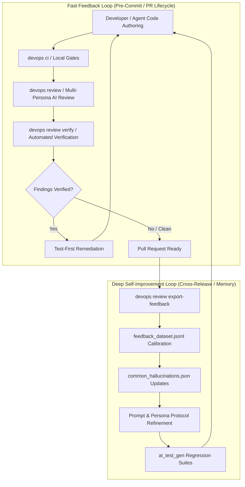
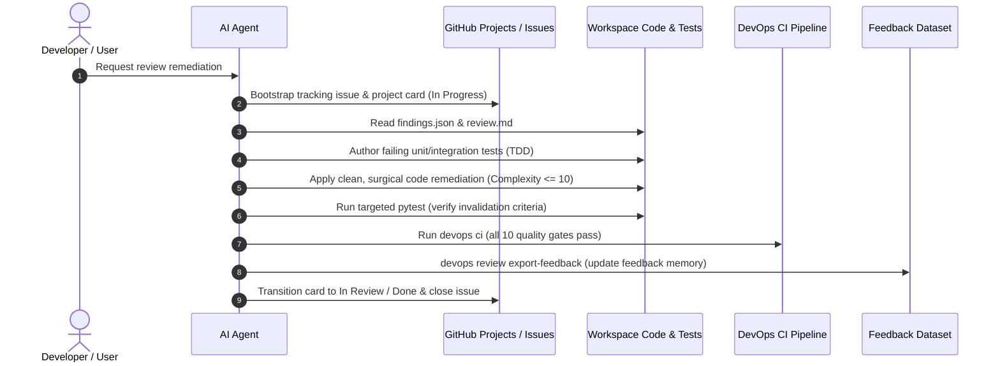

# AI Feedback, Review, and Self-Improvement Loop

This document defines the architecture, operational workflows, and engineering conventions governing the DevOps CLI AI Feedback, Review, and Self-Improvement Loop.

---

## 1. Architectural Principles & Objectives

The primary objective of the self-improvement loop is to achieve **continuous, compounding code quality and security resilience** through structured automated feedback, reproducible verification, and historical memory calibration.

### Dual-Loop Architecture

The self-improvement system operates across two complementary timescales:

1. **Fast Feedback Loop (Synchronous & Per-Branch)**:
   - **Local Quality Gates**: `devops ci` aggregates formatters, linters (`ruff`), static typing (`mypy`), security scanners (`bandit`, `actionlint`), and test suites ($\ge 90\%$ coverage).
   - **Multi-Persona Review Ensemble**: `devops review` synthesizes findings across specialized personas (`devsecops`, `architect`, `qa`, `performance`, `sre`) using a 5-phase chain-of-thought protocol.
   - **Automated Verification**: `devops review verify` evaluates concrete verification criteria against the target repository, automatically filtering out false alarms.
   - **Test-First Remediation**: Verified findings are immediately converted into failing regression tests before implementation code is updated.

2. **Deep Self-Improvement Loop (Asynchronous & Cross-Release)**:
   - **Feedback Export**: `devops review export-feedback` extracts verified findings, false positives, developer overrides, and remediation diffs into structured datasets (`.data/agent/feedback_dataset.jsonl`).
   - **Hallucination Calibration**: Patterns consistently proven false or invalid are incorporated into `common_hallucinations.json`, teaching review models to disarm recurrent false alerts.
   - **Prompt Evolution**: Persona prompts, review instructions (`src/devops_cli/ai/tasks/review.md`), and system guidelines (`AGENTS.md`) are refined to eliminate blind spots and reinforce verified heuristics.
   - **Continuous Regression Guarding**: Remediated defects are converted into enduring invariant checks (`tests/test_architectural_invariants.py`) and domain test suites.

### Deterministic Mechanical Oracles & Closed-Loop Feedback Inversion

As documented in systemic engineering retrospectives and agent post-mortems, self-improvement mechanisms cannot rely on stochastic language generation alone. They require deterministic mechanical oracles coupled with a closed-loop feedback inversion dynamic:

1. **Phase 1: Reactive Remediation**: When invariant violations, test failures, or verified review findings exist, the agent focuses 100% of priority on minimal, surgical defect resolution.
2. **Phase 2: Proactive Quality Elevation**: As soon as quality gates pass and repository health reaches 100.0/100, the feedback loop dynamically inverts:
   - **Proactive Headroom Optimization**: Decomposing functions approaching the complexity ceiling ($7 \le M \le 10$) down to safe headroom ($M \le 6$, depth $\le 3$).
   - **Public Contract Completeness**: Elevating docstring coverage and parameter type hints across all public interfaces to 100%.
   - **Structural Assertion Consolidation**: Converting linear test assertion sequences into structural tuple comparisons (`assert (a, b) == (x, y)`) to prevent false-positive complexity alarms while preserving Pytest element-level diff diagnostics.
3. **Phase 3: Continuous Self-Hardening**: Every debugging struggle, unexpected failure, missing parameter/API inconsistency, bad pattern or deficiency, and constructive suggestion is immediately codified into [`AGENTS.md`](../AGENTS.md) and ingested into [`docs/ROADMAP.md`](./ROADMAP.md) as permanent systemic roadmap tasks and guardrails.

---

## 2. Review Protocol & Persona Guidelines

Review models must follow the **5-Phase Chain-of-Thought Protocol** specified in [`src/devops_cli/ai/tasks/review.md`](../src/devops_cli/ai/tasks/review.md):

### Phase 1: Context & Target Grounding
- Ground evaluations in universal software engineering standards (OWASP Top 10, CIS benchmarks, SOLID, DRY) and target project conventions (`AGENTS.md`, `CLAUDE.md`).
- Respect authoritative lockfiles (`uv.lock`, `package-lock.json`). Never hallucinate CVEs against verified dependencies.
- Distinguish production code from test fixtures, mocks (`tests/`), documentation, or configuration templates (`*.example.*`).

### Phase 2: Semantic & AST Inspection
- **Network Egress & DNS SSRF**: In outbound HTTP requests and web scrapers, verify that both the initial URL and post-redirect response URLs perform DNS resolution and check that all resolved IPs are public (`validate_url_egress`), guarding against DNS rebinding.
- **Path Traversal Containment**: Enforce path parameter validation (`validate_no_path_traversal`) and ensure paths never resolve to forbidden system directories (`is_forbidden_system_path`).
- **HTTP Client Timeouts**: Ensure numeric timeouts configure the `read` timeout (`request_timeout(read=...)`), keeping short connect timeouts to prevent hung connections (CWE-400).
- **Algorithmic Complexity & Memory Bounds**: Bound JSON parsing inputs ($\le 5\text{ MiB}$) and ensure string lengths in exception details are bounded ($\le 256$ chars) with user credentials scrubbed.
- **Architectural Invariants**: Strictly enforce cyclomatic complexity $\le 10$ and maximum nesting depth $\le 5$ project-wide.

### Phase 3: Falsification & Anti-Hallucination
- Actively search surrounding guards, upstream sanitizers, and lockfile constraints to disprove candidate findings.
- Cross-reference candidate alerts against `common_hallucinations.json` (e.g. Python 3.14 PEP 758 syntax, masked placeholder tokens, synthetic test fixtures).
- Dismiss theoretical or already-mitigated alerts; prioritize high-signal, reproducible flaws.

### Phase 4: Root Cause & Severity Classification
- Isolate exact failure mechanisms and categorize severity:
  - **CRITICAL**: Exploitable vulnerability, auth bypass, credential leak, SSRF, arbitrary file write outside root, or fatal crash.
  - **HIGH**: Preconditioned vulnerability, data corruption, race condition, unvalidated path write, or resource leak.
  - **MEDIUM**: Bounded flaw, unhandled error state, or incomplete mitigation.
  - **LOW**: Hardening, observability, defense-in-depth, or maintainability improvement.

### Phase 5: Self-Healing Remediation & Verification Synthesis
- Author drop-in replacements (`fix`) resolving the defect cleanly without breaking API contracts.
- Define 1–3 concrete `verification_criteria` proving defect presence and 1–3 `invalidation_criteria` proving defect resolution.

---

## 3. Step-by-Step AI Agent Remediation Workflow

When an AI agent or automated workflow is tasked with addressing review findings, the following sequence is mandatory:

### Step 1: Ingest & Categorize Findings
Read `.data/reviews/<session-id>/findings.json` and `review.md`. Group findings by severity (Critical $\rightarrow$ High $\rightarrow$ Medium $\rightarrow$ Low) and target component. Filter for verified findings (`"verified": true` or `"status": "VERIFIED"`).

### Step 2: Ground in GitHub Projects & Issues
Every review remediation task must have an active GitHub Issue and Project Item:
- Author a formal issue (e.g. `devops gh issues create --title "fix(security): remediate verified review findings" --label "type/security,scope/review,priority/p1-high"`).
- Move the Project card to `In Progress` via `devops gh project sync`.
- Create a dedicated task file under `docs/agent/tasks/task-<issue>-<slug>.md`.

### Step 3: Author Regression Tests First (Living Contract)
Before altering implementation code in `src/`:
- Formulate tests directly mirroring the finding's `verification_criteria` and `invalidation_criteria`.
- Place tests in canonical submodule test files under `tests/` (e.g. `tests/test_common_tools.py`, `tests/test_validation.py`, `tests/test_http.py`). NEVER create temporary one-off test files.
- Ensure mock hostnames strictly use `example.com` (no subdomains).

### Step 4: Implement Surgical Remediation
- Implement clean, minimal fixes satisfying the tests.
- Ruthlessly remove legacy shims or zombie code (zero compatibility debt).
- Enforce cyclomatic complexity $\le 10$ and maximum nesting depth $\le 5$. Decompose multi-branch procedures into single-responsibility pure functions.

### Step 5: Verify Invalidation & Run Full CI Suite
- Execute targeted tests: `uv run pytest tests/test_<submodule>.py`.
- Run architectural invariants: `uv run pytest tests/test_architectural_invariants.py`.
- Run full CI quality gate: `devops ci` (or `uv run devops ci`).

### Step 6: Export Feedback & Update Knowledge Memory
- Run `devops review export-feedback` to append the session's findings, verifications, and resolutions to `feedback_dataset.jsonl`.
- If any finding was identified as a false positive, register or update catalog entries in `src/devops_cli/ai/review/common_hallucinations.json` (e.g. Keyring secret stores, prompt sanitization boundaries, local cache service bindings).
- Commit changes atomically: `fix(review): remediate findings and update self-improvement memory (#<issue>)`.

---

## 4. Observability, Telemetry & Key Metrics

The self-improvement loop is monitored via OpenTelemetry distributed tracing and structured Prometheus metrics:

| Metric Name | Type | Description |
| :--- | :--- | :--- |
| `devops_cli_review_sessions_total` | Counter | Total AI review sessions executed. |
| `devops_cli_review_findings_total` | Counter | Total findings identified, labeled by `severity` and `persona`. |
| `devops_cli_review_verified_total` | Counter | Findings verified as true defects by verification criteria. |
| `devops_cli_review_invalidated_total` | Counter | Findings disproven as false alarms by invalidation criteria. |
| `devops_cli_review_feedback_exports_total` | Counter | Feedback records exported to `feedback_dataset.jsonl`. |

Tracing spans decorated with `@trace_span("review.<phase>")` capture execution latency, prompt token counts, and completion budgets across the entire pipeline.

---

## 5. Historical Remediation Case Studies

### Session `20260913-231617` (DevSecOps & Robustness Remediation)

The DevSecOps and robustness review session `20260913-231617` produced 13 findings. 11 findings were confirmed and remediated with test-first fixes; 2 findings were classified as false-positive hallucinations and disarmed:

1. **Path Containment & Traversal Hardening**:
   - `SqlitePlanStore`: Constrained database paths to project roots, temp paths, or user home; blocked arbitrary system paths.
   - `DEVOPS_CLI_CONFIG`: Validated path traversal and forbidden system paths when loading config from environment.
   - `run_subprocess` / `run_subprocess_async`: Enforced path containment and system path rejection on caller-supplied `cwd`.
   - `devcontainer` mounts: Enforced path traversal checks on volume mount targets.
2. **SSRF & Network Egress Hardening**:
   - `waterfall.py` (Jaeger): Blocked private RFC 1918 IP addresses (`10.0.0.0/8`, `172.16.0.0/12`, `192.168.0.0/16`) while preserving local loopback (`127.0.0.1`, `localhost`).
3. **Secret Masking & Output Sanitization**:
   - `SandboxLogLine`, `SandboxExecResult`, and `PanicIncident`: Applied `mask_secrets` via Pydantic validators.
   - `pr.py` (`_render_threads_table`): Sanitized first comment bodies with `mask_secrets` in terminal output.
   - `_sync_configured_k8s_context`: Masked and truncated exception details in warning output.
   - `_start_minikube_cluster`: Sanitized status messages with `mask_secrets`.
4. **K8s Autostart Hygiene**:
   - `switch_context`: Respected `should_autostart_minikube()` configuration flag.
   - `KUBECONFIG`: Validated against path traversal and forbidden system paths prior to CLI invocation.
5. **Anti-Hallucination Catalog Updates**:
   - Disarmed `HALLUCINATION-NONEXISTENT-FIXER-PAYLOAD` (non-existent `src/devops_cli/ai/fixer.py` and claims of unbounded payload in `repair_json_string`).
   - Disarmed `HALLUCINATION-CI-ALLOW-BLOCKED-STATE` (false claims of insecure bypass for transient in-flight CI mergeable states).
6. **Native DevOps CLI GitHub Rate Management**:
   - Replaced bare `gh` invocations with native `devops gh` and centralized `run_gh()` runner featuring token-bucket pacing, quota safety thresholds, exponential backoff with jitter on secondary rate limits, and TTL read caching.

### Session `20260915-124521` (GitHub Rate Limiting, Container Sandbox Isolation & Path Traversal Remediation)

The DevSecOps and Architecture review session `20260915-124521` produced 22 findings across GitHub rate limiting, container sandboxes, and file traversal operations. All actionable findings were verified and remediated:

1. **GitHub Rate Limiting Quota Integrity & Mandatory Pacing**:
   - Enforced non-negativity ($\ge 0$) on all quota state values (`remaining`, `limit`, `used`, `reset_epoch`), raising descriptive validation errors on invalid metrics.
   - Paced requests dynamically according to $\text{delay} = \frac{\text{time until reset}}{\text{remaining requests}}$, eliminating hardcoded windows.
   - Introduced configurable no-delay threshold `DEFAULT_GH_NO_DELAY_USED_PERCENT = 25.0`, bypassing delay when token utilization is below 25%.
   - Resolved re-entrant lock deadlocks by transitioning `GitHubRateLimiter` internal locks to `threading.RLock()`.
   - Prevented memory read-caching on commands containing sensitive tokens or credentials (`_should_cache`).
   - Validated `cwd` against directory existence and forbidden system paths (`/etc`, `/root`, etc.).

2. **Container Sandbox Isolation & Secure Network Defaults**:
   - Switched default network mode from insecure `bridge` to `isolated` across `devops test sandbox`, `devops docker sandbox`, and FastMCP tools (`docker_sandbox`, `sandbox_deploy`, `sandbox_network_policy`).
   - Added explicit security warnings in documentation (`CLI_REFERENCE.md`, `docker.md`, `test.md`) and runtime CLI printouts whenever `bridge` mode is selected.
   - Validated network modes and whitelist tokens against flag injection and forbidden characters.

3. **Symlink Traversal & Path Containment Hardening (CWE-22 / CWE-59)**:
   - `argo/gitops.py` (`_scan_directory_manifests`): Explicitly skipped symlinks (`is_symlink()`) and enforced repository root containment (`resolved.is_relative_to(repo_root)`).
   - `security/gitleaks.py` (`_resolve_scan_files`): Enforced `_is_safe_file` validation across candidate lists, individual files, and directory trees, skipping symlinks and out-of-bounds files.
   - `ai/harness/filesystem.py` (`_list_directory`): Added symlink skipping guard.
   - `ai/rag/indexer.py` (`_is_indexable_file`): Skipped symlinks and verified root containment.
   - `config/settings.py` (`_find_project_config_path`): Disallowed symlinks and forbidden system paths.

4. **Secret Sanitization & Output Masking**:
   - Applied `mask_secrets` to image names, stdout, and stderr in `devops test sandbox`.
   - Sanitized clone URLs and exception details in `devops repos clone` and `clone-org`.
   - Masked Minikube cluster startup status output in `devops k8s switch-context`.
   - Routed PR check fallbacks through `run_gh()` with secret masking.
   - Masked Vault configuration error details in `devops vault`.
