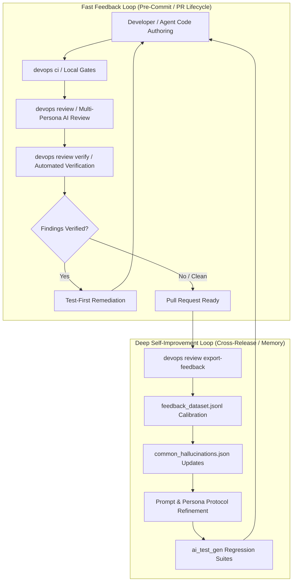
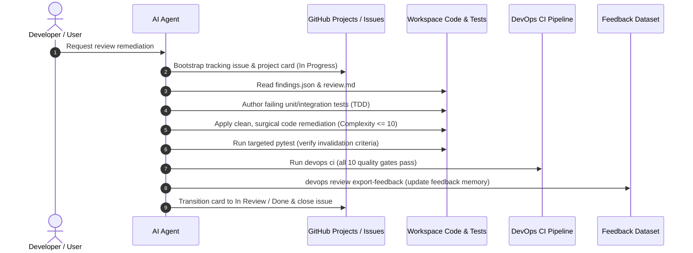

# AI Feedback, Review, and Self-Improvement Loop

This document defines the architecture, operational workflows, and engineering conventions governing the DevOps CLI AI Feedback, Review, and Self-Improvement Loop.

---

## 1. Architectural Principles & Objectives

The primary objective of the self-improvement loop is to achieve **continuous, compounding code quality and security resilience** through structured automated feedback, reproducible verification, and historical memory calibration.

### Dual-Loop Architecture

The self-improvement system operates across two complementary timescales:


```mermaid
flowchart TD
    subgraph FastLoop["Fast Feedback Loop (Pre-Commit / PR Lifecycle)"]
        A[Developer / Agent Code Authoring] --> B[devops ci / Local Gates]
        B --> C[devops review / Multi-Persona AI Review]
        C --> D[devops review verify / Automated Verification]
        D --> E{Findings Verified?}
        E -- Yes --> F[Test-First Remediation]
        F --> A
        E -- No / Clean --> G[Pull Request Ready]
    end

    subgraph DeepLoop["Deep Self-Improvement Loop (Cross-Release / Memory)"]
        G --> H[devops review export-feedback]
        H --> I[feedback_dataset.jsonl Calibration]
        I --> J[common_hallucinations.json Updates]
        J --> K[Prompt & Persona Protocol Refinement]
        K --> L[ai_test_gen Regression Suites]
        L --> A
    end
```

1. **Fast Feedback Loop (Synchronous & Per-Branch)**:
   - **Local Quality Gates**: `devops ci` aggregates formatters, linters (`ruff`), static typing (`mypy`), security scanners (`bandit`, `actionlint`), and test suites ($\ge 90\%$ coverage).
   - **Multi-Persona Review Ensemble**: `devops review` synthesizes findings across specialized personas (`devsecops`, `architect`, `qa`, `performance`, `sre`) using a 5-phase chain-of-thought protocol.
   - **Automated Verification**: `devops review verify` evaluates concrete verification criteria against the target repository, automatically filtering out false alarms.
   - **Test-First Remediation**: Verified findings are immediately converted into failing regression tests before implementation code is updated.

2. **Deep Self-Improvement Loop (Asynchronous & Cross-Release)**:
   - **Feedback Export**: `devops review export-feedback` appends each verdict it has not exported yet, from findings.json and candidates.json, to the feedback dataset (`.data/feedback_dataset.jsonl`, `data.feedback_dataset_path`).
   - **Hallucination Calibration**: Curated false-positive patterns ship in the builtin `common_hallucinations.json`. A person's INVALIDATED verdict records the one claim it disproved in the learned catalog, which later reviews suppress and show to the personas (section 5.7).
   - **Prompt Evolution**: Persona prompts, review instructions (`src/devops_cli/ai/tasks/review.md`), and system guidelines (`AGENTS.md`) are refined to eliminate blind spots and reinforce verified heuristics.
   - **Continuous Regression Guarding**: Remediated defects are converted into enduring invariant checks (`tests/test_architectural_invariants.py`) and domain test suites.

### Deterministic Mechanical Oracles & Closed-Loop Feedback Inversion

As documented in systemic engineering retrospectives and agent post-mortems, self-improvement mechanisms cannot rely on stochastic language generation alone. They require deterministic mechanical oracles coupled with a closed-loop feedback inversion dynamic:

1. **Phase 1: Reactive Remediation**: When invariant violations, test failures, or verified review findings exist, the agent focuses 100% of priority on minimal, surgical defect resolution.
2. **Phase 2: Proactive Quality Elevation**: As soon as quality gates pass and repository health reaches 100.0/100, the feedback loop dynamically inverts:
   - **Proactive Headroom Optimization**: Decomposing functions approaching the complexity ceiling ($7 \le M \le 10$) down to safe headroom ($M \le 6$, depth $\le 3$).
   - **Public Contract Completeness**: Elevating docstring coverage and parameter type hints across all public interfaces to 100%.
   - **Structural Assertion Consolidation**: Converting linear test assertion sequences into structural tuple comparisons (`assert (a, b) == (x, y)`) to prevent false-positive complexity alarms while preserving Pytest element-level diff diagnostics.
3. **Phase 3: Continuous Self-Hardening**: Every debugging struggle, unexpected failure, missing parameter/API inconsistency, bad pattern or deficiency, and constructive suggestion is immediately codified into [`AGENTS.md`](../AGENTS.md) and ingested into [`docs/ROADMAP.md`](./ROADMAP.md) as permanent systemic roadmap tasks and guardrails.

---

## 2. Review Protocol & Persona Guidelines

Review models must follow the **5-Phase Chain-of-Thought Protocol** specified in [`src/devops_cli/ai/tasks/review.md`](../src/devops_cli/ai/tasks/review.md):

### Phase 1: Context & Target Grounding
- Ground evaluations in universal software engineering standards (OWASP Top 10, CIS benchmarks, SOLID, DRY) and target project conventions (`AGENTS.md`, `CLAUDE.md`).
- Respect authoritative lockfiles (`uv.lock`, `package-lock.json`). Dependency advisories come from the scanners; a reviewer never cites a CVE or GHSA identifier from memory.
- Distinguish production code from test fixtures, mocks (`tests/`), documentation, or configuration templates (`*.example.*`). A finding about a test itself is a test that cannot fail, while a real credential or a genuine vulnerability in a test file is still a finding. Roadmaps, changelogs, task files and decision records get no findings.
- The DevSecOps persona states a threat model. Network and fetched content, model output, PR and issue text, repositories under review, Kubernetes and cloud API data, server requests and MCP or tool-call arguments are untrusted. The operator, their config, environment and arguments, and values the code builds are trusted. A vulnerability is a path the reviewer can quote: the untrusted source, the sink and the missing check between them. When it cannot quote them, it returns no finding.

### Phase 2: Semantic & AST Inspection
- **Network Egress & DNS SSRF**: In outbound HTTP requests and web scrapers, verify that both the initial URL and post-redirect response URLs perform DNS resolution and check that all resolved IPs are public (`validate_url_egress`), guarding against DNS rebinding.
- **Path Traversal Containment**: Enforce path parameter validation (`validate_no_path_traversal`) and ensure paths never resolve to forbidden system directories (`is_forbidden_system_path`).
- **HTTP Client Timeouts**: Ensure numeric timeouts configure the `read` timeout (`request_timeout(read=...)`), keeping short connect timeouts to prevent hung connections (CWE-400).
- **Algorithmic Complexity & Memory Bounds**: Bound JSON parsing inputs ($\le 5\text{ MiB}$) and ensure string lengths in exception details are bounded ($\le 256$ chars) with user credentials scrubbed.
- **Architectural Invariants**: Strictly enforce cyclomatic complexity $\le 10$ and maximum nesting depth $\le 5$ project-wide.

### Phase 3: Falsification & Anti-Hallucination
- Actively search surrounding guards, upstream sanitizers, and lockfile constraints to disprove candidate findings.
- Cross-reference candidate alerts against `common_hallucinations.json` (e.g. Python 3.14 PEP 758 syntax, masked placeholder tokens, synthetic test fixtures).
- Dismiss theoretical or already-mitigated alerts; prioritize high-signal, reproducible flaws.
- **Prefer the cheapest mechanical oracle over model judgement.** Before a finding is put to the model verifier, ask which existing tool already decides it. A claim of a `None` dereference is decided by `mypy --strict`; a claim of invalid syntax by the parser; a claim that a symbol is missing by reading the module. A verifier asked to confirm something a tool has already disproved will sometimes confirm it.
- **A finding describes the code as it is now.** Claims that a guard was "removed", "no longer present", or "dropped" must be confirmed against the current file. An assertion about an earlier state, remembered or inferred, is not a finding.

#### Calibration Record: Session `20260921-212653`

This session produced 42 findings (4 CRITICAL, 6 HIGH). Of the ten highest-severity, four were false positives, and **two of those were marked `VERIFIED` at 0.94-0.95 confidence**:

| Claim | Why it was false |
| --- | --- |
| `AttributeError` when `dashboard.uid`/`title` is `None` | Both are declared `str`, not `str \| None`. `mypy --strict` passes on the module. |
| `AttributeError` when `panel.datasource` is `None` | The cited line dereferences `Target.datasource`, which is non-Optional; the one genuinely Optional field is already `None`-guarded. |
| `_are_findings_duplicate` no longer checks same-file/same-line | Both checks are present and reachable in the current source. |
| Unpinned `:latest` image in the release workflow | The reference is `cacheFrom`, a build-cache hint, not a deployed image. |

Two of these were verifiable by a tool the repository already runs on every commit. The verification stage was reasoning about types instead of consulting the type checker, so `_check_none_dereference_hallucination` now invalidates a claimed `None` dereference whenever the cited module passes `mypy --strict`, before the model verifier sees it. The reviewed tree is untrusted, so the check runs devops-cli's own mypy in isolated mode (`python -I -m mypy --strict`), from an empty temporary directory, with devops-cli's own config, which loads only the `pydantic.mypy` plugin its `[tool.mypy]` loads. Nothing of the target runs: not its build backend, which `uv run` would sync, not its mypy config and plugins, and not a `sitecustomize` or `mypy` package that a `PYTHONPATH` naming it would put first (#946). mypy's cache is kept in devops-cli's cache directory (`<data dir>/cache/typecheck-probe/`), one per interpreter, and probes run one at a time. The first probe on a machine is a cold pass over the module's imports: about a minute for a devops-cli module, and longer on a loaded machine, against a 120 s timeout. A probe that times out claims nothing, and the next starts from what it cached. The module under review controls its own strict pass, so the probe claims nothing of a module that holds a `type: ignore` or an inline `# mypy:` comment, or whose cited lines hold an expression of type `Any`: a second, warm pass checks a copy of the module with `# mypy: disallow-any-expr` appended (`--shadow-file`) and names those lines (#972). The remaining two classes were added to the verifier prompt as falsification rules.

The general lesson, and the reason this record exists: **a high-confidence `VERIFIED` is not evidence.** Confidence measures the model's agreement with itself. When a deterministic oracle for a claim exists, it outranks any confidence score, and the loop should consult it first rather than asking a second model to agree with the first.

#### Calibration Record: Session `20260922-034125`

This session produced 33 findings (2 CRITICAL, 11 HIGH, 15 MEDIUM, 5 LOW) and marked **all 33 `VERIFIED`**, eleven of them at 0.95 confidence. Hand-checking against the source found five real defects. The rest failed for reasons that had nothing to do with how hard the claims were to check:

| Claim | Why it was false |
| --- | --- |
| FastAPI `0.141.1` and Uvicorn `0.53.0` are "several major releases behind" 0.110.x / 0.29.x | Version strings compared as decimals. Both pins are *ahead* of the versions cited as current, the supporting evidence was `CVE-2023-xxxx` — a placeholder, twice — and the same `findings.json` lists both packages `CLEAN` with an empty vulnerability list. |
| `StrEnum` import breaks on Python 3.10 | `requires-python = ">=3.14"`. The installer refuses that interpreter before any import runs. |
| Valkey pool caps idle connections at `max_size - 1` | At `len(idle) == max_size - 1` the guard is false and the append runs, giving exactly `max_size`. |
| Token bucket permits drive the balance negative | That is the pacing mechanism: the returned delay is exactly the refill time for the shortfall, so a caller that waits leaves the bucket at zero. Clamping would forgive the overdraft and let oversized requests exceed the configured rate. |
| SSRF via unvalidated `gateway_url` (CRITICAL) | The cited range is a display property returning a host string for a status panel; it issues no request. The suggested fix also rejected public addresses in `172.0`–`172.15` as private. |
| Jinja2 injection in `devcontainer.json.j2` | Fixed in #378, merged before the finding was triaged. The review ran against a checkout that was already behind. |

Two patterns generalize, and both now short-circuit before the model verifier:

- **Unfalsifiable evidence.** `CVE-2023-xxxx` is the shape of evidence written where evidence belongs. A verifier asked to confirm it has nothing to look up, so it agrees with the shape. `_check_placeholder_advisory_hallucination` now invalidates any finding whose advisory identifier is a placeholder.
- **Invented context.** A compatibility claim about Python 3.10 in a project declaring `>=3.14` describes a configuration that cannot be installed. `_check_unsupported_runtime_hallucination` reads the declared floor from `pyproject.toml` and invalidates claims below it.
- **Evidence the run already had.** The dependency finding is the sharpest case, because the artifact refutes itself: `external_dependencies` in the same file resolves both packages to `CLEAN` with no advisory records. The pipeline held the answer and never put the question to it. `_check_scanned_clean_dependency` now invalidates a claim that a package this run scanned clean carries a known advisory, before the model verifier sees it.

Three further classes became verifier prompt rules — sink grounding for injection claims, boundary arithmetic stated as a traced sequence rather than a reading of an operator, and deliberate mechanisms reported as documentation gaps rather than defects.

The last row is a different failure and deserves naming separately: the finding was *true when written*. The Present-State Invariant added after the previous session tells the verifier to read the current file, but the verifier read the same stale checkout the reviewer did. A review is a claim about a commit, and a finding triaged against a later commit needs that commit recorded to be worth anything.

The lesson this record adds to the previous one: **the failures are not distributed like the difficulty.** Every false positive above was refutable in under a minute by reading one file, running one comparison, or noticing a placeholder — while the five real defects each took real tracing. Confidence tracked neither. A loop that spends its verification budget uniformly spends nearly all of it on the claims that needed none.

#### Calibration Record: Session `20260927-150737`

This session produced 301 findings across the repository, marking 182 as `VERIFIED` (5 CRITICAL, 48 HIGH, 101 MEDIUM, 28 LOW). Analysis revealed three recurrent architectural false-positive classes alongside genuine security and reliability defects:

| Claim | Why it was false / Remediated |
| --- | --- |
| SQL injection and auth bypass in `tests/golden/review_findings.json` (CRITICAL) | Synthetic golden test dataset containing known vulnerability exemplars used specifically to test review parser and scanner behavior. |
| Insecure HTTP communication in `k8s/llm/gateway/configmap.yaml` (`http://*.svc.cluster.local:8000/v1`) | Internal Kubernetes cluster overlay networking standardly communicates over plaintext HTTP across pod/namespace boundaries without service mesh. |
| NodePort service exposes gateway to LAN without authentication in `k8s/llm/gateway/service.yaml` | Local development and devcontainer Minikube clusters require NodePort service specifications for host workstation tooling access. |
| Missing SSRF check in `src/devops_cli/ai/gateway.py:275` | Overlooked preceding guard: line 273 immediately prior explicitly executed `validate_url_egress(gateway_url, ...)`. |
| Missing HTTP client timeout in `src/devops_cli/ai/pool_load.py` (CRITICAL) | **Remediated**: instantiated `httpx2.Client(timeout=timeout)`, added `validate_url_egress(base_url, ...)` check, and capped duration to 30 days (`CONST_MAX_PROMETHEUS_WINDOW_SECONDS`). |
| Potential command injection in `hydrate_tool_domain` (`src/devops_cli/ai/mcp/server.py`) | **Remediated**: added strict regex validation (`^[a-z0-9_-]{1,64}$`) on incoming `domain` argument. |
| Potential argument injection in `_fetch_git_file_content` (`src/devops_cli/commands/analyze.py`) | **Remediated**: sanitized `revision` and `rel_path` rejecting dashes and `..` path traversals before executing `git --no-pager show`. |
| Subprocess hang on timeout in `src/devops_cli/sandbox/host.py` | **Remediated**: implemented two-phase process group termination (`SIGTERM` with 2.0s bounded wait, escalating to `SIGKILL`). |

Four systemic updates harden the loop against recurrence:
1. **Catalog Entries Added**: `HALLUCINATION-GOLDEN-TEST-FIXTURE-EXEMPLAR`, `HALLUCINATION-K8S-CLUSTER-OVERLAY-HTTP`, and `HALLUCINATION-LOCAL-DEV-NODEPORT-EXPOSURE` in `common_hallucinations.json`.
2. **Verifier Falsification Rules**: Added explicit invalidation for synthetic test fixtures, cluster overlay networking, local NodePorts, preceding scope guards, and white-box test inspections to `src/devops_cli/ai/tasks/verify_finding_system.md`.
3. **Repository Conventions**: Documented settled claims in `.devops/review.md` and phase grounding in `src/devops_cli/ai/tasks/review.md`.
4. **Targeted Security Hardening**: Validated Prometheus queries, host sandbox process termination, and MCP domain gating with regression tests.

#### Calibration Record: Session `20260928-040906`

This session evaluated `release/v0.2.23` across 669 files, producing 174 findings (2 CRITICAL, 48 HIGH, 93 MEDIUM, 31 LOW). Systematic analysis identified 5 recurring false-positive classes alongside genuine defensive hardening opportunities:

| Claim | Why it was false / Remediated |
| --- | --- |
| Use of untrusted dependency `httpx2` in `tests/test_ai_served_by.py:10` (CRITICAL) | `httpx2` is an approved modern HTTP/2 client library declared in `pyproject.toml` and verified by lockfile integrity. Prohibited by `AGENTS.md`. `verify_ground_truth_hallucination` had a gap that skipped `DEPENDENCY_ECOSYSTEM` verification. |
| Hardcoded password `<masked-password>` in `src/devops_cli/ai/run_store.py:227` (CRITICAL) | The review prompt sanitizer masked `password=password` with `<masked-password>`, which the reviewer flagged as a hardcoded credential. Line 227 contains parameter `password: str \| None`, with zero string literals. |
| Hardcoded API key `sk-gateway` in `tests/test_ai_gateway.py:477` (HIGH) | Synthetic test mock fixture token in unit tests. `CONST_FIXTURE_CREDENTIAL_KEYWORDS` lacked API key variants. |
| Incorrect assertion logic in `tests/test_agent_task_files.py:29` (HIGH) | Consolidated structural tuple equality (`assert (a, b, c) == (...)`) is an intentional architectural invariant mandated by `AGENTS.md` to cap cyclomatic complexity $M \le 10$. |
| Insecure default URL for LightLLM (`DEFAULT_LIGHTLLM_URL`) (HIGH) | `AGENTS.md` explicitly mandates committed templates and defaults use localhost/loopback (`http://localhost:8000/v1`) to prevent private LAN or homelab leaks. |
| Process signal check race condition in `src/devops_cli/commands/ci.py:189` (HIGH) | Standard POSIX `os.kill(pid, 0)` is the canonical Python idiom to check process liveness without delivering a signal. |
| Inconsistent CLI flag naming in `src/devops_cli/ai/mcp/server.py:2845` (MEDIUM) | `devops-cli` is active alpha software prior to release 1.0.0 with an explicit zero backwards compatibility guarantee. |
| Malformed command syntax in `k8s/README.md:65` (MEDIUM) | The secret sanitizer masked `password="$(openssl rand -hex 32)"` into `<masked-password> rand -hex 32)`, causing the reviewer to flag the masked output as malformed syntax. |
| Narrative summaries of calibration tables in `docs/SELF_IMPROVEMENT.md` (32 findings, MEDIUM) | Tautological criteria verification: findings summarized prior calibration entries and used `git grep` as verification criteria. Since `git grep` exited 0, they were falsely marked `VERIFIED`. |
| Potential path traversal in `get_run(run_id, ...)` (`src/devops_cli/ai/run_store.py:360`) | **Remediated**: sanitized `run_id` rejecting `/`, `\\`, `..` and ensured all matched paths strictly reside within `runs_dir()`. |
| Bare exception handling in `src/devops_cli/cloudflare/client.py:194` | **Remediated**: narrowed `except Exception:` to `except (ValueError, json.JSONDecodeError):`. |
| Bare exception handling in `src/devops_cli/ai/analyze/symbols.py:14` | **Remediated**: narrowed `except Exception:` to `except (SyntaxError, ValueError, RecursionError):`. |
| Bare exception handling in `src/devops_cli/ai/spend/payoff.py:23` | **Remediated**: narrowed `except Exception:` to `except (ValueError, TypeError):`. |
| Outdated manifest reference in `src/devops_cli/ai/knowledge_base/it_domains/tools/ollama.md:82` | **Remediated**: updated `k8s/llm/ollama.yaml` to `k8s/llm/profiles/ollama-profiles.yaml`. |

Four systemic updates harden the loop against recurrence:
1. **Catalog Additions**: Added `HALLUCINATION-STRUCTURAL-TUPLE-EQUALITY`, `HALLUCINATION-LOCALHOST-DEFAULT-CONFIG`, `HALLUCINATION-POSIX-SIGNAL-ZERO-LIVENESS`, and `HALLUCINATION-PRE-1-0-BREAKING-CHANGE` to `common_hallucinations.json`, and broadened signature patterns for `HALLUCINATION-LOCAL-DEV-NODEPORT-EXPOSURE` and `HALLUCINATION-K8S-CLUSTER-OVERLAY-HTTP`.
2. **Ground Truth Dispatch**: Refactored `verify_ground_truth_hallucination` into dedicated per-category helpers (`DEPENDENCY_ECOSYSTEM`, `TEST_MOCKS`, `DOCUMENTATION_CONTEXT`, `SECRET_SCANNING`, etc.) with dictionary dispatch, closing the verification gap for dependency and test fixture claims.
3. **Deterministic Pre-Verification Invalidation**: Added deterministic short-circuit checkers for structural tuple equality, localhost default configs, POSIX signal 0 liveness, and pre-1.0 breaking change claims.
4. **Prompt & Protocol Hardening**: Updated `src/devops_cli/ai/tasks/review.md` and `src/devops_cli/ai/tasks/verify_finding_system.md` with explicit falsification rules against tautological criteria, documentation narratives, and prompt sanitizer placeholder claims.

#### Calibration Record: Session `20260928-160843`

This session evaluated `release/v0.2.24` across 1,029 files, producing 293 findings (8 CRITICAL, 55 HIGH, 158 MEDIUM, 72 LOW). Deep triaging revealed recurring false-positive vectors stemming from native secret scanner regexes, tautological verification commands, and cluster overlay networking, alongside several high-value defensive hardening opportunities:

| Claim | Why it was false / Remediated |
| --- | --- |
| Hardcoded OpenAI API key in `docs/agent/tasks/task-*.md` (13 findings, CRITICAL/HIGH) | The fallback secret regex `sk-[A-Za-z0-9-_]{32,128}` was unanchored and allowed hyphens in key body, causing task filenames like `task-677-prepare-release-v0.2.23.md` (where "task" ends in "sk-") to trigger false positives. Remediated in `gitleaks.py` with `\b` word boundaries, strict pattern `\bsk-(?:proj-)?[A-Za-z0-9]{32,128}\b`, and `_is_placeholder_secret` filtering. |
| Insecure HTTP communication for internal LLM services (`http://ollama:*`, `http://vllm:*`) (HIGH) | Internal container-to-container and pod-to-pod networking within private Kubernetes cluster perimeters operates over plaintext HTTP by design. Broadened `HALLUCINATION-K8S-CLUSTER-OVERLAY-HTTP` in `common_hallucinations.json` and verification prompts. |
| Potential SSRF in offline cost calculation (`src/devops_cli/ai/spend/pricing.py:71`) (HIGH) | Lexical URL parsing via `urllib.parse.urlsplit` in offline token pricing ledgers classifies local vs. cloud models in memory without performing network requests. Disarmed via `HALLUCINATION-OFFLINE-PRICING-URLSPLIT`. |
| Missing mitigation controls in security audit ledger (`src/devops_cli/commands/audit.py`) (HIGH) | Audit and telemetry ledgers initialize dynamically with `mitigations = []`. Disarmed via `HALLUCINATION-MITIGATION-LEDGER-INITIAL-EMPTY`. |
| Tautological criteria auto-verifying false findings (24 findings, HIGH/MEDIUM) | Personas wrote verification criteria using `git grep`, `hasattr`, or `print(__code__.co_varnames)`. Because these commands exited 0 (merely confirming code text existed), findings were falsely promoted to `VERIFIED by criteria`. Remediated in `review_environment.py` with `_is_tautological_verification_command`. |
| Missing API key header sanitization in `src/devops_cli/ai/gateway.py:165` (CRITICAL) | **Remediated**: added `_sanitize_api_key_header` stripping newlines and rejecting non-ASCII/CRLF injection characters. |
| Unvalidated URL scheme in benchmark probe (`src/devops_cli/ai/gateway_bench.py:180`) (HIGH) | **Remediated**: added `_validate_http_url` ensuring scheme is strictly http/https and netloc exists before `urllib.request.urlopen`. |
| Unsanitized `run_id` in `src/devops_cli/ai/run_store.py:365` (HIGH) | **Remediated**: added strict regex validation `^[a-zA-Z0-9_\-\.]+$` and rejection of `..` path segments. |
| Bare exception handling in tool installer (`src/devops_cli/commands/install_tools.py`) (MEDIUM) | **Remediated**: narrowed `except Exception:` to `except (httpx2.HTTPError, ValidationError, ToolDownloadError, IndexError, ValueError):`. |
| Unhandled exceptions reading git dir pointer in `src/devops_cli/telemetry/tracer.py:64` (MEDIUM) | **Remediated**: guarded `_resolve_git_dir_from_file` against `(OSError, RuntimeError, ValueError)`. |
| Missing git argument separators in `src/devops_cli/commands/analyze.py` (MEDIUM) | **Remediated**: added `--` argument separator and regex revision/path validation before executing `git show` and `git merge-base`. |
| Missing MCP argument validation in `review_findings` (`src/devops_cli/ai/mcp/server.py:2764`) (LOW) | **Remediated**: added `_validate_mcp_arg("session_id", session_id)` boundary check. |
| GitHub rate limiter paginated dictionary merge flaw (`src/devops_cli/github/rate_limiter.py:317`) (LOW) | **Remediated**: merged paginated `check_runs` lists into a unified dictionary response. |

Five systemic updates harden the loop against recurrence:
1. **Gitleaks Regex Anchoring & Placeholder Filtering**: Added strict word boundaries, explicit character sets, and placeholder filtering (`_is_placeholder_secret`) to prevent task filenames and documentation examples from matching credential patterns.
2. **Tautological Criteria Gate**: Implemented `_is_tautological_verification_command` in `review_environment.py` to prevent text-search and reflection commands from promoting findings to verified status.
3. **Anti-Hallucination Catalog Expansion**: Registered `HALLUCINATION-OFFLINE-PRICING-URLSPLIT` and `HALLUCINATION-MITIGATION-LEDGER-INITIAL-EMPTY`, and expanded signature patterns for `HALLUCINATION-K8S-CLUSTER-OVERLAY-HTTP`.
4. **Prompt Instruction Hardening**: Updated `src/devops_cli/ai/tasks/verify_finding_system.md`, `src/devops_cli/ai/tasks/review.md`, and `src/devops_cli/ai/personas/devsecops/prompt.md` with explicit invalidation rules against tautological criteria, offline URL parsing, and internal cluster networking.
5. **Defensive API & Git Execution Hardening**: Added CRLF header sanitization in gateway, URL scheme validation in gateway bench, run_id regex validation in run store, and git argument separators in analyze.

#### Calibration Record: Session `20260928-201857`

This session evaluated repository review telemetry `/workspaces/devops-cli/.data/reviews/20260928-201857`, identifying transient Cloudflare HTTP 524 gateway timeouts on provider endpoints, Python 3.12+ invalid regex escape sequence warnings, and 18 subsystem code quality and security findings:

| Claim / Observation | Why it was false / Remediated |
| --- | --- |
| Transient HTTP 524 gateway timeouts caused skipped file reviews | Review agent retried only 2 times with static backoff. Elevated `DEFAULT_REVIEW_RETRY_ATTEMPTS = 6`, exponential backoff `2.0s` to `60.0s`, broadened retry status codes (408, 429, 500, 502-504, 520-524), and sanitized Cloudflare HTML error bodies in `ai/client/base.py`. |
| `<unknown>:1: SyntaxWarning: "\w" is an invalid escape sequence` emitted during review | LLM-generated criteria and naked `ast.parse` in symbol/outline scanners emitted unescaped regex warnings under Python 3.12+. Added `PYTHONWARNINGS="ignore::SyntaxWarning"` to sandbox environment, wrapped internal `ast.parse` in `warnings.catch_warnings()`, and instructed review models to use raw strings (`r'...'`) or double backslashes. |
| Python 3.14 PEP 758 multi-exception syntax falsely flagged as syntax error | LLM claimed `except TypeError, ValueError:` syntax is invalid. Broadened `HALLUCINATION-PEP758-EXCEPT` signatures to match `catches X, Y but this syntax is invalid`. |
| Tautological criteria commands auto-verifying false findings | Criteria running `python -c "import foo; print('ok')"` exited 0 without assertions, triggering false auto-promotions. Hardened `_is_tautological_verification_command` in `review_environment.py` to require active assertions (`assert`, `sys.exit`, `pytest`). |
| Insecure dynamic reflection via `_LAZY_OBJECT_MAPPING` in `commands/mcp.py` & `commands/repos.py` | **Remediated**: removed `_LAZY_OBJECT_MAPPING`, `__getattr__`, and `_get` wrappers; replaced with direct static imports. |
| Potential path traversal in `devops repos clone-org` | **Remediated**: added `validate_no_path_traversal` and `is_relative_to` checks on `repo.name`. |
| Predictable static temporary file in `KubernetesService.switch_context` | **Remediated**: replaced static `.tmp` file with `NamedTemporaryFile(delete=False, dir=parent)` with `0o600` permissions and atomic replacement. |
| Inverted return value in `LibraryVectorStore.ensure_collection_exists` | **Remediated**: returned `True` when collection exists (`if info: return True`). |
| Unbounded refresh calculation in `LiveResourceWatcher` | **Remediated**: bounded refresh rate calculation with `min(30, max(1, int(1.0 / max(0.01, self.interval_seconds))))`. |
| Dangling client reference on close in `HttpClientBroker` | **Remediated**: guaranteed `_sync_client = None` and `_async_client = None` are always cleared on `close()` and `aclose()`. |
| Missing async client cleanup helper in `http/pool.py` | **Remediated**: added `aclose_shared_clients()` helper. |
| Incomplete error metrics in `cli_command_handler` | **Remediated**: passed `error_type=type(exc).__name__` in `DevOpsCLIError` handler. |
| Missing dictionary support in `ResourceInformer._normalize_event` | **Remediated**: extracted metadata cleanly via `_extract_event_metadata` supporting both objects and raw event dictionaries. |
| Broad exception handling in `_fetch_metric_value` in `argo/rollouts.py` | **Remediated**: narrowed `except Exception:` to `(httpx2.HTTPError, ValueError, KeyError, IndexError, TypeError)`. |
| Broad exception handling in `instruction_generator.py` | **Remediated**: narrowed `except Exception:` to `(tomllib.TOMLDecodeError, OSError)`. |
| Unvalidated output path in `grafana dashboards export` | **Remediated**: added `validate_no_path_traversal` before path resolution. |
| Root equality bypass in review feedback exporter | **Remediated**: enforced `resolved_out != root` in `ai/review/exporter.py`. |
| Missing path traversal validation in `inspect_git_manifest_drift` | **Remediated**: decomposed into pure helper functions with `validate_no_path_traversal`. |
| Unbounded callable import and resource leak in `memory_profiler.py` | **Remediated**: added `try/finally` around broker in `_exercise_http_pool`, and validated module/function names against identifier regex. |
| Unsanitized error messages in `k8s/security_stream.py` | **Remediated**: applied `mask_secrets` to `proc.stderr`. |
| Unvalidated `currentStepIndex` in `ArgoRolloutState.from_manifest` | **Remediated**: safely parsed `current_step` to integer or `None`. |
| Swallowed `ModuleNotFoundError` in `ai/__init__.py` dynamic loader | **Remediated**: verified `exc.name == f"devops_cli.ai.{name}"` before suppressing. |

Systemic hardening updates resulting from this session:
1. **Resilient HTTP Backoff & Error Stripping**: Elevated review retry attempts to 6 with exponential backoff and HTML tag stripping on provider errors.
2. **Dual-Layer Escape Sequence Suppression**: Configured sandbox environment variable `PYTHONWARNINGS` and wrapped internal AST parsers to eliminate false `SyntaxWarning: "\w"`.
3. **Strict Criteria Assertion Enforcement**: Hardened criteria evaluation to disallow unasserted `print(...)` commands from auto-verifying defects.
4. **Anti-Hallucination Expansions**: Registered `HALLUCINATION-GRAPHQL-JSON-DUMPS`, `HALLUCINATION-EXAMPLE-COM-WEBHOOK`, `HALLUCINATION-PROMETHEUS-TELEMETRY-METRIC`, and broadened `HALLUCINATION-PEP758-EXCEPT`.
5. **Systemic Code Hardening Across 18 Subsystems**: Closed path traversal, resource lifecycle, exception scoping, and type safety vulnerabilities project-wide.

#### Calibration Record: Session `20260930-053418`

This session evaluated repository review telemetry `/workspaces/devops-cli/.data/reviews/20260930-053418`, triaging 133 findings (1 Critical, 38 High, 67 Medium, 27 Low; 24 Verified, 106 Unverified, 3 Mitigated), remediating genuine path traversal defects, eliminating tautological verification loopholes, expanding anti-hallucination catalogs, and refining reviewer/verifier prompts:

| Claim / Observation | Why it was false / Remediated |
| --- | --- |
| Incomplete Path Traversal Protection in `src/devops_cli/commands/repos.py:154` (HIGH) | **Remediated**: `clone_org` now validates `org_name` against path traversal (`validate_no_path_traversal`) and verifies root containment (`org_dir.is_relative_to(root)`) in `_resolve_safe_org_dir` before directory creation or cloning. Decomposed `clone_org`, `_parse_clone_destination`, and `clone` into single-responsibility helpers (`_resolve_safe_org_dir`, `_clone_single_org_repo`, `_extract_url_path`), reducing cyclomatic complexity from $M=11$ to $M \le 5$. Added unit tests `test_repos_clone_org_rejects_path_traversal_org` and `test_repos_clone_rejects_path_traversal_destination` with structural tuple equality assertions. |
| Overly Broad HTTP Status Code Validation in `ai/retries/__init__.py:92` (HIGH) | **False Positive**: In `create_retry_transport`, `default_validate` only raises `HTTPStatusError`, which is subsequently inspected by Tenacity's `should_retry` using `is_retryable_status_code`; client error status codes (400, 401, 403, 404, 422) are never retried. Tautological criteria command exited 0 on trivial transport creation. |
| Potential Resource Leak in Async Client Shutdown in `http/pool.py:121` (HIGH) | **False Positive**: `_ASYNC_CLIENTS` is atomically copied and cleared under `_LOCK` before iteration begins; exceptions during individual `client.aclose()` do not leave tracking dictionary references. Tautological criteria printed source code. |
| Incomplete Exception Handling in HTTP Pool Exercise in `telemetry/memory_profiler.py:264` (HIGH) | **False Positive**: The `finally` block executes `broker.aclose()` and `broker.close()`, not `client.aclose()`. The broker is initialized prior to the `try` block and remains valid regardless of client initialization outcome. |
| Potential Path Traversal Vulnerability in `tests/test_repos.py:171` (HIGH) | **False Positive**: Flagged `test_repos_clone_org_skips_path_traversal_repo`, an intentional unit test fixture verifying that repository names with path traversal sequences are rejected. |
| Unpinned Container Image Tag in `k8s/llm/valkey-runs.yaml:60` & `valkey.yaml:29` (HIGH/MEDIUM) | **False Positive**: Images are pinned to specific version tags (e.g. `9.1.2-alpine`, `2026.9.3`) as required by project conventions. SHA256 digest pinning is not mandatory for these manifests. |
| Potential Information Exposure via Error Type Disclosure in `command_decorator.py:93` (MEDIUM) | **False Positive**: `_record_error_metrics` records exception class names in telemetry and Prometheus metric labels to classify errors by type, which is standard observability practice and reveals no sensitive data. |
| Ambiguous Command Reference in `task-701-*.md:19` (MEDIUM) | **Remediated**: Sanitized ephemeral scratchpad command path `/tmp/claude-1000/...` in `task-701-*.md` to `<scratch-dir>/probe/rewrite/p.py` in compliance with AGENTS.md zero information leakage rules. |
| Egress NetworkPolicy Rule Lacks Port Restriction in `k8s/cloudflared/networkpolicy.yaml:40` (MEDIUM) | **False Positive**: Explicitly documented in manifest comments: kube-router fails to enforce egress rules combining peer selectors (`to:`) with port restrictions, silently dropping traffic. Scoping by `podSelector` and `namespaceSelector` alone is the required pattern. |
| GPU Feature Discovery DaemonSet Security Warnings in `k8s/gpu-feature-discovery/daemonset.yaml` (MEDIUM/LOW) | **False Positive**: NVIDIA GPU Feature Discovery (GFD) is a hardware discovery daemonset requiring privileged access, `/sys`, and NVML to detect GPU hardware topology and label Kubernetes nodes. |
| Inaccurate Docker Image Reference for Jaeger in `knowledge_base/README.md:115` (MEDIUM) | **False Positive**: Jaeger v2 is an OpenTelemetry-native binary distributed as `jaegertracing/jaeger`; `jaegertracing/all-in-one` is the deprecated v1 distribution. |
| Redundant Description Content and Formatting Artifacts in Task Documents (LOW) | **Remediated**: Cleaned up duplicated description sections and formatting artifacts in `task-701-*.md`, `task-704-*.md`, and `task-708-*.md`. |

Systemic hardening updates resulting from this session:
1. **Defensive Path Traversal Containment in Git Operations**: Hardened `clone_org` and `clone` in `src/devops_cli/commands/repos.py` with path traversal validation on organization names and repository URLs, ensuring destination directories remain strictly contained within workspace roots prior to filesystem creation.
2. **Subsystem Complexity Headroom Optimization**: Decomposed `_parse_clone_destination`, `clone_org`, and `clone` into single-responsibility helper functions (`_resolve_safe_org_dir`, `_clone_single_org_repo`, `_extract_url_path`), bringing cyclomatic complexity down to $M \le 5$ and eliminating $M=11$ threshold breach.
3. **Anti-Hallucination Catalog Expansion (`common_hallucinations.json`)**: Registered 7 new declarative rules: `HALLUCINATION-TENACITY-TRANSPORT-HTTP-STATUS`, `HALLUCINATION-ASYNC-POOL-CLIENT-LEAK`, `HALLUCINATION-JAEGER-V2-IMAGE`, `HALLUCINATION-GPU-FEATURE-DISCOVERY-PRIVILEGED`, `HALLUCINATION-KUBE-ROUTER-EGRESS-PORTS`, `HALLUCINATION-TEST-FIXTURE-TRAVERSAL-EXEMPLAR`, and `HALLUCINATION-ERROR-METRICS-TYPE-DISCLOSURE`.
4. **General Category Ground-Truth Dispatch**: Closed verification gap in `common_hallucinations.py` by implementing `_verify_general_ground_truth` and registering `HallucinationCategory.GENERAL` in `_GROUND_TRUTH_VERIFIERS`.
5. **Prompt Protocol Hardening**: Deduplicated and strengthened tautological criteria instructions in `verify_finding_system.md` to disallow auto-verification from import checks (`python -c "import ...; print('ok')"`) or source-printing reflection. Added explicit grounding rules in `review.md` and `verify_finding_system.md` for retry transports, async pools, hardware daemonsets, kube-router network policies, and telemetry error metrics.
6. **Task Document Hygiene & Leakage Sanitization**: Sanitized ephemeral scratchpad paths and eliminated duplicated text across task tracking documents.
7. **Feedback Dataset Export**: Exported 1744 findings to the feedback dataset with 100% categorized statuses.

#### Calibration Record: Session `20260930-133320`

This session evaluated repository review telemetry `/workspaces/devops-cli/.data/reviews/20260930-133320`, triaging 154 findings (1 Critical, 39 High, 78 Medium, 36 Low; 34 Verified, 116 Unverified, 4 Mitigated), remediating genuine TUI markup errors, dependency vulnerabilities, exception handling, and manifest configurations, closing tautological criteria loopholes, reclassifying and expanding the anti-hallucination catalog, and hardening reviewer/verifier prompts:

| Claim / Observation | Why it was false / Remediated |
| --- | --- |
| MarkupError Crash on ANSI Log Streams in `src/devops_cli/ui/widgets.py:322` (CRITICAL) | **Remediated**: Set `markup=False` on `#log-body` and `#log-status` in `LogPane` and use `Text.from_ansi(...)` from `devops_cli.output` to prevent Rich markup parsing errors when streaming ANSI-bracketed container logs in `devops tui`. Added regression test `test_the_log_pane_renders_ansi_and_unencoded_markup_without_error`. |
| Dependency Advisories in `uv.lock` (HIGH) | **Remediated**: Upgraded `urllib3` from 2.7.0 to 2.8.0 and `pyjwt` from 2.14.0 to 2.15.1 in `uv.lock`, resolving CVE advisories reported by `uv audit`. |
| Broad Exception Handling in Node Status Retrieval in `src/devops_cli/commands/k8s/cluster_runtime.py:197` (HIGH) | **Remediated**: Moved `import json` to module level and replaced broad `except Exception:` with narrow `except (subprocess.SubprocessError, OSError, json.JSONDecodeError, KeyError, TypeError):` in `_get_unready_nodes`. |
| Git Show Flag Injection in `src/devops_cli/commands/analyze.py:192` (HIGH) | **Remediated**: Added `--` argument separator before `f"{revision}:{rel_path}"` in `_fetch_git_file_content` to prevent flag injection attacks. |
| Insecure Container Image Tag Pinning in `k8s/llm/portkey/deployment.yaml` (MEDIUM) | **Remediated**: Pinned `portkeyai/gateway:1.15.0` (from `:latest`) with `imagePullPolicy: IfNotPresent`. |
| LiteLLM Gateway Cascading Retry Storm in `k8s/llm/gateway/configmap.yaml` (MEDIUM) | **Remediated**: Configured circuit breaker settings `allowed_fails: 3` and `cooldown_time: 30` under `router_settings` in LiteLLM configmap. |
| Missing `$KUBECONFIG` Documentation Context in `k8s/README.md` (LOW) | **Remediated**: Documented `$KUBECONFIG` environment variable requirements and deployment verification commands. |
| Container Runs as Root & SYS_ADMIN in `k8s/monitoring/dcgm-exporter-values.yaml` (CRITICAL/HIGH) | **False Positive**: NVIDIA DCGM Exporter requires root privileges (`runAsUser: 0`) and `SYS_ADMIN` capability to access `/dev/nvidia*` character devices and communicate with NVML for host GPU metrics. |
| Insecure Direct Object Reference in Backend Probe in `src/devops_cli/ai/gateway.py:518` (HIGH) | **False Positive**: `probe_backend` operates strictly on administrative cluster URLs resolved from validated internal configuration, not arbitrary user-supplied input. Promoted by tautological criterion `print('Method exists and validates input')`. |
| Potential Logic Error in Author Comparison in `src/devops_cli/github/pr_threads.py:327` (HIGH) | **False Positive**: GitHub login handles are strictly normalized alphanumeric handles without whitespace or arbitrary casing according to GitHub platform invariants. Promoted by tautological criterion exiting 0. |
| Overly Permissive Egress Policy in `k8s/llm/profiles/networkpolicy.yaml` (HIGH) | **False Positive**: LLM profile pods (Ollama, vLLM) require outbound internet egress (`0.0.0.0/0`) to pull model weights from public model registries (HuggingFace, Ollama Registry); metadata endpoints (`169.254.169.254/32`) are explicitly blocked. |
| Missing Pod-Security Labels on Namespace `cloudflared` in `k8s/namespaces.yaml` (HIGH) | **False Positive**: Hallucination of absence; `cloudflared` namespace already specifies `pod-security.kubernetes.io/enforce: restricted`, `warn: restricted`, and `audit: restricted`. |
| Overly Broad Retry Logic in Sync/Async Transport in `src/devops_cli/ai/retries/__init__.py:92, 123` (HIGH) | **False Positive**: `default_validate` raises `HTTPStatusError`, which Tenacity filters using `is_retryable_status_code`; client errors are not retried. Misaligned rule category `syntax_grammar` caused catalog matcher to discard rule. |
| Unencrypted Internal Service Endpoint in `.devcontainer/devcontainer.json` (HIGH) | **False Positive**: Internal cluster overlay URLs communicating across local devcontainer port bridges operate over plaintext HTTP by design. |
| Missing LightLLM Backend URL Resolution in `src/devops_cli/ai/gateway.py:574` (MEDIUM) | **False Positive**: LightLLM was deliberately decommissioned from `CONST_AI_BACKENDS` under pre-1.0 zero backwards compatibility standards. |
| Task Document Formatting Artifacts & Duplication in `docs/agent/tasks/` (MEDIUM/LOW) | **Remediated**: Cleaned up duplicated description sections and stray asterisks in `task-686`, `task-696`, `task-697`, `task-698`, `task-702`, `task-703`, `task-707`, `task-709`, `task-710`, `task-711`. |

Systemic hardening updates resulting from this session:
1. **Hardened Tautological Criteria Gate (`review_environment.py` & `constants.py`)**: Defined canonical `CONST_TAUTOLOGICAL_CRITERIA_SUBSTRINGS` in `config/constants.py` and updated `_is_tautological_verification_command` to intercept static prints (`print('...successfully')`, `print('Method exists...')`, `print('...validates input')`), symbol existence checks, and reflection introspection, preventing tautological exit 0 commands from promoting false findings.
2. **Category Realignment in Anti-Hallucination Catalog**: Reclassified `HALLUCINATION-TENACITY-TRANSPORT-HTTP-STATUS` and `HALLUCINATION-ASYNC-POOL-CLIENT-LEAK` from `syntax_grammar` to `general` in `common_hallucinations.json`, ensuring non-syntax findings match the rules.
3. **Overlay HTTP File Pattern Expansion**: Expanded `file_patterns` on `HALLUCINATION-K8S-CLUSTER-OVERLAY-HTTP` to include `*devcontainer.json*`, `*.json`, and `*.j2`.
4. **New Declarative Anti-Hallucination Entries**: Added 5 new entries: `HALLUCINATION-DCGM-EXPORTER-PRIVILEGED`, `HALLUCINATION-AUTHOR-COMPARISON-NORMALIZATION`, `HALLUCINATION-BACKEND-PROBE-EGRESS`, `HALLUCINATION-LLM-DIRECT-EGRESS-NETWORKPOLICY`, and `HALLUCINATION-DECOMMISSIONED-BACKEND-RESOLUTION`.
5. **Prompt Protocol Hardening**: Added explicit grounding rules to `review.md` and `verify_finding_system.md` for DCGM exporter root/SYS_ADMIN privileges, LLM model download internet egress, decommissioned backends, GitHub username normalization, and task tracking file status.
6. **Task Tracking Document Hygiene**: Cleaned formatting artifacts, removed duplicate overview lines, and corrected markdown bolding across task files.
7. **Feedback Dataset Export**: Re-exported feedback dataset via `devops review export-feedback`.

### Phase 4: Root Cause & Severity Classification
- Isolate exact failure mechanisms. Severity follows who can trigger the defect and what it costs. Trusted and untrusted input are what the project's conventions say; where they give no threat model, `review.md` states a default one for every persona:
  - **CRITICAL**: an untrusted input reaches code execution, credential disclosure, or a write outside its root, and every step can be quoted.
  - **HIGH**: an untrusted input reaches harm under a stated precondition, or normal use corrupts or loses data.
  - **MEDIUM**: wrong behaviour on a path normal use reaches: a crash, an unhandled error, a leak in a long-running process.
  - **LOW**: hardening, defense in depth, a missing guard on trusted input that the project's conventions require. Without that requirement, it is no finding.

### Phase 5: Self-Healing Remediation & Verification Synthesis
- `fix` is replacement code for the cited lines. A fix that says to verify, review or consider, or that matches the current code, means there is no finding.
- `observed_value` is copied exactly from the cited lines, so a mechanical check can find it there.
- Define 1–3 `verification_criteria` that pass only while the defect exists and 1–3 `invalidation_criteria` that pass only when it is absent. An executable check is a `python -c` command that imports the cited code and asserts the outcome; a check that only finds, imports or prints code is written as a sentence with `"executable": false`.
- The persona agent is shown a reply schema of only the fields a reviewer writes. The fields the pipeline owns (verdicts, criteria results, citations, confidence) are still parsed but never asked for.

---

## 3. Step-by-Step AI Agent Remediation Workflow

When an AI agent or automated workflow is tasked with addressing review findings, the following sequence is mandatory:


```mermaid
sequenceDiagram
    autonumber
    actor Developer as Developer / User
    participant Agent as AI Agent
    participant GH as GitHub Projects / Issues
    participant Code as Workspace Code & Tests
    participant CI as DevOps CI Pipeline
    participant Memory as Feedback Dataset

    Developer->>Agent: Request review remediation
    Agent->>GH: Bootstrap tracking issue & project card (In Progress)
    Agent->>Code: Read findings.json & review.md
    Agent->>Code: Author failing unit/integration tests (TDD)
    Agent->>Code: Apply clean, surgical code remediation (Complexity <= 10)
    Agent->>Code: Run targeted pytest (verify invalidation criteria)
    Agent->>CI: Run devops ci (all 10 quality gates pass)
    Agent->>Memory: devops review export-feedback (update feedback memory)
    Agent->>GH: Transition card to In Review / Done & close issue
```

### Step 1: Ingest & Categorize Findings
Read `.data/reviews/<session-id>/findings.json` and `review.md`. Group findings by severity (Critical $\rightarrow$ High $\rightarrow$ Medium $\rightarrow$ Low) and target component. Filter for verified findings (`"verified": true` or `"status": "VERIFIED"`).

### Step 2: Ground in GitHub Projects & Issues
Every review remediation task must have an active GitHub Issue and Project Item:
- Author a formal issue (e.g. `devops gh issues create --title "fix(security): remediate verified review findings" --label "type/security,scope/review,priority/p1-high"`).
- Move the Project card to `In Progress` via `devops gh project sync`.
- Create a dedicated task file under `docs/agent/tasks/task-<issue>-<slug>.md`.

### Step 3: Author Regression Tests First (Living Contract)
Before altering implementation code in `src/`:
- Formulate tests directly mirroring the finding's `verification_criteria` and `invalidation_criteria`.
- Place tests in canonical submodule test files under `tests/` (e.g. `tests/test_common_tools.py`, `tests/test_validation.py`, `tests/test_http.py`). NEVER create temporary one-off test files.
- Ensure mock hostnames strictly use `example.com` (no subdomains).

### Step 4: Implement Surgical Remediation
- Implement clean, minimal fixes satisfying the tests.
- Ruthlessly remove legacy shims or zombie code (zero compatibility debt).
- Enforce cyclomatic complexity $\le 10$ and maximum nesting depth $\le 5$. Decompose multi-branch procedures into single-responsibility pure functions.

### Step 5: Verify Invalidation & Run Full CI Suite
- Execute targeted tests: `uv run pytest tests/test_<submodule>.py`.
- Run architectural invariants: `uv run pytest tests/test_architectural_invariants.py`.
- Run full CI quality gate: `devops ci` (or `uv run devops ci`).

### Step 6: Export Feedback & Update Knowledge Memory
- Run `devops review export-feedback` to append the session's findings, verifications, and resolutions to `feedback_dataset.jsonl`.
- A person's INVALIDATED verdict (`devops review verify ... --status INVALIDATED`) records that one claim for later reviews to suppress (section 5.7). A false-positive pattern that recurs across files and projects belongs in the curated builtin catalog, `src/devops_cli/ai/review/common_hallucinations.json` (e.g. Keyring secret stores, prompt sanitization boundaries, local cache service bindings).
- Commit changes atomically: `fix(review): remediate findings and update self-improvement memory (#<issue>)`.

---

## 4. Observability, Telemetry & Key Metrics

The self-improvement loop is monitored via OpenTelemetry distributed tracing and structured Prometheus metrics:

| Metric Name | Type | Description |
| :--- | :--- | :--- |
| `devops_cli_review_sessions_total` | Counter | Total AI review sessions executed. |
| `devops_cli_review_findings_total` | Counter | Total findings identified, labeled by `severity` and `persona`. |
| `devops_cli_review_verified_total` | Counter | Findings verified as true defects by verification criteria. |
| `devops_cli_review_invalidated_total` | Counter | Findings disproven as false alarms by invalidation criteria. |
| `devops_cli_review_feedback_exports_total` | Counter | Feedback records exported to `feedback_dataset.jsonl`. |

Tracing spans decorated with `@trace_span("review.<phase>")` capture execution latency, prompt token counts, and completion budgets across the entire pipeline.

### Review Profiles & Benchmarks

Every review writes `profile.json` next to its `findings.json`: wall time per stage (pre-analysis,
payloads, persona review, verification, re-ranking, report), the LLM calls, prompt and completion
tokens made during each stage, the backends the gateway routed them to, and the candidate,
verified and reported finding counts. The profile's session ID is an attribute of the session's
`review.session` span, so a slow stage can be followed into its trace. It also records how each
static analyzer took part (`static_analyzers`), why each that failed did, as review.md's Static
Analyzers table says, such as `timed out after 300 s` (`static_analyzer_reasons`), and how many
seconds each analyzer's scans ran (`static_analyzer_seconds`).

Each stage also counts its replies by the reason the provider gave for their end
(`finish_reasons`, with `unknown` when it gave none), and the replies cut at their token cap by
the backend that served them (`truncated`). When any reply hit the cap, the profile's summary line
says how many.

A single review is not a measurement: identical runs produce different numbers of candidate
findings, and verification time follows them. `devops review benchmark <targets> -n 3` reviews the
same files several times with the response cache bypassed and saves the medians under
`.data/reviews/benchmarks/`, with seconds per candidate finding and a digest of the reviewed files.
Compare benchmarks only when their corpus digests match.

### Project Review Conventions

The shared review and verification prompts hold rules that are true of any project. What is
intended in one project goes in that project's `.devops/review.md`. Examples include an internal
connector allowed to reach private networks, output a CLI is meant to print, a type checker the
project enforces, the inputs the project trusts, or house rules for its documentation. Facts about
one project's code, which the shared prompts once carried as exemptions for every project, belong
there too (#951). A test keeps this repository's file under the 8,000-character cap below, past
which a rule is cut before any model reads it.

`devops ai review` reads the nearest `.devops/review.md` from the target up to its repository
root, in full up to 8,000 characters. It gives the file to the persona reviewers and the verifier,
beside the general conventions file (`AGENTS.md` or its peers), of which only the opening is used.
This repository keeps its own rules in `.devops/review.md`.

A change is reviewed under the conventions it started from, so it cannot loosen its own review
(#946). `devops review branch` reads both files with git at the merge base of the branch and its
base (at `HEAD` for uncommitted changes), not from the working tree, and `devops review pr` reads
them from the pull request's base. A base with no local branch, as in a CI checkout of a feature,
is `origin/<base>`, and the checked-out branch is never its own base: with no base at all the diff
fails. The lookup also stops at a defect corpus's root, which its manifest marks, read at the same
revision. It reads only regular files: a conventions file that is a link is skipped, on disk and
at a revision, as the chunker skips a linked source file, so a reviewed tree cannot bring a file
from outside it into the prompts. Each review's `profile.json` records `conventions_digest`, a digest of the conventions
its prompts carried, empty when they carried none.

### Synthetic Defect Corpora

A review of a real repository cannot say what it missed, and the verifier labels what it found.
`devops review corpus generate <sources>` copies the files a review would read and injects one known
defect into each, recording where. It never writes into the sources. The templates:

| Template | Injection | Languages |
| :--- | :--- | :--- |
| `drop-bounds-check` | Removes a guard on an ordering test that raises, throws or returns early. | Python, TS/JS, Go, Rust, Java, C#, C/C++ |
| `drop-error-check` | Removes a guard that stops on an error or a missing value (`err != nil`, `== null`, `!ptr`, `is_none()`). | TS/JS, Go, Rust, Java, C#, C/C++ |
| `drop-path-containment` | Removes an `if not ...is_relative_to(...): raise` style guard. | Python |
| `drop-await` | Removes an `await`, leaving a coroutine, promise or task that is never awaited. | Python, TS/JS, C# |
| `unpin-image-tag` | Replaces a pinned image tag or digest with `latest`. | YAML, Dockerfile |
| `unpin-action-ref` | Replaces a pinned GitHub Action ref with `main`. | YAML |
| `disable-tls-verify` | Turns off certificate verification: `validate_certs`, `verify=`, `rejectUnauthorized`, `InsecureSkipVerify`, `danger_accept_invalid_certs`, an accept-any certificate callback, `curl --insecure`, `wget --no-check-certificate`. | Python, YAML, TS/JS, Go, Rust, C#, Dockerfile, shell, docs |
| `log-secrets` | Turns Ansible `no_log` off. | YAML |
| `widen-file-mode` | Widens a private file mode such as `0600` to `0666`, or `rw-------` to `rw-rw-rw-`, including `chmod`. | Python, YAML, TS/JS, Go, Rust, Java, C/C++, Dockerfile, shell, docs |
| `weaken-pod-security` | Flips `runAsNonRoot`, `readOnlyRootFilesystem`, `allowPrivilegeEscalation` or `privileged`. | YAML |
| `unbounded-string-copy` | Replaces `strncpy`, `strncat`, `snprintf` or `vsnprintf` with the unbounded form. | C/C++ |
| `expose-public-access` | Sets `publicly_accessible` or `map_public_ip_on_launch` true, turns S3 public access blocks off, makes an ACL `public-read`, or flips such a variable's default. | Terraform |
| `disable-encryption` | Sets `encrypted`, `storage_encrypted` and similar to false, or flips an encryption variable's default. | Terraform |
| `open-ingress` | Opens an ingress rule's source range to `0.0.0.0/0`. | Terraform |
| `run-as-root` | Changes `USER` to root. | Dockerfile |
| `unverified-download` | Drops `ADD --checksum`, or a `sha256sum -c` or `gpg --verify` check of a download. | Dockerfile, shell |
| `pipe-to-shell` | Pipes a downloaded install script into `sh` instead of saving it. | Dockerfile, shell, docs |
| `drop-strict-mode` | Removes `set -e`, `set -eu` or `set -euo pipefail`. | shell |
| `unquote-expansion` | Unquotes `"$var"` in a command, so the value splits. | shell |
| `enable-host-network` | Adds `hostNetwork: true` to a pod spec. | YAML |
| `mount-host-path` | Replaces an `emptyDir: {}` volume with the node's root (`hostPath`). | YAML |
| `drop-resource-limits` | Removes a container's `resources.limits`. | YAML |
| `contradict-documented-default` | Changes a documented default (`true`/`false`, a number), so the page contradicts the code. | docs |

Docs templates change example commands only inside fenced code blocks (and Hugo `highlight` or
`codeFromInline` shortcodes); prose is left alone. A removed checksum in a Dockerfile must be a
middle segment of a continued `RUN`, and in a shell script a statement of its own, so the chain
still joins. Code finders never touch comments: block comments spanning lines, and the code
examples in them, are blanked before a site is chosen. A guard is removed only as a whole
statement that fills its lines. Its body must only exit, no
`else` may follow, and it may not be the body of a braceless `if` or loop, so the mutated file
stays balanced and well formed. A Go error check is removed only when `err` is read again later,
or the file would not compile.

The mutated files sit under `files/`, and the manifest sits beside that directory rather than in it,
so the reviewer cannot read the answers. The corpus carries copies of the first source's
conventions files where it has them, and the manifest marks the corpus root, where the conventions
lookup stops: a corpus written under `.data/reviews/corpora/` is not reviewed under the
conventions of the checkout around it. After `devops review path <corpus>/files --all`, run
`devops review corpus score <corpus>`. It reports:

- how many injections some finding matched, before verification;
- how many were still reported after verification;
- how many findings the review raised, how many the verifier invalidated and how many it kept.
  The invalidated count is the verifier's opinion, not a label.

`--json` also gives, per session, the injections found and then dropped and the reported findings
that match no injection.

A finding matches an injection when it names the file and either:

- points into the injection's region, within the line tolerance. A dropped guard leaves no line
  behind, so its region runs from the enclosing function's start to ten lines past the guard.
- names the injection's evidence: the changed value, the key it was set on, or the guard's
  identifiers.

Review pages number their lines (#499), so a reported range can be matched to the region; the
evidence covers reports whose lines are still off. Both kinds of match can be wrong, so the score lists each
injection with the titles of the findings it matched. Every review also writes `candidates.json`:
all findings with their verification status, including the invalidated ones that `findings.json`
leaves out.

The score measures regression, not capability. A prompt can be tuned to find exactly the defects
this generator knows how to inject, so every score carries that caveat.

### Prompt Benchmarking

Identical reviews find different defects, so one run of a prompt says little. An arm is k reviews
of one corpus run with the same prompts, and `devops review corpus score <corpus> --runs k` scores
the latest k reviews of the corpus together (`--session` names sessions instead, and is repeatable).
The score gives:

- for each injection, how many of the k runs found it and how many still reported it;
- pass@k, the share of injections found in at least one run, and pass^k, the share found in every
  run, before and after verification;
- each run's recall, findings, tokens and unparsed persona replies;
- the mean of each figure (`recall_found`, `recall_reported`, `candidate_findings`,
  `invalidated_findings`, `reported_findings`, `prompt_tokens`, `completion_tokens`), and its
  `[min, max]` across the runs as `spread`. One run measures no spread, so its `spread` is null.

Each review's `profile.json` records `prompt_digest`, a digest of every `.md` file under the
package's `ai/tasks/` and `ai/personas/`. Prompts load only from the package, so each arm runs from
its own checkout, and the digest says which prompts a session ran. It does not cover the target's
conventions, which `conventions_digest` records beside it. Sessions with different digests
are refused rather than scored as one arm. The run record's setup names the prompt digest, k, the
personas that replied, each task's model, temperature and `top_p`, and the gateway pool of each
group the review used. Verification is recorded as reviews resolve it, layered on the analysis
task, so with `ai.tasks.verification` unset the setup names the analysis model. When a group
serves more than one model, the report says `not model-pinned`: pin one model with a single-model
gateway group before comparing prompts.

Two arms are compared with `devops ai runs baseline set <A>` and `devops ai runs compare <B>`.
Beside each mean, the table shows each arm's range and whether the ranges `overlaps` or are
`apart`, or `—` when either run has no range. With k = 3 that is all the data supports: no
significance test is run. `devops ai runs check` still compares the means.

Both arms must read one configuration file. `config.yaml` is git-ignored and the config lookup
stops at a worktree's `.git`, so point both checkouts at a shared copy with `DEVOPS_CLI_CONFIG`,
and pin the analysis and verification models there. Run the base arm twice first: the A/A ranges
are the noise floor a prompt change is read against. A review learns nothing from its own
verdicts: only a person's INVALIDATED verdict teaches the catalog (section 5.7). Give no verdicts
between the runs of a comparison, or the claims judged after an earlier run are suppressed in, and
shown to the personas of, the runs after it.

To compare models rather than prompts, run every arm from one checkout and pin each arm's model
from the shell. Each model `devops-review` serves has a gateway group of its own
(`qwen3-coder:30b`, `gpt-oss:20b`) with the pool's deployments and weights and no fallback.
`DEVOPS_CLI_AI_TASK_ANALYSIS_MODEL` and `DEVOPS_CLI_AI_TASK_VERIFICATION_MODEL` name that group for
both tasks; the second overrides a configured `ai.tasks.verification`. `devops review benchmark
--no-static-scan` keeps scanner findings out of the model's recall. With `DEVOPS_CLI_DATA_DIR`
unset, `DEVOPS_CLI_DATA_REVIEWS_DIR` and `DEVOPS_CLI_DATA_ANALYSIS_DIR` give each arm its own
sessions and pre-analysis metadata, which also keeps its sessions out of `devops review stats`.

#### Measuring the threat-model and evidence-bar prompts (#951)

This change rewrote the review and verifier prompts after session `20261001-224227`, in which 87%
of 563 reported findings were false. Its effect is measured by a person, because the run needs
models; the gate never runs it.

1. **Setup.** Check out two arms: A at the commit before the change, B at the change. Point both
   at one shared `DEVOPS_CLI_CONFIG` that pins the analysis and verification models to
   single-model gateway groups, or the report says `not model-pinned`. #475's per-model baseline
   is the model-side control.
2. **Corpus.** From A, run `devops review corpus generate src/devops_cli/security
   src/devops_cli/ai/review src/devops_cli/commands/k8s src/devops_cli/server k8s docs/commands
   tests --seed 413`. Both arms review this one corpus. It copies A's `.devops/review.md`, and a
   review of `<corpus>/files` reads only that copy. A's file has neither the threat model nor the
   devops-cli exemptions that B moved out of its prompts and into its own `.devops/review.md`, so
   B reviewed under A's file would run with those exemptions nowhere.
3. **A/A first.** Run arm A twice, each run a review of the corpus from A with A's
   `.devops/review.md` in `<corpus>/.devops/review.md` (`devops review path <corpus>/files`), and
   compare their scores with `devops ai runs compare`. Their difference is the noise floor a B
   result is read against. Every review in this protocol runs the default DevSecOps persona, not
   `--all`: the baseline session ran only that persona, and this change left the other four
   personas' own prompts as they were, so their findings would blur the counts in step 8.
4. **Interleave.** Run three reviews per arm, alternating A and B, so whatever changes between
   runs, such as the response cache warming, does not favour one arm. Before each review, copy that arm's
   `.devops/review.md` over `<corpus>/.devops/review.md`, so each arm runs as it ships; each
   session's `profile.json` then records its arm's `conventions_digest` (#946) beside its
   `prompt_digest`. Score each arm with explicit sessions:
   `devops review corpus score <corpus> --session <id> --session <id> --session <id> --json`.
   `--runs 3` takes the latest sessions and refuses mixed prompt digests, so it cannot pick an
   interleaved arm.
5. **Compare.** `devops ai runs baseline set <A>`, then `devops ai runs compare <B>`.
6. **Read the guards.** `recall_found`, `recall_reported`, `pass_at_k` and `by_template` must
   overlap A/A or be better. Watch the absence templates (`drop-error-check`,
   `drop-bounds-check`) and the guard templates on trusted inputs (`drop-path-containment`), since
   the prompts now say to report only what is visible and to treat operator input as trusted.
7. **Read the effects.** `candidate_findings`, `invalidated_findings`, `reported_findings`,
   `prompt_tokens`, and the mean of `scores[].unmatched_findings`, the reported findings that
   match no injection (the precision proxy).
8. **Count the failure signatures** in each session's `candidates.json`. The baseline session's
   values, all from the DevSecOps persona: `cve` 9, `tests` 87, `planning` 23, `masked` 36,
   `syntax` 97, `no_code_fix` 117, `crit_high` 534, `unverified_reported` 357,
   `find_only_criteria` 663. `masked` counts findings about the review tool's own markers
   (`<masked-kind>`). A bare `<masked>` is the file's own text, so the script lists those
   findings apart as the known-positive check: the baseline had 10, and B should report the
   `<masked>` default in `docs/commands/tls.md` and keep it through verification.

   ```python
   import json, re, sys
   from collections import Counter


   def kind(s):
       s = s.strip()
       if re.match(r"(git )?grep\b", s) or " grep " in s:
           return "find"
       if "pytest" in s:
           return "test"
       if not re.search(r"(from|import)\s+(src\.)?\w+", s) or "getsource" in s:
           return "find"
       return "test" if re.search(r"\bassert\b|\braise\b|pytest\.raises", s) else "find"


   for d in sys.argv[1:]:
       f = json.load(open(f"{d}/candidates.json"))["findings"]
       p = lambda x: x["location"].split(":")[0].lstrip("./")
       print(
           d,
           len(f),
           dict(
               Counter(
                   cve=sum(
                       any(r.upper().startswith(("CVE-", "GHSA-")) for r in x["references"]) for x in f
                   ),
                   tests=sum(p(x).startswith("tests/") for x in f),
                   planning=sum(
                       bool(re.search(r"ROADMAP|CHANGELOG|docs/agent/tasks", p(x))) for x in f
                   ),
                   masked=sum("<masked-" in x["title"] + x["description"] for x in f),
                   syntax=sum("syntax" in (x["title"] + x["description"]).lower() for x in f),
                   no_code_fix=sum("`" not in (x["fix"] or "") for x in f),
                   crit_high=sum(x["severity"] in ("CRITICAL", "HIGH") for x in f),
                   unverified_reported=sum(x["status"] == "UNVERIFIED" for x in f),
                   find_only_criteria=sum(
                       bool(k) and "test" not in k
                       for k in (
                           [
                               kind(v["command"])
                               for v in x["verification_criteria"]
                               if v.get("executable") and v.get("command")
                           ]
                           for x in f
                       )
                   ),
               )
           ),
       )
       print(
           d,
           "bare <masked>:",
           sorted(
               f"{x['location']} {x['status']}"
               for x in f
               if "<masked>" in x["title"] + x["description"]
           ),
       )
   ```

9. **Planning documents** never enter a corpus, since they have no injection site. Measure them
   with a known-negative run from each checkout, where every finding is a false positive:
   `devops review benchmark docs/ROADMAP.md CHANGELOG.md docs/agent/tasks -n 3`.

The prompt digest covers `ai/tasks/` and `ai/personas/`, not `.devops/review.md`, so the
conventions swap in steps 3 and 4 is part of measuring B, not an option. To isolate the prompt
change instead, run both arms under B's `.devops/review.md`; to isolate the conventions, run B
under each file. Score every arm with explicit `--session` ids.

#### Scoring recall on known findings (#1015)

A corpus scores only the defects its templates inject. None of them injects a NetworkPolicy open
to every address, a broad `except` or a security claim the code does not bear out, and those are
what #951's prompts stopped finding: session `20261002-205520` answered each file that held one of
this repository's known real findings with no finding. So a fixed set of real findings is scored
beside the corpus A/B, and a prompt change is measured on both.

`tests/fixtures/review_recall/recall_set.json` lists each finding with its file, the revision that
holds it, its line range, its class and the issue that tracks its fix. The range spans the
defective construct, such as a whole ingress rule or a whole `try` statement, because a review can
cite any line of it: sessions S1 to S4 cited the monitoring policy's world-open rule at its port
list. The class is the label of the rule that names it: a bullet of the DevSecOps persona's *Where
to Look*, or of the page prompt for the file's kind. A test fails when no prompt that reaches a
file names its class, when the page prompt a file gets carries a rule that silenced the persona,
and, in a clone that holds the revision, when the cited lines no longer hold the finding's
evidence. The gate calls no model, so it cannot score recall; a person runs this.

1. **Setup.** Arm A is the commit to compare against (`38517a8`, #951's prompts, for #1015) and
   arm B the change. T, at the set's revision, holds the files both arms review and the
   `.devops/review.md` both read. Pin the models with one shared `DEVOPS_CLI_CONFIG`, as in step 1
   above. The revision is on `release/v0.2.25`, which is squash-merged into `main`, so a clone
   made after that branch is gone has to fetch it by its id.

   ```sh
   R=/tmp/recall
   git worktree add --detach $R/a 38517a8
   git worktree add --detach $R/b <B>
   git worktree add --detach $R/t 38517a89ebd1439e245c08ce0d9ad9cd17932b74
   ```

2. **Review.** From T, review the set's files three times per arm, alternating arms. Each review
   is fresh (`--no-cache`), runs no scanners (`--no-static-scan`), so that every candidate is the
   model's, runs no verification (`--no-verification`), so that each severity is the persona's
   own (after #846 the copy-back keeps the verifier's), and runs the default DevSecOps persona,
   which session `20261002-205520` ran. Pin both arms to one model: the first run (2026-10-02)
   let the pool mix gpt-oss and qwen3-coder per file, and gpt-oss cut two of B's replies. Each arm
   keeps its sessions in a data directory of its own, and `uv run --project` runs an arm's code on
   T's files. The paths are an array, expanded in quotes, so that bash and zsh both pass each one
   as its own argument.

   ```sh
   cd $R/t
   files=(k8s/monitoring/networkpolicy.yaml k8s/otel/networkpolicy.yaml src/devops_cli/ai/rag/investigator.py docs/VISION.md src/devops_cli/ai/spend/pricing.py)
   for sample in 1 2 3; do
     for arm in a b; do
       DEVOPS_CLI_DATA_DIR=$R/data-$arm uv run --project $R/$arm devops review path "${files[@]}" --no-cache --no-static-scan --no-verification
     done
   done
   ```

3. **Score.** Save the script below as `score_recall.py` and run it once per arm on that arm's
   sessions, as in `python3 score_recall.py $R/b/tests/fixtures/review_recall/recall_set.json
   $R/data-b/reviews/2*/`. For each finding of the set it prints how many samples found it, with a
   match among the candidates before verification, and how many reported it, then the location
   and title of each match. A match names the file and cites a line inside the set's range. Last,
   it lists every other candidate on the set's files.

   ```python
   import json, re, sys

   recall_set, *sessions = sys.argv[1:]
   entries = json.load(open(recall_set))["findings"]


   def place(finding):
       """The set's path that a finding names, or None, and the first and last line it cites."""
       path, _, lines = finding["location"].partition(":")
       named = next(
           (e["path"] for e in entries if path == e["path"] or path.endswith("/" + e["path"])),
           None,
       )
       span = re.fullmatch(r"(\d+)(?:-(\d+))?", lines)
       return named, span and (int(span[1]), int(span[2] or span[1]))


   def matches(entry, finding):
       path, span = place(finding)
       start, end = entry["lines"]
       return path == entry["path"] and bool(span) and span[0] <= end and span[1] >= start


   def load(session, name):
       return json.load(open(f"{session}/{name}"))["findings"]


   for entry in entries:
       found = [[f for f in load(s, "candidates.json") if matches(entry, f)] for s in sessions]
       kept = [[f for f in load(s, "findings.json") if matches(entry, f)] for s in sessions]
       print(
           f"{entry['path']}:{entry['lines'][0]}-{entry['lines'][1]}",
           f"found {sum(map(bool, found))}/{len(sessions)}",
           f"reported {sum(map(bool, kept))}/{len(sessions)}",
       )
       for session, hits in zip(sessions, found):
           for f in hits:
               print("   ", session, f["location"], f["title"])
   print("unmatched on the set's files")
   for session in sessions:
       for f in load(session, "candidates.json"):
           if place(f)[0] and not any(matches(e, f) for e in entries):
               print("   ", session, f["location"], f["title"])
   ```

4. **Read.** The bar counts a sample only when one of its matches describes the set's defect:
   read each title, because a finding on the construct's lines can describe another defect. An
   unmatched candidate that describes a set's defect on other lines counts for it too; name it in
   the PR. Label every other unmatched candidate valid, opinion or false: they are what the
   change adds on the set's own files. B passes when it finds each Network Exposure finding of the
   set in at least 2 of its 3 samples; the Error Handling and Security Claims findings are counted
   and reported, not gated. A path review shows no code to a docs page and no diff to a broad
   `except`, so those two classes are measured in branch reviews; #423 carries broad excepts and
   #921 the `docs/VISION.md` text. A's counts, read the same way, are the baseline. A finding that B found and
   did not report was lost at verification, not at generation.
5. **Precision guard.** Session `20261002-205520` reported 24 findings on 15 files, and 22 of them
   were false or opinion: all but the broad excepts at `pricing.py:55` and `:65`. Review those
   files once from B, fresh, at T, and label each finding in the session's `findings.json` valid,
   opinion or false. B passes with at most 33 false or opinion findings, 1.5 times 22. This review
   keeps the scanners, as that session did. Bandit failed in that session (#1009) and runs on
   these 15 files, so count its findings apart. A path review reads whole files where that branch
   review read diffs, so when B misses the bar, the same review from A gives a like-for-like
   baseline.

   ```sh
   cd $R/t
   DEVOPS_CLI_DATA_DIR=$R/data-precision uv run --project $R/b devops review path .github/project-template.json docs/agent/tasks/task-593-reviews-compute-their-own-symbol-delta.md k8s/cloudflared/deployment.yaml k8s/monitoring/service-aliases.yaml src/devops_cli/ai/mcp/server.py src/devops_cli/ai/rag/indexer.py src/devops_cli/ai/rag/qdrant.py src/devops_cli/ai/spend/pricing.py src/devops_cli/config/settings.py src/devops_cli/docs/generator.py src/devops_cli/github/metrics.py tests/test_ai_request_priority.py tests/test_batch_2_review_defects.py tests/test_review_prompt_consistency.py tests/test_telemetry_profile.py --no-cache
   ```

6. **Where the restored classes reach.** The files of step 5 hold no NetworkPolicy, Ingress,
   firewall rule or hand-written claim about a security control, so they cannot show what Network
   Exposure and Security Claims add. Review every NetworkPolicy, Ingress and Service manifest at T,
   the Terraform routes to `0.0.0.0/0`, and the hand-written documents that state security
   controls, once from each arm, fresh and without scanners. Label each finding in each session's
   `findings.json` valid, opinion or false; a finding of the recall set is valid. Put each arm's
   false and opinion counts in the PR, and name each false finding B has and A does not.

   ```sh
   cd $R/t
   reach=(k8s/argocd/networkpolicy.yaml k8s/cloudflared/networkpolicy.yaml k8s/llm/gateway/networkpolicy.yaml k8s/llm/networkpolicy.yaml k8s/llm/portkey/networkpolicy.yaml k8s/llm/profiles/networkpolicy.yaml k8s/logging/networkpolicy.yaml k8s/monitoring/networkpolicy.yaml k8s/otel/networkpolicy.yaml k8s/ingress/ingress-routes.yaml k8s/llm/gateway/service.yaml k8s/llm/ollama-host-service.yaml k8s/llm/portkey/service.yaml k8s/llm/profiles/services.yaml k8s/llm/valkey-runs.yaml k8s/llm/valkey.yaml k8s/monitoring/service-aliases.yaml k8s/otel/jaeger.yaml k8s/registry/service.yaml tf/aws/main.tf SECURITY.md ARCHITECTURE.md docs/VISION.md)
   for arm in a b; do
     DEVOPS_CLI_DATA_DIR=$R/reach-$arm uv run --project $R/$arm devops review path "${reach[@]}" --no-cache --no-static-scan
   done
   ```

### Sample Repositories

devops ai is meant for any technical project. `devops review samples list` shows a checked-in
catalog of open-source repositories:
- one or more per category: Python, TypeScript/JavaScript, Go, Rust, Java, C#/.NET, C/C++,
  Terraform, Kubernetes/Helm, Dockerfiles, shell and technical documentation;
- each pinned to a commit, with a permissive licence and the paths the tooling is run over.

`devops review samples fetch` takes each pinned commit into `.data/samples/`.

`devops review samples validate` runs the tooling over the fetched samples. It saves one JSON
report per category under `.data/reviews/sample-validations/<run>/`, recording:

- which parser read each file (tree-sitter, the regex fallback, or none) and the symbols it found;
- what file analysis made of each file: its language, symbols and dependencies;
- how many files and symbols the multilingual repository map shows of each sample;
- with `--review`, a review of the category's synthetic defect corpus, scored as above. It uses
  the default persona, or every persona with `--all`.

Each report ends with its problems: a language read by the regex fallback, files that yield no
symbols, code types with no AST support, code the analysis mislabels, an empty repository map,
and a review that found nothing or failed.

---

## 5. Loop Failure Modes & Calibration Guardrails

The review loop can fail in ways that look like productivity. A session that emits many
findings is not necessarily a session that found many defects, and a suppression catalog
that grows steadily is not necessarily a catalog that is getting smarter. The failure
modes below were each observed in a real session and are now guarded mechanically, in
prompts, or both.

### 5.1 Symptom Fan-Out (One Root Cause Reported As Many Findings)

A single defect frequently surfaces as several findings, because each persona (and each
file segment) encounters a different downstream consequence of it. One unassigned
attribute produced five findings: the unassigned attribute, the ineffective shutdown, the
un-joined thread, the delayed stream teardown, and the leaked resource.

**Guardrails**:
- **Prompt**: `code_review_prompt.md` and `review_output_instruction.md` mandate one finding
  per root cause, with downstream consequences enumerated inside that finding's description,
  and require models to scan their own `findings` array for entries a single edit would fix.
- **Mechanical**: `consolidate_duplicate_findings` merges findings that name the same
  distinctive code symbol over overlapping lines, and merges near-identical titles in one
  file even when the cited line ranges differ (personas routinely cite different, and often
  both wrong, ranges for the same defect).
- **Deliberately conservative**: findings that merely share an enclosing function are never
  merged. Losing a real defect is far costlier than leaving a duplicate on the board.

### 5.2 Segment-Boundary False Positives (Asserting Absence Of Unseen Code)

Reviewers see a bounded slice of each file and then assert that a control is *absent*
because it is not in that slice. A FastMCP server was reported as unauthenticated and
internet-exposed on the strength of its constructor at lines 1–60, while the launch path
2,900 lines away defaults to stdio and hard-rejects non-loopback binds without an explicit
opt-in flag. The inverse error is identical in shape: help strings were reported as
referencing non-existent commands because the commands are registered in a different module.

**Guardrails**:
- **Prompt**: a *Report What You Can See* rule allows a missing control — authentication,
  validation, error handling, bounds checks, cleanup — only when the code in front of the
  model shows the path that needs it. A matching rule forbids declaring a symbol unused or
  dangling without locating its consumer. In both cases the model omits the finding. An
  earlier version let it report the unchecked assumption with a lower `confidence_score`
  instead; in session `20261001-224227` verification left 357 findings unverified and all
  of them were reported, so #951 reversed it.
- **Persona**: the DevSecOps persona carries an explicit rule that a server object's
  constructor is not its security boundary; transport, bind address, and loopback
  enforcement live at the launch site.
- **Catalog**: both confirmed false positives are registered as recognised patterns
  (`HALLUCINATION-SERVER-CONSTRUCTOR-NO-AUTH`, `HALLUCINATION-DECLARATION-WITHOUT-CONSUMER`).

### 5.3 Suppression Catalog Poisoning (Self-Improvement That Degrades Itself)

This is the most dangerous failure mode, because it silently suppresses true positives and
leaves no trace in the output. Auto-learning synthesized each new signature from a *single*
keyword, so words such as `unvalidated`, `traversal`, `insecure`, `unbounded`, and
`validation` became complete suppression patterns — each matching nearly every genuine
security finding. The module's documented safety invariant ("no common English words may
flag findings as hallucinations") was enforced for `pattern_keywords` but not for
`signature_patterns`, so learning routed straight around it.

A two-keyword co-occurrence signature did not fix it. In session `20261001-224227` the learned
catalog held 35 entries, all `general` and all taught by the review's own deterministic checks,
pairing common words such as `exception` and `handling` or `insecure` and `configuration`. Their
`general` ground truth dispatched on id substrings, so none could pass; had it passed, they would
have invalidated 240 of that session's 903 candidates, 19 VERIFIED HIGH findings among them.

**Guardrails**:
- The review teaches the catalog nothing. Only a person's INVALIDATED verdict records an entry,
  and it suppresses one claim exactly (section 5.7) rather than matching a signature.
- The entries the deterministic checks taught are purged from the ledger on its first load,
  which logs one notice saying how many it removed.
- Bare single-word signatures in the builtin catalog are rejected at match time, and an invalid
  signature regex is skipped rather than degraded into a broad substring match.
- The ledger's writers take turns on a lock beside it (`common_hallucinations.json.lock`), so
  verdicts given at once all land, and a ledger that cannot be read warns.

### 5.4 Silent Baseline Loss (Fail-Open Calibration)

The builtin hallucination catalog was validated inside a single `try` around a list
comprehension, so one malformed record discarded all 27 entries and the failure was logged
only at debug level. Verification then ran on auto-learned entries alone — precisely the
entries most likely to be poisoned — with no visible signal.

**Guardrails**: entries are validated individually, a malformed record is skipped with a
warning naming its id, and a missing or unreadable baseline warns rather than failing
silently. Calibration data that fails to load must be loud, because its absence changes
review outcomes without changing review output.

### 5.5 Unactionable Findings

Both CRITICAL findings in session `20260920-124350` carried an empty `fix`. A finding
without a remediation is a report of unease, not an engineering artifact.

**Guardrail**: `fix` is mandatory and holds replacement code for the cited lines. A model that
cannot write that code does not yet understand the defect well enough to report it, and a fix
that says to verify, review or consider means there is no finding.

### 5.6 Calibration Metrics Worth Tracking

Finding counts measure volume, not value. The ratios below measure whether the loop is
actually improving:

| Signal | Interpretation |
| :--- | :--- |
| False positives per CRITICAL/HIGH finding | Precision where it matters most; the costliest errors to ship. |
| Findings per distinct root cause | Symptom fan-out; approaching 1.0 means the loop reports defects, not symptoms. |
| Share of findings with a non-empty `fix` | Actionability of the output. |
| Judged claims suppressed per review | What a person's triage saves the next review; each is one claim about one piece of code. |
| Builtin catalog entries successfully loaded | Calibration integrity; any shortfall is a silent regression. |

### 5.7 Re-Reviews Repeat What a Person Already Disproved

Review session `20261002-214641` reported 24 findings, and 21 of them repeated session
`20261002-205520`'s, word for word, because their replies were replayed from the cache; a person
had judged nearly all of them false. A cold run rewords every one, and a scanner may report the
same line under another rule: S6 reported Semgrep's `exec` finding at a test's line 439 under
Bandit's B102 title.

**Guardrail**: a person's INVALIDATED verdict (`devops review verify --status INVALIDATED`)
records the claim it disproved, and a later review invalidates the same claim with
`deterministic:person_verdict` before any model is asked about it. The review records on each
finding the code its location cites as the review read it (`cited_code`), and the verdict keys
the claim on that record, never on the file as it reads when the verdict is given, which may
hold code the person never saw. A verdict on a session saved before this records nothing. The
claim is matched on:

- the project the code belongs to, the name of its main checkout, so a verdict in one
  repository never suppresses another's identical code, though both share a data directory. A
  pull request's head, which `devops review pr` writes to a temporary directory, is named after
  the checkout the review runs in, and belongs to that project;
- the file, relative to its checkout, so a scanner's absolute path and a persona's relative one
  agree;
- the first line the location cites and a hash of the lines it cites, each stripped of
  surrounding whitespace. The line keeps a verdict on one `except Exception as err:` handler
  from reaching the same line in another function, which nobody judged. A change to those lines,
  or an edit above them that moves them, raises the claim again for a person to judge;
- the code names of those lines that the title names, or the description when the title names
  none, ignoring case. Language keywords such as `in`, `for` and `with` and common English words
  are not code names, and in a prose or configuration file, such as Markdown, YAML or JSON, only
  a name shaped like an identifier is: one with an underscore or a camelCase hump. A finding that
  names no code name of its lines records nothing, and the verdict says so, because a claim
  stated only in prose cannot be told from another claim about the same line.

The tool, persona and wording are not part of the match. Findings whose location names no line,
such as kube-linter's `Kind/name` objects, are not suppressed. Any later verdict on the finding
but INVALIDATED withdraws the entry, whether VERIFIED, MITIGATED or a reset to UNVERIFIED, so a
claim a person changes their mind about is raised again.

The personas are shown the claims people disproved in reviews of the target, the most often
judged first, under "reported against this codebase". A repository with none is shown the
curated builtin entries under a heading that does not claim that, and another repository's judged
claims are never shown.

The feedback dataset is read honestly too. `devops review export-feedback` appends to the one
configured dataset, `.data/feedback_dataset.jsonl`, skipping each verdict it already holds, reads
findings.json and candidates.json, and leaves the file as it was when it finds nothing new. Each
record carries its session's subject, the finding's category and references, and the excerpt
of its cited code. `devops ai prompt-eval` reports its counts per labeller and leaves out the labels a
deterministic check wrote, which the layer it measures would only agree with
(`--include-deterministic` counts them). `devops ai benchmark --suite` is gone: it sent empty
prompts from two task files that never existed and scored the fix as the code under test.

---

## 6. Historical Remediation Case Studies

### Session `20260913-231617` (DevSecOps & Robustness Remediation)

The DevSecOps and robustness review session `20260913-231617` produced 13 findings. 11 findings were confirmed and remediated with test-first fixes; 2 findings were classified as false-positive hallucinations and disarmed:

1. **Path Containment & Traversal Hardening**:
   - `SqlitePlanStore`: Constrained database paths to project roots, temp paths, or user home; blocked arbitrary system paths.
   - `DEVOPS_CLI_CONFIG`: Validated path traversal and forbidden system paths when loading config from environment.
   - `run_subprocess` / `run_subprocess_async`: Enforced path containment and system path rejection on caller-supplied `cwd`.
   - `devcontainer` mounts: Enforced path traversal checks on volume mount targets.
2. **SSRF & Network Egress Hardening**:
   - `waterfall.py` (Jaeger): Blocked private RFC 1918 IP addresses (`10.0.0.0/8`, `172.16.0.0/12`, `192.168.0.0/16`) while preserving local loopback (`127.0.0.1`, `localhost`).
3. **Secret Masking & Output Sanitization**:
   - `SandboxLogLine`, `SandboxExecResult`, and `PanicIncident`: Applied `mask_secrets` via Pydantic validators.
   - `pr.py` (`_render_threads_table`): Sanitized first comment bodies with `mask_secrets` in terminal output.
   - `_sync_configured_k8s_context`: Masked and truncated exception details in warning output.
   - `_start_minikube_cluster`: Sanitized status messages with `mask_secrets`.
4. **K8s Autostart Hygiene**:
   - `switch_context`: Respected `should_autostart_minikube()` configuration flag.
   - `KUBECONFIG`: Validated against path traversal and forbidden system paths prior to CLI invocation.
5. **Anti-Hallucination Catalog Updates**:
   - Disarmed `HALLUCINATION-NONEXISTENT-FIXER-PAYLOAD` (non-existent `src/devops_cli/ai/fixer.py` and claims of unbounded payload in `repair_json_string`).
   - Disarmed `HALLUCINATION-CI-ALLOW-BLOCKED-STATE` (false claims of insecure bypass for transient in-flight CI mergeable states).
6. **Native DevOps CLI GitHub Rate Management**:
   - Replaced bare `gh` invocations with native `devops gh` and centralized `run_gh()` runner featuring token-bucket pacing, quota safety thresholds, exponential backoff with jitter on secondary rate limits, and TTL read caching.

### Session `20260915-124521` (GitHub Rate Limiting, Container Sandbox Isolation & Path Traversal Remediation)

The DevSecOps and Architecture review session `20260915-124521` produced 22 findings across GitHub rate limiting, container sandboxes, and file traversal operations. All actionable findings were verified and remediated:

1. **GitHub Rate Limiting Quota Integrity & Mandatory Pacing**:
   - Enforced non-negativity ($\ge 0$) on all quota state values (`remaining`, `limit`, `used`, `reset_epoch`), raising descriptive validation errors on invalid metrics.
   - Paced requests dynamically according to $\text{delay} = \frac{\text{time until reset}}{\text{remaining requests}}$, eliminating hardcoded windows.
   - Introduced configurable no-delay threshold `DEFAULT_GH_NO_DELAY_USED_PERCENT = 25.0`, bypassing delay when token utilization is below 25%.
   - Resolved re-entrant lock deadlocks by transitioning `GitHubRateLimiter` internal locks to `threading.RLock()`.
   - Prevented memory read-caching on commands containing sensitive tokens or credentials (`_should_cache`).
   - Validated `cwd` against directory existence and forbidden system paths (`/etc`, `/root`, etc.).

2. **Container Sandbox Isolation & Secure Network Defaults**:
   - Switched default network mode from insecure `bridge` to `isolated` across `devops test sandbox`, `devops docker sandbox`, and FastMCP tools (`docker_sandbox`, `sandbox_deploy`, `sandbox_network_policy`).
   - Added explicit security warnings in documentation (`CLI_REFERENCE.md`, `docker.md`, `test.md`) and runtime CLI printouts whenever `bridge` mode is selected.
   - Validated network modes and whitelist tokens against flag injection and forbidden characters.

3. **Symlink Traversal & Path Containment Hardening (CWE-22 / CWE-59)**:
   - `argo/gitops.py` (`_scan_directory_manifests`): Explicitly skipped symlinks (`is_symlink()`) and enforced repository root containment (`resolved.is_relative_to(repo_root)`).
   - `security/gitleaks.py` (`_resolve_scan_files`): Enforced `_is_safe_file` validation across candidate lists, individual files, and directory trees, skipping symlinks and out-of-bounds files.
   - `ai/harness/filesystem.py` (`_list_directory`): Added symlink skipping guard.
   - `ai/rag/indexer.py` (`_is_indexable_file`): Skipped symlinks and verified root containment.
   - `config/settings.py` (`_find_project_config_path`): Disallowed symlinks and forbidden system paths.

4. **Secret Sanitization & Output Masking**:
   - Applied `mask_secrets` to image names, stdout, and stderr in `devops test sandbox`.
   - Sanitized clone URLs and exception details in `devops repos clone` and `clone-org`.
   - Masked Minikube cluster startup status output in `devops k8s switch-context`.
   - Routed PR check fallbacks through `run_gh()` with secret masking.
   - Masked Vault configuration error details in `devops vault`.

### Session `20260920-124350` (Review Loop Calibration & Informer Shutdown Remediation)

A DevSecOps, Architecture, and QA session produced 55 findings across 2 CRITICAL, 4 HIGH,
24 MEDIUM, and 25 LOW. Hand-verification of the CRITICAL and HIGH tier found 4 real defects,
2 false positives, and substantial symptom fan-out — which redirected the remediation toward
the loop itself as much as the code.

1. **Verified Defects Remediated**:
   - `k8s/informer.py`: the active `watch.Watch()` was never published to `self._watcher`, so
     `stop()` could not interrupt the blocking stream and the worker thread survived until the
     next server-side resync. The watcher is now published for the stream's lifetime, cleared
     on exit, and `stop()` joins the worker under a bounded timeout.
   - `k8s/informer.py`: the resource cache grew without bound; it is now an `OrderedDict` with
     FIFO eviction at `DEFAULT_K8S_INFORMER_CACHE_MAX_ENTRIES`.
   - `k8s/service.py`: `_set_cached` accepted a `ttl` argument and silently ignored it, so
     short negative caches (a failed reachability probe asking for ~2s) were pinned for the
     full cache TTL. Entries now carry their own expiry deadline.
   - `commands/k8s/cluster_context.py`: `except Exception: pass` around the in-process client
     realignment hid genuine failures; it now logs a typed warning without failing the command.
   - `github/client.py`: `get_repo_overview` let raw GraphQL transport errors escape and crash
     the CLI; they are wrapped in an annotated `GitHubOperationError`.

2. **False Positives Disarmed** (see §5.2):
   - *FastMCP server lacks authentication*: judged from the constructor while the launch path
     defaults to stdio and rejects non-loopback binds absent an explicit opt-in flag.
   - *Help strings reference nonexistent commands*: the commands are registered in
     `commands/gh.py`, a module outside the reviewed segment.

3. **Loop Calibration** (the substantive outcome):
   - Symbol-aware and range-independent duplicate consolidation, reducing this session's
     findings from 55 to 50 without merging any distinct defect; the residual fan-out is
     addressed at generation time through the root-cause prompt mandate.
   - **110 degenerate single-word suppression signatures neutralized** at match time. Words
     including `unvalidated`, `traversal`, `insecure`, and `unbounded` had been learned as
     complete suppression patterns capable of burying genuine security findings.
   - The builtin catalog was discovered to be loading **zero of 27 entries** because one
     malformed record aborted the whole comprehension; validation is now per-entry and loud.
   - Prompt mandates added for root-cause consolidation, segment-boundary honesty,
     declaration-versus-consumer reasoning, narrowest-true-location anchoring, and a
     mandatory non-empty `fix`.
