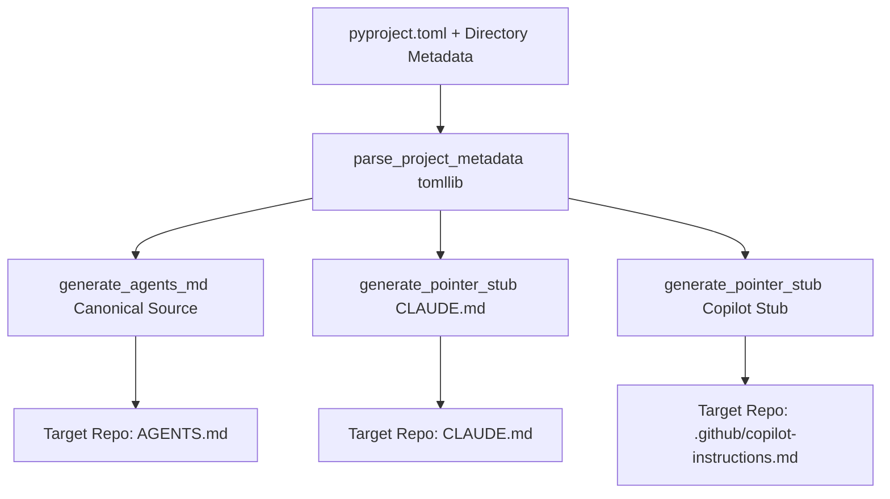

# Knowledge Base Task: AI Agent Instructions Scaffolding & Pointer Stubs

## 1. Overview & Purpose

The AI Agent Instructions Scaffolding subsystem (`devops ai agents`, `devops devcontainer init`, and `src/devops_cli/ai/instruction_generator.py`) generates and synchronizes canonical engineering guidelines (`AGENTS.md`) and tool pointer stubs (`CLAUDE.md`, `.github/copilot-instructions.md`) across repositories. This ensures AI coding assistants (Claude, Copilot, Cursor, Codex) strictly follow the project's engineering philosophy, testing workflows, and architectural rules.

---

## 2. Architecture & Pointer Stub Model



- **Single Source of Truth**: `AGENTS.md` is the canonical instruction manual containing full architecture guidelines, build/lint/test commands, git hygiene, and security policies.
- **Thin Redirection Pointers**: Tool-specific instruction files (`CLAUDE.md` and `.github/copilot-instructions.md`) are lightweight pointer stubs that direct tools to `AGENTS.md`, avoiding duplicated or out-of-sync documentation.
- **Dynamic Metadata Extraction**: Uses Python's standard `tomllib` to inspect `pyproject.toml` dynamically for project name, description, Python runtime requirements, entry points, and dependencies.

---

## 3. Useful Usage Information & Common Commands

### Scaffolding Commands
```bash
# Scaffold or synchronize agent instructions in a target repository
devops ai agents --repo repos/my-org/my-project --template

# Overwrite existing instruction files with force flag
devops ai agents --repo repos/my-org/my-project --force

# Automatically scaffolded during devcontainer initialization
devops devcontainer init

# Automatically scaffolded during container post-create hook if missing
devops devcontainer post-create
```

---

## 4. Best Practice Guidance

1. **Keep `AGENTS.md` Updated**: Whenever new testing commands, linters, or architectural conventions are introduced, update `AGENTS.md`.
2. **Never Duplicate Content in Stubs**: Always keep `CLAUDE.md` and `.github/copilot-instructions.md` as thin pointers redirecting to `AGENTS.md`.
3. **Idempotent Scaffolding**: `scaffold_agent_instructions` checks for existing files and skips generation unless `--force` is specified.
4. **Target Path Safety**: Always validate file paths to prevent directory traversal outside the target repository root.

---

## 5. Security Recommendations & Zero-Trust Policies

- **No Secrets in Prompts or Instructions**: Never include live tokens, private keys, or credentials in `AGENTS.md` or instruction templates.
- **Zero Inline Prompts**: Multi-line LLM prompts and task instructions must reside in dedicated Markdown files under `src/devops_cli/ai/tasks/` rather than inline Python strings.

---

## 6. General Standards & Reference Guidelines

- **Canonical File**: `AGENTS.md` at target repository root.
- **Claude Pointer**: `CLAUDE.md` at target repository root (`./AGENTS.md`).
- **Copilot Pointer**: `.github/copilot-instructions.md` (`../AGENTS.md`).

---

## 7. Official References & Published Artifacts

- **DevOps CLI Agent Guidelines**: [AGENTS.md](../../../AGENTS.md)
- **Instruction Generator Module**: [src/devops_cli/ai/instruction_generator.py](../../../src/devops_cli/ai/instruction_generator.py)
- **AI Command Module**: [src/devops_cli/commands/ai.py](../../../src/devops_cli/commands/ai.py)
