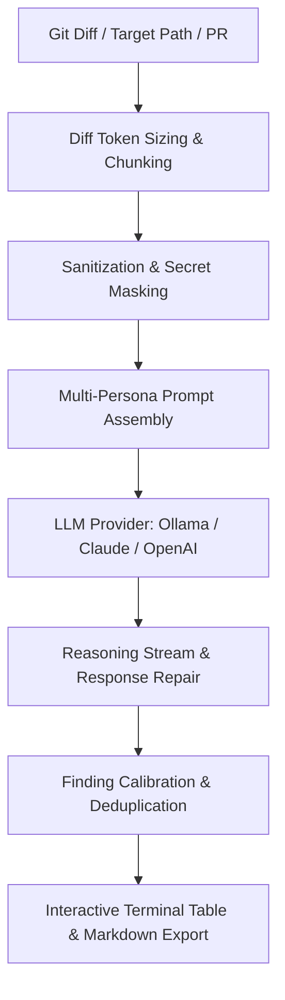

# Knowledge Base Task: Multi-Persona AI Code Review

## 1. Overview & Purpose

The Multi-Persona AI Code Review system in `devops-cli` provides automated, high-signal, persona-driven feedback on git diffs, pull requests, and file paths. By leveraging domain-specialized personas (`architect`, `devsecops`, `auditor`, `qa`, `pm`), the review engine analyzes code modifications against universal software engineering principles (SOLID, DRY, OWASP Top 10, CIS benchmarks) as well as the target repository's own declared conventions (`AGENTS.md`).

---

## 2. Architecture & Review Pipeline



- **Specialized Personas**:
  - `devsecops`: Evaluates CWE vulnerabilities, secret exposures, network egress, and permissions.
  - `architect`: Evaluates SOLID design, coupling, cohesion, module boundaries, and typing.
  - `auditor`: Evaluates compliance, license risks, and log sanitization.
  - `qa`: Evaluates edge cases, exception handling, and test isolation.
  - `pm`: Evaluates documentation sync, changelog updates, and user requirements.
- **Closed-Loop Verification**:
  - `verify_finding`: Calibrates confidence scores and runs AST/test checks to eliminate false positives.
  - Patch generation: Synthesizes concrete, drop-in remediations for reported findings.

---

## 3. Useful Usage Information & Common Commands

### Review Commands
```bash
# Review active working directory git diff (staged + unstaged)
devops review branch

# Review an entire target path or child repository
devops review path repos/my-org/my-project

# Review a specific GitHub pull request by number
devops review pr 17

# Review using a specific persona and provider
devops review branch --persona devsecops --provider ollama --model qwen2.5-coder:14b

# Export review report to markdown
devops review branch --export-md .data/reviews/review-report.md
```

---

## 4. Best Practice Guidance

1. **Review Small, Atomic Diffs**: Run reviews iteratively on focused commits to maximize AI context focus and receive higher-signal feedback.
2. **Target Path Isolation**: When reviewing child workspaces (under `repos/`), always ensure file paths resolve relative to `target_dir` to prevent host file collisions.
3. **Declare Project Conventions**: Maintain an accurate `AGENTS.md` file in target repositories; the review engine automatically injects it into prompt context.
4. **Use Response Repair**: The review pipeline automatically normalizes LLM outputs using `repair_json_string` and `fix_llm_response` to ensure valid structured schemas.

---

## 5. Security Recommendations & Zero-Trust Policies

- **Secret Masking**: All diffs are passed through `_sanitize_prompt_boundary_tags` and token redactors before being sent to LLM providers.
- **Offline Review Option**: For proprietary or air-gapped environments, use `--provider ollama` to keep all code analysis strictly on the local machine.

---

## 6. General Standards & Output Schemas

- **Finding Severity**: `CRITICAL`, `HIGH`, `MEDIUM`, `LOW`, `INFO`.
- **Finding Model**: Structured Pydantic model (`ReviewFinding`) with `id`, `file_path`, `line_start`, `line_end`, `persona`, `severity`, `title`, `description`, `remediation`, and `confidence`.

---

## 7. Official References & Published Artifacts

- **DevOps CLI Repository**: [github.com/dan-petty/devops-cli](https://github.com/dan-petty/devops-cli)
- **Review Pipeline Engine**: [src/devops_cli/ai/review.py](../../../src/devops_cli/ai/review.py)
- **Persona Prompt Task Definitions**: [src/devops_cli/ai/tasks/](../../../src/devops_cli/ai/tasks/)
