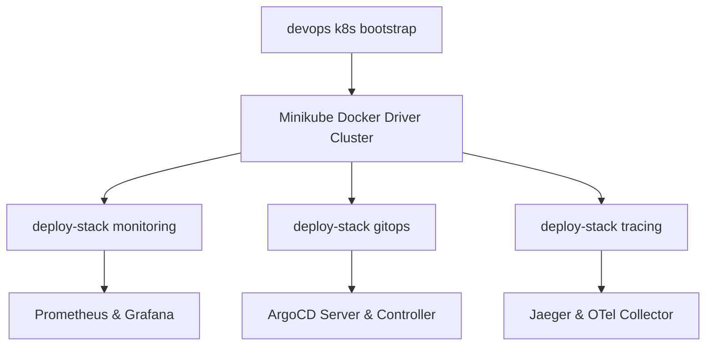

# Knowledge Base Task: Local Kubernetes Stack Deployment & Teardown

## 1. Overview & Purpose

Local Kubernetes stack automation in `devops-cli` allows developers to bootstrap, configure, deploy, and teardown complete cloud-native infrastructure stacks on local Minikube clusters with a single command. Supported stacks include Prometheus metrics collection, Grafana dashboards, ArgoCD GitOps reconciliation, Jaeger distributed tracing, and OpenTelemetry collectors.

---

## 2. Architecture & Stack Definitions



- **Stack Metadata**:
  - `monitoring`: Prometheus Community chart + Grafana chart in `monitoring` namespace.
  - `gitops`: ArgoCD server, controller, and repo server in `argocd` namespace.
  - `tracing`: Jaeger operator / all-in-one in `monitoring` namespace.
  - `all`: Sequentially bootstraps all three stacks.

---

## 3. Useful Usage Information & Common Commands

### Stack Deployment Commands
```bash
# 1. Bootstrap local Minikube cluster with GPU passthrough
devops k8s bootstrap

# 2. Deploy complete monitoring and observability stack
devops k8s deploy-stack monitoring

# 3. Deploy GitOps continuous delivery stack (ArgoCD)
devops k8s deploy-stack gitops

# 4. Deploy all stacks simultaneously
devops k8s deploy-stack all

# 5. Check deployed pod health across all namespaces
devops k8s pods --all-namespaces

# 6. Teardown stack cleanly
devops k8s teardown-stack monitoring
```

---

## 4. Best Practice Guidance

1. **Sequential Bootstrap**: Ensure `devops k8s bootstrap` completes and all nodes report `Ready` before launching stack deployments.
2. **Resource Allocation**: Ensure Minikube has sufficient CPU/memory (`--cpus=4 --memory=8192`) when running multiple concurrent stacks.
3. **Idempotent Deployments**: `deploy-stack` uses `helm upgrade --install --atomic` so commands can be safely re-run without causing resource conflicts.
4. **Clean Teardown**: Run `teardown-stack` before deleting clusters to allow Helm hooks and finalizers to release external resources cleanly.

---

## 5. Security Recommendations & Zero-Trust Policies

- **Namespace Segregation**: Keep monitoring and GitOps controllers isolated in dedicated namespaces (`monitoring`, `argocd`).
- **Initial Credentials**: Extract and securely store the ArgoCD initial admin secret, then rotate it immediately:
  ```bash
  kubectl get secret -n argocd argocd-initial-admin-secret -o jsonpath='{.data.password}' | base64 -d
  ```

---

## 6. General Standards & Reference Guidelines

- **Port Forwards**:
  - Grafana: `kubectl port-forward svc/grafana -n monitoring 3000:80`
  - Prometheus: `kubectl port-forward svc/prometheus-server -n monitoring 9090:80`
  - ArgoCD: `kubectl port-forward svc/argocd-server -n argocd 8080:443`
  - Jaeger: `kubectl port-forward svc/jaeger-query -n monitoring 16686:16686`
