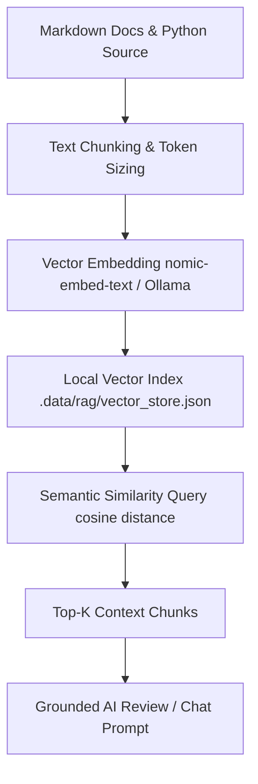

# Knowledge Base Task: RAG Semantic Context Indexing & Knowledge Retrieval

## 1. Overview & Purpose

Retrieval-Augmented Generation (RAG) in `devops-cli` indexes codebase documentation, architecture decisions, CLI commands, and operational procedures into a local vector database. When executing AI code reviews or natural language queries, relevant semantic chunks are retrieved and injected into prompt context to ground LLM responses in concrete repository facts.

---

## 2. Architecture & RAG Pipeline



- **Vector Storage**: Lightweight, file-backed local vector store stored under `.data/rag/`.
- **Embeddings**: Utilizes local Ollama (`nomic-embed-text`) or external providers to generate 768-dimensional normalized vectors.
- **Query Ranking**: Computes cosine similarity scores to rank and extract the most relevant top-K documentation chunks.

---

## 3. Useful Usage Information & Common Commands

### RAG Commands
```bash
# Index workspace documentation and architecture guides into local vector store
devops rag index docs/

# Query indexed knowledge base with natural language
devops rag query "How do I deploy the Prometheus and Grafana stack?"

# Inspect RAG database stats and indexed document count
devops rag status

# Clear and rebuild RAG index
devops rag clear
```

---

## 4. Best Practice Guidance

1. **Optimal Chunk Sizing**: Use sliding window chunking (500–1000 tokens with 100 token overlap) to preserve semantic coherence across headings and code blocks.
2. **Include Structural Metadata**: Attach file path, heading hierarchy, and source repository names as metadata attributes on each indexed chunk.
3. **Re-index After Documentation Updates**: Re-run `devops rag index` whenever major documentation or architectural changes are merged.
4. **Grounded Inferences**: Instruct LLM prompts to cite specific document paths when answering queries based on retrieved context.

---

## 5. Security Recommendations & Zero-Trust Policies

- **100% Local Vectors**: Vector embeddings and similarity lookups run locally without sending source content to third-party embedding APIs when using Ollama.
- **Filter Sensitive Files**: Exclude `.env`, `.pem`, `id_rsa`, `.key`, and secret files from the indexing scanner pipeline.

---

## 6. General Standards & Reference Guidelines

- **Vector Store Path**: `.data/rag/vector_store.json`.
- **Default Embedding Model**: `nomic-embed-text:latest` (Ollama).

---

## 7. Official References & Published Artifacts

- **Ollama Nomic Embed Text Model**: [ollama.com/library/nomic-embed-text](https://ollama.com/library/nomic-embed-text)
- **DevOps CLI RAG Subsystem**: [src/devops_cli/rag/](file:///workspaces/devops-cli/src/devops_cli/rag/)
- **RAG Command Module**: [src/devops_cli/commands/rag.py](file:///workspaces/devops-cli/src/devops_cli/commands/rag.py)
