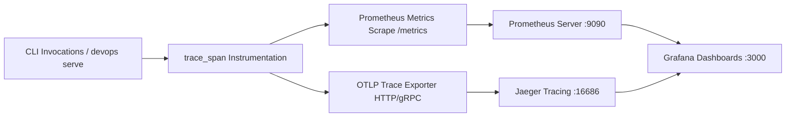

# Knowledge Base Task: Workstation Telemetry & Observability

## 1. Overview & Purpose

Workstation Telemetry & Observability in `devops-cli` provides comprehensive visibility into CLI command execution, tool latencies, subprocess invocation durations, REST API request rates, and error distributions using OpenTelemetry trace spans and Prometheus metrics.

---

## 2. Architecture & Observability Flow



- **In-Memory Metric Counters**: Automatically records total invocations, error counts, and latency histograms.
- **Trace Context Propagation**: Emits W3C `traceparent` headers to correlate CLI execution traces with background server operations.
- **Health Probes**: Evaluates connection reachability to OTLP collector endpoints (`devops telemetry test`).

---

## 3. Useful Usage Information & Common Commands

### Telemetry Commands
```bash
# Test connection to active OTLP telemetry collector
devops telemetry test

# View telemetry status and endpoint configuration
devops telemetry status

# Emit test trace span to verify ingestion
devops telemetry probe

# Scrape local Prometheus metrics directly
curl -s http://localhost:8000/metrics
```

---

## 4. Best Practice Guidance

1. **Non-Blocking Telemetry**: Telemetry emission must run asynchronously or with bounded short timeouts so that collector unreachability never slows down CLI commands.
2. **Standardized Attributes**: Use consistent attributes: `cli.command`, `subprocess.bin`, `status`, `error.type`.
3. **Trace Root Cause Analysis**: Use Jaeger UI (`http://localhost:16686`) to trace slow subprocesses or investigate multi-step deployment failures.
4. **Scrape Frequency**: Configure Prometheus with a 10s–15s scrape interval for responsive workstation metrics.

---

## 5. Security Recommendations & Zero-Trust Policies

- **Redact Sensitive Attributes**: Never attach authorization headers, tokens, SSH keys, or raw SQL queries to trace span attributes.
- **Local Collector Binding**: Ensure local collector and Jaeger ports are bound to loopback or protected Kubernetes namespaces.

---

## 6. General Standards & Reference Guidelines

- **OTLP HTTP Endpoint**: Default `http://localhost:4318/v1/traces`.
- **OTLP gRPC Endpoint**: Default `http://localhost:4317`.

---

## 7. Official References & Published Artifacts

- **OpenTelemetry Standard**: [opentelemetry.io](https://opentelemetry.io/)
- **Prometheus Metrics Specification**: [prometheus.io/docs/concepts/metric_types/](https://prometheus.io/docs/concepts/metric_types/)
- **DevOps CLI Telemetry Tracer**: [src/devops_cli/telemetry/tracer.py](file:///workspaces/devops-cli/src/devops_cli/telemetry/tracer.py)
- **Telemetry Command Module**: [src/devops_cli/commands/telemetry.py](file:///workspaces/devops-cli/src/devops_cli/commands/telemetry.py)
