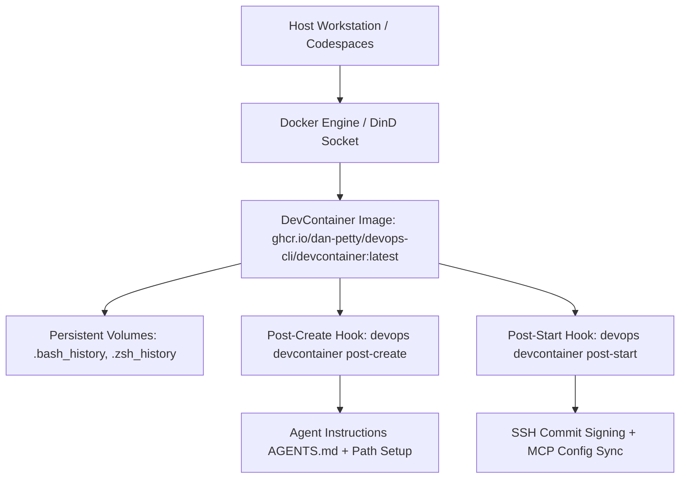

# Knowledge Base Topic: Reproducible DevContainers & Workstation Automation

## 1. Overview & Domain Architecture

Development Containers (DevContainers) provide fully configured, reproducible development environments running inside Docker containers. In `devops-cli`, DevContainer automation standardizes toolchain installations (Python 3.14+, Docker, Kubernetes CLI tools, OpenTofu), manages persistent developer shell histories, automates SSH commit signing, configures Model Context Protocol (MCP) servers, and synchronizes multi-root VS Code workspaces.



---

## 2. Key Concepts & Theoretical Foundations

- **Development Container Specification (OCI)**: Standardized specification (`.devcontainer/devcontainer.json`) defining container image references, editor extensions, lifecycle hooks, and port forwarding.
- **Docker-in-Docker (DinD)**: Mounting `/var/run/docker.sock` to enable container building, image inspection, and Minikube execution inside development environments without nested virtualization penalties.
- **Persistent State across Rebuilds**: Preserving shell history, configuration directories (`~/.gemini/config`), and cache directories (`~/.cache/uv`) across container rebuilds via host volume mounts.
- **Multi-Root Workspaces**: Aggregating multiple independent child repositories under `repos/<org>/` into a single root `.code-workspace` file.

---

## 3. Operational Patterns & Workflows in DevOps CLI

### Pure Python Lifecycle Execution
Rather than maintaining brittle multi-line shell scripts in JSON configs, `devops-cli` implements container lifecycle logic in pure Python:
- `devops devcontainer init`: Scaffolds `.devcontainer/devcontainer.json`, `.vscode/mcp.json`, `AGENTS.md`, and tool stubs.
- `devops devcontainer post-create`: Configures persistent bash/zsh history, environment paths, config directories, and agent instructions.
- `devops devcontainer post-start`: Configures Git defaults, SSH key commit signing, MCP server JSON synchronization, and Minikube auto-start.

### Common Commands
```bash
# Initialize a new DevContainer with AGENTS.md and MCP configuration
devops devcontainer init

# Manually trigger post-start lifecycle tasks
devops devcontainer post-start --workspace .

# Synchronize VS Code multi-root workspace definition
devops workspace sync

# Clone all repositories from a GitHub organization
devops repos clone-org dan-petty
```

---

## 4. Best Practice Guidance

1. **Use Pre-Built GHCR Base Images**: Base child project DevContainers on `ghcr.io/dan-petty/devops-cli/devcontainer:latest` to eliminate 10+ minute image build times.
2. **Commit Signing Configuration**: Configure `postStartCommand` to detect SSH keys in `~/.ssh/` and enable automated Git commit signing (`git config --global commit.gpgsign true`).
3. **Keep Agent Instructions Synchronized**: Verify `AGENTS.md` exists during container bootstrap so AI assistants have immediate access to project conventions.
4. **Idempotent Hooks**: Ensure all lifecycle operations can execute multiple times without producing duplicate entries in `~/.bashrc` or `~/.zshrc`.

---

## 5. Security Recommendations & Zero-Trust Governance

- **Socket Mount Protection**: When mounting the Docker socket, ensure the container does not expose unauthenticated daemon ports to external networks.
- **SSH Agent Forwarding**: Use SSH agent forwarding rather than copying raw private keys into container filesystems.
- **Non-Root Default User**: Run development sessions as the `vscode` user (UID 1000) rather than root.

---

## 6. General Standards & Engineering Guidelines

- **Base Image**: `ghcr.io/dan-petty/devops-cli/devcontainer:latest`.
- **Config Path**: `.devcontainer/devcontainer.json`.
- **Documentation Guide**: [docs/DEVCONTAINER_USAGE.md](file:///workspaces/devops-cli/docs/DEVCONTAINER_USAGE.md).

---

## 7. Official References & Published Artifacts

- **DevContainer Specification**: [containers.dev](https://containers.dev/)
- **Published DevContainer Package (GHCR)**: [`ghcr.io/dan-petty/devops-cli/devcontainer:latest`](https://github.com/dan-petty/devops-cli/pkgs/container/devops-cli%2Fdevcontainer)
- **DevContainer CLI Module**: [src/devops_cli/commands/devcontainer.py](file:///workspaces/devops-cli/src/devops_cli/commands/devcontainer.py)
- **DevContainer Usage Guide**: [docs/DEVCONTAINER_USAGE.md](file:///workspaces/devops-cli/docs/DEVCONTAINER_USAGE.md)
