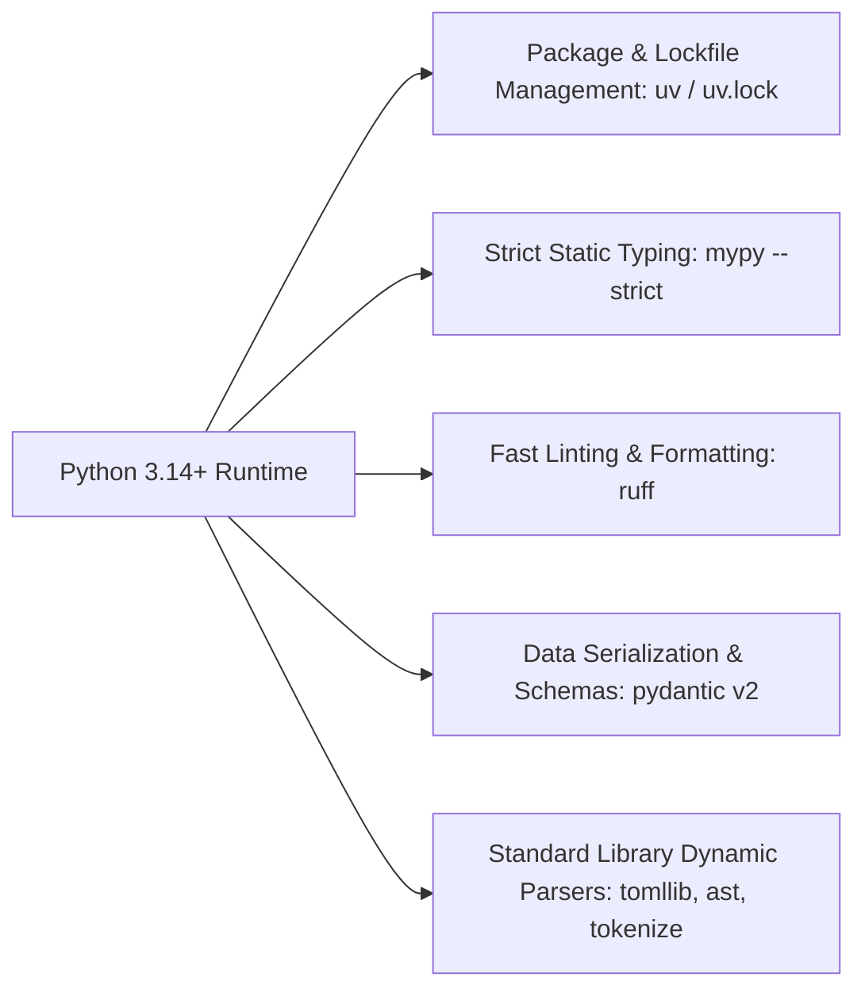

# Knowledge Base Topic: Modern Python 3.14+ Runtime & Tooling Ecosystem

## 1. Overview & Domain Architecture

The modern Python ecosystem has evolved rapidly, delivering significant performance enhancements, advanced static typing standards, and high-performance Rust-based developer tooling. In `devops-cli`, development strictly aligns with Python 3.14+ runtime standards, `uv` packaging, strict `mypy` typing, `ruff` linting and formatting, `pydantic v2` data modeling, and standard library dynamic parsers.



---

## 2. Key Concepts & Theoretical Foundations

- **Python 3.14+ Features & Typing Idioms**:
  - Deferred evaluation of annotations (`from __future__ import annotations`).
  - Native union syntax (`int | str`) replacing legacy `Union[int, str]`.
  - Built-in generic collection types (`list[str]`, `dict[str, Any]`, `set[Path]`).
  - Abstract base collections from `collections.abc` (`Sequence`, `Mapping`, `Callable`).
- **Strict Prohibition on Incomplete Literal Collections**: Never rely on fragile hardcoded lists of file extensions, keyword sets, or regex substring matching for domain logic. Always use established parsers (`tomllib`, `json`, `ast`, `urllib.parse`, `ipaddress`).
- **Pydantic v2 Schema Modeling**: Structured data modeling with strict validation, `Field(default_factory=...)`, and computed fields.
- **Rust-Powered Tooling Engine**: `uv` and `ruff` providing orders-of-magnitude faster package resolution, linting, and formatting than legacy tooling.

---

## 3. Operational Patterns & Workflows in DevOps CLI

### Dependency Synchronization & Execution
All Python operations are executed the `uv`-native way:
```bash
# Sync dependencies strictly with lockfile
uv sync

# Run fast isolated unit tests
uv run pytest tests/test_server.py

# Run fast lint inspection on modified files
uv run ruff check src/devops_cli/server/

# Run strict static type validation
uv run mypy src/devops_cli/server/
```

### Standard Dynamic Parser Pattern
```python
import tomllib
from pathlib import Path

def inspect_project_metadata(repo_path: Path) -> dict[str, str]:
    pyproject = repo_path / "pyproject.toml"
    if pyproject.is_file():
        with pyproject.open("rb") as f:
            data = tomllib.load(f)
        return data.get("project", {})
    return {}
```

---

## 4. Best Practice Guidance

1. **Strict Type Annotations**: Enforce complete type annotations on all function signatures (`def func(param: str) -> bool:`).
2. **Purpose-Driven Naming**: Use concrete, operational class and module names (e.g. `instruction_generator.py`, `vulnerability_lookup.py`) rather than vague generic buckets (e.g. `manager.py`, `helpers.py`, `misc.py`).
3. **Immutability & Constants**: Distinguish immutable invariant constants (e.g. `CONST_AGENTS_MD_FILENAME`) from user-configurable defaults.
4. **Clean Abstractions & Low Coupling**: Structure components with high cohesion and minimal inter-module coupling.

---

## 5. Security Recommendations & Zero-Trust Governance

- **PyPI Malware Verification**: Maintain `UV_MALWARE_CHECK=1` in developer environments.
- **Safe Subprocess Arguments**: Always pass tokenized command arrays (`["uv", "run", "pytest"]`) rather than formatted strings.

---

## 6. General Standards & Engineering Guidelines

- **Runtime Version**: Python `>=3.14`.
- **Linter Rule Standard**: 100 character line length (`E501`).
- **Configuration Root**: Centrally declared in [`pyproject.toml`](../../../pyproject.toml).

---

## 7. Official References & Published Artifacts

- **Python Official Documentation**: [docs.python.org/3.14](https://docs.python.org/3.14/)
- **Astral uv Package Manager**: [astral.sh/uv](https://astral.sh/uv) | [github.com/astral-sh/uv](https://github.com/astral-sh/uv)
- **Astral Ruff Linter/Formatter**: [astral.sh/ruff](https://astral.sh/ruff) | [github.com/astral-sh/ruff](https://github.com/astral-sh/ruff)
- **Mypy Static Type Checker**: [mypy-lang.org](https://mypy-lang.org/) | [github.com/python/mypy](https://github.com/python/mypy)
- **Pydantic Data Validation**: [docs.pydantic.dev](https://docs.pydantic.dev/) | [github.com/pydantic/pydantic](https://github.com/pydantic/pydantic)
