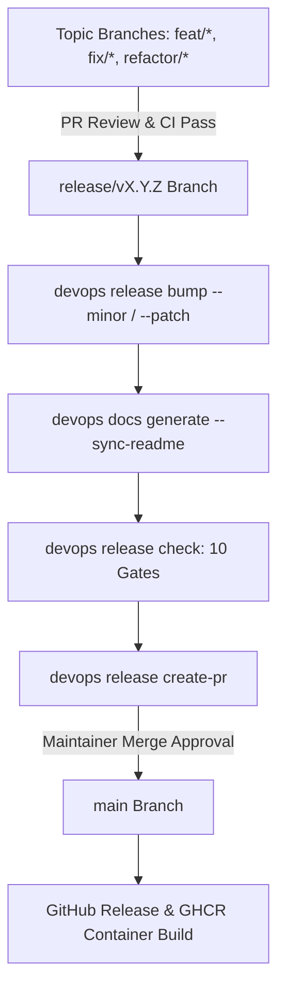

# Knowledge Base Topic: Release Engineering & SemVer Governance

## 1. Overview & Domain Architecture

Release Engineering establishes repeatable, deterministic processes for version bumping, release gate verification, changelog generation, Git branch isolation, and automated pull request workflows. In `devops-cli`, release engineering enforces Semantic Versioning 2.0.0 (SemVer), Conventional Commits, 10-gate release validation (`devops release check`), and automated container publishing to GitHub Container Registry (GHCR).



---

## 2. Key Concepts & Theoretical Foundations

- **Semantic Versioning (SemVer 2.0.0)**:
  - `MAJOR`: Breaking API, CLI argument, or schema modifications.
  - `MINOR`: Backwards-compatible new features, subcommands, and tool additions.
  - `PATCH`: Backwards-compatible bug fixes and security remediations.
- **Git Branch Hierarchy & Topic Isolation**:
  - **Zero Direct Commits to `main`**: All work occurs on topic branches (`feat/*`, `fix/*`, `docs/*`, `refactor/*`).
  - **Base Branch Targeting**: Feature, fix, and refactoring PRs target the active release branch (`--base release/v<version>`).
  - **Release PRs**: Official release branches target `main` when cutting a release.
- **Conventional Commits Specification**: Standardized commit structure (`type(scope): description`) enabling automated changelog generation and semantic history audits.

---

## 3. Operational Patterns & Workflows in DevOps CLI

### Release Subcommands (`src/devops_cli/commands/release.py`)
- `devops release status`: Displays active branch, tag status, and version consistency.
- `devops release bump`: Updates `pyproject.toml`, `src/devops_cli/__init__.py`, and initializes changelog headers.
- `devops release check`: Executes comprehensive 10-gate quality check ensuring release readiness.
- `devops release create-pr`: Opens a release PR targeting `main` with formatted release notes.

### Common Commands
```bash
# Inspect release status and version alignment
devops release status

# Bump minor version for new feature release
devops release bump minor

# Run pre-release verification gates
devops release check

# Create official release PR targeting main
devops release create-pr --version 0.2.0
```

---

## 4. Best Practice Guidance

1. **Maintain Atomic Commits**: Keep commits focused and cohesive with clear Conventional Commit messages.
2. **Synchronize Documentation**: Always execute `devops docs generate --sync-readme` when adding new commands or options before cutting a release.
3. **Document in Release Notes**: Record all additions, fixes, and refactorings in `docs/RELEASE_NOTES.md` under the appropriate version header.
4. **Human-in-the-Loop Governance**: AI assistants prepare clean commits and open PRs; merging into protected branches (`main`) requires human maintainer approval.

---

## 5. Security Recommendations & Zero-Trust Governance

- **Container Image Tagging Policy**: Pull request container builds must NEVER be tagged with `latest`. Only merges to `main` tag `latest`.
- **Signed Commits & Releases**: Ensure release commits and tags are cryptographically signed with SSH or GPG keys.

---

## 6. General Standards & Engineering Guidelines

- **Branch Naming**: `release/v<MAJOR>.<MINOR>.<PATCH>`.
- **Release Tag Format**: `v<MAJOR>.<MINOR>.<PATCH>`.
- **Quality Threshold**: 100% pass across all 10 release verification gates before PR creation.

---

## 7. Official References & Published Artifacts

- **Semantic Versioning 2.0.0**: [semver.org](https://semver.org/)
- **Conventional Commits**: [conventionalcommits.org](https://www.conventionalcommits.org/)
- **DevOps CLI GitHub Releases**: [github.com/dan-petty/devops-cli/releases](https://github.com/dan-petty/devops-cli/releases)
- **Release Module**: [src/devops_cli/commands/release.py](../../../src/devops_cli/commands/release.py)
- **Release Notes**: [docs/RELEASE_NOTES.md](../../RELEASE_NOTES.md)
