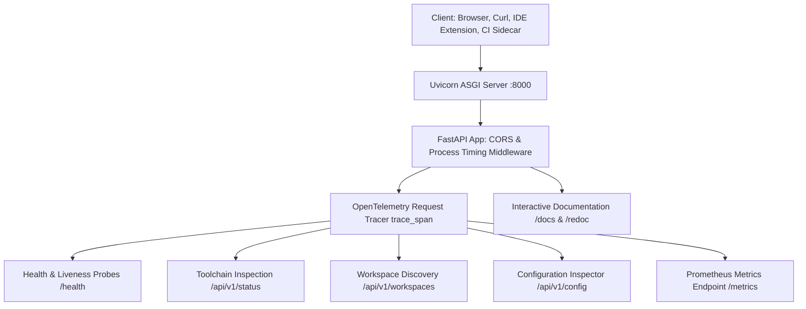

# Knowledge Base Topic: REST API Architecture & Service Engineering

## 1. Overview & Domain Architecture

REST API architecture and service engineering in `devops-cli` provides an enterprise-ready, asynchronous HTTP interface for toolchain inspection, health probing, workspace discovery, and observability metrics. Built on FastAPI and Uvicorn (`devops serve`), the service engine exposes OpenAPI v3.1 interactive schemas, Prometheus metric series, and latency profiling headers.



---

## 2. Key Concepts & Theoretical Foundations

- **Asynchronous ASGI Architecture**: High-concurrency event loops powered by Starlette and Uvicorn handling concurrent non-blocking HTTP requests.
- **Contract-First OpenAPI Schemas**: Automatic OpenAPI v3.1 specification generation derived from strict Pydantic v2 schemas and Python type hints.
- **Process Timing & Trace Headers**:
  - `X-Process-Time`: Calculates request execution duration in seconds.
  - `X-DevOps-Version`: Injects the active CLI release version into all response headers.
- **Bounded Discovery Patterns**: Performing deterministic, shallow filesystem inspection (max 2 levels) with skip lists (`.git`, `.venv`, `node_modules`) to eliminate latency bottlenecks.

---

## 3. Operational Patterns & Workflows in DevOps CLI

### Server Architecture (`src/devops_cli/server/`)
- `app.py`: Factory function `create_app()` constructing the FastAPI instance with middleware and route mounts.
- `routes/health.py`: Health probes (`/health`, `/healthz`).
- `routes/status.py`: Workstation binary availability checks (`uv`, `docker`, `kubectl`, `helm`, `minikube`, `tofu`, `ollama`, `gh`).
- `routes/workspace.py`: Child workspace discovery and sanitized configuration inspection.
- `routes/telemetry.py`: OTel connectivity probe and Prometheus `/metrics` endpoint.

### Common Commands
```bash
# Launch DevOps CLI REST service on localhost:8000
devops serve

# Launch on custom port with auto-reload
devops serve --host 127.0.0.1 --port 8080 --reload

# Production mode with multiple worker processes
devops serve --no-docs --workers 4 --log-level info

# Scrape metrics directly
curl -s http://localhost:8000/metrics
```

---

## 4. Best Practice Guidance

1. **Pydantic Response Models**: Always declare `response_model=...` on route decorators to ensure automatic output filtering and schema generation.
2. **Strict Typing on Routes**: Route signatures must have complete type annotations to satisfy `mypy --strict`.
3. **Async vs Sync Separation**: Use `async def` for network or I/O bound endpoints and standard `def` when delegating to CPU-bound synchronous utilities.
4. **Interactive Documentation**: Provide clear descriptions and examples in Pydantic `Field(description=...)` to populate Swagger UI documentation.

---

## 5. Security Recommendations & Zero-Trust Governance

- **Bind to Loopback by Default**: Default to `127.0.0.1` binding to prevent exposing workstation APIs to external networks.
- **Mask Sensitive Settings**: Redact credentials in `/api/v1/config` responses using `<masked-token>` placeholders.
- **Restrict CORS Origins**: Explicitly configure allowed origins rather than using permissive wildcard (`"*"`) policies.

---

## 6. General Standards & Engineering Guidelines

- **Default Port**: `8000`.
- **OpenAPI Version**: `3.1.0`.
- **Interactive UI**: `/docs` (Swagger UI) and `/redoc` (ReDoc).

---

## 7. Official References & Published Artifacts

- **FastAPI Documentation**: [fastapi.tiangolo.com](https://fastapi.tiangolo.com/) | [github.com/fastapi/fastapi](https://github.com/fastapi/fastapi)
- **Uvicorn Documentation**: [uvicorn.org](https://www.uvicorn.org/) | [github.com/encode/uvicorn](https://github.com/encode/uvicorn)
- **DevOps CLI Server Package**: [src/devops_cli/server/](file:///workspaces/devops-cli/src/devops_cli/server/)
- **Serve Command**: [src/devops_cli/commands/serve.py](file:///workspaces/devops-cli/src/devops_cli/commands/serve.py)
