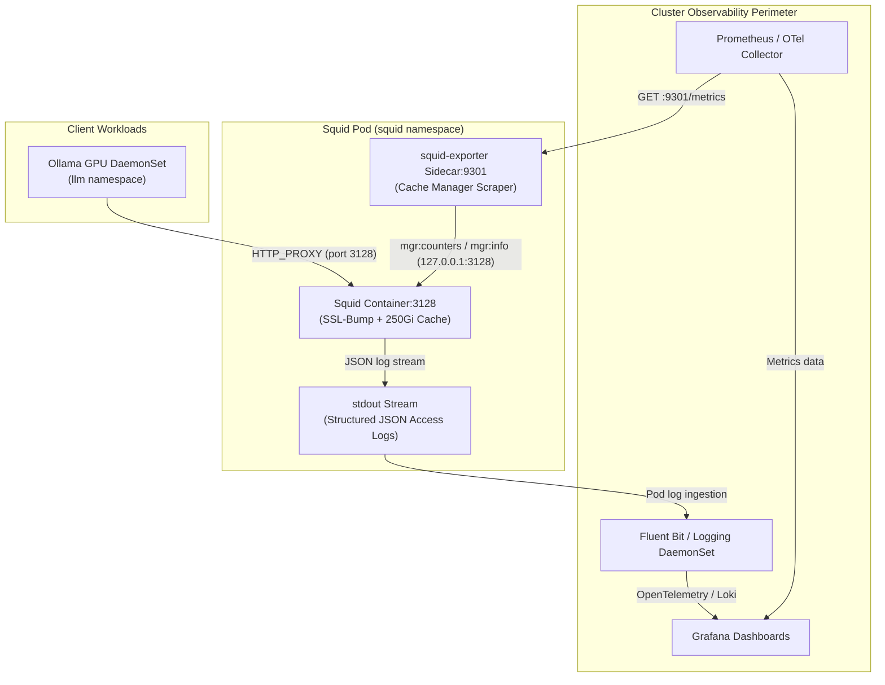

# Squid Caching Proxy: Observability Features & Failover Investigation

This document provides architectural design, operational specifications, and in-depth failure mode analysis for the Kubernetes Squid forward caching proxy with SSL-Bump, optimized for high-capacity OCI artifacts and multi-gigabyte Ollama 70B model layers.

---

## 1. Architectural Overview & Context

When in-cluster workloads (such as Ollama GPU inference nodes, CI build runners, and batch evaluation jobs) download multi-gigabyte models (e.g. `llama3.3:70b`, `deepseek-r1:70b`, `qwen2.5:72b`), each model pull transfers between 40 GB and 75 GB of immutable OCI layer blobs from `registry.ollama.ai`.

Without centralized proxy caching:
1. Every node independently downloads identical 40–75 GB weight layers over the WAN internet connection.
2. Multiple concurrent pulls saturate WAN bandwidth, increase upstream latency, and trigger Cloudflare rate-limiting.
3. If internet connectivity drops, nodes cannot spin up or scale out models even if another node already fetched the layer.

The Kubernetes Squid proxy deployment provides:
- **Massive Layer Caching**: Up to 100 GB single object size (`maximum_object_size 100 GB`) backed by a dedicated 250 GiB PVC.
- **Store-ID URL Normalization**: Normalizes ephemeral Cloudflare R2 presigned S3 URLs (`?X-Amz-Signature=...`) into canonical content-addressable cache keys (`http://ollama-cache.local/blobs/sha256/<hash>`), guaranteeing `TCP_HIT` cache reuse across all GPU nodes.
- **In-Cluster Proxying & Loopback Resolution**: Proxies in-cluster traffic (`.svc`, `.cluster.local`, `10.43.0.0/16`) without requiring blanket `NO_PROXY` subnet exclusions, splicing internal TLS (`ssl_bump splice to_localnet`) and transparently translating container loopback / `0.0.0.0:11434` requests to the calling pod's IP via `url_rewrite.pl`.
- **SSL-Bump TLS Interception**: Terminates TLS for outbound HTTPS registry connections, inspects `GET /v2/.*/blobs/sha256:...` requests, and caches cryptographic content-addressable layers locally.
- **Comprehensive Observability**: Prometheus scraping sidecar (`squid-exporter`), Cache Manager API, and structured JSON access logs streamed directly to stdout.
- **Multi-Tier Failover Resilience**: Rapid health probing, dynamic LFUDA eviction against disk exhaustion, and WAN outage immunity.

---

## 2. Observability Features



### 2.1 Prometheus Metrics via `squid-exporter` Sidecar
Squid maintains rich internal runtime statistics accessible via its Cache Manager protocol (`cache_object://localhost/...`). Rather than modifying core Squid binaries, the deployment uses a dedicated `squid-exporter` sidecar container:
- **Endpoint**: `http://<squid-pod-ip>:9301/metrics`
- **Scrape Frequency**: 15s (standard Prometheus scrape interval)
- **Key Metrics**:
  | Metric Name | Type | Description & Operational Value |
  | :--- | :--- | :--- |
  | `squid_client_http_requests_total` | Counter | Total inbound proxy requests across all client pods. |
  | `squid_client_http_hits_total` | Counter | Total requests satisfied directly from cache (`TCP_HIT`). |
  | `squid_client_http_kbytes_out_total` | Counter | Total volume (KB) delivered to clients (reflects total egress demand). |
  | `squid_server_all_kbytes_in_total` | Counter | Volume (KB) fetched from WAN internet (WAN Bandwidth Savings = `kbytes_out` - `server_kbytes_in`). |
  | `squid_service_cache_disk_size_kbytes` | Gauge | Current size of cached objects on the 250 GiB PVC. |
  | `squid_service_cache_mem_size_kbytes` | Gauge | Memory utilization of hot in-memory cache. |
  | `squid_service_file_descriptors_open` | Gauge | Open file descriptors (critical during parallel 50GB chunk downloads). |
  | `squid_service_cpu_time_seconds_total` | Counter | CPU consumption of the proxy worker process. |

### 2.2 Cache Manager API (`mgr:`)
The Cache Manager interface is exposed securely to `127.0.0.1` and authorized administrator pods:
- `mgr:info`: General runtime status, uptime, cache memory, and request counters.
- `mgr:storedir`: State of the on-disk storage directories, number of stored entries, and high/low watermarks.
- `mgr:client_http_requests`: Live in-flight requests and chunk streaming progress.
- `mgr:utilization`: Internal memory allocation and pool fragmentation.

Configuration in `squid.conf`:
```squid
acl manager proto cache_object
acl localhost src 127.0.0.1/32 ::1
http_access allow manager localhost
http_access deny manager
```

### 2.3 Structured JSON Access Logging
To integrate seamlessly with the cluster's centralized logging architecture (Fluent Bit, OpenTelemetry, Loki), access logs are written to `/var/log/squid/access.log` and streamed directly to container stdout via background `tail -F` in structured JSON format:

```squid
# Strip sensitive query parameters (SAS tokens, signatures) from access records
strip_query_terms on

# Structured JSON log format streamed to stdout via /var/log/squid/access.log
logformat json_k8s {"timestamp":"%tl","client_ip":"%>a","duration_ms":%tr,"cache_status":"%Ss","http_status":%03>Hs,"bytes_sent":%<st,"method":"%>rm","uri":"%>ru","mime_type":"%mt","upstream":"%Sh/%<a"}
access_log /var/log/squid/access.log json_k8s
logfile_rotate 0
```

**JSON Log Fields**:
- `cache_status`: `TCP_HIT`, `TCP_MEM_HIT`, `TCP_MISS`, `TCP_REFRESH_UNMODIFIED`.
- `bytes_sent`: Payload byte size (e.g. `45829124018` for a 42.6 GB model layer).
- `duration_ms`: Latency of the transfer in milliseconds.
- `upstream`: Target upstream server (e.g. `DIRECT/registry.ollama.ai`).

### 2.4 Alerting & Dashboards
Recommended Prometheus alerting rules for production operation:
1. **Cache Hit Ratio Degradation**: `rate(squid_client_http_hits_total[1h]) / rate(squid_client_http_requests_total[1h]) < 0.50` (warns if model layer caching is bypassed).
2. **Storage Volume Saturation**: `squid_service_cache_disk_size_kbytes / (250 * 1024 * 1024) > 0.90` (warns when cache approaches 90% capacity).
3. **File Descriptor Saturation**: `squid_service_file_descriptors_open > 50000` (prevents socket exhaustion during concurrent bulk model transfers).

---

## 3. Failover Handling & Resilience Investigation

```mermaid
graph TD
    subgraph "Failure Domain 1: Proxy Pod Failure"
        podCrash["Squid Pod Crash / Eviction"]
        kubeProxy["Kubernetes Service (ClusterIP)<br/>Health Probes Failure"]
        drainRoute["Automatic Endpoint Removal (<5s)"]
        failoverPod["Standby / Sibling Replica takes traffic"]
        podCrash --> kubeProxy --> drainRoute --> failoverPod
    end

    subgraph "Failure Domain 2: Upstream WAN Outage"
        wanDrop["Upstream Internet Down<br/>(registry.ollama.ai unreachable)"]
        shaMatch["Content-Addressable SHA-256 Match<br/>in 250Gi Cache"]
        directHit["TCP_HIT: Serve Layer from PVC<br/>100% Offline Resiliency"]
        wanDrop --> shaMatch --> directHit
    end

    subgraph "Failure Domain 3: Storage Exhaustion"
        pvcFull["Cache approaches 250Gi PVC limit"]
        lfuda["LFUDA Dynamic Aging Eviction"]
        prune["Auto-prune oldest/least referenced models<br/>between 92% and 85% watermarks"]
        pvcFull --> lfuda --> prune
    end
```



### 3.1 Failure Domain 1: Proxy Instance & Node Failover
**Problem**: If a single Squid instance crashes, encounters node eviction, or runs out of memory, all client pods configured with `HTTP_PROXY=http://squid.squid.svc.cluster.local:3128` receive immediate `Connection refused` (ECONNREFUSED) errors. Standard HTTP client libraries in Go, Python, and curl do not have built-in direct fallback when a proxy endpoint is unreachable.

**Mitigation & Architectural Design**:
1. **Fast Failure Detection with Readiness Probes**:
   - Readiness probe queries `http://127.0.0.1:3128/squid-internal-mgr/info` every 5 seconds with a failure threshold of 2 (`failureThreshold: 2`, `periodSeconds: 5`).
   - If Squid hangs or stops responding to proxy requests, kube-proxy strips the pod IP from the Service endpoints within 10 seconds.
2. **High Availability Deployment Topologies**:
   - **Topology A: Active/Passive Deployment with Fast Re-scheduling**:
     - Single active replica backed by local-path PVC on the high-capacity node (`condor`, 1.8 TB NVMe).
     - Kubernetes automatically restarts or re-schedules the container upon crash.
     - Suitable for workstation/homelab clusters where managing multi-master storage is unwarranted.
   - **Topology B: Multi-Replica StatefulSet with CARP (Cache Array Routing Protocol)**:
     - Squid instances run as a 2-pod StatefulSet (`squid-0`, `squid-1`), each with its own 250 GiB PVC.
     - Instances are peered via CARP:
       ```squid
       cache_peer squid-0.squid-peers.squid.svc.cluster.local sibling 3128 3130 proxy-only carp
       cache_peer squid-1.squid-peers.squid.svc.cluster.local sibling 3128 3130 proxy-only carp
       ```
     - CARP deterministically hashes the model layer URL to one of the replicas. If one replica fails, the remaining replica seamlessly handles the requests.
3. **Pod Anti-Affinity**:
   - Deployment specifies `podAntiAffinity` (soft `preferredDuringSchedulingIgnoredDuringExecution`) ensuring proxy pods do not co-locate on the same physical host when scaled.

### 3.2 Failure Domain 2: Upstream WAN Disconnection & Registry Outages
**Problem**: The cluster experiences a WAN outage or `registry.ollama.ai` / Cloudflare enforces IP rate limits or undergoes an incident.

**Mitigation**:
- Ollama layers are distributed as content-addressable cryptographic blobs:
  `https://registry.ollama.ai/v2/library/<model>/blobs/sha256:<hash>` (redirecting to Cloudflare R2 presigned S3 URLs).
- Because upstream S3 presigned URLs append ephemeral authorization query strings (`?X-Amz-Signature=...`), standard proxy caches treat each pull as a distinct object. Squid uses `store_id_program` with `/etc/squid/storeid_rewrite.conf` to strip transient parameters and normalize the cache storage key to `http://ollama-cache.local/blobs/sha256/<hash>`.
- In `squid.conf`, aggressive refresh patterns prevent Squid from contacting upstream servers on cache hits:
  ```squid
  refresh_pattern -i ollama-cache\.local/blobs/sha256/[a-f0-9]+$ 525600 100% 525600 override-expire override-lastmod ignore-no-cache ignore-no-store ignore-reload ignore-private
  refresh_pattern -i /v2/.*/blobs/sha256:[a-f0-9]+$ 525600 100% 525600 override-expire override-lastmod ignore-no-cache ignore-no-store ignore-reload ignore-private
  ```
- **Outcome**: Even when the external internet is completely severed, any cluster node can pull previously downloaded 70B models directly from the Squid cache at full LAN speed (~10 Gbps).

### 3.3 Failure Domain 3: Storage Exhaustion & Eviction Failover
**Problem**: Downloading multiple 70B models (e.g. DeepSeek-R1, Llama-3.3, Qwen-2.5) consumes ~180 GB. If disk space reaches 100%, Squid encounters a FATAL file write error and abruptly halts. Standard LRU (Least Recently Used) eviction also tends to evict large files first to maximize small-object counts, which destroys model caching.

**Mitigation**:
1. **LFUDA (Least Frequently Used with Dynamic Aging)**:
   ```squid
   cache_replacement_policy heap LFUDA
   memory_replacement_policy heap GDSF
   ```
   LFUDA evaluates objects by size and reference frequency. It prioritizes keeping massive, multi-gigabyte layers in cache over smaller web assets, dramatically increasing byte hit ratios.
2. **Dynamic Watermark Auto-Pruning**:
   ```squid
   cache_swap_low 85
   cache_swap_high 92
   ```
   When disk consumption reaches 92% of the 200 GB allocated cache directory (~184 GB), Squid initiates asynchronous background pruning, evicting the least valuable layers until disk usage drops back to 85% (~170 GB). This guarantees that the underlying 250 GiB PVC never exhausts its capacity.
3. **Memory Safeguards**:
   ```squid
   maximum_object_size_in_memory 32 MB
   cache_mem 2048 MB
   ```
   Caps in-memory objects to 32 MB so that 40–75 GB layer streams are written directly to disk without bloating container RAM or risking Linux OOM kills.

### 3.4 Failure Domain 4: Workload-Side Fallback & Direct Bypass
**Analysis of Client-Side Fallback**:
- **Standard Behavior**: When `HTTP_PROXY` is defined, standard CLI tools (`curl`, `ollama pull`) fail if the proxy is unresponsive.
- **Failover Alternatives**:
  - **Option 1: Service-Level High Availability (Recommended)**: Back the `squid.squid.svc.cluster.local` Service with fast-reacting Kubernetes health checks and multiple replicas or fast automated restart. This preserves central security governance and caching without requiring custom client logic.
  - **Option 2: Proxy Auto-Configuration (PAC)**: For tools that support PAC scripts, define:
    ```javascript
    function FindProxyForURL(url, host) {
        if (shExpMatch(host, "*.ollama.ai")) {
            return "PROXY squid.squid.svc.cluster.local:3128; DIRECT";
        }
        return "DIRECT";
    }
    ```
    If `squid` is unreachable, clients automatically fail over to `DIRECT`.
  - **Option 3: Transparent Egress Gateway (eBPF / Cilium)**: Transparently redirect outbound ports 80/443 to Squid via eBPF. If Squid health checks fail, the eBPF datapath automatically bypasses the proxy and routes directly to the default WAN gateway.

---

## 4. Verification & Testing Matrix

| Test Case | Scenario | Expected Result | Verification Command |
| :--- | :--- | :--- | :--- |
| **TC-1: Metrics Exporter** | Scrape `:9301/metrics` | Prometheus metrics returned with `squid_client_http_requests_total` | `curl -s http://squid:9301/metrics \| grep squid_` |
| **TC-2: JSON Logging** | Process HTTP request through proxy | Container stdout emits single-line JSON log with `cache_status` | `kubectl logs -n squid -l app=squid -c squid \| jq .` |
| **TC-3: Cache Manager** | Query `mgr:info` from localhost | Status 200 OK with Squid memory/cache stats | `curl -s http://localhost:3128/squid-internal-mgr/info` |
| **TC-4: Massive Object** | Download >40 GB layer | Layer stored on disk; `TCP_HIT` on subsequent pull | Inspect `/var/spool/squid/cache` size |
| **TC-5: Eviction Watermark** | Fill cache past 92% | Asynchronous pruning activates; disk returns to 85% | Check `squid_service_cache_disk_size_kbytes` |
| **TC-6: Pod Readiness Failover**| Stop Squid process | Service strips endpoint in <10s | `kubectl get endpoints -n squid squid` |
