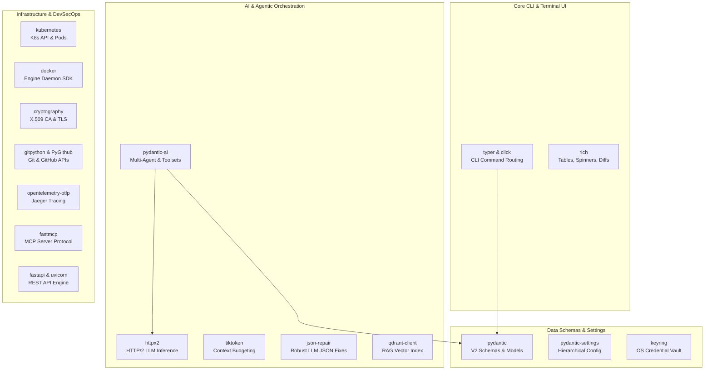

# Python Packages & Code Libraries Reference Manual

This technical reference manual provides a comprehensive, deep-dive architectural guide to every Python package and code library integrated into the `devops-cli` ecosystem. It details production runtime dependencies, development quality tools, architectural roles, code patterns, and best practices across the codebase.

---

## 📦 Package Architecture Overview

`devops-cli` implements a modern, high-performance, strictly typed Python 3.14+ runtime architecture. Dependencies are strictly categorized into:
1. **Core Runtime Packages (`dependencies`)**: Production libraries powering the CLI framework, AI multi-agent engine, Kubernetes/Docker controllers, OpenTelemetry tracing, cryptographic engine, and REST services.
2. **Development & Quality Tooling (`dependency-groups.dev`)**: High-speed testing, coverage validation, static typing, and AST security scanners enforcing the 10-point `devops ci` quality gate.
3. **Build Backend (`build-system`)**: Standard PEP 517 build system for reproducible wheel generation via `hatchling`.



---

## 🚀 Core Runtime Code Libraries

### 1. CLI & Terminal Interface

#### `typer` & `click` ([Dedicated Manual](libraries/typer.md))
- **Pinned Versions**: `typer==0.27.1`, `click==8.4.2`
- **Ecosystem Role**: Provides declarative CLI application scaffolding, subcommand dispatching, argument/option parsing, shell autocompletion, and type inference.
- **Codebase Integration**:
  - `devops_cli.core.cli.new_typer`: Factory creating standardized Typer apps with unified formatting, error handlers, and help text from `devops_cli.lang.HELP`.
  - Type annotations (`Annotated[T, typer.Option(...)]`) map automatically to rich terminal options and validation rules.

```python
from typing import Annotated
import typer
from devops_cli.core.cli import new_typer
from devops_cli.lang import HELP

app = new_typer(help=HELP.main.app)


@app.command("run")
def run_command(
    target: Annotated[str, typer.Argument(help=HELP.options.target)],
    dry_run: Annotated[bool, typer.Option("--dry-run", help=HELP.options.dry_run)] = False,
) -> None: ...
```

#### `rich` ([Dedicated Manual](libraries/rich.md))
- **Pinned Version**: `rich==15.0.0`
- **Ecosystem Role**: Terminal rendering engine providing colorized output, syntax highlighting, formatted tables, animated spinners, status displays, and progress bars.
- **Codebase Integration**:
  - `devops_cli.output`: Centralized console abstractions (`print_table`, `print_banner`, `print_success`, `print_error`, `print_info`, `print_warning`, `print_muted`).
  - Diffs and finding locations are rendered in Rich tables using the canonical `filename.ext:n-n` syntax.

---

### 2. Data Validation, Settings & Secrets

#### `pydantic` (v2) ([Dedicated Manual](libraries/pydantic.md))
- **Pinned Version**: `pydantic==2.13.4`
- **Ecosystem Role**: High-performance data validation, parsing, serialization, and JSON Schema generation using compiled Rust core (`pydantic-core`).
- **Codebase Integration**:
  - All domain models (`devops_cli.models`), review findings (`Finding`, `ReviewSession`), tool schemas, and AI agent output structures inherit from `BaseModel`.
  - Enforces `Field(default_factory=...)`, strict validation, and seamless conversion to/from dict and JSON.

```python
from pydantic import BaseModel, Field


class Finding(BaseModel):
    id: str
    persona: str
    severity: str
    title: str
    location: str
    description: str
    remediation: str | None = None
    confidence: float | None = None
    details: dict[str, str] = Field(default_factory=dict)
```

#### `pydantic-settings` ([Dedicated Manual](libraries/pydantic.md))
- **Pinned Version**: `pydantic-settings==2.15.0`
- **Ecosystem Role**: Layered configuration management loading settings from environment variables, `.env` files, TOML/JSON configs, and CLI overrides.
- **Codebase Integration**:
  - `devops_cli.config.settings.Settings`: Unified singleton loading application configuration with prefix `DEVOPS_CLI_` and automatic type coercion.

#### `keyring` ([Dedicated Manual](libraries/keyring.md))
- **Pinned Version**: `keyring==25.7.0`
- **Ecosystem Role**: Zero-trust credential security interface integrating with native OS vaults (Secret Service on Linux, Keychain on macOS, Credential Manager on Windows).
- **Codebase Integration**:
  - `devops_cli.config.keyring_vault`: Securely retrieves and stores GitHub Personal Access Tokens, LLM API keys, and sensitive credentials without storing plaintext in files or environment variables.

---

### 3. Agentic AI, LLM Client & Semantic Search

#### `pydantic-ai` ([Dedicated Manual](libraries/pydantic_ai.md))
- **Pinned Version**: `pydantic-ai==2.35.0`
- **Ecosystem Role**: Multi-agent framework enabling type-safe tool execution, dynamic instructions, structured output validation, model overrides, and sub-agent delegation.
- **Codebase Integration**:
  - `devops_cli.ai.agents.agent.PydanticAgent`: High-level agent abstraction managing toolsets, usage tracking (`AgentUsage`), and async lifecycles (`async with agent:`).
  - `devops_cli.ai.agents.tools.MCPToolset`: Connects external Model Context Protocol servers as native callable agent tools.

```python
from devops_cli.ai.agents import PydanticAgent, AgentTool, MCPToolset

async with MCPToolset(server_url="http://localhost:8000/sse") as mcp:
    agent = PydanticAgent(
        name="DevSecOps",
        model="claude-3-5-sonnet",
        toolsets=[mcp],
    )
    result = await agent.run("Audit Kubernetes security policies")
```

#### `httpx2` (Pydantic HTTP/2 Client) ([Dedicated Manual](libraries/httpx2.md))
- **Pinned Version**: `httpx2==2.9.0`
- **Ecosystem Role**: Advanced HTTP/2 and HTTP/1.1 client supporting connection pooling, asynchronous streaming, mTLS, and multiplexed requests.
- **Codebase Integration**:
  - `devops_cli.ai.llm.client.UnifiedLLMClient`: Executes high-throughput streaming requests to LLM inference endpoints (Ollama, Anthropic, OpenAI, Azure) with bounded timeouts and TLS verification.

#### `tiktoken` ([Dedicated Manual](libraries/tiktoken.md))
- **Pinned Version**: `tiktoken==0.14.0`
- **Ecosystem Role**: Fast BPE (Byte-Pair Encoding) tokenizer developed by OpenAI for token counting and context window management.
- **Codebase Integration**:
  - `devops_cli.ai.context_budget`: Accurately counts tokens in diffs, prompts, and knowledge base files, preventing LLM context window overflows and optimizing cost.

#### `json-repair` ([Dedicated Manual](libraries/json_repair.md))
- **Pinned Version**: `json-repair==0.63.4`
- **Ecosystem Role**: Resilient JSON parser capable of repairing malformed, unclosed, or truncated JSON responses emitted by LLMs.
- **Codebase Integration**:
  - `devops_cli.ai.review.runner` & `devops_cli.ai.agents`: Automatically repairs and parses structured model outputs without crashing when tokens are abruptly truncated.

#### `qdrant-client` ([Dedicated Manual](libraries/qdrant_client.md))
- **Pinned Version**: `qdrant-client==1.19.0`
- **Ecosystem Role**: Vector database client supporting in-memory, local on-disk storage, and remote server connectivity for dense embeddings.
- **Codebase Integration**:
  - `devops_cli.ai.rag.engine`: Manages vector collections, cosine distance indexing, and semantic search retrieval to ground AI code reviews against knowledge base manuals.

---

### 4. Git, GitHub & DevSecOps Subsystems

#### `gitpython` ([Dedicated Manual](libraries/gitpython.md))
- **Pinned Version**: `gitpython==3.1.60`
- **Ecosystem Role**: Python interface for interacting with Git repositories, inspecting commits, reading tree objects, and managing tracking branches.
- **Codebase Integration**:
  - `devops_cli.git`: Retrieves current branch name, diffs (`git.diff`), unstaged files, and commit logs with defensive error handling.

#### `PyGithub` ([Dedicated Manual](libraries/pygithub.md))
- **Pinned Version**: `PyGithub==2.10.0`
- **Ecosystem Role**: Full-featured client for the GitHub REST API v3 and GraphQL API.
- **Codebase Integration**:
  - `devops_cli.commands.pr`: Fetches PR details, posts review findings as collapsible markdown comments, checks remote CI status, and manages releases.

#### `cryptography` ([Dedicated Manual](libraries/cryptography.md))
- **Pinned Version**: `cryptography==50.0.1`
- **Ecosystem Role**: Industry-standard cryptographic library providing X.509 certificate generation, RSA/Ed25519 keypair creation, CSR signing, and TLS encryption.
- **Codebase Integration**:
  - `devops_cli.crypto.tls_certificates`: Automatically generates root Certificate Authorities, server certificates with SAN (Subject Alternative Names), and exports PEM/CRT bundles.
  - `devops_cli.commands.ssh`: Generates and rotates Ed25519 SSH keys with 90-day expiry naming conventions.

#### `tldextract` ([Dedicated Manual](libraries/tldextract.md))
- **Pinned Version**: `tldextract==5.3.2`
- **Ecosystem Role**: Accurately separates domain subtotals using the Public Suffix List (PSL).
- **Codebase Integration**:
  - `devops_cli.security`: Validates outbound network destinations, preventing Server-Side Request Forgery (SSRF) and ensuring egress safety.

#### `pathspec` ([Dedicated Manual](libraries/pathspec.md))
- **Pinned Version**: `pathspec==1.1.1`
- **Ecosystem Role**: Fast pattern matching utility implementing `.gitignore` style globbing rules.
- **Codebase Integration**:
  - `devops_cli.ai.diff` & `devops_cli.commands.review`: Excludes build directories (`.venv`, `node_modules`, `dist`, `.data`) and secret files from code review passes.

#### `packaging` ([Dedicated Manual](libraries/packaging.md))
- **Pinned Version**: `packaging==26.3`
- **Ecosystem Role**: Core packaging utilities for parsing Semantic Versioning (SemVer 2.0.0) and PEP 440 specification rules.
- **Codebase Integration**:
  - `devops_cli.commands.release`: Validates version increments (`major`, `minor`, `patch`), ensuring clean bump sequences across `pyproject.toml` and changelogs.

---

### 5. Kubernetes, Containers, Observability & Services

#### `kubernetes` ([Dedicated Manual](libraries/kubernetes.md))
- **Pinned Version**: `kubernetes==36.0.3`
- **Ecosystem Role**: Official Python client for the Kubernetes API (CoreV1Api, AppsV1Api, CustomObjectsApi).
- **Codebase Integration**:
  - `devops_cli.commands.k8s`: Inspects cluster nodes, queries running pods, streams container logs, creates TLS secrets, and executes in-cluster diagnostics.

#### `docker` ([Dedicated Manual](libraries/docker.md))
- **Pinned Version**: `docker==7.2.0`
- **Ecosystem Role**: Docker SDK for Python interacting with the Docker Engine daemon over Unix sockets or TCP.
- **Codebase Integration**:
  - `devops_cli.commands.docker`: Collects real-time container CPU/memory statistics, checks container health, and inspects image layers.

#### `fastmcp` ([Dedicated Manual](libraries/fastmcp.md))
- **Pinned Version**: `fastmcp==3.4.7`
- **Ecosystem Role**: High-level Model Context Protocol (MCP) server framework exposing Python functions as standardized tools and prompts.
- **Codebase Integration**:
  - `devops_cli.mcp`: Exposes `devops-cli` tools (`review_path`, `k8s_pods`, `tf_plan`, `scan_uv_audit`, `security_intel_package`) to AI assistants via stdio and SSE transports.

#### `fastapi` & `uvicorn` ([Dedicated Manual](libraries/fastapi_uvicorn.md))
- **Pinned Versions**: `fastapi==0.141.1`, `uvicorn==0.52.4`
- **Ecosystem Role**: Asynchronous web framework and lightning-fast ASGI server for building high-performance REST APIs with auto-generated OpenAPI documentation.
- **Codebase Integration**:
  - `devops_cli.service`: Powers `devops serve`, providing REST endpoints for remote automation, health probes (`/healthz`), Prometheus metric scraping (`/metrics`), and tool execution.

#### `opentelemetry-exporter-otlp-proto-grpc` ([Dedicated Manual](libraries/opentelemetry.md))
- **Pinned Version**: `opentelemetry-exporter-otlp-proto-grpc==1.44.0`
- **Ecosystem Role**: OpenTelemetry collector exporter transmitting distributed trace spans over gRPC.
- **Codebase Integration**:
  - `devops_cli.telemetry.tracer`: Emits span waterfalls for CLI subcommands, multi-agent review stages, and tool executions to Jaeger (`http://localhost:16686`).

#### `PyYAML` & `jinja2` ([Dedicated Manual](libraries/pyyaml_jinja2.md))
- **Pinned Versions**: `PyYAML==6.0.3`, `jinja2==3.1.6`
- **Ecosystem Role**: YAML parsing/serialization and expressive text templating engine.
- **Codebase Integration**:
  - `devops_cli.commands.k8s` & `devops_cli.commands.devcontainer`: Dynamically renders DevContainer configurations, ArgoCD manifests, and Helm values files.

---

## 🛠️ Development, CI Quality & Verification Tooling

The development environment leverages modern Python engineering tools managed via Astral `uv`:

| Tool | Pinned Version | Quality Gate Role | Execution Command |
| :--- | :--- | :--- | :--- |
| **`ruff`** | `0.16.4` | Extreme-speed linter and code formatter checking py314 rules (`E`, `F`, `I`, `N`, `W`, `UP`). | `uv run ruff check .` / `uv run ruff format .` |
| **`mypy`** | `2.3.1` | Strict static type checker validating 100% type coverage with Pydantic v2 plugin. | `uv run mypy src` |
| **`pytest`** | `9.1.1` | Comprehensive unit and integration test runner. | `uv run pytest` |
| **`pytest-asyncio`** | `1.4.0` | Asyncio fixture and test execution plugin for asynchronous tool loops. | Included in pytest suite |
| **`pytest-mock`** | `3.15.1` | Thin wrapper around standard library `unittest.mock` for clean fixture patching. | Included in pytest suite |
| **`pytest-cov`** | `7.1.0` | Code coverage measurement enforcing strict $\ge 90\%$ minimum threshold project-wide. | `uv run pytest --cov=src` |
| **`pytest-xdist`** | `3.8.0` | Multi-core parallel test execution distribution across worker subprocesses. | `uv run pytest -n auto` |
| **`bandit`** | `1.9.4` | AST-based Python security analyzer detecting insecure patterns (CWE checks). | `uv run bandit -r src/` |
| **`actionlint-py`** | `1.7.12.24` | GitHub Actions workflow syntax and expression validation engine. | `uv run actionlint` |
| **`pre-commit`** | `4.6.2` | Multi-hook manager orchestrating git commit quality gates. | `uv run pre-commit run --all-files` |
| **`hatchling`** | `>=1.26.0` | Build backend complying with PEP 517 / PEP 621 for wheel generation. | `uv build` |

---

## 🔒 Engineering Standards & Integration Principles

1. **Deterministic Version Pinning**: All package versions are strictly pinned with exact versions (`==`) in `pyproject.toml` and verified in `uv.lock` to guarantee reproducible builds across workstations, CI runners, and DevContainers.
2. **Automated Vulnerability Audits**: The `devops ci` quality gate automatically audits dependencies for known CVEs via `scan_uv_audit` and `pip-audit`.
3. **Lazy Subsystem Loading**: High-overhead modules (e.g. `fastmcp`, `qdrant-client`, `docker`, `kubernetes`, `fastapi`, `cryptography`) are imported lazily within subcommand execution functions to ensure CLI cold-start latency remains under 80ms.
4. **Standard Library Leverage First**: Ad-hoc helper loops or custom workarounds are avoided in favor of standard library modules (`functools`, `itertools`, `pathlib`, `ipaddress`, `urllib.parse`) and established libraries.
5. **Strict Type Safety**: All external library integrations must provide complete type annotations compatible with `mypy --strict`.
