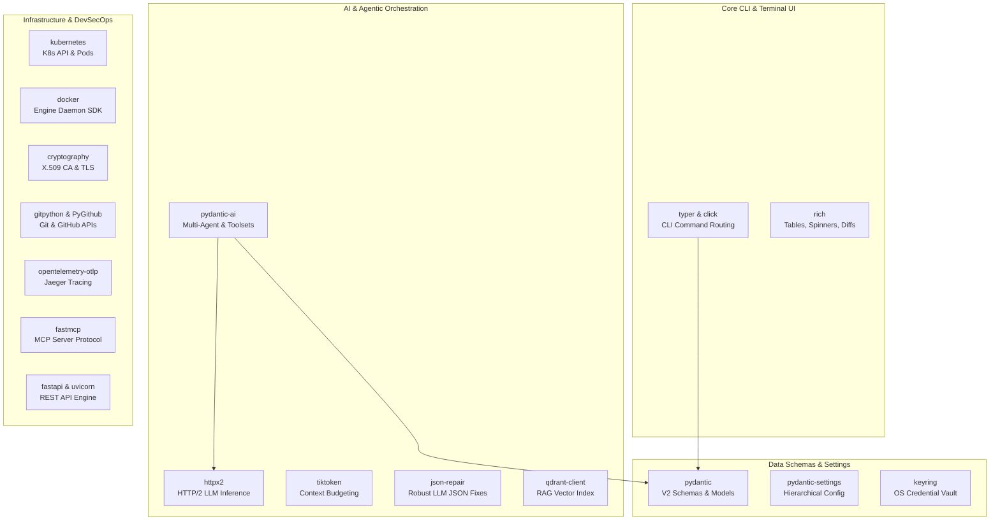

# Python Packages Reference Manual

This technical reference manual documents every Python package and dependency integrated into the `devops-cli` ecosystem, including production runtime libraries, developer quality tools, and build backends.

---

## 📦 Package Summary & Architecture Overview

`devops-cli` maintains a modern, high-performance, strictly typed Python 3.14+ runtime architecture. Dependencies are strictly categorized into:
1. **Core Runtime Packages (`dependencies`)**: Production libraries powering the CLI, AI multi-agent engine, Kubernetes/Docker controllers, OpenTelemetry tracing, and REST services.
2. **Development & Quality Tooling (`dependency-groups.dev`)**: High-speed testing, coverage validation, static typing, and AST security scanners enforcing the 10-point `devops ci` quality gate.
3. **Build Backend (`build-system`)**: Standard PEP 517 build system for reproducible wheel generation.

---

## 🚀 Production Runtime Dependencies

### 1. CLI & Terminal Interface

| Package | Pinned Version | Ecosystem Role & Usage | Repository & Docs |
| :--- | :--- | :--- | :--- |
| **`typer`** | `0.27.1` | High-level CLI application framework with automatic type inference, subcommand routing, and option parsing. | [tiangolo/typer](https://github.com/tiangolo/typer) • [PyPI](https://pypi.org/project/typer/) |
| **`click`** | `8.4.2` | Core composable command-line toolkit underlying Typer, providing custom parameter parsing and exit code mapping. | [pallets/click](https://github.com/pallets/click) • [PyPI](https://pypi.org/project/click/) |
| **`rich`** | `15.0.0` | Terminal styling, formatted tables (`print_table`), animated spinners, live progress bars, and syntax-highlighted code diffs. | [Textualize/rich](https://github.com/Textualize/rich) • [PyPI](https://pypi.org/project/rich/) |

### 2. Data Validation, Settings & Secrets

| Package | Pinned Version | Ecosystem Role & Usage | Repository & Docs |
| :--- | :--- | :--- | :--- |
| **`pydantic`** | `2.13.4` | Core data validation and schema definitions for all domain models, review findings, and tool payloads. | [pydantic/pydantic](https://github.com/pydantic/pydantic) • [PyPI](https://pypi.org/project/pydantic/) |
| **`pydantic-settings`** | `2.15.0` | Hierarchical configuration management, layered resolution (CLI flags $\rightarrow$ Env vars $\rightarrow$ Config files $\rightarrow$ Defaults). | [pydantic/pydantic-settings](https://github.com/pydantic/pydantic-settings) • [PyPI](https://pypi.org/project/pydantic-settings/) |
| **`keyring`** | `25.7.0` | Secure OS Keyring storage for sensitive secrets (GitHub tokens, cloud API keys, private credentials) across Linux/macOS/Windows. | [jaraco/keyring](https://github.com/jaraco/keyring) • [PyPI](https://pypi.org/project/keyring/) |

### 3. Agentic AI, LLM Client & Semantic Search

| Package | Pinned Version | Ecosystem Role & Usage | Repository & Docs |
| :--- | :--- | :--- | :--- |
| **`pydantic-ai`** | `2.35.0` | Multi-agent orchestrator, `FunctionToolset` abstractions, `ToolReturn` rich output models, and retry budgets. | [pydantic/pydantic-ai](https://github.com/pydantic/pydantic-ai) • [PyPI](https://pypi.org/project/pydantic-ai/) |
| **`httpx2`** | `2.9.0` | Modern HTTP/2 async & sync client for streaming LLM provider requests (Ollama, Claude, Copilot, OpenAI) with TLS pooling. | [pydantic/httpx2](https://github.com/pydantic/httpx2) • [PyPI](https://pypi.org/project/httpx2/) |
| **`tiktoken`** | `0.14.0` | Fast Byte-Pair Encoding (BPE) tokenizer used for strict context budget estimation (`devops_cli.ai.context_budget`). | [openai/tiktoken](https://github.com/openai/tiktoken) • [PyPI](https://pypi.org/project/tiktoken/) |
| **`json-repair`** | `0.63.4` | Resilient JSON parser and tokenizer that auto-repairs truncated or malformed JSON payloads emitted by LLMs. | [mangiucugna/json_repair](https://github.com/mangiucugna/json_repair) • [PyPI](https://pypi.org/project/json-repair/) |
| **`qdrant-client`** | `1.19.0` | Vector database client for local semantic search, document chunk indexing, and RAG grounding in code reviews. | [qdrant/qdrant-client-python](https://github.com/qdrant/qdrant-client-python) • [PyPI](https://pypi.org/project/qdrant-client/) |

### 4. Git, GitHub & DevSecOps Subsystems

| Package | Pinned Version | Ecosystem Role & Usage | Repository & Docs |
| :--- | :--- | :--- | :--- |
| **`gitpython`** | `3.1.60` | Git repository inspection, branch tracking, working tree status checks, and local commit graph operations. | [gitpython-developers/GitPython](https://github.com/gitpython-developers/GitPython) • [PyPI](https://pypi.org/project/GitPython/) |
| **`PyGithub`** | `2.10.0` | GitHub REST API v3 client for managing PR reviews, repository synchronization, release assets, and SSH signing keys. | [PyGithub/PyGithub](https://github.com/PyGithub/PyGithub) • [PyPI](https://pypi.org/project/PyGithub/) |
| **`cryptography`** | `50.0.1` | Cryptographic primitives for generating X.509 Certificate Authorities, mTLS server/client certificates, and SSH keys. | [pyca/cryptography](https://github.com/pyca/cryptography) • [PyPI](https://pypi.org/project/cryptography/) |
| **`tldextract`** | `5.3.2` | Accurate domain name and TLD parsing using the Public Suffix List for SSRF mitigation and endpoint validation. | [john-kurkowski/tldextract](https://github.com/john-kurkowski/tldextract) • [PyPI](https://pypi.org/project/tldextract/) |
| **`pathspec`** | `1.1.1` | Gitignore-style path pattern matching for target repository scanning, file exclusion, and diff filtering. | [cpburnz/python-pathspec](https://github.com/cpburnz/python-pathspec) • [PyPI](https://pypi.org/project/pathspec/) |
| **`packaging`** | `26.3` | Core packaging utilities for parsing Semantic Versions (SemVer 2.0.0), PEP 440 versions, and dependency constraints. | [pypa/packaging](https://github.com/pypa/packaging) • [PyPI](https://pypi.org/project/packaging/) |

### 5. Kubernetes, Containers, Observability & Services

| Package | Pinned Version | Ecosystem Role & Usage | Repository & Docs |
| :--- | :--- | :--- | :--- |
| **`kubernetes`** | `36.0.3` | Official Python client library for Kubernetes cluster management, custom resources, namespace provisioning, and secret sync. | [kubernetes-client/python](https://github.com/kubernetes-client/python) • [PyPI](https://pypi.org/project/kubernetes/) |
| **`docker`** | `7.2.0` | Docker SDK for Python managing container lifecycles, health inspections, real-time resource stats, and network bridges. | [docker/docker-py](https://github.com/docker/docker-py) • [PyPI](https://pypi.org/project/docker/) |
| **`fastmcp`** | `3.4.7` | Model Context Protocol (MCP) server integration exposing CLI tools directly to AI assistants and IDE extensions. | [jlowin/fastmcp](https://github.com/jlowin/fastmcp) • [PyPI](https://pypi.org/project/fastmcp/) |
| **`fastapi`** | `0.141.1` | Asynchronous REST and OpenAPI service engine backing `devops serve` for automated workstation orchestration. | [fastapi/fastapi](https://github.com/fastapi/fastapi) • [PyPI](https://pypi.org/project/fastapi/) |
| **`uvicorn`** | `0.52.4` | Lightning-fast ASGI web server implementation powering the local `devops serve` REST API engine. | [encode/uvicorn](https://github.com/encode/uvicorn) • [PyPI](https://pypi.org/project/uvicorn/) |
| **`opentelemetry-exporter-otlp-proto-grpc`** | `1.44.0` | OpenTelemetry Protocol (OTLP) gRPC exporter delivering distributed trace spans to Jaeger and OTel collectors. | [open-telemetry/opentelemetry-python](https://github.com/open-telemetry/opentelemetry-python) • [PyPI](https://pypi.org/project/opentelemetry-exporter-otlp-proto-grpc/) |
| **`PyYAML`** | `6.0.3` | YAML 1.2 parser and emitter for Kubernetes manifests, Helm values, OpenTofu outputs, and Agent specifications. | [yaml/pyyaml](https://github.com/yaml/pyyaml) • [PyPI](https://pypi.org/project/PyYAML/) |
| **`jinja2`** | `3.1.6` | Expressive template engine powering DevContainer configuration generation and Agent instruction scaffolding. | [pallets/jinja](https://github.com/pallets/jinja) • [PyPI](https://pypi.org/project/jinja2/) |

---

## 🛠️ Development & CI Verification Tooling

The development environment leverages modern Python engineering tools managed via Astral `uv`:

| Tool | Pinned Version | Quality Gate Role | Execution Command |
| :--- | :--- | :--- | :--- |
| **`ruff`** | `0.16.4` | Extreme-speed linter and code formatter checking py314 rules (`E`, `F`, `I`, `N`, `W`, `UP`). | `uv run ruff check .` / `uv run ruff format .` |
| **`mypy`** | `2.3.1` | Strict static type checker validating 100% type coverage with Pydantic v2 plugin. | `uv run mypy src` |
| **`pytest`** | `9.1.1` | Comprehensive unit and integration test runner. | `uv run pytest` |
| **`pytest-asyncio`** | `1.4.0` | Asyncio fixture and test execution plugin for asynchronous tool loops. | Included in pytest suite |
| **`pytest-mock`** | `3.15.1` | Thin wrapper around standard library `unittest.mock` for clean fixture patching. | Included in pytest suite |
| **`pytest-cov`** | `7.1.0` | Code coverage measurement enforcing strict $\ge 90\%$ minimum threshold project-wide. | `uv run pytest --cov=src` |
| **`pytest-xdist`** | `3.8.0` | Multi-core parallel test execution distribution across worker subprocesses. | `uv run pytest -n auto` |
| **`bandit`** | `1.9.4` | AST-based Python security analyzer detecting insecure patterns (CWE checks). | `uv run bandit -r src/` |
| **`actionlint-py`** | `1.7.12.24` | GitHub Actions workflow syntax and expression validation engine. | `uv run actionlint` |
| **`pre-commit`** | `4.6.2` | Multi-hook manager orchestrating git commit quality gates. | `uv run pre-commit run --all-files` |
| **`hatchling`** | `>=1.26.0` | Build backend complying with PEP 517 / PEP 621 for wheel generation. | `uv build` |

---

## 🔒 Dependency Hygiene & Best Practices

1. **Deterministic Pinning**: All package versions are strictly pinned in `pyproject.toml` and locked in `uv.lock` to ensure identical builds across local workstations, CI runners, and DevContainers.
2. **Automated Vulnerability Audits**: The `devops ci` quality gate automatically audits dependencies for known CVEs via `pip-audit` and `scan_uv_audit`.
3. **Lazy Subsystem Loading**: High-overhead modules (e.g. `fastmcp`, `qdrant-client`, `docker`, `kubernetes`, `fastapi`) are imported lazily within subcommand entry points to keep CLI cold-start times under 80ms.
4. **Zero-Trust Security**: No dependency is permitted to bypass OS Keyring or log unredacted credential tokens.
