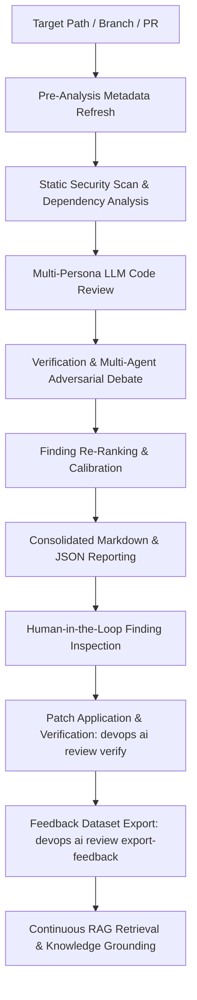

# Knowledge Base Task: Multi-Persona AI Code Review

## 1. Overview & Purpose

The Multi-Persona AI Code Review system in `devops-cli` provides automated, high-signal, persona-driven feedback on git diffs, pull requests, and file paths. By leveraging domain-specialized personas (`architect`, `devsecops`, `auditor`, `qa`, `pm`), the review engine analyzes code modifications against universal software engineering principles (SOLID, DRY, OWASP Top 10, CIS benchmarks) as well as the target repository's own declared conventions (`AGENTS.md`).

---

## 2. Architecture & 6-Stage Review Pipeline



- **6 Modular Pipeline Stages**:
  1. `pre_analysis`: Fast workspace scan, AST context refresh, and cache synchronization (`--no-pre-analysis`, `--pre-analysis-only`).
  2. `static_scan`: Parallelized tool execution (Bandit, KubeLinter, Pluto, Semgrep, Gitleaks, OSV, Shodan) and dependency extraction (`--no-static-scan`, `--static-scan-only`).
  3. `persona_review`: Multi-persona parallel LLM inspection across specialized engineering personas (`--no-persona-review`, `--persona-review-only`).
  4. `verification`: Step-by-step observable code/AST evidence checking and multi-agent adversarial debate (`--no-verification`, `--verification-only`).
  5. `reranking`: Cross-persona deduplication, severity sorting, and reportable threshold filtering (`--no-reranking`, `--reranking-only`).
  6. `reporting`: Markdown file report generation (`review.md`), JSON finding persistence (`findings.json`), and Rich console table rendering (`--no-reporting`, `--reporting-only`).

- **Specialized Personas**:
  - `devsecops`: Evaluates CWE vulnerabilities, secret exposures, network egress, and permissions.
  - `architect`: Evaluates SOLID design, coupling, cohesion, module boundaries, and typing.
  - `auditor`: Evaluates compliance, license risks, and log sanitization.
  - `qa`: Evaluates edge cases, exception handling, and test isolation.
  - `pm`: Evaluates documentation sync, changelog updates, and user requirements.

- **Closed-Loop Feedback & Self-Improvement**:
  - `verify_finding`: Tests observable verification and invalidation criteria against visible code and AST structures to eliminate false positives.
  - **Verification vs. Reporting Separation**: Verification criteria and invalidation criteria are internal tools for automated validation during Stage 4 (`verification`). They are used to match observable evidence and calibrate confidence, but are strictly excluded from user-facing reports (`review.md`, terminal tables, console panels).
  - **Python 3.14+ PEP 759 Syntax Awareness**: Recognizes modern Python 3.14 multi-exception syntax (`except FileNotFoundError, OSError:`) without parentheses to prevent false-positive "SyntaxError" flags.
  - **Confidence Calibration**: Weighs findings based on concrete criteria satisfaction, discarding unverified or mitigated items.
  - **Lockfile-Aware Dependency Scanning**: Resolves exact package releases from lockfiles (`uv.lock`, `poetry.lock`, `package-lock.json`, `Cargo.lock`, `go.sum`) before querying OSV.dev and NVD vulnerability databases.
  - **Network Reference Disambiguation**: Differentiates legitimate network endpoints from source file extensions (`*.py`, `*.md`, `*.sh`, `*.tf`, `*.rs`, `*.pid`) and telemetry/code property paths (`service.name`, `ci.step.*`, `host.name`, `process.pid`).
  - **Self-Healing & Patch Application**: Generates drop-in remediation code patches that can be applied and verified against automated CI quality gates (`devops ai review patch`).
  - **Continuous Feedback Dataset Export**: Persists validated, invalidated, and mitigated review findings to structured JSONL feedback datasets (`.data/reviews/feedback_dataset.jsonl`) via `devops ai review export-feedback` to continuously ground RAG indices and calibrate LLM evaluation prompts.
  - **Continuous Knowledge Feedback**: Synthesizes recurrent review findings into repository architecture guides and test fixtures to prevent recurrence.

---

## 3. Useful Usage Information & Common Commands

### Review Execution Commands
```bash
# Review active working directory git diff (staged + unstaged)
devops ai review branch

# Review an entire target path or child repository
devops ai review path repos/my-org/my-project

# Review a specific GitHub pull request by number
devops ai review pr 22

# Review using a specific persona and provider
devops ai review branch --persona devsecops --provider ollama --model qwen3.8:27b

# Fast testing: Run static analysis stage only (skip LLM inspection & verification)
devops ai review path . --static-scan-only

# Performance testing: Disable verification stage to measure baseline persona generation
devops ai review branch --no-verification

# Pipeline debugging: Run pre-analysis metadata refresh only
devops ai review path src/ --pre-analysis-only
```

### Findings Management & Closed-Loop Feedback Commands
```bash
# Inspect findings from the latest review session
devops ai review findings --session latest --details

# Filter findings by status (VERIFIED, UNVERIFIED, INVALIDATED, MITIGATED)
devops ai review findings --status VERIFIED

# Mark finding as MITIGATED after applying a fix
devops ai review verify --session latest --index 1 --status MITIGATED --reason "Service type changed to ClusterIP and NetworkPolicy jaeger-ingress created"

# Mark finding as INVALIDATED if proven to be a false positive
devops ai review verify --session latest --index 2 --status INVALIDATED --reason "Symbol is re-exported via __all__ in target module"

# Export review report to markdown
devops ai review branch --export-md .data/reviews/review-report.md

# Export all findings to structured feedback dataset for fine-tuning and RAG grounding
devops ai review export-feedback --status ALL --output .data/reviews/feedback_dataset.jsonl
```

---

## 4. Best Practice Guidance

1. **Review Small, Atomic Diffs**: Run reviews iteratively on focused commits to maximize AI context focus and receive higher-signal feedback.
2. **Target Path Isolation**: When reviewing child workspaces (under `repos/`), always ensure file paths resolve relative to `target_dir` to prevent host file collisions.
3. **Declare Project Conventions**: Maintain an accurate `AGENTS.md` file in target repositories; the review engine automatically injects it into prompt context.
4. **Use Response Repair**: The review pipeline automatically normalizes LLM outputs using `repair_json_string` and `fix_llm_response` to ensure valid structured schemas.
5. **Context-Aware Documentation & Avoidance Context**: Never flag documentation, architectural guides, security tutorials, or prompt tasks that explain known vulnerabilities or insecure configurations in the context of avoiding, preventing, or mitigating them.

---

## 5. Security Recommendations & Zero-Trust Policies

- **Secret Masking & Path Filtering**: All diffs and source excerpts pass through `_mask_secrets_in_content` before transmission to LLM providers. Secret-containing paths (`.env*`, `.pem`, `*.key`, `*secret*`) are excluded from validation prompt injection.
- **Information Exposure & Exception Sanitization (CWE-200)**: Exception messages, log streams, and CLI diagnostic output must sanitize and mask private IPs, internal endpoints, hostnames, and credentials, preserving raw target URLs strictly inside structured debug details dictionaries.
- **Prompt Injection Defense**: Boundary closing tags and diff titles are escaped to prevent prompt manipulation.
- **Path Traversal Protection**: Directory traversal routines strictly enforce repository boundaries and skip symlinked files.
- **Offline Review Option**: For proprietary or air-gapped environments, use `--provider ollama` to keep all code analysis strictly on the local machine.

---

## 6. General Standards & Output Schemas

- **Finding Severity**: `CRITICAL`, `HIGH`, `MEDIUM`, `LOW`, `INFO`.
- **Finding Model**: Structured Pydantic model (`ReviewFinding`) with `id`, `file_path`, `line_start`, `line_end`, `persona`, `severity`, `title`, `description`, `remediation`, and `confidence`.

---

## 7. Official References & Published Artifacts

- **DevOps CLI Repository**: [github.com/dan-petty/devops-cli](https://github.com/dan-petty/devops-cli)
- **Review Pipeline Engine**: [src/devops_cli/ai/review/pipeline.py](../../../../ai/review/pipeline.py)
- **Persona Prompt Task Definitions**: [src/devops_cli/ai/tasks/](../../../../ai/tasks/)
