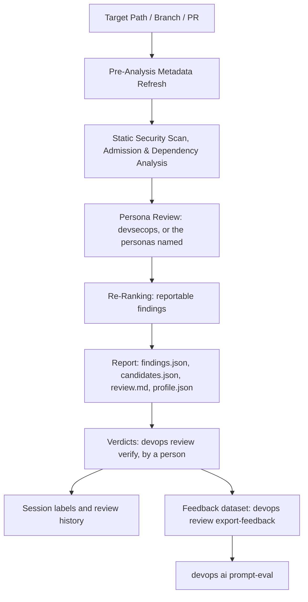

# Knowledge Base Task: Multi-Persona AI Code Review

## 1. Overview & Purpose

The AI code review in `devops-cli` reviews file paths, branch diffs and pull requests with static scanners and domain personas, and a person gives the verdicts. The DevSecOps persona reviews alone unless `--persona` names another (`architect`, `auditor`, `qa`, `pm` or `challenger`) or `--all` adds architect, qa, auditor and pm. Each persona judges the code against universal software engineering principles (SOLID, DRY, OWASP Top 10, CIS benchmarks) and the target's own conventions: the opening of the first of `AGENTS.md`, `CLAUDE.md`, `.github/copilot-instructions.md`, `.cursorrules` and `.cursor/rules` found from the target up, and the project's `.devops/review.md` in full. `docs/SELF_IMPROVEMENT.md` section 1 describes the loop as it runs, with the file and line of each step.

---

## 2. Architecture & Staged Review Pipeline


```mermaid
graph TD
    A[Target Path / Branch / PR] --> S1[Pre-Analysis Metadata Refresh]
    S1 --> S2[Static Security Scan, Admission & Dependency Analysis]
    S2 --> S3[Persona Review: devsecops, or the personas named]
    S3 --> S5[Re-Ranking: reportable findings]
    S5 --> S6[Report: findings.json, candidates.json, review.md, profile.json]
    S6 --> F1[Verdicts: devops review verify, by a person]
    F1 --> F2[Session labels and review history]
    F1 --> F3[Feedback dataset: devops review export-feedback]
    F3 --> F4[devops ai prompt-eval]
```

- **Pipeline Stages**:
  1. `pre_analysis`: Fast workspace scan, AST context refresh, and cache synchronization (`--no-pre-analysis`, `--pre-analysis-only`).
  2. `static_scan`: Scanners run isolated (Bandit, KubeLinter, Pluto, Trivy, Gitleaks, Semgrep), and each candidate is admitted against the reviewed tree, its `.devops/review.toml` suppressions and its path class's `[severity_caps]`; dependency extraction with OSV advisories, and Shodan InternetDB and Cloudflare Radar reputations for network references (`--no-static-scan`, `--static-scan-only`).
  3. `persona_review`: Each selected persona reviews every page of every file (`--no-persona-review`, `--persona-review-only`).
  4. `reranking`: Marks each file that has a reportable finding not INVALIDATED and counts those findings; it changes no finding (`--no-reranking`, `--reranking-only`).
  5. `reporting`: Writes `findings.json` (the reported findings, never an INVALIDATED one), `candidates.json` (every finding with its verdict), `review.md` and `profile.json` (`--no-reporting`, `--reporting-only`).

- **Specialized Personas** (`src/devops_cli/ai/personas/`):
  - `devsecops`: Evaluates CWE vulnerabilities, secret exposures, network egress, and permissions. It reviews alone by default.
  - `architect`: Evaluates SOLID design, coupling, cohesion, module boundaries, and typing.
  - `auditor`: Evaluates compliance, license risks, and log sanitization.
  - `qa`: Evaluates edge cases, exception handling, and test isolation.
  - `pm`: Evaluates documentation sync, changelog updates, and user requirements.
  - `challenger`: Runs only when `--persona challenger` names it; `--all` leaves it out.

- **Closed-Loop Feedback & Self-Improvement**:
  - **Verdicts Come From People**: No model and no criterion gives a finding its verdict. A persona's finding is reported UNVERIFIED until a person judges it; `--no-persona-review` gives a tools-only review.
  - **Strict Canonical Location Enforcement**: Normalizes all finding locations to standard `path/to/file.ext:start-end` or `path/to/file.ext:line` format, rejecting conversational text, markdown noise (`**`, `###`), approval remarks ("Good.", "Looks solid."), prompt leakage, and malformed non-path tokens.
  - **Zero Scratchpad Leakage Defense**: Cleans model titles, descriptions, and locations to isolate internal reasoning and chain-of-thought scratchpad text from structured review artifacts.
  - **Criteria Stay Out of Reports**: The verification and invalidation criteria a persona writes are excluded from user-facing reports (`review.md`, terminal tables, console panels).
  - **Reporting**: Nothing compares personas or counts their agreement. UNVERIFIED and MITIGATED findings are reported, and only INVALIDATED ones are left out of `findings.json`.
  - **Lockfile-Aware Dependency Scanning**: Resolves exact package releases from lockfiles (`uv.lock`, `poetry.lock`, `package-lock.json`, `Cargo.lock`, `go.sum`) before querying the OSV.dev vulnerability database.
  - **Network Reference Disambiguation**: Differentiates legitimate network endpoints from source file extensions (`*.py`, `*.md`, `*.sh`, `*.tf`, `*.rs`, `*.pid`) and telemetry/code property paths (`service.name`, `ci.step.*`, `host.name`, `process.pid`).
  - **Drop-In Fixes**: Each finding's `fix` is replacement code for the cited lines; nothing applies it, so a person or agent applies it and runs the tests and `devops ci`.
  - **Feedback Dataset Export**: `devops review export-feedback` appends the verdicts on review findings and candidates to one JSONL feedback dataset (`.data/feedback_dataset.jsonl`, `data.feedback_dataset_path`), skipping verdicts it already holds. Without `--status` it exports INVALIDATED verdicts only. One command reads the dataset, `devops ai prompt-eval`, which counts the recorded verdicts per labeller; nothing indexes it for RAG and no prompt is built from it.
  - **Knowledge Feedback Is a Commit**: A recurring false positive becomes a reviewed `[[suppressions]]` entry in `.devops/review.toml` with a rule, a path, a reason and an expiry, a rule true of one repository goes into its `.devops/review.md`, and a prompt changes when someone edits a file under `src/devops_cli/ai/tasks/` or `src/devops_cli/ai/personas/`. A branch or pull request review, and `devops pr check-readiness`, list the unexpired suppressions whose path the change touches, for a person to re-check each reason.
  - **Path Routing**: Path, branch and pull request reviews keep lockfiles, planning documents (`docs/ROADMAP.md`, `CHANGELOG.md`, `changelog.d/`, `docs/agent/tasks/`, `docs/adr/`) and generated references (`docs/commands/*.md`, `docs/CLI_REFERENCE.md`) off persona pages, by one predicate (`skips_persona_review`). Gitleaks still reads them, and a change made only of such files calls no model.
  - **One Taxonomy and Path-Class Severity Caps**: A finding's category is the CWE it cites (`CWE-<n>`) or a class of the closed `DefectClass` enum, the original kept as `category_raw`; the report and the category metrics group findings by that class. A scanner finding's severity is its tool's, capped at admission by its path class's `[severity_caps]` entry in `.devops/review.toml` unless a secret scanner reported it, Gitleaks or one of Trivy's secret results: a secret in a test or a document is still a secret. Any other scanner's finding is capped, even one whose words name a password or a credential.
  - **Executive Summary & Pattern Synthesis (review.md)**: Every consolidated review report generates an Executive Summary statement at the top detailing:
    - The reported findings counted by status, each with its severities: verified and unverified, then, listed apart, the mitigated ones. Findings rank verified first, then by severity, location and title, never by a model's confidence.
    - The defect classes that recur among verified findings, most severe first; a class seen once, a CVE or a finding title is never a theme.
    - `Static Security Analysis`: the analyzers that ran, the critical findings the scan reported, and those on built-in patterns, failed or not installed.
    - `Key Good Patterns Observed`: Reports verified tool observations (external dependencies queried against vulnerability databases with zero critical/high CVEs, network reference counts); omitted when no positive tool outputs exist.
    - `Key Bad Patterns Observed`: The defect classes that recur among verified findings, or confirmation that none recurs.
  - **Prompt Sanitization Markers**: The review prompts tell personas that pre-prompt secret redaction markers (`<masked-*>`) are the sanitizer's, never an undefined name or a missing variable.
  - **Verdicts & Export**: A person records a verdict through `devops review verify <session> --index <n> --status <STATUS> --reason "..."`, where `<n>` is the number `devops review findings` shows whatever filter it applies. `--candidate <n>` judges a finding from `devops review findings --candidates`, and a VERIFIED or MITIGATED verdict moves it into findings.json; when findings.json already reports its defect under another title, the command names that finding to judge instead. A verdict on a finding is recorded on the candidate it reports as well, and a verdict on a candidate on its copy in findings.json, so both lists agree; a candidate that its copy cannot tell apart from another of the same persona, title, location and description is judged through the copy with `--index`. Verdicts given on one session at once take turns under a lock on the session. Every verdict records `verified_by="human"` and ranks review history; it labels the session's files and nothing else, and when they cannot be written the verdict is not recorded. Verdicts are exported with `devops review export-feedback`, which labels a record `human` only when a person gave it.

---

## 3. Useful Usage Information & Common Commands

### Review Execution Commands
```bash
# Review active working directory git diff (staged + unstaged)
devops ai review branch

# Review an entire target path or child repository
devops ai review path repos/my-org/my-project

# Review a specific GitHub pull request by number
devops ai review pr 22

# Review with one persona, on a model chosen for the analysis task
DEVOPS_CLI_AI_TASK_ANALYSIS_MODEL=qwen3.8:27b devops ai review branch --persona architect

# Review with devsecops, architect, qa, auditor and pm
devops ai review branch --all

# Fast testing: Run static analysis stage only (skip LLM inspection)
devops ai review path . --static-scan-only

# A tools-only review: scanners, no persona
devops ai review branch --no-persona-review

# Pipeline debugging: Run pre-analysis metadata refresh only
devops ai review path src/ --pre-analysis-only

# Print the whole report to the terminal. By default the terminal lists CRITICAL to MEDIUM
# findings, details CRITICAL and HIGH, and gives LOW and INFO findings, dependencies and
# network references one line each that points at review.md.
devops ai review branch --full
```

### Findings Management & Closed-Loop Feedback Commands
```bash
# Inspect findings from the latest review session (a session id or part of one picks another)
devops review findings --details

# Filter findings by status (VERIFIED, UNVERIFIED, INVALIDATED, MITIGATED)
devops review findings --status VERIFIED

# List the LOW and INFO findings a review only counted on the terminal
devops review findings 20260910-143644 --severity LOW --severity INFO --details

# Mark finding #1 as MITIGATED after applying a fix (the number `review findings` shows)
devops review verify 20260910-143644 --index 1 --status MITIGATED --reason "Service type changed to ClusterIP and NetworkPolicy jaeger-ingress created"

# Mark finding #2 as INVALIDATED if proven to be a false positive
devops review verify 20260910-143644 --index 2 --status INVALIDATED --reason "Symbol is re-exported via __all__ in target module"

# List the invalidated candidates (findings.json never holds them), and restore a real defect
devops review findings 20260910-143644 --candidates --invalidated
devops review verify 20260910-143644 --candidate 7 --status VERIFIED --reason "The join takes the raw upload name"

# Read a session's report, written beside its findings
cat .data/reviews/20260910-143644/review.md

# Append every verdict to the feedback dataset (.data/feedback_dataset.jsonl), which devops ai prompt-eval reads
devops review export-feedback --status ALL

# Append only invalidated findings and candidates, which is what export-feedback does without --status
devops review export-feedback --status INVALIDATED
```

---

## 4. Best Practice Guidance

1. **Review Small, Atomic Diffs**: Run reviews iteratively on focused commits to maximize AI context focus and receive higher-signal feedback.
2. **Target Path Isolation**: When reviewing child workspaces (under `repos/`), always ensure file paths resolve relative to `target_dir` to prevent host file collisions.
3. **Declare Project Conventions**: Maintain an accurate conventions file (e.g. `AGENTS.md`, `CLAUDE.md`, `.github/copilot-instructions.md`, `.cursorrules`) in target repositories; the review gives the personas the opening of the nearest one. Rules for reviews of the project belong in its `.devops/review.md`, which they read in full up to 8,000 characters.
4. **Modular Task Tracking Architecture**: Ensure active tasks are tracked in dedicated per-task files (`docs/agent/tasks/task-<issue>-<slug>.md`) rather than editing monolithic tracking documents, preventing merge conflicts across concurrent branches.
5. **Use Response Repair**: The review pipeline automatically normalizes LLM outputs using `repair_json_string` and `fix_llm_response` to ensure valid structured schemas.
6. **Context-Aware Documentation & Avoidance Context**: Never flag documentation, architectural guides, security tutorials, or prompt tasks that explain known vulnerabilities or insecure configurations in the context of avoiding, preventing, or mitigating them.
7. **Ground-Truth Symbol & Export Verification**: Review personas must inspect actual source module ASTs or exports before asserting that imported variables, constants, or classes are missing or cause `ImportError`. A person invalidates a false missing-symbol claim, and one that recurs from a tool becomes a `.devops/review.toml` suppression.
8. **Closed-Loop Finding Remediation Workflow**: When remediating reported review findings:
   - **Step 1 (Test-First Specification)**: Author unit/regression tests asserting the defect and desired behavior before modifying source files.
   - **Step 2 (Clean Implementation & Architectural Invariants)**: Implement fixes adhering strictly to cyclomatic complexity $\le 10$ and maximum nesting depth $\le 5$ project-wide. Ruthlessly prune zombie code.
   - **Step 3 (Record the Verdict)**: A person records the verdict, `MITIGATED` or `INVALIDATED` with explicit step-by-step causal rationale, via `devops review verify <session> --index <n> --status <STATUS> --reason "..."`; agents record none. A recurring false positive becomes a `.devops/review.toml` suppression with a reason and an expiry.
   - **Step 4 (Export the Verdicts)**: Run `devops review export-feedback --status ALL` to append the verdicts to the feedback dataset (`.data/feedback_dataset.jsonl`), which `devops ai prompt-eval` counts per labeller.

---

## 5. Security Recommendations & Zero-Trust Policies

- **Secret Masking & Path Filtering**: All diffs and source excerpts pass through `mask_secrets` before transmission to LLM providers. Secret-containing paths (`.env*`, `.pem`, `*.key`, `*secret*`) are excluded from validation prompt injection.
- **Information Exposure & Bounded Exception Sanitization (CWE-200 / CWE-209 / CWE-400)**: Exception messages, log streams, and CLI diagnostic output must sanitize and mask private IPs, internal endpoints, hostnames, and credentials. Structured exception `details` dictionaries must enforce bounded string length caps ($\le 256$ characters) on caller-provided parameters (such as issue titles, query strings, or error text) to prevent log injection and memory bloat.
- **Public Documentation IP Invariants (RFC 5737)**: All code examples, CLI command tutorials, and environment variable documentation must use official documentation IP blocks (RFC 5737 `192.0.2.0/24`, `198.51.100.0/24`, `203.0.113.0/24`) or generic placeholders (`<host>`) rather than private RFC 1918 addresses.
- **Algorithmic Complexity & Resource Exhaustion (CWE-400)**: Review passes must verify that string processing, AST parsing, and token budget routines enforce linear $O(N)$ execution over repetitive loop unparsing or nested tokenization.
- **Prompt Injection Defense**: Boundary closing tags and diff titles are escaped to prevent prompt manipulation.
- **Path Traversal Protection**: Directory traversal routines strictly enforce repository boundaries and skip symlinked files.
- **Offline Review Option**: For proprietary or air-gapped environments, set the analysis task's provider to a local one (`ai.tasks.analysis.provider: ollama` in `config.yaml`, or `DEVOPS_CLI_AI_TASK_ANALYSIS_PROVIDER=ollama`) to keep all code analysis on the local machine.

---

## 6. General Standards & Output Schemas

- **Finding Severity**: `CRITICAL`, `HIGH`, `MEDIUM`, `LOW`, `INFO`.
- **Finding Model**: `Finding` (`src/devops_cli/ai/review_schema.py`) holds what a reviewer writes: `severity`, `location` (`path:line` or `path:start-end`), `title`, `description`, `fix`, `references`, `observed_value`, `expected_value`, `verification_criteria` and `invalidation_criteria`. The verdict fields (`status`, `verified_by`, `confidence_score` and the rest) are the pipeline's, and `SavedFinding` adds the `persona`.

---

## 7. Official References & Published Artifacts

- **DevOps CLI Repository**: [github.com/dan-petty/devops-cli](https://github.com/dan-petty/devops-cli)
- **Review Pipeline Engine**: [src/devops_cli/ai/review/pipeline.py](../../../../ai/review/pipeline.py)
- **Persona Prompt Task Definitions**: [src/devops_cli/ai/tasks/](../../../../ai/tasks/)
