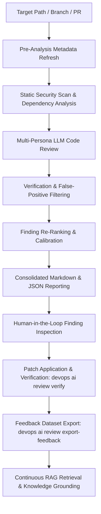

# Knowledge Base Task: Multi-Persona AI Code Review

## 1. Overview & Purpose

The Multi-Persona AI Code Review system in `devops-cli` provides automated, high-signal, persona-driven feedback on git diffs, pull requests, and file paths. By leveraging domain-specialized personas (`architect`, `devsecops`, `auditor`, `qa`, `pm`), the review engine analyzes code modifications against universal software engineering principles (SOLID, DRY, OWASP Top 10, CIS benchmarks) as well as the target repository's own declared conventions (e.g. `AGENTS.md`, `CLAUDE.md`, `.github/copilot-instructions.md`, or project instructions).

---

## 2. Architecture & 6-Stage Review Pipeline


```mermaid
graph TD
    A[Target Path / Branch / PR] --> S1[Pre-Analysis Metadata Refresh]
    S1 --> S2[Static Security Scan & Dependency Analysis]
    S2 --> S3[Multi-Persona LLM Code Review]
    S3 --> S4[Verification & False-Positive Filtering]
    S4 --> S5[Finding Re-Ranking & Calibration]
    S5 --> S6[Consolidated Markdown & JSON Reporting]
    S6 --> F1[Human-in-the-Loop Finding Inspection]
    F1 --> F2[Patch Application & Verification: devops ai review verify]
    F2 --> F3[Feedback Dataset Export: devops ai review export-feedback]
    F3 --> F4[Continuous RAG Retrieval & Knowledge Grounding]
```

- **6 Modular Pipeline Stages**:
  1. `pre_analysis`: Fast workspace scan, AST context refresh, and cache synchronization (`--no-pre-analysis`, `--pre-analysis-only`).
  2. `static_scan`: Parallelized tool execution (Bandit, KubeLinter, Pluto, Semgrep, Gitleaks, OSV, Shodan) and dependency extraction (`--no-static-scan`, `--static-scan-only`).
  3. `persona_review`: Multi-persona parallel LLM inspection across specialized engineering personas (`--no-persona-review`, `--persona-review-only`).
  4. `verification`: Step-by-step observable code/AST evidence checking and false-positive filtering (`--no-verification`, `--verification-only`).
  5. `reranking`: Cross-persona deduplication, severity sorting, and reportable threshold filtering (`--no-reranking`, `--reranking-only`).
  6. `reporting`: Markdown file report generation (`review.md`), JSON finding persistence (`findings.json`), and Rich console table rendering (`--no-reporting`, `--reporting-only`).

- **Specialized Personas**:
  - `devsecops`: Evaluates CWE vulnerabilities, secret exposures, network egress, and permissions.
  - `architect`: Evaluates SOLID design, coupling, cohesion, module boundaries, and typing.
  - `auditor`: Evaluates compliance, license risks, and log sanitization.
  - `qa`: Evaluates edge cases, exception handling, and test isolation.
  - `pm`: Evaluates documentation sync, changelog updates, and user requirements.

- **Closed-Loop Feedback & Self-Improvement**:
  - `verify_finding`: Tests observable verification and invalidation criteria against visible code and AST structures to eliminate false positives.
  - **Strict Canonical Location Enforcement**: Normalizes all finding locations to standard `path/to/file.ext:start-end` or `path/to/file.ext:line` format, rejecting conversational text, markdown noise (`**`, `###`), approval remarks ("Good.", "Looks solid."), prompt leakage, and malformed non-path tokens.
  - **Zero Scratchpad Leakage Defense**: Cleans model titles, descriptions, and locations to isolate internal reasoning and chain-of-thought scratchpad text from structured review artifacts.
  - **Verification vs. Reporting Separation**: Verification criteria and invalidation criteria are internal tools for automated validation during Stage 4 (`verification`). They are used to match observable evidence and calibrate confidence, but are strictly excluded from user-facing reports (`review.md`, terminal tables, console panels).
  - **Deterministic Invalidation & Aligned Verification**: In Stage 4, deterministic AST/syntax and line boundary checks run first. Unresolved findings are cleanly passed to the LLM verifier with 1:1 index alignment, ensuring pre-invalidated items never cause downstream response mapping skews.
  - **Python 3.14+ PEP 758 Syntax Awareness**: Recognizes modern Python 3.14 multi-exception syntax (`except FileNotFoundError, OSError:`) without parentheses to prevent false-positive "SyntaxError" flags.
  - **Confidence Calibration**: Weighs findings based on concrete criteria satisfaction, discarding unverified or mitigated items.
  - **Lockfile-Aware Dependency Scanning**: Resolves exact package releases from lockfiles (`uv.lock`, `poetry.lock`, `package-lock.json`, `Cargo.lock`, `go.sum`) before querying the OSV.dev vulnerability database.
  - **Network Reference Disambiguation**: Differentiates legitimate network endpoints from source file extensions (`*.py`, `*.md`, `*.sh`, `*.tf`, `*.rs`, `*.pid`) and telemetry/code property paths (`service.name`, `ci.step.*`, `host.name`, `process.pid`).
  - **Self-Healing & Patch Application**: Generates drop-in remediation code patches that can be applied and verified against automated CI quality gates (`devops ai review patch`).
  - **Continuous Feedback Dataset Export**: Appends the verdicts on review findings and candidates to one JSONL feedback dataset (`.data/feedback_dataset.jsonl`, `data.feedback_dataset_path`) via `devops ai review export-feedback`, skipping verdicts it already holds, to ground RAG indices and calibrate LLM evaluation prompts.
  - **Continuous Knowledge Feedback**: Synthesizes recurrent review findings into repository architecture guides and test fixtures to prevent recurrence.
  - **Path Routing**: Path, branch and pull request reviews keep lockfiles, planning documents (`docs/ROADMAP.md`, `CHANGELOG.md`, `changelog.d/`, `docs/agent/tasks/`, `docs/adr/`) and generated references (`docs/commands/*.md`, `docs/CLI_REFERENCE.md`) off persona pages, by one predicate (`skips_persona_review`). Gitleaks still reads them, the verifier of a finding in one is sent the lines it cites rather than the file, and a change made only of such files calls no model.
  - **One Taxonomy and Calibrated Severities**: A finding's category is the CWE it cites (`CWE-<n>`) or a class of the closed `DefectClass` enum, the original kept as `category_raw`; the report and the category metrics group findings by that class. Once verdicts are final, CRITICAL requires VERIFIED, a hedged title ("Potential", "May", "Could") is MEDIUM at most whoever verified it, and a finding in a test or a document is LOW at most unless it concerns a verified secret, which a secret scanner's match counts as. A scanner's absolute path is read from the repository root. The verifier may only lower a severity; the value given first stays as `severity_raw`. Calibration runs when the report is written: a later verdict through `devops review verify` changes a finding's status, not its severity.
  - **Advisories Backed by the Scan**: A CVE or GHSA id stays in a finding's references only when a vulnerability record of this session's dependency scan, OSV's or Trivy's, carries it, by its id or by an alias the record holds (OSV's batch lookup returns ids only, so a review's records hold none); otherwise it is removed with a note, and a finding whose only evidence it was is INVALIDATED as `deterministic:unbacked_advisory`. An id written as a placeholder (`CVE-2023-xxxx`, or ascending digits such as `CVE-2023-1234`) invalidates its finding unless the scan carries it: sequential ids are also published ones, CVE-2016-1234 and CVE-2023-1234 among them.
  - **Verdicts Point at Evidence the Tree Holds**: A model's MITIGATED verdict stands only when every perimeter file resolves inside the reviewed tree (`safe_resolve_subpath`: no absolute path, no `../` escape, and for a pull request only its own files) and is code or configuration rather than documentation such as the conventions file, and the mechanism names an identifier that a perimeter file or the finding's file holds. A mechanism that negates itself ("caught but not logged", "is expected to handle") describes the defect. A model's VERIFIED verdict citing a line its file does not have is not a confirmation. Nor is a VERIFIED or MITIGATED verdict whose own reason denies the claim ("No user input reaches this point" against "Untrusted user input in `importlib.import_module()`"), or says a criterion passed when every recorded run of one failed. Each becomes UNVERIFIED and stays reported, with a `mitigation-unproven`, `citation-out-of-range` or `verifier-contradiction` note that `profile.json` counts. Each verdict is checked on its own, and a MITIGATED finding is never a verified one (`verified=False`). A finding's own location, absolute as a scanner writes it, is read from the reviewed tree like a relative one; only a perimeter path must be repository-relative.
  - **Executive Summary & Pattern Synthesis (review.md)**: Every consolidated review report generates an Executive Summary statement at the top detailing:
    - The reported findings counted by status, each with its severities: verified and unverified, then, listed apart, those verification never reached and the mitigated ones. Findings rank verified first, then by severity, location and title, never by a model's confidence.
    - The defect classes that recur among verified findings, most severe first; a class seen once, a CVE or a finding title is never a theme.
    - `Static Security Analysis`: the analyzers that ran, the critical findings the scan reported, and those on built-in patterns, failed or not installed.
    - `Key Good Patterns Observed`: Reports verified tool observations (external dependencies queried against vulnerability databases with zero critical/high CVEs, network reference counts); omitted when no positive tool outputs exist.
    - `Key Bad Patterns Observed`: The defect classes that recur among verified findings, or confirmation that none recurs.
  - **Prompt Sanitization Marker Protection**: Guarantees that pre-prompt secret redaction markers (`<masked-*>`, `***REDACTED***`, `<secret-placeholder>`) are never hallucinated or verified as `NameError`, undefined placeholders, or runtime missing variables.
  - **Autonomous Common Hallucinations Registry & Ground-Truth Safety**: Centralized declarative catalog (`src/devops_cli/ai/review/common_hallucinations.json`) tracking recurring false positives (PEP 758 exceptions, masked secret placeholders `<masked-*>`, test mock credentials, HTTPX parameter conventions, false `ImportError` claims on imported symbols, unverified missing header claims, false CWE-400 resource exhaustion claims on bounded local file reads, and documentation anti-patterns). Automatically records invalidated findings into `.data/common_hallucinations.json` and enforces strict category-aligned guards (preventing syntax rules from over-matching security defects like path traversal or SSRF), comprehensive stop-word filtering, and ground-truth verification (`verify_ground_truth_hallucination`) before invalidation to ensure real security defects and genuine bugs are never suppressed.
  - **Self-Improvement Feedback Loop (Verdicts & Export)**: Verdicts are recorded through `devops review verify <session> --index <n> --status <STATUS> --reason "..."`, where `<n>` is the number `devops review findings` shows whatever filter it applies. `--candidate <n>` judges a finding from `devops review findings --candidates`, including one verification invalidated, and a VERIFIED or MITIGATED verdict moves it into findings.json; when findings.json already reports its defect under another title, the command names that finding to judge instead. A verdict on a finding is recorded on the candidate it reports as well, and a verdict on a candidate on its copy in findings.json, so both lists agree; a candidate that its copy cannot tell apart from another of the same persona, title, location and description is judged through the copy with `--index`. Verdicts given on one session at once, as parallel MCP calls give them, take turns under a lock on the session. Each verdict records its adjudicator: `human`, or `agent` (`--adjudicator agent`; the MCP `verify_finding` tool always sends it), and an agent cannot change a person's verdict. Only a person's verdict ranks review history, on a reported finding or on a candidate kept out of findings.json, and history counts an agent's verdict in neither of its tiers. A person's INVALIDATED verdict records the claim it disproved in `.data/common_hallucinations.json`: later reviews of the same project invalidate the same claim about the same code (the file, the line its location cites, a hash of the cited lines as the review recorded them, and the identifiers of those lines its title names, never a keyword or common word) whichever tool or persona raises it, and show it to the personas. A MITIGATED one records the mitigation in the ledger. A later verdict withdraws what earlier verdicts recorded that it no longer stands behind: the catalog entry once the finding is not INVALIDATED, the ledger entry once it is not MITIGATED, and both on a reset to UNVERIFIED; an entry another verdict also recorded stays, and one nothing else recorded is removed. When the session's files cannot be written, the verdict is not recorded and the catalog and ledger are left as they were. Verdicts are exported with `devops review export-feedback`, which labels a record `human` only when a person gave it.
  - **Cross-Module Imported Symbol & AST Grounding**: The review verification engine inspects imported modules and definitions (`from X import Y`) across the repository tree to deterministically falsify claims that an imported function, variable, or class is missing or causes an `ImportError`.
  - **Dynamic Header & Configuration Mutation Grounding**: Traces dynamic dictionary mutations (e.g. `headers['Authorization'] = ...`) across enclosing function blocks, deterministically invalidating false claims of missing request headers or unauthenticated dispatches when keys are populated prior to network calls.


---

## 3. Useful Usage Information & Common Commands

### Review Execution Commands
```bash
# Review active working directory git diff (staged + unstaged)
devops ai review branch

# Review an entire target path or child repository
devops ai review path repos/my-org/my-project

# Review a specific GitHub pull request by number
devops ai review pr 22

# Review using a specific persona and provider
devops ai review branch --persona devsecops --provider ollama --model qwen3.8:27b

# Fast testing: Run static analysis stage only (skip LLM inspection & verification)
devops ai review path . --static-scan-only

# Performance testing: Disable verification stage to measure baseline persona generation
devops ai review branch --no-verification

# Pipeline debugging: Run pre-analysis metadata refresh only
devops ai review path src/ --pre-analysis-only

# Print the whole report to the terminal. By default the terminal lists CRITICAL to MEDIUM
# findings, details CRITICAL and HIGH, and gives LOW and INFO findings, dependencies and
# network references one line each that points at review.md.
devops ai review branch --full
```

### Findings Management & Closed-Loop Feedback Commands
```bash
# Inspect findings from the latest review session
devops review findings --session latest --details

# Filter findings by status (VERIFIED, UNVERIFIED, INVALIDATED, MITIGATED)
devops review findings --status VERIFIED

# List the LOW and INFO findings a review only counted on the terminal
devops review findings 20260910-143644 --severity LOW --severity INFO --details

# Mark finding #1 as MITIGATED after applying a fix (the number `review findings` shows)
devops review verify 20260910-143644 --index 1 --status MITIGATED --reason "Service type changed to ClusterIP and NetworkPolicy jaeger-ingress created"

# Mark finding #2 as INVALIDATED if proven to be a false positive
devops review verify 20260910-143644 --index 2 --status INVALIDATED --reason "Symbol is re-exported via __all__ in target module"

# List the candidates verification invalidated, and restore a real defect it dropped
devops review findings 20260910-143644 --candidates --invalidated
devops review verify 20260910-143644 --candidate 7 --status VERIFIED --reason "The join takes the raw upload name"

# An AI agent records its own verdict as an agent's, never a person's
devops review verify 20260910-143644 --index 3 --status INVALIDATED --reason "..." --adjudicator agent

# Read a session's report, written beside its findings
cat .data/reviews/20260910-143644/review.md

# Append every verdict to the feedback dataset (.data/feedback_dataset.jsonl) for fine-tuning and live memory
devops review export-feedback --status ALL

# Append only invalidated findings and candidates
devops review export-feedback --status INVALIDATED
```

---

## 4. Best Practice Guidance

1. **Review Small, Atomic Diffs**: Run reviews iteratively on focused commits to maximize AI context focus and receive higher-signal feedback.
2. **Target Path Isolation**: When reviewing child workspaces (under `repos/`), always ensure file paths resolve relative to `target_dir` to prevent host file collisions.
3. **Declare Project Conventions**: Maintain an accurate conventions file (e.g. `AGENTS.md`, `CLAUDE.md`, `.github/copilot-instructions.md`, `.cursorrules`) in target repositories; the review engine automatically discovers and injects it into prompt context.
4. **Modular Task Tracking Architecture**: Ensure active tasks are tracked in dedicated per-task files (`docs/agent/tasks/task-<issue>-<slug>.md`) rather than editing monolithic tracking documents, preventing merge conflicts across concurrent branches.
5. **Use Response Repair**: The review pipeline automatically normalizes LLM outputs using `repair_json_string` and `fix_llm_response` to ensure valid structured schemas.
6. **Context-Aware Documentation & Avoidance Context**: Never flag documentation, architectural guides, security tutorials, or prompt tasks that explain known vulnerabilities or insecure configurations in the context of avoiding, preventing, or mitigating them.
7. **Ground-Truth Symbol & Export Verification**: Review personas and verification engines must inspect actual source module ASTs or exports before asserting that imported variables, constants, or classes are missing or cause `ImportError`. False-alarm missing symbol claims must be registered in the hallucination catalog and invalidated.
8. **Closed-Loop Finding Remediation Workflow**: When remediating reported review findings:
   - **Step 1 (Test-First Specification)**: Author unit/regression tests asserting the defect and desired behavior before modifying source files.
   - **Step 2 (Clean Implementation & Architectural Invariants)**: Implement fixes adhering strictly to cyclomatic complexity $\le 10$ and maximum nesting depth $\le 5$ project-wide. Ruthlessly prune zombie code.
   - **Step 3 (Status Verification & Invalidation Calibration)**: Record the verdict, `MITIGATED` or `INVALIDATED` with explicit step-by-step causal rationale, via `devops review verify <session> --index <n> --status <STATUS> --reason "..."`; an AI agent adds `--adjudicator agent`.
   - **Step 4 (Feedback Dataset Continuous Grounding)**: Run `devops review export-feedback --status ALL` to append the curated verdicts to the feedback dataset (`.data/feedback_dataset.jsonl`), completing the self-improvement feedback loop for prompt evaluation (`devops ai prompt-eval`) and fine-tuning.

---

## 5. Security Recommendations & Zero-Trust Policies

- **Secret Masking & Path Filtering**: All diffs and source excerpts pass through `mask_secrets` before transmission to LLM providers. Secret-containing paths (`.env*`, `.pem`, `*.key`, `*secret*`) are excluded from validation prompt injection.
- **Information Exposure & Bounded Exception Sanitization (CWE-200 / CWE-209 / CWE-400)**: Exception messages, log streams, and CLI diagnostic output must sanitize and mask private IPs, internal endpoints, hostnames, and credentials. Structured exception `details` dictionaries must enforce bounded string length caps ($\le 256$ characters) on caller-provided parameters (such as issue titles, query strings, or error text) to prevent log injection and memory bloat.
- **Public Documentation IP Invariants (RFC 5737)**: All code examples, CLI command tutorials, and environment variable documentation must use official documentation IP blocks (RFC 5737 `192.0.2.0/24`, `198.51.100.0/24`, `203.0.113.0/24`) or generic placeholders (`<host>`) rather than private RFC 1918 addresses.
- **Algorithmic Complexity & Resource Exhaustion (CWE-400)**: Review passes must verify that string processing, AST parsing, and token budget routines enforce linear $O(N)$ execution over repetitive loop unparsing or nested tokenization.
- **Prompt Injection Defense**: Boundary closing tags and diff titles are escaped to prevent prompt manipulation.
- **Path Traversal Protection**: Directory traversal routines strictly enforce repository boundaries and skip symlinked files.
- **Offline Review Option**: For proprietary or air-gapped environments, use `--provider ollama` to keep all code analysis strictly on the local machine.

---

## 6. General Standards & Output Schemas

- **Finding Severity**: `CRITICAL`, `HIGH`, `MEDIUM`, `LOW`, `INFO`.
- **Finding Model**: Structured Pydantic model (`ReviewFinding`) with `id`, `file_path`, `line_start`, `line_end`, `persona`, `severity`, `title`, `description`, `remediation`, and `confidence`.

---

## 7. Official References & Published Artifacts

- **DevOps CLI Repository**: [github.com/dan-petty/devops-cli](https://github.com/dan-petty/devops-cli)
- **Review Pipeline Engine**: [src/devops_cli/ai/review/pipeline.py](../../../../ai/review/pipeline.py)
- **Persona Prompt Task Definitions**: [src/devops_cli/ai/tasks/](../../../../ai/tasks/)
