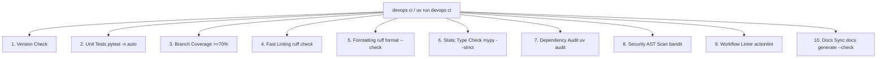

# Knowledge Base Task: Local CI Quality Gate & Validation

## 1. Overview & Purpose

The Local CI Quality Gate (`devops ci`) provides a comprehensive, 10-point local quality inspection suite that mirrors remote GitHub Actions CI checks. By executing tests, linting, formatting, strict static type checking, security scanning, dependency auditing, GitHub Actions workflow linting, and documentation synchronization locally, developers guarantee release readiness before pushing commits.

---

## 2. Architecture & The 10-Point Quality Gate



---

## 3. Useful Usage Information & Common Commands

### CI Commands
```bash
# Execute full 10-point quality gate
devops ci

# Execute with automatic fixes for linting and formatting
devops ci --fix

# Run targeted checks
devops ci test -v
devops ci lint
devops ci format
devops ci typecheck
devops ci security
devops ci docs
```

### Progressive Verification Strategy
During active development loops, run isolated, fast checks rather than the full suite:
```bash
# 1. Fast Lint Inspection
uv run ruff check path/to/file.py

# 2. Fast Strict Typecheck
uv run mypy path/to/file.py

# 3. Fast Targeted Unit Test
uv run pytest tests/test_feature.py

# 4. Final Comprehensive Milestone Gate
devops ci
```

---

## 4. Best Practice Guidance

1. **Fix Errors Progressively**: Resolve linting and formatting first, then type checking, then unit tests, and finally documentation sync.
2. **Synchronize Docs**: If the docs gate reports discrepancies, run `devops docs generate --sync-readme` to regenerate markdown reference files.
3. **Parallel Test Execution**: `devops ci test` automatically utilizes all available CPU cores via `pytest-xdist`.
4. **Pre-Commit Enforcement**: Pre-commit hooks run essential subsets of `devops ci` on `git commit`.

---

## 5. Security Recommendations & Zero-Trust Policies

- **Lockfile Enforcement**: CI validation verifies that `uv.lock` is clean, synchronized, and free of known vulnerability advisories.
- **Fail-Fast Policy**: Any failure in security scanning (`bandit`, `uv audit`) immediately aborts the CI pipeline.

---

## 6. General Standards & Reference Guidelines

- **Quality Threshold**: 100% pass requirement on all 10 gates before merging to release or main branches.
- **Coverage Floor**: Minimum 70% branch and line coverage enforced across `src/devops_cli/`.

---

## 7. Official References & Published Artifacts

- **DevOps CLI Repository**: [github.com/dan-petty/devops-cli](https://github.com/dan-petty/devops-cli)
- **CI Quality Gate Command**: [src/devops_cli/commands/ci.py](../../../../commands/ci.py)
- **GitHub Actions CI Workflow**: [.github/workflows/ci.yml](../../../../../../.github/workflows/ci.yml)
