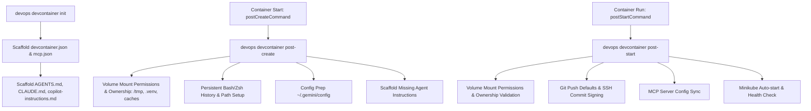

# Knowledge Base Task: DevContainer Lifecycle & Scaffolding

## 1. Overview & Purpose

DevContainer lifecycle automation in `devops-cli` standardizes the provisioning, configuration, and startup lifecycle of containerized development environments across single and multi-repo workspaces. It automates `.devcontainer/devcontainer.json` scaffolding, persistent shell histories, SSH commit signing configuration, Kubeconfig preparation, AI agent instruction synchronization (`AGENTS.md`), and FastMCP tool configuration.

---

## 2. Architecture & Container Lifecycle Hooks



- **Lifecycle Phases**:
  1. `init`: Scaffolds `.devcontainer/devcontainer.json`, `.vscode/mcp.json`, and agent instruction files.
  2. `post-create`: Pure Python setup of volume mount permissions (`/tmp` 1777, `.venv`/`.data`/caches user ownership), persistent bash/zsh history, environment paths, config directories, and agent instructions.
  3. `post-start`: Pure Python verification of volume mount permissions, Git defaults, SSH key commit signing, MCP server JSON synchronization, and Minikube auto-start.

---

## 3. Useful Usage Information & Common Commands

### DevContainer Lifecycle Commands
```bash
# Initialize a new DevContainer with AGENTS.md and MCP configuration
devops devcontainer init

# Execute post-create lifecycle tasks (history, path setup, agent files)
devops devcontainer post-create --workspace .

# Execute post-start lifecycle tasks (SSH, git, MCP sync, Minikube)
devops devcontainer post-start --workspace .

# Dry-run simulate lifecycle execution without modifying files
devops devcontainer post-start --dry-run
```

---

## 4. Best Practice Guidance

1. **Persistent History**: Mount host `.bash_history` and `.zsh_history` volumes to preserve developer command histories across container rebuilds.
2. **Pure Python Lifecycle**: Keep lifecycle scripts in pure Python (`_run_post_create_lifecycle`, `_run_post_start_lifecycle`) rather than brittle inline shell scripts.
3. **Idempotent Hooks**: Ensure all post-create and post-start hooks can execute repeatedly without generating duplicate configuration entries.
4. **Synchronize MCP Servers**: Automatically sync `.vscode/mcp.json` to `.gemini/config/mcp_config.json` during post-start to ensure AI agents have access to CLI tools.

---

## 5. Security Recommendations & Zero-Trust Policies

- **SSH Forwarding**: Mount host SSH agent sockets (`/ssh-agent` or SSH agent forwarding) rather than copying private key files into container filesystems.
- **Docker Socket Permissions**: Secure host `/var/run/docker.sock` mounts against unauthorized container breakouts.

---

## 6. General Standards & Reference Guidelines

- **Base Image**: `ghcr.io/dan-petty/devops-cli/devcontainer:latest`.
- **Configuration File**: `.devcontainer/devcontainer.json`.
- **Default User**: `vscode` (UID 1000).

---

## 7. Official References & Published Artifacts

- **DevContainer Specification**: [containers.dev](https://containers.dev/)
- **Published Container Package**: [`ghcr.io/dan-petty/devops-cli/devcontainer:latest`](https://github.com/dan-petty/devops-cli/pkgs/container/devops-cli%2Fdevcontainer)
- **DevContainer Command Module**: [src/devops_cli/commands/devcontainer.py](../../../../commands/devcontainer.py)
- **DevContainer Usage Guide**: [docs/commands/devcontainer.md](../../../../../../docs/commands/devcontainer.md)
