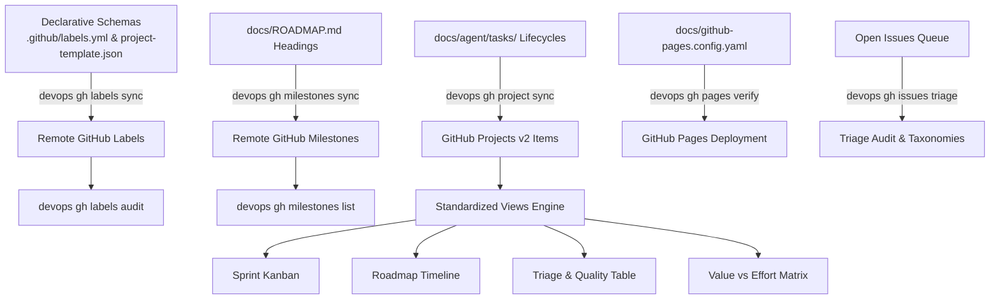

# Knowledge Base Task: GitHub Project Governance, Views, Milestones, Issues & Pages

## 1. Overview & Purpose

GitHub project governance in `devops-cli` standardizes repository metadata across six foundational pillars:
1. **GitHub Pages Publishing**: Inspection of deployment health, custom domain status, HTTPS enforcement, build history, manual build dispatching, and local Jekyll `docs/github-pages.config.yaml` / `docs/` readiness verification.
2. **GitHub Issues Lifecycle & Triage**: Issue creation, taxonomy label enforcement (`type/*`, `scope/*`, `priority/*`), milestone linkage, and proactive triage auditing to guarantee zero unclassified or unmilestoned open issues.
3. **GitHub Projects v2 Lifecycle**: Board creation, multi-board listing, card lifecycle reconciliation against `docs/agent/tasks/` (and `docs/agent/task.md`), and automated drift auditing against standardized template schemas.
4. **Standardized Projects v2 Views**: Continuous auditing and synchronization of the 4 canonical views (`Sprint Kanban`, `Roadmap Timeline`, `Triage & Quality Table`, and `Value vs Effort Priority Matrix`) ensuring full alignment across `https://github.com/dan-petty/devops-cli/projects` and `https://github.com/dan-petty/devops-cli/issues/views`.
5. **Roadmap Milestones**: Synchronized milestone lifecycle directly extracted from `docs/ROADMAP.md` release headings, providing issue completion ratios, health metrics, and automated milestone closure on release.
6. **Declarative Label Taxonomy & PR Auditing**: Repository label synchronization driven by `.github/labels.yml`, enforcing strict categorization across `type/*`, `scope/*`, `priority/*`, `status/*`, and `review/*`.

---

## 2. Architecture & Governance Lifecycle



### The 4 Standardized Projects v2 Views

| View Name | Layout | Group By | Purpose & Filtering |
| :--- | :--- | :--- | :--- |
| **Sprint Kanban** | Board | `Status` | Active sprint tracking (`Backlog`, `Ready`, `In Progress`, `In Review`, `Done`). Filtered to current milestone. |
| **Roadmap Timeline** | Roadmap | `Milestone` | Chronological release milestones with target delivery dates and status health. |
| **Triage & Quality Table** | Table | None | Priority-ordered queue (`P0` to `P3`) filtering open defects (`type/bug`, `status/blocked`, `status/triage`). |
| **Value vs Effort Priority Matrix** | Table | `Category` | Strategic portfolio matrix grouping deliverables into Quick Wins, Major Projects, Fill-Ins, and Foundation. |

---

## 3. Useful Usage Information & Common Commands

### GitHub Pages Commands
```bash
# Inspect GitHub Pages deployment status, URL, custom domain, and HTTPS enforcement
devops gh pages status

# View recent GitHub Pages build history and statuses
devops gh pages builds --limit 10

# Request a new GitHub Pages deployment build
devops gh pages build

# Verify local repository readiness (validates Jekyll docs/github-pages.config.yaml and docs/ directory)
devops gh pages verify
```

### Issue Management & Triage Commands
```bash
# List repository issues filtered by state, milestone, or label
devops gh issues list --state open --milestone v0.2.14 --limit 30

# Create a new issue linked to active milestone and taxonomy labels
devops gh issues create --title "feat(rag): vector index optimization" --milestone v0.2.14 --label "type/feature,scope/ai,priority/p1-high"

# Audit open issues for taxonomy compliance and milestone linkage
devops gh issues triage

# Display aggregated issue counts by priority, type, and milestone
devops gh issues status
```

### Project & Views Inspection Commands
```bash
# List available GitHub Projects v2 boards for user or organization
devops gh project list

# Display project template summary, custom fields, and views
devops gh project status

# Audit project board health and alignment against standardized template
devops gh project audit

# Synchronize task tracking item cards, provision fields, and link project
devops gh project sync

# Preview task item synchronization into project statuses
devops gh project sync --dry-run

# Link an existing project board to the repository
devops gh project link 1

# Inspect all 4 standardized project views in Rich table format
devops gh views list

# Audit remote project views against standardized view template specifications
devops gh views audit

# Output JSON specification for GitHub Projects v2 views
devops gh views spec
```

### Label & Milestone Management Commands
```bash
# List all labels defined in the remote repository
devops gh labels list

# Synchronize labels against declarative schema (.github/labels.yml)
devops gh labels sync

# Audit open pull requests for mandatory type/ and scope/ taxonomy labels
devops gh labels audit

# List release milestones and issue progress rates
devops gh milestones list

# Reconcile milestones with docs/ROADMAP.md
devops gh milestones sync

# Close a release milestone upon release merge or publish
devops gh milestones close v0.2.14
```

---

## 4. Best Practice Guidance

1. **GitHub Pages Deployment Readiness**:
   - Before requesting builds or pushing documentation releases, run `devops gh pages verify` to validate local Jekyll configuration files (`docs/github-pages.config.yaml` syntax, title, markdown engine) and confirm the `docs/` publishing root exists.
   - Verify that HTTPS is strictly enforced (`enforce_https: true`) and custom domains have valid SSL certificates via `devops gh pages status`.
2. **Issue Triage & Zero-Untracked Defect Policy**:
   - Every open issue must have at least one `type/*` label, at least one `scope/*` label, and an assigned `priority/*` label (`priority/p0-critical` through `priority/p3-low`).
   - Every feature or defect issue must link to the active release milestone (`--milestone "v<version>"`).
   - Regularly execute `devops gh issues triage` to catch issues missing labels or milestones.
3. **Mandatory GitHub Projects v2 Session Bootstrap & Task-to-Issue Grounding**:
   - At the beginning of every session or upon receiving any user task, AI agents must inspect board status via `devops gh project status` (or FastMCP `gh_project_status`) and triage health via `devops gh issues triage` (or FastMCP `gh_issue_triage`).
   - Ground every user task to a corresponding GitHub Issue and Project Item.
   - If an open issue exists: verify milestone and taxonomy labels, and transition its project card to `In Progress` prior to authoring code edits.
   - If no issue exists: immediately author a formal tracking issue (`gh issue create` or FastMCP `gh_issue_create`), apply declarative taxonomy labels (`type/*`, `scope/*`, `priority/*`, `status/in-progress`), link the active milestone, and synchronize into GitHub Projects v2 (`devops gh project sync` or FastMCP `gh_project_sync`).
4. **Projects v2 Board Linkage & Real-Time Card Lifecycle Transitions**:
   - Ensure the project board is linked to the repository via `devops gh project link <number>`, surfacing the project board under `https://github.com/dan-petty/devops-cli/projects` and its 4 canonical views under `https://github.com/dan-petty/devops-cli/issues/views`.
   - Maintain bidirectional synchronization between `docs/agent/tasks/` and GitHub Projects v2 across the 5 canonical lifecycle states:
     - `Backlog`: Queued deliverables and roadmap milestones awaiting assignment.
     - `Ready`: Scoped items with concrete acceptance criteria and tests designed.
     - `In Progress (WIP)`: Active implementation. **Move card to `In Progress` BEFORE making code edits in `src/`**.
     - `In Review`: Pull Request opened with automated review and CI checks running.
     - `Done`: PR squash-merged, remote CI checks green, and issue closed.
   - Run `devops gh project audit` and `devops gh views audit` to detect missing fields, invalid options, or misconfigured view filters.
5. **Data-Driven Custom Field Reconciliation (`devops gh project sync`)**:
   - Enforce enrichment of all 6 custom project fields (`Status`, `Milestone`, `Priority`, `Category`, `Value`, `Effort`) for every issue and PR card.
   - Reconcile project item custom fields using declarative taxonomy mappings (`infer_item_category_value_effort` mapping `type/*` and `priority/*` to strategic categories, business value, and engineering effort).
   - Run `devops gh project sync` (or FastMCP `gh_project_sync`) after creating issues, pushing branches, or opening PRs to keep project views fully updated.
6. **Active Milestone Resource Population & Zero-Empty Queue/Projects Policy**:
   - When initializing a new release branch or activating a milestone, AI agents must proactively author GitHub tracking issues for every planned deliverable in `docs/ROADMAP.md`.
   - The open issues queue (`https://github.com/dan-petty/devops-cli/issues?q=is%3Aissue+state%3Aopen`), projects tab (`https://github.com/dan-petty/devops-cli/projects`), and issue views (`https://github.com/dan-petty/devops-cli/issues/views`) must never be left empty during an active release cycle.
   - Each issue must follow Conventional Commits (`feat(<scope>): ...`), assign the milestone (`vX.Y.Z`), and include mandatory taxonomy labels (`type/*`, `scope/*`, `priority/*`).
7. **Strict Remote Branch Lifecycle & PR Governance**:
   - Every remote topic branch on `origin` must have an associated open PR targeting the active release branch or `main`.
   - Remote branches must be deleted immediately upon PR merge or supersession (`git push origin --delete <branch>` and `git fetch --prune origin`).
   - Orphan remote branches are strictly prohibited.
8. **Mandatory Defect & Incident Tracking on CLI Errors/Warnings**:
   - Whenever an AI agent or developer encounters an unhandled error, subcommand failure, crash, diagnostic warning, or unexpected behavior while executing `devops` CLI commands, they must immediately file a formal bug issue via `gh issue create` (using `.github/ISSUE_TEMPLATE/bug_report.yml`).
   - Title follows Conventional Commits: `fix(<scope>): <concise description>`.
   - Apply mandatory taxonomy labels: `type/bug`, appropriate `scope/*`, `priority/*`, and `status/triage` (or `status/in-progress`).
   - Link the active release milestone (`--milestone "v<version>"`).
   - Reconcile and synchronize the new issue into GitHub Projects v2 (`devops gh project sync` or FastMCP `gh_project_sync`) so that it appears in the *Triage & Quality Table*.

---

## 5. Security Recommendations & Zero-Trust Policies

- **Zero-Plaintext Credentials**: GitHub tokens must be retrieved from the OS Keyring (`github_token`) or environment variable (`GITHUB_TOKEN`), never hardcoded or logged.
- **Granular Token Scopes**:
  - Labels, Milestones, Issues, and Pages require standard `repo` scope.
  - Projects v2 mutations require `project` or `read:project` scopes. When scopes are restricted, `devops gh` falls back gracefully with clear instructions (`gh auth refresh -s project,read:project`) and preserves read-only/offline functionality.
- **Dry-Run Mode for Mutations**: Task items and project synchronization can be simulated without remote mutations using `--dry-run`.

---

## 6. FastMCP Tool & Dynamic Resource Integration

AI coding agents have native access to GitHub project management through 16 FastMCP tools and 4 dynamic system resources:

### Registered FastMCP Tools
- **Pages**: `gh_pages_status`, `gh_pages_build`, `gh_pages_verify`
- **Issues**: `gh_issue_list`, `gh_issue_create`, `gh_issue_triage`, `gh_issue_status`
- **Projects**: `gh_project_list`, `gh_project_status`, `gh_project_audit`, `gh_project_sync`
- **Views**: `gh_views_audit`, `gh_views_sync`, `gh_view_spec`
- **Milestones**: `gh_milestone_list`, `gh_milestone_sync`, `gh_milestone_close`
- **Labels**: `gh_label_list`, `gh_label_sync`

### Registered Dynamic System Resources
- `resource://gh/pages/status`: Real-time GitHub Pages publishing status and build health.
- `resource://gh/issues/status`: Live issue distribution across priorities, types, and milestones.
- `resource://gh/project/status`: GitHub Projects v2 board configuration and field definitions.
- `resource://gh/views/status`: Remote project views synchronization and schema audit status.

---

## 7. Official References & Published Artifacts

- **GitHub CLI Documentation**: [cli.github.com/manual](https://cli.github.com/manual)
- **GitHub Projects v2 API & Views**: [docs.github.com/en/issues/planning-and-tracking-with-projects](https://docs.github.com/en/issues/planning-and-tracking-with-projects)
- **GitHub Pages API**: [docs.github.com/en/rest/pages](https://docs.github.com/en/rest/pages)
- **DevOps CLI GitHub Subsystem**: [src/devops_cli/commands/gh.py](../../../../commands/gh.py)
- **GitHub Pages Engine**: [src/devops_cli/github/pages.py](../../../../github/pages.py)
- **GitHub Issues Engine**: [src/devops_cli/github/issues.py](../../../../github/issues.py)
- **Projects & Views Engine**: [src/devops_cli/github/projects.py](../../../../github/projects.py)
- **Milestone Engine**: [src/devops_cli/github/milestones.py](../../../../github/milestones.py)
- **Declarative Label Engine**: [src/devops_cli/github/labels.py](../../../../github/labels.py)
