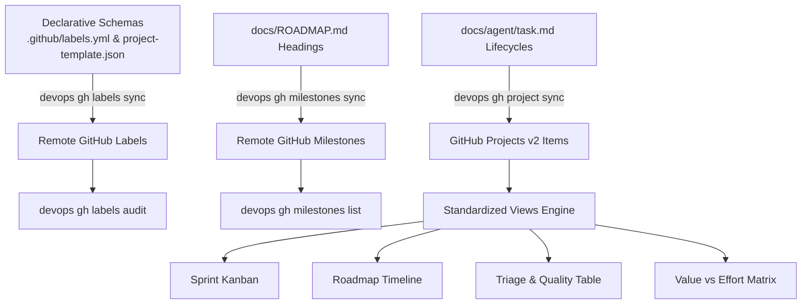

# Knowledge Base Task: GitHub Project Governance, Views, Milestones & Labels

## 1. Overview & Purpose

GitHub project governance in `devops-cli` standardizes repository metadata across four foundational pillars:
1. **GitHub Views & Projects v2**: Declarative workspace templates defining custom fields (`Status`, `Milestone`, `Priority`, `Category`, `Value`, `Effort`) and four standardized views for agile sprint execution, chronological roadmap tracking, defect triage, and portfolio prioritization.
2. **Roadmap Milestones**: Synchronized milestone lifecycle directly extracted from `docs/ROADMAP.md` release headings, providing issue completion ratios and health metrics.
3. **Declarative Label Taxonomy**: Repository label synchronization driven by `.github/labels.yml`, enforcing strict categorization across `type/*`, `scope/*`, `priority/*`, `status/*`, and `review/*`.
4. **Pull Request Quality Auditing**: Automated validation ensuring every active pull request possesses mandatory `type/*` and `scope/*` classification labels.

---

## 2. Architecture & Governance Lifecycle



### The 4 Standardized Projects v2 Views

| View Name | Layout | Group By | Purpose & Filtering |
| :--- | :--- | :--- | :--- |
| **Sprint Kanban** | Board | `Status` | Active sprint tracking (`Backlog`, `Ready`, `In Progress`, `In Review`, `Done`). Filtered to current milestone. |
| **Roadmap Timeline** | Roadmap | `Milestone` | Chronological release milestones with target delivery dates and status health. |
| **Triage & Quality Table** | Table | None | Priority-ordered queue (`P0` to `P3`) filtering open defects (`type/bug`, `status/blocked`, `status/triage`). |
| **Value vs Effort Priority Matrix** | Table | `Category` | Strategic portfolio matrix grouping deliverables into Quick Wins, Major Projects, Fill-Ins, and Foundation. |

---

## 3. Useful Usage Information & Common Commands

### Label Management Commands
```bash
# List all labels defined in the remote repository
devops gh labels list

# Preview reconciliation against .github/labels.yml without mutating remote state
devops gh labels sync --dry-run

# Synchronize labels against declarative schema
devops gh labels sync

# Audit open pull requests for mandatory type/ and scope/ taxonomy labels
devops gh labels audit
```

### Milestone Management Commands
```bash
# List release milestones and issue progress rates
devops gh milestones list

# Preview extraction and synchronization from docs/ROADMAP.md
devops gh milestones sync --dry-run

# Reconcile milestones with docs/ROADMAP.md
devops gh milestones sync

# Inspect health and completion metrics for a specific milestone
devops gh milestones status v0.2.11
```

### Project & Views Inspection Commands
```bash
# Display project template summary, custom fields, and views
devops gh project status

# Preview task.md item synchronization into project statuses
devops gh project sync --dry-run

# Inspect all 4 standardized project views in Rich table format
devops gh views list

# Output JSON specification for GitHub Projects v2 views
devops gh views spec
```

---

## 4. Best Practice Guidance

1. **Mandatory PR Taxonomy Labels**:
   - Every Pull Request must be labeled with at least one **type** (`type/feature`, `type/bug`, `type/refactor`, `type/docs`, `type/infra`, `type/test`, `type/security`, `type/chore`).
   - Every Pull Request must be labeled with at least one **scope** (`scope/ai`, `scope/k8s`, `scope/cli`, `scope/review`, `scope/config`, `scope/security`, `scope/infra`, `scope/docs`, `scope/test`).
2. **Roadmap-Driven Milestones**:
   - Milestones must originate from `docs/ROADMAP.md` chronological headings (e.g. `### Feature Topic (vX.Y.Z - Status)`).
   - Pull requests targeting a release branch must link to the corresponding milestone.
3. **Projects v2 Item State Transitions**:
   - When beginning a task: transition card from `Backlog` to `In Progress`.
   - When PR is submitted: transition card to `In Review`.
   - When PR is merged: transition card to `Done`.
4. **Use Dry-Run First**: Always run `devops gh labels sync --dry-run` and `devops gh milestones sync --dry-run` to preview reconciliations before applying changes.

---

## 5. Security Recommendations & Zero-Trust Policies

- **Zero-Plaintext Credentials**: GitHub tokens must be retrieved from the OS Keyring (`github_token`) or environment variable (`GITHUB_TOKEN`), never hardcoded or logged.
- **Granular Token Scopes**:
  - Labels and Milestones require `repo` scope.
  - Projects v2 mutations require `project` or `read:project` scopes. When scopes are restricted, `devops gh` falls back gracefully and preserves read-only/offline functionality.
- **Dry-Run Default for Project Sync**: All task item and project synchronization commands default to safe dry-runs.

---

## 6. General Standards & Reference Guidelines

- **Declarative Schema Canonical Paths**:
  - Labels: [`.github/labels.yml`](../../../../../../.github/labels.yml)
  - Project Template: [`.github/project-template.json`](../../../../../../.github/project-template.json)
- **FastMCP Tool Integration**: AI coding agents can interact with GitHub governance via MCP tools:
  - `gh_label_list`, `gh_label_sync`
  - `gh_milestone_list`, `gh_milestone_sync`
  - `gh_project_status`, `gh_view_spec`

---

## 7. Official References & Published Artifacts

- **GitHub CLI Documentation**: [cli.github.com/manual](https://cli.github.com/manual)
- **GitHub Projects v2 API & Views**: [docs.github.com/en/issues/planning-and-tracking-with-projects](https://docs.github.com/en/issues/planning-and-tracking-with-projects)
- **DevOps CLI GitHub Subsystem**: [src/devops_cli/commands/gh.py](../../../../commands/gh.py)
- **Declarative Label Engine**: [src/devops_cli/github/labels.py](../../../../github/labels.py)
- **Milestone Engine**: [src/devops_cli/github/milestones.py](../../../../github/milestones.py)
- **Projects & Views Engine**: [src/devops_cli/github/projects.py](../../../../github/projects.py)
