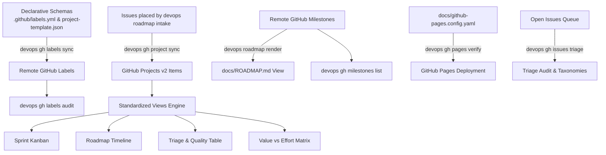

# Knowledge Base Task: GitHub Project Governance, Views, Milestones, Issues & Pages

## 1. Overview & Purpose

GitHub project governance in `devops-cli` standardizes repository metadata across six foundational pillars:
1. **GitHub Pages Publishing**: Inspection of deployment health, custom domain status, HTTPS enforcement, build history, manual build dispatching, and local Jekyll `docs/github-pages.config.yaml` / `docs/` readiness verification.
2. **GitHub Issues Lifecycle & Triage**: Intake (`devops roadmap intake`), the one way new work becomes an item, taxonomy label enforcement (`type/*`, `scope/*`, `priority/*`), and proactive triage auditing to guarantee zero unclassified open issues; a backlog item has no milestone.
3. **GitHub Projects v2 Lifecycle**: Board creation, multi-board listing, reconciliation of Status and Priority on the board's cards from issue and pull request state and labels, and automated drift auditing against standardized template schemas.
4. **Standardized Projects v2 Views**: Continuous auditing and synchronization of the 4 canonical views (`Sprint Kanban`, `Roadmap Timeline`, `Triage & Quality Table`, and `Value vs Effort Priority Matrix`) ensuring full alignment across `https://github.com/dan-petty/devops-cli/projects` and `https://github.com/dan-petty/devops-cli/issues/views`.
5. **Roadmap Milestones**: GitHub is the roadmap's source of truth (ADR 0001): milestones are its releases, with issue completion ratios, health metrics and milestone closure on release. `devops roadmap render` writes `docs/ROADMAP.md` from them.
6. **Declarative Label Taxonomy & PR Auditing**: Repository label synchronization driven by `.github/labels.yml`, enforcing strict categorization across `type/*`, `scope/*`, `priority/*`, `status/*`, and `review/*`.

---

## 2. Architecture & Governance Lifecycle


```mermaid
graph TD
    A[Declarative Schemas<br/>.github/labels.yml & project-template.json] -->|devops gh labels sync| B[Remote GitHub Labels]
    D[Remote GitHub Milestones] -->|devops roadmap render| C[docs/ROADMAP.md View]
    E[Issues placed by devops roadmap intake] -->|devops gh project sync| F[GitHub Projects v2 Items]
    G[docs/github-pages.config.yaml] -->|devops gh pages verify| H[GitHub Pages Deployment]
    I[Open Issues Queue] -->|devops gh issues triage| J[Triage Audit & Taxonomies]
    B --> K[devops gh labels audit]
    D --> L[devops gh milestones list]
    F --> M[Standardized Views Engine]
    M --> N[Sprint Kanban]
    M --> O[Roadmap Timeline]
    M --> P[Triage & Quality Table]
    M --> Q[Value vs Effort Matrix]
```

### The 4 Standardized Projects v2 Views

| View Name | Layout | Group By | Purpose & Filtering |
| :--- | :--- | :--- | :--- |
| **Sprint Kanban** | Board | `Status` | Active sprint tracking (`New`, `Ready`, `In Progress`, `In Review`, `Done`, `Blocked`). Filtered to current milestone. |
| **Roadmap Timeline** | Roadmap | `Milestone` | Chronological release milestones with target delivery dates and status health. |
| **Triage & Quality Table** | Table | None | Priority-ordered queue (`P0` to `P3`) filtering open defects (`type/bug`, `status/blocked`, `status/triage`). |
| **Value vs Effort Priority Matrix** | Table | `Value` | Items grouped by Value and sorted by Value, then Effort. |

---

## 3. Useful Usage Information & Common Commands

### GitHub Pages Commands
```bash
# Inspect GitHub Pages deployment status, URL, custom domain, and HTTPS enforcement
devops gh pages status

# View recent GitHub Pages build history and statuses
devops gh pages builds --limit 10

# Request a new GitHub Pages deployment build
devops gh pages build

# Verify local repository readiness (validates Jekyll docs/github-pages.config.yaml and docs/ directory)
devops gh pages verify
```

### Issue Management & Triage Commands
```bash
# List repository issues filtered by state, milestone, or label
devops gh issues list --state open --milestone v0.2.14 --limit 30

# Preview a candidate: --plan reads GitHub and calls the model and writes nothing; --dry-run makes no request; --confirm files it
devops roadmap intake --title "feat(rag): vector index optimization" --body-file candidate.md --plan

# Audit open issues for taxonomy compliance; issues not on the board are reported as awaiting intake
devops gh issues triage

# Display aggregated issue counts by priority, type, and milestone
devops gh issues status
```

### Project & Views Inspection Commands
```bash
# List available GitHub Projects v2 boards for user or organization
devops gh project list

# Display project template summary, custom fields, and views
devops gh project status

# Audit project board health and alignment against standardized template
devops gh project audit

# Provision fields, link the board, and reconcile Status and Priority on its cards (adds no card)
devops gh project sync

# Describe a sync without making any request
devops gh project sync --dry-run

# List the Status and Priority changes reconcile would make, making none
devops gh project reconcile --plan

# Link an existing project board to the repository
devops gh project link 1

# Inspect all 4 standardized project views in Rich table format
devops gh views list

# Audit remote project views against standardized view template specifications
devops gh views audit

# Output JSON specification for GitHub Projects v2 views
devops gh views spec
```

### Label & Milestone Management Commands
```bash
# List all labels defined in the remote repository
devops gh labels list

# Synchronize labels against declarative schema (.github/labels.yml)
devops gh labels sync

# Audit open pull requests for mandatory type/ and scope/ taxonomy labels
devops gh labels audit

# List release milestones and issue progress rates
devops gh milestones list

# Regenerate docs/ROADMAP.md from the milestones, issues and board (at the release cut)
devops roadmap render --ref release/v0.2.25

# List the requests a reprioritize run makes, making none (--dry-run); preview its admission,
# size limit, descoping and stall decisions, reading GitHub (--plan); then make them
devops roadmap reprioritize --dry-run
devops roadmap reprioritize --plan
devops roadmap reprioritize --confirm

# Close a release milestone upon release merge or publish
devops gh milestones close v0.2.14
```

---

## 4. Best Practice Guidance

1. **GitHub Pages Deployment Readiness**:
   - Before requesting builds or pushing documentation releases, run `devops gh pages verify` to validate local Jekyll configuration files (`docs/github-pages.config.yaml` syntax, title, markdown engine) and confirm the `docs/` publishing root exists.
   - Verify that HTTPS is strictly enforced (`enforce_https: true`) and custom domains have valid SSL certificates via `devops gh pages status`.
2. **Issue Triage & Zero-Untracked Defect Policy**:
   - Every open issue must have at least one `type/*` label, at least one `scope/*` label, and an assigned `priority/*` label (`priority/p0-critical` through `priority/p3-low`).
   - New feature or defect issues enter through intake (`devops roadmap intake --title … --body-file … --confirm`), which sets their Priority and place; nobody sets a milestone or priority on a new issue by hand.
   - Regularly execute `devops gh issues triage` to catch issues missing labels, and `devops roadmap intake` for those awaiting intake.
3. **Mandatory GitHub Projects v2 Session Bootstrap & Task-to-Issue Grounding**:
   - At the beginning of every session or upon receiving any user task, AI agents must inspect board status via `devops gh project status` (or FastMCP `gh_project_status`) and triage health via `devops gh issues triage` (or FastMCP `gh_issue_triage`).
   - Ground every user task to a corresponding GitHub Issue and Project Item.
   - If an open issue exists: verify milestone and taxonomy labels, and transition its project card to `In Progress` prior to authoring code edits.
    - Without a matching issue: file the task as a candidate with `devops roadmap intake --title … --body-file … --confirm` (or FastMCP `roadmap_intake` with `mode="confirm"`); intake files it unless it is a duplicate and gives it its type, Priority, Value, Effort and place.
4. **Projects v2 Board Linkage & Real-Time Card Lifecycle Transitions**:
   - Ensure the project board is linked to the repository via `devops gh project link <number>`, surfacing the project board under `https://github.com/dan-petty/devops-cli/projects` and its 4 canonical views under `https://github.com/dan-petty/devops-cli/issues/views`.
   - Keep each task file in `docs/agent/tasks/` and its issue's card in step across the 5 canonical lifecycle states; sync reads no task file, and the card's `In Review` comes from GitHub:
     - `Backlog`: Queued deliverables and roadmap milestones awaiting assignment.
     - `Ready`: Scoped items with concrete acceptance criteria and tests designed.
     - `In Progress (WIP)`: Active implementation. **Move card to `In Progress` BEFORE making code edits in `src/`**.
     - `In Review`: Pull Request opened with automated review and CI checks running.
     - `Done`: PR squash-merged, remote CI checks green, and issue closed.
   - Run `devops gh project audit` and `devops gh views audit` to detect missing fields, invalid options, or misconfigured view filters.
5. **Custom Field Reconciliation (`devops gh project sync`, `devops gh project reconcile`)**:
   - The board owns Status: reconcile sets it only when it is unset (from an exact `status/*` label, otherwise New) or when issue or pull request state forces Done, In Review or In Progress, so manual triage is never reverted.
   - Priority fills an unset field from its `priority/*` label. The board mirrors the issue's milestone itself, so reconcile never writes it, and Value and Effort are never inferred; they stay as set by hand.
   - Reconcile and sync add no card: `devops roadmap intake` places issues, and a pull request gets no card, its progress showing on its issue's card.
   - `devops gh project reconcile --plan` lists every change with its old and new value and the source that decided it; `--dry-run` makes no request and lists the requests a run makes. A planned value the board's field has no option for is refused before any write, naming the value and the options. A run that stops early (mutation budget, GraphQL quota or a failed write) says why and how many planned changes remain, and exits 1; running it again continues from there, after the reset for a quota stop and once the cause is fixed for a failed write.
   - Run `devops gh project sync` (or FastMCP `gh_project_sync`) after creating issues, pushing branches, or opening PRs to keep the cards' fields up to date.
6. **Active Milestone Resource Population & Zero-Empty Queue/Projects Policy**:
   - When initializing a new release branch or activating a milestone, AI agents must proactively author GitHub tracking issues for every planned deliverable in `docs/ROADMAP.md`.
   - The open issues queue (`https://github.com/dan-petty/devops-cli/issues?q=is%3Aissue+state%3Aopen`), projects tab (`https://github.com/dan-petty/devops-cli/projects`), and issue views (`https://github.com/dan-petty/devops-cli/issues/views`) must never be left empty during an active release cycle.
   - Each issue must follow Conventional Commits (`feat(<scope>): ...`), assign the milestone (`vX.Y.Z`), and include mandatory taxonomy labels (`type/*`, `scope/*`, `priority/*`).
7. **Strict Remote Branch Lifecycle & PR Governance**:
   - **Sequential PR Processing (Oldest to Newest / FIFO)**: When multiple open PRs exist across the repository or targeting an active release branch, AI agents MUST process and shepherd PRs in strict chronological order from oldest to newest (FIFO queue: lowest PR number / earliest creation date first). Remediating review comments, fixing CI checks, resolving merge conflicts, and verifying merge readiness on older PRs strictly takes precedence over newer PRs.
   - Every remote topic branch on `origin` must have an associated open PR targeting the active release branch or `main`.
   - Remote branches must be deleted immediately upon PR merge or supersession (`git push origin --delete <branch>` and `git fetch --prune origin`).
   - Orphan remote branches are strictly prohibited.
8. **Mandatory Defect & Incident Tracking on CLI Errors/Warnings**:
   - Whenever an AI agent or developer encounters an unhandled error, subcommand failure, crash, diagnostic warning, or unexpected behavior while executing `devops` CLI commands, they must immediately file it as a candidate with `devops roadmap intake --title … --body-file … --confirm`, written in the shape of `.github/ISSUE_TEMPLATE/bug_report.yml`.
   - Title follows Conventional Commits: `fix(<scope>): <concise description>`. Cite the commit that introduced a regression, or the failed Actions run, so intake can verify it.
   - Intake gives it its type (`type/bug`), puts it on the board with its Priority, and places a verified critical fix in the release the admission rule allows, so it appears in the *Triage & Quality Table*. Set no milestone or priority by hand.

---

## 5. Security Recommendations & Zero-Trust Policies

- **Zero-Plaintext Credentials**: The GitHub token is gh's own login, which `gh auth token` returns once per process (`GH_TOKEN` overrides it); devops-cli keeps no copy, and never hardcodes or logs it.
- **Granular Token Scopes**:
  - Labels, Milestones, Issues, and Pages require standard `repo` scope.
  - Projects v2 mutations require `project` or `read:project` scopes. When scopes are restricted, `devops gh` falls back gracefully with clear instructions (`gh auth refresh -s project,read:project`) and preserves read-only/offline functionality.
- **Dry-Run Mode for Mutations**: `devops gh project sync --dry-run` and `devops gh project reconcile --dry-run` make no request at all; `reconcile --plan` reads, and writes nothing.

---

## 6. FastMCP Tool & Dynamic Resource Integration

AI coding agents have native access to GitHub project management through the FastMCP `gh_*` tools (including those listed below) and the server's resources:

### Registered FastMCP Tools
- **Pages**: `gh_pages_status`, `gh_pages_build`, `gh_pages_verify`
- **Issues**: `gh_issue_list`, `gh_issue_create`, `gh_issue_triage`, `gh_issue_status`
- **Projects**: `gh_project_list`, `gh_project_status`, `gh_project_audit`, `gh_project_sync`, `gh_project_reconcile` (`mode="plan"` by default; `"write"` makes the changes and `"dry-run"` makes no request)
- **Views**: `gh_views_audit`, `gh_views_sync`, `gh_view_spec`
- **Milestones**: `gh_milestone_list`, `gh_milestone_close`
- **Roadmap**: `roadmap_render` (`mode="plan"` by default; `"write"` writes the file), `roadmap_migrate` (preview only), `roadmap_close` (preview only), `roadmap_reprioritize` (`"confirm"` writes) and `roadmap_intake` (`"confirm"` writes): each takes a `mode` whose default, `"plan"`, reads GitHub and writes nothing, and whose `"dry-run"` makes no request
- **Labels**: `gh_label_list`, `gh_label_sync`

### Registered Dynamic System Resources
- `resource://gh/pages/status`: Real-time GitHub Pages publishing status and build health.
- `resource://gh/issues/status`: Live issue distribution across priorities, types, and milestones.
- `resource://gh/project/status`: GitHub Projects v2 board configuration and field definitions.
- `resource://gh/views/status`: Remote project views synchronization and schema audit status.

---

## 7. Official References & Published Artifacts

- **GitHub CLI Documentation**: [cli.github.com/manual](https://cli.github.com/manual)
- **GitHub Projects v2 API & Views**: [docs.github.com/en/issues/planning-and-tracking-with-projects](https://docs.github.com/en/issues/planning-and-tracking-with-projects)
- **GitHub Pages API**: [docs.github.com/en/rest/pages](https://docs.github.com/en/rest/pages)
- **DevOps CLI GitHub Subsystem**: [src/devops_cli/commands/gh.py](../../../../commands/gh.py)
- **GitHub Pages Engine**: [src/devops_cli/github/pages.py](../../../../github/pages.py)
- **GitHub Issues Engine**: [src/devops_cli/github/issues.py](../../../../github/issues.py)
- **Projects & Views Engine**: [src/devops_cli/github/projects.py](../../../../github/projects.py)
- **Milestone Engine**: [src/devops_cli/github/milestones.py](../../../../github/milestones.py)
- **Declarative Label Engine**: [src/devops_cli/github/labels.py](../../../../github/labels.py)
