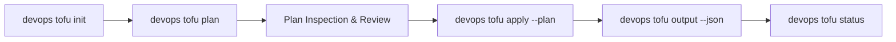

# Knowledge Base Task: Infrastructure Provisioning with OpenTofu & Terraform

## 1. Overview & Purpose

Infrastructure provisioning in `devops-cli` standardizes declarative cloud infrastructure management across AWS, GCP, Azure, and Kubernetes using OpenTofu and Terraform. The CLI provides a reliable, safe pipeline for initialization, plan generation, variable injection, state inspection, and execution auditing.

---

## 2. Architecture & Provisioning Workflow



- **Execution Engine**: Supports `devops tofu` and `devops tf` with automatic binary detection.
- **Path Resolution**: Enforces structured directories under `tf/<provider>/` (e.g. `tf/aws`, `tf/k8s`).
- **Telemetry Integration**: Emits OpenTelemetry trace spans with execution duration, resource changes count, and provider metadata.

---

## 3. Useful Usage Information & Common Commands

### Provisioning Pipeline Commands
```bash
# 1. Initialize OpenTofu working directory and download providers
devops tofu init --path tf/aws

# 2. Generate and save execution plan
devops tofu plan --path tf/aws -v tf/environments/dev.tfvars -o dev.tfplan

# 3. Apply the generated plan file
devops tofu apply --path tf/aws --plan dev.tfplan

# 4. View structured JSON output attributes
devops tofu output --path tf/aws --json

# 5. Check state file status and provider initialization
devops tofu status --path tf/aws
```

---

## 4. Best Practice Guidance

1. **Always Use Plan Files**: Never run `devops tofu apply` without a pre-computed `.tfplan` file in production workflows.
2. **Provider Caching**: Enable OpenTofu provider caching (`plugin_cache_dir = "$HOME/.terraform.d/plugin-cache"`) in developer workstations to avoid repeated downloads.
3. **Format All HCL**: Run `tofu fmt -recursive` across all `.tf` files (enforced by `devops ci`).
4. **Environment Separation**: Maintain separate variable files (`dev.tfvars`, `staging.tfvars`, `prod.tfvars`) and separate state keys for each environment.

---

## 5. Security Recommendations & Zero-Trust Policies

- **Never Commit State Files**: Ensure `.tfstate`, `.tfstate.backup`, and `.tfvars` containing secrets are strictly included in `.gitignore`.
- **Sensitive Output Redaction**: Mark outputs containing passwords or keys with `sensitive = true`.
- **Pre-Apply Security Scans**: Run Trivy (`trivy config tf/`) to detect insecure security group rules, public S3 buckets, and unencrypted volumes before applying.

---

## 6. General Standards & Reference Guidelines

- **File Layout**:
  ```text
  tf/
  ├── aws/
  │   ├── main.tf
  │   ├── variables.tf
  │   ├── outputs.tf
  │   └── versions.tf
  └── environments/
      ├── dev.tfvars
      └── prod.tfvars
  ```
- **HCL Syntax**: Use HCL2 declarative syntax with explicit type constraints for all variables (`type = string`, `type = list(string)`).

---

## 7. Official References & Published Artifacts

- **OpenTofu Project**: [opentofu.org](https://opentofu.org/) | [github.com/opentofu/opentofu](https://github.com/opentofu/opentofu)
- **OpenTofu Provider Registry**: [search.opentofu.org](https://search.opentofu.org/)
- **Terraform Registry**: [registry.terraform.io](https://registry.terraform.io/)
- **DevOps CLI IaC Engine**: [src/devops_cli/commands/tf.py](../../../commands/tf.py)
