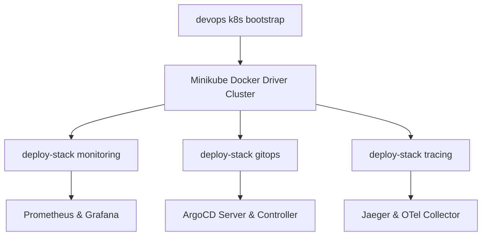

# Knowledge Base Task: Local Kubernetes Stack Deployment & Teardown

## 1. Overview & Purpose

Local Kubernetes stack automation in `devops-cli` allows developers to bootstrap, configure, deploy, and teardown complete cloud-native infrastructure stacks on local Minikube clusters with a single command. Supported stacks include Prometheus metrics collection, Grafana dashboards, ArgoCD GitOps reconciliation, Jaeger distributed tracing, and OpenTelemetry collectors.

---

## 2. Architecture & Stack Definitions



- **Stack Metadata**:
  - `monitoring`: Prometheus Community chart (`kube-prometheus`) + Grafana dashboards in `monitoring` namespace.
  - `gitops`: ArgoCD server, controller, and repo server in `argocd` namespace.
  - `tracing`: Jaeger distributed tracing query & collector in `otel` namespace.
  - `otel`: OpenTelemetry Collector DaemonSet/Deployment and Jaeger in `otel` namespace.
  - `llm`: Local LLM stack (Ollama DaemonSet, Open-WebUI, Qdrant Vector DB, Valkey Cache) in `llm` namespace.
  - `all`: Bootstraps all stacks (`monitoring`, `gitops`, `otel`, `llm`) with automatic port-forwarding and service URL target detection.

---

## 3. Useful Usage Information & Common Commands

### Stack Deployment Commands
```bash
# 1. Bootstrap local Minikube cluster with GPU passthrough
devops k8s bootstrap

# 2. Deploy complete monitoring and observability stack
devops k8s deploy-stack monitoring

# 3. Deploy GitOps continuous delivery stack (ArgoCD)
devops k8s deploy-stack gitops

# 4. Deploy local LLM stack (Ollama, Open-WebUI, Qdrant, Valkey)
devops k8s deploy-stack llm

# 5. Deploy OpenTelemetry & Jaeger distributed tracing stack
devops k8s deploy-stack otel

# 6. Deploy all stacks simultaneously with automatic port-forwarding
devops k8s deploy-stack all

# 7. Check deployed pod health across all namespaces
devops k8s pods --all-namespaces

# 8. Teardown stack cleanly
devops k8s teardown-stack llm
```

---

## 4. Best Practice Guidance

1. **Sequential Bootstrap**: Ensure `devops k8s bootstrap` completes and all nodes report `Ready` before launching stack deployments.
2. **Resource Allocation**: Ensure Minikube has sufficient CPU/memory (`--cpus=4 --memory=8192` or GPU node) when running multiple concurrent stacks.
3. **Idempotent Deployments**: `deploy-stack` uses `helm upgrade --install --atomic` so commands can be safely re-run without causing resource conflicts.
4. **Clean Teardown**: Run `teardown-stack` before deleting clusters to allow Helm hooks and finalizers to release external resources cleanly.
5. **Multi-Namespace Root Kustomization**: The root `k8s/kustomization.yaml` coordinates child namespaces without setting a single top-level `namespace:` override.

---

## 5. Security Recommendations & Zero-Trust Policies

- **Namespace Segregation**: Keep controllers isolated in dedicated namespaces (`monitoring`, `argocd`, `otel`, `llm`).
- **Workstation vs. Production Dual-Mode Guidance**:
  - Local workstation manifests use NodePort (`31434`), hostPort, and `IfNotPresent` pull policies for offline testing.
  - Production deployments must transition to `ClusterIP`, ingress controllers with TLS certificates, non-root users, read-only root filesystems, and strict NetworkPolicies.
- **Initial Credentials**: Extract and securely store the ArgoCD initial admin secret, then rotate it immediately:
  ```bash
  kubectl get secret -n argocd argocd-initial-admin-secret -o jsonpath='{.data.password}' | base64 -d
  ```

---

## 6. General Standards & Reference Guidelines

- **Port Forward Target Mapping**:
  - ArgoCD UI: `http://localhost:8080` (namespace: `argocd`)
  - Grafana Dashboards: `http://localhost:8030` (namespace: `monitoring`)
  - Prometheus Query: `http://localhost:8090` (namespace: `monitoring`)
  - Jaeger Query UI: `http://localhost:16686` (namespace: `otel`)
  - OTLP Traces: `localhost:4317` (gRPC) / `localhost:4318` (HTTP)
  - Ollama Inference: `http://localhost:11434` (namespace: `llm`)
  - Open-WebUI: `http://localhost:3000` (namespace: `llm`)
  - Qdrant Vector DB: `http://localhost:6333` (HTTP) / `:6334` (gRPC)
  - Valkey Cache: `localhost:6379` (namespace: `llm`)

---

## 7. Official References & Published Artifacts

- **Prometheus Community Charts**: [github.com/prometheus-community/helm-charts](https://github.com/prometheus-community/helm-charts)
- **Grafana Community Charts**: [github.com/grafana/helm-charts](https://github.com/grafana/helm-charts)
- **ArgoCD Official Charts**: [github.com/argoproj/argo-helm](https://github.com/argoproj/argo-helm)
- **Jaeger Operator Charts**: [github.com/jaegertracing/helm-charts](https://github.com/jaegertracing/helm-charts)
- **Qdrant Helm Charts**: [github.com/qdrant/qdrant-helm](https://github.com/qdrant/qdrant-helm)
- **Open-WebUI Helm Charts**: [github.com/open-webui/helm-charts](https://github.com/open-webui/helm-charts)
- **DevOps CLI Kubernetes Module**: [src/devops_cli/commands/k8s/](../../../../commands/k8s/)
