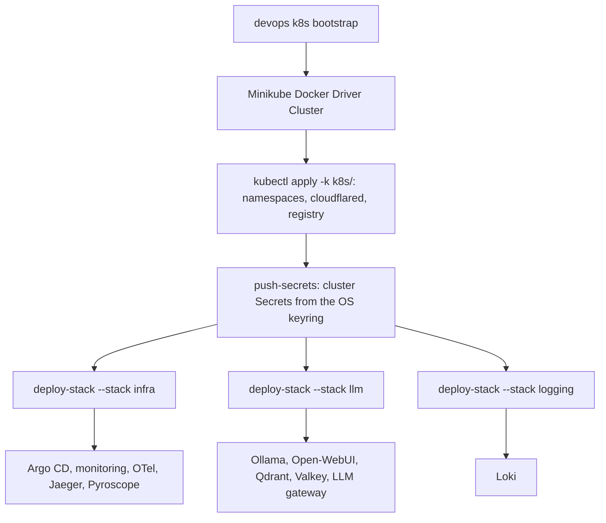

# Knowledge Base Task: Local Kubernetes Stack Deployment & Teardown

## 1. Overview & Purpose

Local Kubernetes stack automation in `devops-cli` allows developers to bootstrap, configure, deploy, and teardown complete cloud-native infrastructure stacks on local Minikube clusters with a single command. Supported stacks include Prometheus metrics collection, Grafana dashboards, ArgoCD GitOps reconciliation, Jaeger distributed tracing, OpenTelemetry collectors, the local LLM stack and centralized logging.

---

## 2. Architecture & Stack Definitions


```mermaid
graph TD
    A[devops k8s bootstrap] --> B[Minikube Docker Driver Cluster]
    B --> N[kubectl apply -k k8s/: namespaces, cloudflared, registry]
    N --> S[push-secrets: cluster Secrets from the OS keyring]
    S --> C[deploy-stack --stack infra]
    S --> D[deploy-stack --stack llm]
    S --> E[deploy-stack --stack logging]
    C --> F[Argo CD, monitoring, OTel, Jaeger, Pyroscope]
    D --> G[Ollama, Open-WebUI, Qdrant, Valkey, LLM gateway]
    E --> H[Loki]
```

- **Stack Metadata**:
  - `infra`: Argo CD in `argocd`; Grafana Kubernetes Monitoring (`k8s-monitoring`), Prometheus, Grafana, dcgm-exporter and Pyroscope in `monitoring`; the OpenTelemetry Collector and Jaeger in `otel`.
  - `llm`: Local LLM stack (Ollama, Open-WebUI, Qdrant Vector DB, Valkey Cache, LiteLLM gateway) in `llm` namespace.
  - `logging`: Loki in `logging` namespace.
  - `all`: `infra`, `llm` and `logging`.
- **Cluster Secrets**: right after the namespaces, `deploy-stack` pushes every Secret its stacks read from the OS keyring (`devops k8s push-secrets`, workstation keyring → cluster), so the keyring must be unlocked (`devops devcontainer unlock-keyring`). `--no-push-secrets` skips the push on a cluster without a keyring.

---

## 3. Useful Usage Information & Common Commands

### Stack Deployment Commands
```bash
# 1. Inspect available contexts and switch to target cluster
devops k8s contexts
devops k8s switch-context docker-desktop  # Target Docker Desktop
# Or switch to Minikube (autostarts cluster if stopped)
devops k8s switch-context minikube

# 2. Bootstrap local Minikube cluster explicitly with GPU passthrough
devops k8s bootstrap

# 3. Deploy the infrastructure stack (Argo CD, monitoring, OpenTelemetry & Jaeger)
devops k8s deploy-stack --stack infra

# 4. Deploy local LLM stack (Ollama, Open-WebUI, Qdrant, Valkey, gateway)
devops k8s deploy-stack --stack llm

# 5. Preview a deploy: releases, manifests, and the Secrets it pushes (key names only)
devops k8s deploy-stack --stack all --dry-run

# 6. Write or check the cluster Secrets from the keyring alone
devops k8s push-secrets --dry-run    # no request: the requests a push would make, in order
devops k8s push-secrets --plan       # reads the keyring, gh and the cluster: each key's state
devops k8s push-secrets --only llm/qdrant-api-key

# 7. Run one devops command as a Job in the cluster (after `devops k8s deploy-stack --stack devops`)
devops k8s run-job -- ai gateway status --format json

# 8. Check deployed pod health across all namespaces
devops k8s pods --all-namespaces

# 9. Teardown stack cleanly
devops k8s teardown-stack --stack llm
```

---

## 4. Best Practice Guidance

1. **Sequential Bootstrap**: Ensure `devops k8s bootstrap` completes and all nodes report `Ready` before launching stack deployments.
2. **Resource Allocation**: Ensure Minikube has sufficient CPU/memory (`--cpus=4 --memory=8192` or GPU node) when running multiple concurrent stacks.
3. **Idempotent Deployments**: `deploy-stack` uses `helm upgrade --install --wait --timeout <t>` (plus `--force-conflicts` on Helm 4) and recovers stuck releases, so it can be re-run safely.
4. **Clean Teardown**: Run `teardown-stack` before deleting clusters to allow Helm hooks and finalizers to release external resources cleanly.
5. **Multi-Namespace Root Kustomization**: The root `k8s/kustomization.yaml` coordinates child namespaces without setting a single top-level `namespace:` override.
6. **Cluster Target Verification**: Run `devops k8s contexts` or `devops k8s status` before executing `deploy-stack` to ensure workloads are deployed to the intended cluster context (e.g. Minikube vs. Docker Desktop vs. Cloud EKS).

---

## 5. Security Recommendations & Zero-Trust Policies

- **Namespace Segregation**: Keep controllers isolated in dedicated namespaces (`monitoring`, `argocd`, `otel`, `llm`).
- **Workstation vs. Production Dual-Mode Guidance**:
  - Local workstation manifests use NodePort (e.g. registry `30500`), hostPort, and `IfNotPresent` pull policies for offline testing.
  - Production deployments must transition to `ClusterIP`, ingress controllers with TLS certificates, non-root users, read-only root filesystems, and strict NetworkPolicies.
- **Cluster Secrets from the Keyring**: Never create Secrets with `kubectl create secret --from-literal`, which puts the value in the process list and shell history. `devops k8s push-secrets` server-side applies them from stdin, and `devops config set cloudflare.tunnel_token` stores a typed value at a hidden prompt.
- **Initial Credentials**: Extract and securely store the ArgoCD initial admin secret, then rotate it immediately:
  ```bash
  kubectl get secret -n argocd argocd-initial-admin-secret -o jsonpath='{.data.password}' | base64 -d
  ```

---

## 6. General Standards & Reference Guidelines

- **Port Forward Target Mapping**:
  - ArgoCD UI: `http://localhost:8080` (namespace: `argocd`)
  - Grafana Dashboards: `http://localhost:8030` (namespace: `monitoring`)
  - Prometheus Query: `http://localhost:8090` (namespace: `monitoring`)
  - Jaeger Query UI: `http://localhost:16686` (namespace: `otel`)
  - OTLP Traces: `localhost:4317` (gRPC) / `localhost:4318` (HTTP)
  - Ollama Inference: `http://localhost:11434` (namespace: `llm`)
  - Open-WebUI: `http://localhost:3000` (namespace: `llm`)
  - Qdrant Vector DB: `http://localhost:6333` (HTTP) / `:6334` (gRPC)
  - Valkey Cache: `localhost:6379` (namespace: `llm`)

---

## 7. Official References & Published Artifacts

- **Prometheus Community Charts**: [github.com/prometheus-community/helm-charts](https://github.com/prometheus-community/helm-charts)
- **Grafana Community Charts**: [github.com/grafana/helm-charts](https://github.com/grafana/helm-charts)
- **ArgoCD Official Charts**: [github.com/argoproj/argo-helm](https://github.com/argoproj/argo-helm)
- **Jaeger Operator Charts**: [github.com/jaegertracing/helm-charts](https://github.com/jaegertracing/helm-charts)
- **Qdrant Helm Charts**: [github.com/qdrant/qdrant-helm](https://github.com/qdrant/qdrant-helm)
- **Open-WebUI Helm Charts**: [github.com/open-webui/helm-charts](https://github.com/open-webui/helm-charts)
- **DevOps CLI Kubernetes Module**: [src/devops_cli/commands/k8s/](../../../../commands/k8s/)
