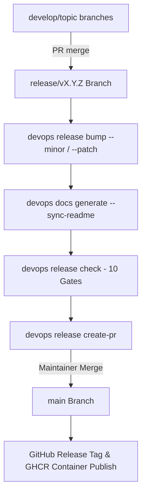

# Knowledge Base Task: Release Management & SemVer Lifecycle

## 1. Overview & Purpose

Release management in `devops-cli` standardizes semantic versioning (SemVer), release branch workflows, changelog generation, release verification quality gates, and automated GitHub pull request creation for cutting official software releases.

---

## 2. Architecture & Release Lifecycle



- **Branch Hierarchy**:
  - Topic branches (`feat/*`, `fix/*`, `refactor/*`, `docs/*`) target `release/v<version>`.
  - Release branches (`release/v<version>`) target `main` when cutting an official release.
- **Verification Engine**: `devops release check` runs comprehensive quality gates, verifying version consistency across `pyproject.toml`, `src/devops_cli/__init__.py`, `docs/RELEASE_NOTES.md`, and unit tests.

---

## 3. Useful Usage Information & Common Commands

### Release Subcommands
```bash
# Check current release version and git status
devops release status

# Bump release version (patch, minor, or major)
devops release bump minor

# Run comprehensive pre-release quality gate verification
devops release check

# Create official release pull request targeting main
devops release create-pr --version 0.2.0
```

---

## 4. Best Practice Guidance

1. **Strict Semantic Versioning**: Follow SemVer 2.0.0 (`MAJOR.MINOR.PATCH`):
   - `MAJOR`: Incompatible breaking API or CLI contract changes.
   - `MINOR`: Backwards-compatible new features, commands, or tools.
   - `PATCH`: Backwards-compatible bug fixes and security patches.
2. **Update Release Notes**: Document all notable additions, fixes, refactorings, and documentation updates under `docs/RELEASE_NOTES.md` under the corresponding version header.
3. **Always Run `release check`**: Never push a release branch or open a release PR without verifying `devops release check` completes with 10/10 green gates.
4. **Synchronize CLI Docs**: Always run `devops docs generate --sync-readme` when adding new commands or options before cutting a release.

---

## 5. Security Recommendations & Zero-Trust Policies

- **Human-in-the-Loop Approval**: Automated tools prepare commits, update documentation, and open PRs; merging into `main` and cutting official release tags requires human maintainer approval.
- **Signed Commits & Tags**: Enforce SSH or GPG signed commits on release branches.

---

## 6. General Standards & Reference Guidelines

- **Release Branch Naming**: `release/v<MAJOR>.<MINOR>.<PATCH>` (e.g. `release/v0.2.0`).
- **Release Tag Naming**: `v<MAJOR>.<MINOR>.<PATCH>` (e.g. `v0.2.0`).
- **Conventional Commits**: Format release commits as `chore(release): prepare v0.2.0 release`.

---

## 7. Official References & Published Artifacts

- **DevOps CLI Releases**: [github.com/dan-petty/devops-cli/releases](https://github.com/dan-petty/devops-cli/releases)
- **Release Verification Engine**: [src/devops_cli/release/validator.py](../../../commands/release.py)
- **Release Command Module**: [src/devops_cli/commands/release.py](../../../commands/release.py)
- **Release Notes Document**: [docs/RELEASE_NOTES.md](../../../../../docs/RELEASE_NOTES.md)
