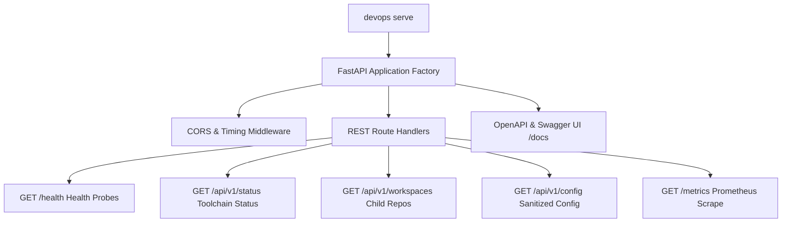

# Knowledge Base Task: Workstation REST API Service Engine

## 1. Overview & Purpose

The Workstation REST API Service Engine (`devops serve` / `src/devops_cli/server`) provides a programmatic HTTP/REST interface to the DevOps CLI. It enables external tools, IDE extensions, CI sidecars, and browser dashboards to query workstation health, toolchain availability, discovered child workspaces, and sanitized configuration settings, as well as scrape Prometheus metrics and view OpenAPI documentation.

---

## 2. Architecture & Service Components



- **Built-in Endpoints**:
  - `GET /health`, `GET /healthz`: Health and liveness probes.
  - `GET /api/v1/status`: Workstation tool availability checks (`uv`, `docker`, `kubectl`, `helm`, `minikube`, `tofu`, `ollama`, `gh`), Python runtime, and OTel probe.
  - `GET /api/v1/workspaces`: Bounded child workspace discovery (2 levels deep).
  - `GET /api/v1/config`: Configuration inspection with token masking.
  - `GET /api/v1/telemetry`: OpenTelemetry collector connectivity.
  - `GET /metrics`: Prometheus metric series.
  - `/docs`, `/redoc`, `/openapi.json`: OpenAPI documentation.

---

## 3. Useful Usage Information & Common Commands

### Service Commands
```bash
# Launch DevOps REST service on localhost:8000
devops serve

# Launch on custom port with auto-reload for local development
devops serve --host 127.0.0.1 --port 8080 --reload

# Launch in production mode without Swagger docs and 4 worker processes
devops serve --no-docs --workers 4 --log-level info
```

### Direct HTTP Invocations
```bash
# Check toolchain availability
curl -s http://localhost:8000/api/v1/status | jq .

# List discovered child repositories
curl -s http://localhost:8000/api/v1/workspaces | jq .

# Scrape Prometheus metrics
curl -s http://localhost:8000/metrics
```

---

## 4. Best Practice Guidance

1. **Use Pydantic Schemas**: Always return typed Pydantic models for predictable JSON serialization and automatic OpenAPI documentation.
2. **Include Version & Timing Headers**: The service injects `X-Process-Time` and `X-DevOps-Version` headers on all responses for latency tracking and client version verification.
3. **Bound File Operations**: Never perform unbounded recursive file scans in API request lifecycles.
4. **Graceful Shutdown**: Use standard SIGTERM / SIGINT signals to allow active requests to finish cleanly.

---

## 5. Security Recommendations & Zero-Trust Policies

- **Bind to Localhost**: Default binding to `127.0.0.1` prevents unauthorized network access.
- **Mask Sensitive Values**: Never expose plaintext API keys or tokens in configuration endpoints (`/api/v1/config`).

---

## 6. General Standards & Reference Guidelines

- **Default Port**: `8000`.
- **OpenAPI Version**: `3.1.0`.
- **Python Framework**: FastAPI + Uvicorn ASGI server.

---

## 7. Official References & Published Artifacts

- **FastAPI Documentation**: [fastapi.tiangolo.com](https://fastapi.tiangolo.com/)
- **Uvicorn Documentation**: [uvicorn.org](https://www.uvicorn.org/)
- **DevOps CLI Server Factory**: [src/devops_cli/server/app.py](../../../server/app.py)
- **Serve Command Module**: [src/devops_cli/commands/serve.py](../../../commands/serve.py)
