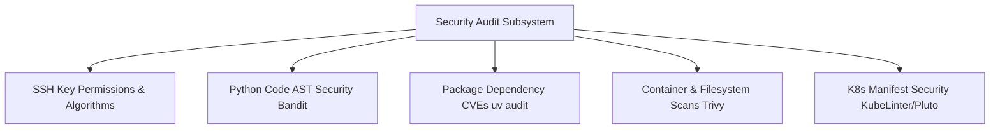

# Knowledge Base Task: Security Auditing & Vulnerability Scanning

## 1. Overview & Purpose

Security auditing and vulnerability scanning in `devops-cli` provide an end-to-end security posture assessment of developer workstations, container images, Kubernetes manifests, SSH key configurations, and third-party dependencies.

---

## 2. Architecture & Audit Matrix



- **Multi-Scanner Synthesis**: Aggregates findings from `bandit`, `trivy`, `uv audit`, `kubelinter`, `pluto`, and SSH audit tools into unified JSON and terminal reports.
- **Automated Remediation**: Hardens SSH key permissions (`0600` private, `0644` public, `0700` `~/.ssh`), configures SSH commit signing, and sanitizes configurations.

---

## 3. Useful Usage Information & Common Commands

### Security Subcommands
```bash
# Audit workstation SSH keys, permissions, and cipher safety
devops ssh audit

# Run full workstation security scanning
devops scan security src/

# Scan container image for CVEs and misconfigurations
devops scan image ghcr.io/dan-petty/devops-cli/devcontainer:latest

# Audit Python dependencies against vulnerability advisories
uv audit

# Run Bandit AST static security analysis
bandit -r src/
```

---

## 4. Best Practice Guidance

1. **Pre-Commit Auditing**: Execute `devops scan security` or `devops ci` prior to creating pull requests to catch security issues locally.
2. **Modern SSH Cryptography**: Prefer Ed25519 keys (`id_ed25519`) over legacy RSA keys for SSH authentication and Git commit signing.
3. **Automate Dependency Updates**: Regularly update pinned dependencies in `pyproject.toml` and run `uv lock --upgrade` to remediate known CVEs.
4. **Enforce Least Privilege**: Audit Kubernetes manifests for missing security contexts and unconstrained privilege escalation.

---

## 5. Security Recommendations & Zero-Trust Policies

- **Zero Tolerance for Plaintext Secrets**: Never store tokens in code or configuration files; always use OS Keyring (`devops config set`).
- **Bound Subprocess Execution**: All security scanner subprocesses must execute with explicit timeouts and argument lists.
- **Egress Destination Validation**: Validate all remote vulnerability database endpoints against SSRF risks.

---

## 6. General Standards & Reference Guidelines

- **Compliance Standards**: CIS Benchmarks, OWASP Top 10, NIST SP 800-53, PEP 508.
- **Severity Levels**: `CRITICAL`, `HIGH`, `MEDIUM`, `LOW`.

---

## 7. Official References & Published Artifacts

- **DevOps CLI Security Module**: [src/devops_cli/security/](../../../../security)
- **SSH Audit Engine**: [src/devops_cli/commands/ssh.py](../../../../commands/ssh.py)
- **Aqua Security Trivy Scanner**: [github.com/aquasecurity/trivy](https://github.com/aquasecurity/trivy)
- **PyCQA Bandit Static Analyzer**: [github.com/PyCQA/bandit](https://github.com/PyCQA/bandit)
