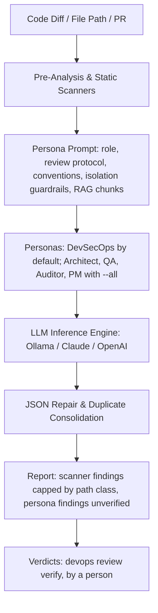

# Knowledge Base Topic: Agentic AI & Automated Code Review Systems

## 1. Overview & Domain Architecture

Agentic AI systems leverage large language models (LLMs) not merely for text generation, but as reasoning engines capable of multi-step problem solving, deterministic code inspection, closed-loop verification, and grounded domain feedback. In the `devops-cli` ecosystem, Agentic AI powers automated multi-persona code reviews (`devops review`), RAG semantic context indexing (`devops ai rag`), and automated instruction scaffolding (`devops ai agents`).



---

## 2. Key Concepts & Theoretical Foundations

- **Multi-Persona Code Review**: Code review quality improves substantially when diffs are evaluated from distinct cognitive perspectives rather than a single generic prompt. Personas embody specialized heuristics:
  - **DevSecOps**: CWE compliance, injection vulnerabilities, secret leakage, egress risks, subprocess safety.
  - **Architect**: SOLID principles, coupling, cohesion, interface stability, strict typing, standard library parsers.
  - **Auditor**: License obligations, log sanitization, data privacy, compliance standards.
  - **QA**: Edge cases, exception handling, mock deterministic isolation, flaky test prevention.
  - **PM**: Requirement completeness, changelog accuracy, documentation integrity.
- **Closed-Loop Feedback & Self-Improvement**:
  - **Verdicts**: No model and no criterion gives a finding its verdict. A persona's finding is reported unverified until a person judges it with `devops review verify`, which labels that session's files and nothing else.
  - **Persona Independence**: Each selected persona reviews independently, with its own system prompt; no persona agreement or debate is computed, and `challenger` runs only when `--persona challenger` names it.
  - **Known False Positives**: A false positive that recurs is a reviewed `[[suppressions]]` entry in `.devops/review.toml` with a rule, a path, a reason and an expiry; a scanner finding it covers is listed as suppressed and not reported.
  - **Structured Feedback Dataset**: Verdicts are appended to one JSONL feedback dataset, `.data/feedback_dataset.jsonl` (`devops review export-feedback --status ALL`), which `devops ai prompt-eval` counts per labeller. Nothing else reads it.
  - **Lockfile-Aware Dependency Resolution**: Evaluates dependency vulnerability alerts against exact cryptographic package releases resolved from authoritative lockfiles (`uv.lock`, `poetry.lock`, `package-lock.json`, `Cargo.lock`, `go.sum`) to prevent false alarms on loose manifest ranges (`>=`, `~=`).
  - **Network Reference & Code Identifier Disambiguation**: Applies RFC 1123/2606 rules, Public Suffix List (`tldextract`) validation, and AST introspection to distinguish legitimate network domains from source file names (`*.py`, `*.md`, `*.sh`, `*.tf`, `*.rs`, `*.pid`) and telemetry/code property paths (`service.name`, `ci.step.*`, `host.name`, `process.pid`).
  - **Self-Healing Remediations**: AI generates verifiable, syntax-valid, drop-in patches ready for immediate CI test execution.
  - **Path & Boundary Validation**: Evaluators verify that file operations, release paths, and workspace tools enforce repository containment (`Path.is_relative_to`) to prevent path traversal.
  - **Zero-Trust Secret Verification**: Evaluators confirm that credentials use secure OS Keyring backends (`keyring>=25`) and reject unencrypted plaintext store additions.
  - **Information Exposure, Bounded Exceptions & Network Invariants (CWE-200 / CWE-209 / CWE-400)**: Evaluators verify that exception messages, CLI error output, and logs mask private IP addresses, internal hostnames, and credentials. Structured exception details dictionaries must enforce bounded string length caps ($\le 256$ characters) on caller inputs, public documentation must strictly use RFC 5737 documentation blocks (`192.0.2.0/24`), and token budget loops must maintain linear $O(N)$ execution.
  - **Knowledge Feedback**: Everything changes through a commit: a recurring false positive becomes a `.devops/review.toml` suppression, a project's review rule goes into its `.devops/review.md`, and a prompt changes when someone edits it. No verdict reaches the RAG index or a later review.
- **Adaptive Two-Axis LLM Routing**:
  - **Complexity Axis**: Dispatches simple tasks (format, summarize) to fast mini/local models and complex architectural synthesis to frontier models.
  - **Freshness Axis**: Dynamically decides whether live web/MCP grounding is required, avoiding redundant search latency and saving up to 92% in inference costs.
- **Agent Harness Slots & Sub-Agent Local Offloading**:
  - Partitions agent systems into swappable slots (Model, Skills, Tools, Sub-Agents).
  - Offloads token-heavy exploration sub-agents (file indexing, symbol extraction) to local open-weight models (Granite, Qwen, DeepSeek), achieving **87% input token savings** while reserving frontier models for planning and verification ("Big decides, small types, big checks").
- **Model Dependency Chaos Engineering & Slow-Zone Resilience**:
  - Implements "Chaos Monkey for Models" by testing system workflows against degraded/fallback models to ensure operational continuity when frontier APIs experience downtime or policy changes.
  - Prioritizes complete, synchronized CLI `--help` and documentation so fallback models can pilot complex tasks autonomously.
- **Context Grounding via RAG**: With RAG enabled, each file's persona prompt carries up to three chunks the RAG index returns for the file's path and key symbols, marked as untrusted context. The conventions themselves (`AGENTS.md` and `.devops/review.md`) are read from the target, not from the index.
- **LLM Response Caching & Warm Starting Points**:
  - **Deterministic Caching**: Multi-tiered in-memory and persistent disk caching (`.data/cache/llm/`) hashes model, system instructions, and messages with SHA-256 (`usedforsecurity=False`), eliminating redundant LLM dispatches and reducing review latency to 0ms for unmodified inputs.
  - **Warm Baseline Starting Points**: When refining previous analyses or reviewing modified code diffs, prior cached responses are injected as structured `<starting_point>` baselines. This guides the model to preserve valid conclusions, revise outdated findings, and converge quickly.
  - **Cache Governance**: CLI commands (`devops ai cache status`, `devops ai cache clear`) provide observability into cache hit rates, memory entries, disk utilization, and TTL lifecycle.

---

## 3. Operational Patterns & Workflows in DevOps CLI

### Prompt Task Isolation
All system prompts, task instructions and evaluation rubrics are stored in dedicated Markdown files: task prompts under `src/devops_cli/ai/tasks/` (e.g. `review.md`, `code_review_prompt.md`) and each persona's `role.md` and `prompt.md` under `src/devops_cli/ai/personas/<persona>/`. Prompt text is never declared inline in Python code.

### Canonical Instruction Model (`AGENTS.md`)
AI assistants operate best when provided with a single authoritative source of truth. `devops-cli` establishes `AGENTS.md` at the repository root as the canonical instruction file, while `CLAUDE.md` and `.github/copilot-instructions.md` serve as thin redirection pointers.

### Common Commands
```bash
# Review active working directory git diff with DevSecOps persona
devops ai review branch --persona devsecops

# Review an entire target project path
devops ai review path repos/my-org/my-project

# Append the review verdicts to the feedback dataset (.data/feedback_dataset.jsonl), which devops ai prompt-eval reads
devops ai review export-feedback --status ALL

# Check LLM response cache performance and hit rates
devops ai cache status

# Clear LLM response cache entries
devops ai cache clear

# Scaffold AI agent instructions across child repositories
devops ai agents --repo repos/my-org/my-project --template

# Index codebase documentation into local RAG vector store
devops ai rag index docs/
```

---

## 4. Best Practice Guidance

1. **Target-Agnostic Code Analysis**: When analyzing target repositories (e.g. under `repos/`), evaluate code against universal software engineering standards (OWASP, SOLID, DRY) and the target project's own declared conventions (`AGENTS.md`) rather than coupling to host CLI assumptions.
2. **Target Path Resolution & Isolation**: All file reading, AST analysis, and security scanning on target projects must resolve paths relative to the target root directory (`target_dir`) to prevent host-workspace file collisions.
3. **Actionable AI Feedback**: Always conclude agent analyses with concrete remediation snippets, file line references, and drop-in patches.
4. **Structured JSON Output Repair**: Employ defensive parsing (`repair_json_string`) and schema validation to handle LLM markdown code blocks and conversational preambles gracefully.
5. **Context-Aware Documentation & Avoidance Context**: AI review engines must never flag documentation, architectural guides, security tutorials, or prompt tasks describing known vulnerabilities or insecure configurations in the context of avoiding or mitigating them.

---

## 5. Security Recommendations & Zero-Trust Governance

- **Prompt Injection Defense & Boundary Escaping**: Sanitize untrusted diffs and external user inputs by escaping boundary closing tags (e.g. `</untrusted_code_diff>`) and HTML-escaping titles before prompt interpolation.
- **Path Traversal & Symlink Defense**: Ensure all target directory traversals (`_find_repo_files`, `load_custom_repo_persona`, `load_test_document_corpus`) enforce strict containment within the target repository root and reject symlinks pointing to external or arbitrary system files.
- **Zero Secret Exposure & Secret Path Filtering**: Strip API keys, tokens, cloud credentials (AWS, GCP, Azure), and private keys from prompts. Automatically filter out secret-containing paths (`.env*`, `.pem`, `*.key`, `*secret*`) before embedding excerpts into LLM prompts.
- **ReDoS Prevention**: Enforce strict length limits on inputs and use bounded, non-backtracking regular expressions for tool and JSON extraction.
- **SSRF & URL Normalization**: Canonicalize, parse, and validate service endpoints before initializing external or internal network clients (e.g. Qdrant, Ollama).
- **Offline Inference**: Support fully air-gapped local model inference via Ollama (`deepseek-r1:14b`, `qwen2.5-coder:14b`) for sensitive codebases.

---

## 6. General Standards & Engineering Guidelines

- **Task Prompt Location**: `src/devops_cli/ai/tasks/*.md`.
- **Persona Identifiers**: `devsecops`, `architect`, `auditor`, `qa`, `pm`, `challenger`.
- **Finding Schema**: Pydantic models `Finding` and `SavedFinding` (`src/devops_cli/ai/review_schema.py`) with strict typing.
- **Indentation Limits & Modularity**: Aim for fewer than 6 indentations project-wide; extract complex multi-branch and nested loops into dedicated, single-responsibility functions.

---

## 7. Official References & Published Artifacts

- **DevOps CLI AI Review Module**: [src/devops_cli/ai/review/pipeline.py](../../../../ai/review/pipeline.py)
- **AI Task Prompt Definitions**: [src/devops_cli/ai/tasks/](../../../../ai/tasks/)
- **Ollama Project**: [ollama.com](https://ollama.com/) | [github.com/ollama/ollama](https://github.com/ollama/ollama)
- **Anthropic Claude API**: [docs.anthropic.com](https://docs.anthropic.com/)
- **Model Context Protocol (MCP)**: [modelcontextprotocol.io](https://modelcontextprotocol.io/)
