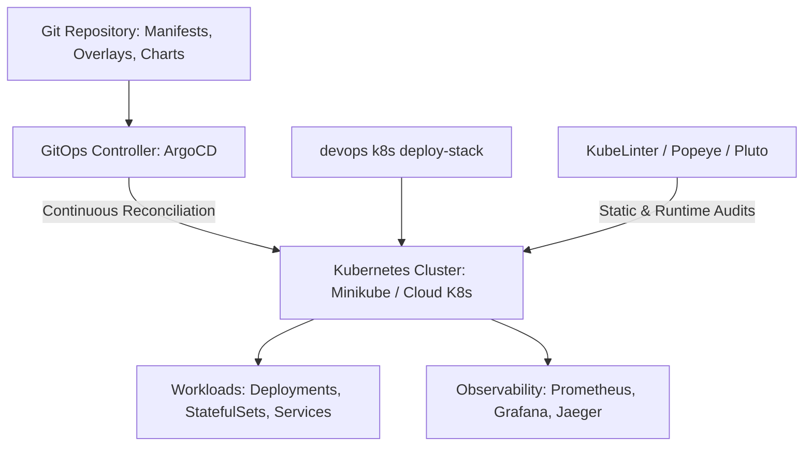

# Knowledge Base Topic: Cloud-Native Kubernetes & GitOps Delivery

## 1. Overview & Domain Architecture

Cloud-Native Kubernetes and GitOps continuous delivery represent the modern standard for container orchestration, declarative infrastructure lifecycle, automated reconciliation, and self-healing infrastructure. In `devops-cli`, this domain encompasses automated local cluster bootstrapping with Minikube, packaging with Helm, overlay customization with Kustomize, GitOps reconciliation with ArgoCD, and cluster safety auditing with KubeLinter, Popeye, and Pluto.



---

## 2. Key Concepts & Theoretical Foundations

- **Declarative State & GitOps**: Infrastructure and applications are defined as declarative code in Git repositories. The active cluster state continuously reconciles against Git via controllers like ArgoCD.
- **Packaging & Composition Patterns**:
  - **Helm**: Parameterized packaging, semantic release versioning, atomic rollback capabilities.
  - **Kustomize**: Template-free overlay inheritance (`base/` + `overlays/<env>/`) using strategic merge patches.
- **Kubernetes Cluster Topologies & Targeting**:
  - **Embedded DevContainer Minikube**: Local single-node cluster using the Docker-in-Docker driver (`--driver=docker`) with GPU passthrough and conditional autostart governed by `k8s.context == "minikube"`.
  - **Docker Desktop Kubernetes (`docker-desktop`)**: Local workstation cluster running on macOS/Windows host, accessed via bind-mounted `~/.kube` and `host.docker.internal:6443`.
  - **Local Host Clusters (`kind`, `k3s`, `k3d`)**: Containerized or lightweight local clusters running on the workstation host without consuming DevContainer resources.
  - **Cloud-Managed Clusters (Amazon EKS, Google GKE, Azure AKS)**: Remote enterprise clusters authenticated via cloud provider CLIs (`aws`, `gcloud`, `az`) and IAM credentials forwarded into the container.
- **Dynamic Context Routing**:
  - `k8s.context` configuration setting and `DEVOPS_CLI_K8S_CONTEXT` environment variable dictate the target cluster.
  - Context switching (`devops k8s switch-context <name>`) dynamically updates active kubeconfig and persists settings, automatically starting Minikube if selected and stopped.
- **Pod Security Standards (PSS)**: Restricting privileged containers, enforcing non-root users, and enforcing read-only root filesystems across namespaces.

---

## 3. Operational Patterns & Workflows in DevOps CLI

### One-Command Stack Deployments
`devops-cli` provides automated Helm stack orchestration:
- `devops k8s bootstrap`: Provisions a Docker-driven Minikube cluster with GPU passthrough (`--gpus all`).
- `devops k8s deploy-stack monitoring`: Deploys Prometheus and Grafana.
- `devops k8s deploy-stack gitops`: Deploys ArgoCD.
- `devops k8s deploy-stack tracing`: Deploys Jaeger and OpenTelemetry collectors.

### Common Commands
```bash
# List available Kubernetes contexts and identify active cluster
devops k8s contexts

# Switch active context (autostarts Minikube if stopped and targeted)
devops k8s switch-context minikube
devops k8s switch-context docker-desktop
devops k8s switch-context kind-dev-cluster

# Check cluster status and node readiness for active context
devops k8s status

# Bootstrap local Minikube cluster explicitly
devops k8s bootstrap

# Deploy all observability and GitOps stacks to active context
devops k8s deploy-stack all

# Real-time pod monitoring across namespaces
devops k8s pods --all-namespaces

# Sanitize cluster health with Popeye
devops scan popeye --namespace monitoring

# Check deprecated API versions with Pluto
devops scan pluto k8s/
```

---

## 4. Best Practice Guidance

1. **Idempotent Deployments**: Use `helm upgrade --install --atomic` with explicit timeouts to ensure failed deployments automatically roll back to clean previous states.
2. **Namespace Segregation**: Segregate workloads, monitoring agents, and delivery controllers into dedicated namespaces (`monitoring`, `argocd`, `default`).
3. **Resource Requests & Limits**: Always declare `resources.requests` (CPU/Memory) and `resources.limits` to prevent noisy-neighbor container crashes.
4. **Audit API Deprecations Early**: Run Pluto in CI pipelines prior to cluster version upgrades to catch deprecated `apiVersion` entries before deployment.

---

## 5. Security Recommendations & Zero-Trust Governance

- **Enforce Restricted Pod Security**: Block `allowPrivilegeEscalation: true` and drop Linux capabilities (`drop: ["ALL"]`).
- **Protect API Server & Kubeconfig**: Secure `~/.kube/config` permissions (`0600`) and never expose Kubernetes API server endpoints to unauthenticated public networks.
- **Rotate Initial Secrets**: Immediately rotate and purge default admin credentials generated by ArgoCD and Grafana.

---

## 6. General Standards & Engineering Guidelines

- **Namespace Naming**: Lowercase kebab-case (`monitoring`, `argocd`, `ingress-nginx`).
- **Resource Labels**: Standard Kubernetes metadata labels (`app.kubernetes.io/name`, `app.kubernetes.io/instance`, `app.kubernetes.io/version`, `app.kubernetes.io/managed-by`).

---

## 7. Official References & Published Artifacts

- **Kubernetes Documentation**: [kubernetes.io](https://kubernetes.io/)
- **ArgoCD GitOps Project**: [argo-cd.readthedocs.io](https://argo-cd.readthedocs.io/) | [github.com/argoproj/argo-cd](https://github.com/argoproj/argo-cd)
- **Helm Documentation**: [helm.sh](https://helm.sh/) | [github.com/helm/helm](https://github.com/helm/helm)
- **Minikube Project**: [minikube.sigs.k8s.io](https://minikube.sigs.k8s.io/) | [github.com/kubernetes/minikube](https://github.com/kubernetes/minikube)
- **DevOps CLI Kubernetes Subsystem**: [src/devops_cli/commands/k8s/](../../../../commands/k8s/)
