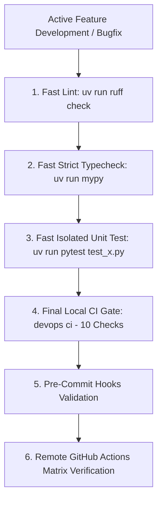

# Knowledge Base Topic: Continuous Integration & Progressive Verification

## 1. Overview & Domain Architecture

Continuous Integration (CI) and Progressive Verification ensure that software modifications maintain high code quality, strict static type safety, thorough test coverage, zero security regressions, and synchronized documentation. In `devops-cli`, continuous integration is governed by a progressive testing strategy paired with a local 10-point quality gate (`devops ci`) and remote GitHub Actions workflows.



---

## 2. Key Concepts & Theoretical Foundations

- **Progressive Verification Philosophy**:
  - **Iterative Feedback Loop**: During active development, run isolated checks on modified files to keep developer feedback loops under 2 seconds.
  - **Comprehensive Quality Gate**: Execute the full local CI suite (`devops ci`) at pre-commit and pre-PR milestones to ensure 100% release readiness before pushing code.
- **The 10-Point Local Quality Gate**:
  1. Version Consistency (`pyproject.toml`, `__init__.py`, `RELEASE_NOTES.md`).
  2. Parallel Unit Tests (`pytest -n auto`).
  3. Branch Coverage Floor (`>=70%`).
  4. Fast Code Linting (`ruff check`).
  5. Fast Code Formatting (`ruff format --check`).
  6. Strict Static Type Checking (`mypy --strict`).
  7. Dependency CVE Audit (`uv audit`).
  8. Static Security AST Scan (`bandit`).
  9. GitHub Actions Workflow Linter (`actionlint`).
  10. Documentation Freshness (`devops docs generate --check`).

---

## 3. Operational Patterns & Workflows in DevOps CLI

### Pre-Commit & Local CI Commands
```bash
# Execute the complete 10-point local quality gate
devops ci

# Execute with automatic fixes for linting and formatting
devops ci --fix

# Run targeted subset checks
devops ci test -v
devops ci lint
devops ci typecheck
devops ci security
devops ci docs
```

### Remote CI Monitoring
When creating or updating pull requests, `devops-cli` provides active remote check monitoring via the GitHub CLI:
```bash
# Watch pull request checks in real-time until green
gh pr checks 17 --watch

# View recent workflow runs on active release branch
gh run list --branch release/v0.2.0 -L 5
```

---

## 4. Best Practice Guidance

1. **Never Commit Failing Code**: Ensure all 10 local CI gates pass before committing code to feature or release branches.
2. **Deterministic Test Isolation**: Unit tests must isolate external dependencies (network, LLM providers, subprocesses) using mocks (`unittest.mock`, `pytest-mock`).
3. **Synchronize Docs Automatically**: If `devops ci docs` detects differences, run `devops docs generate --sync-readme` to regenerate markdown reference files.
4. **Fix Errors Systematically**: Resolve formatting and linting first, then static typing, then unit tests, and finally documentation.

---

## 5. Security Recommendations & Zero-Trust Governance

- **Lockfile Integrity**: Always install dependencies in CI with frozen lockfiles (`uv sync --frozen`) to prevent supply chain tampering.
- **Automated Workflow Linting**: Run `actionlint` locally to prevent script injection vulnerabilities inside GitHub Actions expressions.

---

## 6. General Standards & Engineering Guidelines

- **Quality Threshold**: 100% pass on all 10 quality gates.
- **Test Execution**: Multi-core parallel execution via `pytest-xdist`.
- **Workflow Path**: `.github/workflows/ci.yml`.

---

## 7. Official References & Published Artifacts

- **DevOps CLI CI Module**: [src/devops_cli/commands/ci.py](../../../../commands/ci.py)
- **GitHub Actions Workflow**: [.github/workflows/ci.yml](../../../../../../.github/workflows/ci.yml)
- **Actionlint Project**: [github.com/rhysd/actionlint](https://github.com/rhysd/actionlint)
- **Pytest Documentation**: [pytest.org](https://docs.pytest.org/)
- **Ruff Documentation**: [astral.sh/ruff](https://astral.sh/ruff)
