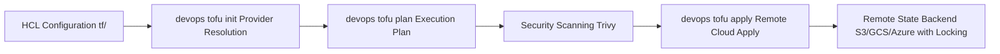

# Knowledge Base Topic: Infrastructure as Code & Cloud Automation

## 1. Overview & Domain Architecture

Infrastructure as Code (IaC) is the practice of managing and provisioning cloud compute, networking, storage, and Kubernetes infrastructure through machine-readable definition files rather than manual web console interactions. In `devops-cli`, IaC workflows are standardized around OpenTofu and Terraform, providing declarative state management, provider locking, automated plan validation, and drift detection.



---

## 2. Key Concepts & Theoretical Foundations

- **Declarative Infrastructure**: Declaring desired target cloud resources (e.g. AWS VPCs, EKS clusters, S3 buckets) in HashiCorp Configuration Language (HCL2) while the execution engine computes the graph of resource dependencies.
- **State Management & Locking**: Preserving cloud resource mappings in state backends with distributed concurrency locks (e.g. DynamoDB, GCS lock) to prevent simultaneous colliding applies.
- **Execution Plan Safety (`.tfplan`)**: Generating an immutable binary execution plan before applying changes, guaranteeing that only reviewed additions, modifications, and deletions are executed.
- **Provider Plugin Ecosystem**: Leveraging open-source providers (AWS, Google, Azure, Kubernetes, Helm, Cloudflare) cached centrally.

---

## 3. Operational Patterns & Workflows in DevOps CLI

### Dual-Binary Dispatch
`devops-cli` automatically inspects the environment, preferring `tofu` and seamlessly falling back to `terraform`.

### Structured Layout
```text
tf/
├── aws/           # AWS cloud infrastructure
├── k8s/           # Kubernetes manifests via Helm/K8s providers
└── environments/  # Environment variable overrides (.tfvars)
```

### Common Commands
```bash
# Initialize OpenTofu working directory
devops tofu init --path tf/aws

# Compute execution plan with variable file
devops tofu plan --path tf/aws -v tf/environments/dev.tfvars -o dev.tfplan

# Apply the pre-computed plan file
devops tofu apply --path tf/aws --plan dev.tfplan

# Read structured JSON outputs
devops tofu output --path tf/aws --json

# Inspect state status and provider health
devops tofu status --path tf/aws
```

---

## 4. Best Practice Guidance

1. **Always Use Dedicated Plan Files**: In automated CI/CD and production environments, never run `apply` without passing an explicit `.tfplan` file.
2. **Lock Provider Semvers**: Pin all provider versions in `versions.tf` (`required_providers`) to prevent unexpected upstream breaking changes.
3. **Format All HCL Manifests**: Enforce `tofu fmt -recursive` across all configuration directories (enforced automatically in `devops ci`).
4. **Environment Isolation**: Separate production and non-production states using separate backend prefixes or distinct workspace directories.

---

## 5. Security Recommendations & Zero-Trust Governance

- **Never Commit State Files**: Keep `.tfstate` and `.tfstate.backup` in `.gitignore`; state files often contain sensitive unencrypted resource attributes.
- **Redact Sensitive Outputs**: Mark sensitive values with `sensitive = true` to prevent them from appearing in CI console outputs.
- **Pre-Apply Static Analysis**: Scan IaC configurations with Trivy (`trivy config tf/`) to detect open security groups or unencrypted disks prior to apply.

---

## 6. General Standards & Engineering Guidelines

- **File Conventions**: `main.tf`, `variables.tf`, `outputs.tf`, `versions.tf`.
- **Variable Typing**: Always specify explicit type constraints (`type = string`, `type = map(string)`).

---

## 7. Official References & Published Artifacts

- **OpenTofu Project**: [opentofu.org](https://opentofu.org/) | [github.com/opentofu/opentofu](https://github.com/opentofu/opentofu)
- **OpenTofu Registry**: [search.opentofu.org](https://search.opentofu.org/)
- **Terraform Documentation**: [developer.hashicorp.com/terraform](https://developer.hashicorp.com/terraform)
- **DevOps CLI IaC Subsystem**: [src/devops_cli/commands/tf.py](../../../commands/tf.py)
