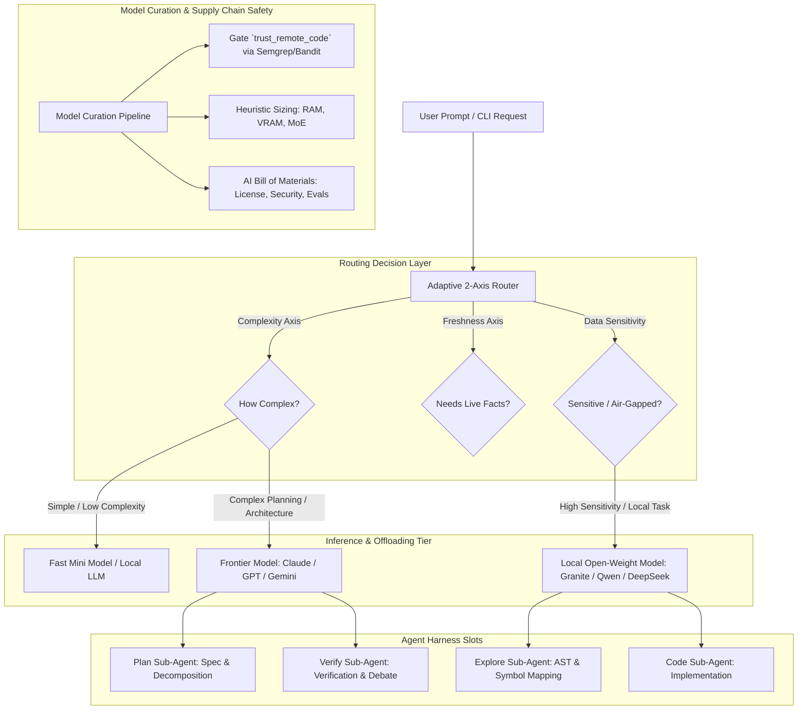

# Knowledge Base Topic: Model Governance, Adaptive Routing, Curation & Resilience

## 1. Overview & Domain Architecture

Modern enterprise AI systems are shifting from monolithic single-frontier-model architectures toward **hybrid, multi-model agentic ecosystems**. Instead of sending every prompt to an expensive proprietary frontier model, high-reliability engineering platforms leverage **adaptive workflow routing**, **open-weight model curation**, **sub-agent local offloading**, and **model dependency chaos engineering**.



---

## 2. Key Architectural Tenets & Theoretical Foundations

### 2.1. Open-Weight vs. Commercial Frontier Models: Two Products, Not Two Tiers
- **Commercial Frontier Models (Proprietary APIs)**:
  - Highest reasoning ceiling, multi-modal capabilities, zero local GPU hardware footprint.
  - *Trade-offs*: Data egress outside security perimeter, variable per-token cost scaling, potential vendor lock-in, and silent mid-quarter behavior shifts or sudden deprecations.
- **Open-Weight Models (Self-Hosted / Local)**:
  - Full data sovereignty (on-prem, air-gapped, in-region), fixed infrastructure line-item cost (no per-token penalty), full weight access for fine-tuning (LoRA, QLoRA), immutable versioning, and rapid innovation from open research.
  - *Trade-offs*: Local VRAM/compute management, self-managed quantization, and lower absolute reasoning ceiling on complex zero-shot tasks.
- **Strategic Principle: "Own the Sensitive, Rent the Frontier"**:
  - Run both in a unified workflow. Keep confidential IP, internal credentials, and sensitive workstation data on local/in-cluster open models while routing high-complexity architectural planning to frontier reasoning engines.

### 2.2. "Open" Licensing & Governance Taxonomy
Open models exhibit diverse licensing frameworks with distinct compliance requirements:
1. **True Open Source**: Full code + training scripts + complete dataset transparency + weights (e.g. OLMo, Amber, Pythia).
2. **Open Source Code**: Training and inference code public; training data private (e.g. DeepSeek-V3, Qwen3).
3. **Permissive Open Weight**: Model weights released under Apache 2.0 or MIT licenses with zero data transparency (e.g. DeepSeek-V3, Qwen-2.5, Gemma 2, gpt-oss-120B).
4. **Open Weights, Capped**: Permissive weights restricted by commercial revenue or active user thresholds (e.g. Llama 3.3, Falcon 180B).
5. **Open Weights, Behavioral (RAIL)**: Weights governed by Responsible AI Licenses with contractual restrictions on specific operational use cases (e.g. BLOOM, Gemma, Falcon 2/3).

### 2.3. Model Curation Pipeline & Fast Governance (Avoiding Shadow AI)
Slow governance does not prevent AI adoption—it drives engineers toward unmonitored "Shadow AI" workarounds (~$700K average breach cost). Fast, automated governance serves as an active security control:
- **Fail Before Spending Compute**:
  - Automatically gate and block model repositories requesting `trust_remote_code=True` before spinning up expensive GPU conversion/quantization instances.
  - Execute static AST security scans (Semgrep, Bandit) on custom model repository files to prevent arbitrary remote code execution.
- **Heuristic Sizing Up-Front**:
  - Compute RAM, VRAM, and scratch disk requirements dynamically from parameter counts, context window limits, and Mixture-of-Experts (MoE) active/total layer topologies before triggering conversion.
- **Cache Upstream, Retry Local**:
  - Ingest multi-GB/TB weights into a local-first staging store (e.g. S3/R2/EFS cache). Retry transient conversion or quantization failures against the local mirror rather than re-downloading upstream.
- **AI Bill of Materials (AIBOM)**:
  - Generate verifiable, machine-readable documentation capturing:
    1. **License Terms**: Full text snapshot, redistribution rights, commercial triggers, acceptable use policies (AUP), and attribution clauses.
    2. **Security Audit Findings**: Semgrep/Bandit static scan results, `trust_remote_code` safety clearance, and supply chain provenance.
    3. **Evaluation Benchmarks**: Accuracy, latency, and throughput across quantization tiers (FP16, Q8_0, Q4_K_M).
    4. **Resource Profiles**: Peak RAM, VRAM, context window budget, and inference speed (tokens/sec).
    5. **Runnable File Manifest**: Cryptographic hashes (SHA-256) of weights, tokenizer configs, and companion files.
    6. **Publisher Record**: Publisher credentials, provenance, and responsiveness to CVEs.
- **Documented Deprecation (n-1 Policy)**:
  - Establish formal deprecation timelines, migration guides, and fallback runtimes when decommissioning model versions.

### 2.4. Adaptive Two-Axis LLM Routing
"Not every prompt needs the same language model. Right-size the model, then the context."
- **Axis 1: Complexity (How Hard?)**:
  - **Simple Tier** (rewording, formatting, entity extraction): Route to lightweight local models or fast mini models (`gpt-4o-mini`, `qwen2.5-coder:7b`).
  - **Moderate Tier** (API design, standard refactoring, query generation): Route to balanced models (`deepseek-chat`, `qwen2.5-coder:32b`, `granite-3.2`).
  - **Complex Tier** (system architecture, multi-file reasoning, security threat modeling): Route to frontier reasoning models (`claude-3-7-sonnet`, `o3-mini`, `deepseek-r1`).
- **Axis 2: Freshness (Needs Live Facts?)**:
  - Dynamic decision layer determining whether prompt requires live web/MCP search or can be answered strictly from model knowledge and local RAG context.
  - Trivial prompts skip live search; fresh queries inject concise, grounded markdown context.
- **Economic Payoff**: Yields up to **92% cost savings** compared to uniform all-frontier dispatch while preserving maximum answer quality.

### 2.5. Agent Harness Slots & Sub-Agent Local Offloading (The IBM Granite Pattern)
Agent harnesses partition reasoning into modular, swappable "slots":
1. **Model Slot**: Dynamic provider swap without code changes.
2. **Skills Slot**: Pluggable guardrails and specialized execution routines.
3. **Tools Slot**: Multimodal tooling (VLM, STT, code execution, doc models) behind security proxies.
4. **Sub-Agents Slot**: Dedicated, single-responsibility sub-agents (Explore, Plan, Code, Verify).

#### Sub-Agent Local Offloading Economics:
- Exploration sub-agents execute token-heavy operations (file tree traversal, AST symbol indexing, grep searches, dependency parsing) consuming 80–90% of total pipeline prompt tokens.
- **Offloading Strategy**: Delegate exploration and preliminary code drafting to local open-weight models (e.g. `granite-cli`, `qwen2.5-coder`) while retaining frontier models for architecture planning and final verification.
- **Measured Result**: Delivers **87% input token savings and 9% output token savings** on full-scale coding workflows.

#### Orchestration Shape: "Big Decides, Small Types, Big Checks"
1. **Big Model (Frontier)**: Analyzes requirements, architects design, and generates exact technical specifications.
2. **Small Model (Local / Open-Weight)**: Receives bounded specifications and generates implementation code (typing the diff).
3. **Big Model (Frontier)**: Inspects the generated diff against the specification, runs verification tests, and approves merge.

### 2.6. Model Dependency Chaos Engineering & Slow-Zone Resilience (The Fable/Gene Kim Blueprint)
Systems built solely around cutting-edge frontier models ("The Beyond") risk catastrophic failure when dropped into lower-intelligence fallback models ("The Slow Zone") due to sudden vendor outages, export controls, or policy revocations.

- **"Chaos Monkey for Models"**:
  - Deliberately inject model degradation experiments: Pull the primary frontier model and verify that secondary/local models (e.g. `llama-3.3-70b`, `qwen2.5-coder:14b`, `claude-3-5-haiku`) can operate the repository tools, CLI commands, and CI workflows without human intervention.
- **"It's Not the Model, It's the Documentation"**:
  - When models fail to operate tools, the root cause is rarely model deficiency—it is out-of-date `--help` output, incomplete documentation, or missing schemas.
  - Maintaining 100% documentation synchronization (`devops docs generate --sync-readme`) is a primary operational resilience control.
- **Agent Fleet Quiesce & Emergency Controls**:
  - Implement centralized shutdown/pause protocols (`devops ai quiesce`) to safely freeze running agent loops, background schedulers, and cron jobs during unexpected model failovers.
- **Eval-Driven Hill-Climbing**:
  - Replace subjective prompt adjustments with automated evaluation harnesses (`devops ai benchmark --suite`) tracking regression metrics across model transitions.

---

## 3. Operational CLI Commands & Integration

```bash
# Evaluate model curation safety and generate AI Bill of Materials (AIBOM)
devops ai curate-model --model qwen/qwen2.5-coder-32b --check-safety --generate-aibom

# Run two-axis adaptive routing benchmark across complexity and freshness tiers
devops ai benchmark --suite routing-cost-eval --compare-all-frontier

# Execute Sub-Agent Local Offloading review (Local explore/code + Frontier plan/verify)
devops ai review branch --orchestration-shape big-small-big --local-model ollama/granite-code:8b

# Run Model Dependency Chaos Engineering drill ("Chaos Monkey for Models")
devops ai chaos-model --fallback-model ollama/qwen2.5-coder:14b --test-suite regression

# Centralized emergency quiesce of all running agent tasks and background cron jobs
devops ai quiesce --reason "Upstream provider model deprecation failover"
```

---

## 4. Best Practices & Security Summary

| Pillar | Principle | Operational Standard |
| :--- | :--- | :--- |
| **Data Sovereignty** | Own the sensitive, rent the frontier | Keep confidential code and PII in local/air-gapped models; route abstract reasoning to frontier. |
| **Supply Chain Safety** | Fail before spending compute | Enforce AST/Semgrep scans and block `trust_remote_code=True` before GPU provisioning. |
| **Provenance** | Verifiable AIBOM | Document license terms, security scans, quant evals, and runnable file hashes for every model. |
| **Cost Optimization** | Right-size model and context | Route by complexity and freshness axes; offload exploration sub-agents to local models (87% token reduction). |
| **Operational Resilience** | Chaos-engineer model dependencies | Routinely test fallback models and keep documentation/CLI help 100% synchronized. |
| **Safety Governance** | Centralized fleet quiesce | Support instant pause/resume for all agent loops and cron jobs during failovers. |
