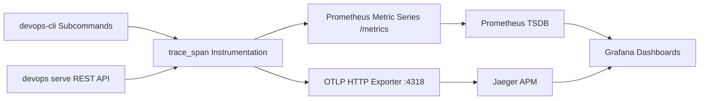

# Knowledge Base Topic: Workstation Observability & Distributed Tracing

## 1. Overview & Domain Architecture

Observability provides high-cardinality, vendor-neutral visibility into application performance, command latencies, error distributions, and system interactions. In `devops-cli`, observability unites OpenTelemetry distributed trace spans (`trace_span`), Prometheus time-series metrics (`/metrics`), Jaeger distributed trace visualization, and Grafana telemetry dashboards.



---

## 2. Key Concepts & Theoretical Foundations

- **The Three Pillars of Observability**:
  - **Traces**: Directed acyclic graphs of spans representing the full causal lifecycle of commands and subprocesses.
  - **Metrics**: Aggregated time-series counters, gauges, and latency histograms exposing throughput and error rates.
  - **Logs**: Structured event logs with contextual span and trace correlations.
- **W3C Trace Context Standard**: Propagating `traceparent` headers (`00-<trace_id>-<span_id>-01`) across process and network boundaries to link parent and child spans.
- **Semantic Conventions**: Adhering to official OpenTelemetry attribute naming (`service.name`, `cli.command`, `subprocess.bin`, `http.status_code`, `http.route`).

---

## 3. Operational Patterns & Workflows in DevOps CLI

### Built-in Tracer Engine (`src/devops_cli/telemetry/tracer.py`)
```python
from devops_cli.telemetry.tracer import trace_span

with trace_span("k8s.deploy_stack", {"stack.name": "monitoring"}):
    # Instrumented operation
    pass
```

### Automatic Prometheus Metrics
Exposed by `devops serve` on `GET /metrics` for Prometheus scraping:
- `devops_cli_command_total`: Counter tracking command executions by command name and status.
- `devops_cli_command_duration_seconds`: Histogram tracking command execution duration.
- `devops_cli_subprocess_seconds`: Subprocess runtime latency by binary.

### Common Commands
```bash
# Test OTLP telemetry collector connection
devops telemetry test

# View telemetry client status and active exporter endpoint
devops telemetry status

# Emit test trace probe
devops telemetry probe

# Scrape local Prometheus metrics
curl -s http://localhost:8000/metrics
```

---

## 4. Best Practice Guidance

1. **Non-Blocking Telemetry**: Telemetry collection and export must never block or crash core CLI execution; handle collector unreachability gracefully.
2. **Context Propagation**: Always propagate W3C `traceparent` headers when delegating tasks across background processes or REST API endpoints.
3. **Controlled Metric Cardinality**: Avoid unbounded dynamic strings (e.g. raw user input, timestamps) in metric label values to prevent Prometheus TSDB memory degradation.
4. **Structured Dashboards**: Organize Grafana dashboards into logical rows: Summary KPIs, Command Latencies, Subprocess Performance, and Error Breakdowns.

---

## 5. Security Recommendations & Zero-Trust Governance

- **Attribute Sanitization**: Filter out passwords, auth tokens, and sensitive customer data before attaching attributes to spans.
- **Local Collector Binding**: Ensure OTLP collector and Prometheus scrape endpoints are bound to localhost or isolated Kubernetes namespaces.

---

## 6. General Standards & Engineering Guidelines

- **Default OTLP Port**: HTTP `4318`, gRPC `4317`.
- **Default Jaeger UI**: `16686`.
- **Default Prometheus Port**: `9090`.
- **Default Grafana Port**: `3000`.

---

## 7. Official References & Published Artifacts

- **OpenTelemetry Standard**: [opentelemetry.io](https://opentelemetry.io/)
- **Jaeger Tracing Project**: [jaegertracing.io](https://www.jaegertracing.io/) | [github.com/jaegertracing/jaeger](https://github.com/jaegertracing/jaeger)
- **Prometheus Monitoring**: [prometheus.io](https://prometheus.io/) | [github.com/prometheus/prometheus](https://github.com/prometheus/prometheus)
- **Grafana Visualization**: [grafana.com](https://grafana.com/) | [github.com/grafana/grafana](https://github.com/grafana/grafana)
- **DevOps CLI Telemetry Subsystem**: [src/devops_cli/telemetry/tracer.py](../../../../telemetry/tracer.py)
