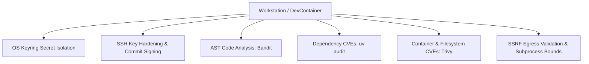

# Knowledge Base Topic: Zero-Trust Security & Workstation Compliance

## 1. Overview & Domain Architecture

Zero-Trust Security operates on the principle of "never trust, always verify." In modern developer workstations, agentic developer tooling, and automated CI pipelines, zero-trust requires strict credential isolation, defense-in-depth vulnerability scanning, safe subprocess execution, cryptographic commit verification, and proactive egress protection.



---

## 2. Key Concepts & Theoretical Foundations

- **Credential Isolation with OS Keyring**: Eliminating plaintext API tokens, SSH passphrases, and passwords from Git repositories, `.env` files, and log streams by delegating secret storage to OS Keyring / DBus SecretService.
- **Egress Safety & SSRF Mitigation**: Enforcing destination endpoint validation before dispatching outbound HTTP requests from CLI tools or AI agents.
- **Defensive Subprocess Execution**: Preventing shell injection vulnerabilities by strictly executing subprocesses with explicit argument lists (`["kubectl", "get", "pods"]`) and bounded timeouts rather than `shell=True`.
- **Cryptographic Commit Verification**: Ensuring all Git commits and release tags are cryptographically signed using Ed25519 SSH keys registered in GitHub.

---

## 3. Operational Patterns & Workflows in DevOps CLI

### Keyring Secret Management
`devops config set <key> <val>` routes secrets to OS Keyring under the `devops-cli` service namespace, with automatic masking in all CLI outputs and REST configuration endpoints (`/api/v1/config`).

### Multi-Scanner Security Suite
- `devops ssh audit`: Audits `~/.ssh/` key permissions, RSA bit lengths, and Ed25519 adoption.
- `devops scan image`: Scans container images with Trivy for CVEs.
- `bandit -r src/`: Analyzes Python AST nodes for common security antipatterns.
- `uv audit`: Verifies third-party Python dependencies against known CVE databases.

### Common Commands
```bash
# Securely configure GitHub token in OS Keyring
devops config set github.token ghp_xxxx1234567890

# Audit workstation SSH key permissions and configurations
devops ssh audit

# Run full workstation security scan
devops scan security src/

# Run Python package dependency vulnerability audit
uv audit
```

---

## 4. Best Practice Guidance

1. **Zero Plaintext Secrets & OS Keyring Exclusivity**: Never commit tokens, passwords, or credentials to configuration files, `.env` files, or test fixtures. Always use encrypted OS Keyring backends (`keyring>=25`); never use unencrypted plaintext fallbacks (such as `keyrings.alt`).
2. **Zero Information Leakage from Private/Gitignored Files**: AI assistants and tooling must never leak, extract, or transcribe data from hidden files (`.env*`, `.ssh/`, `.data/`), private configs, or `.gitignored` paths into documentation, review findings, or code.
3. **Repository Path Boundary Containment**: Enforce strict filesystem boundary validation (`resolved_path.is_relative_to(repo_root)`) on all file writing and reading helpers to mitigate path traversal (CWE-22) vulnerabilities.
4. **Use Ed25519 Keys**: Use modern Ed25519 keys for SSH authentication and Git commit signing (`devops ssh generate --type ed25519`).
5. **Automate Pre-Commit Scanning**: Enforce security linting (`bandit`, `actionlint`) in pre-commit hooks to catch security issues before remote push.
6. **Mask Output Logs**: Ensure string representations (`__repr__`) and telemetry exporters mask sensitive variables matching `*token*`, `*key*`, `*secret*`.

---

## 5. Security Recommendations & Zero-Trust Governance

- **Zero Information Leakage**: Prevent extraction of sensitive local environment context, private files, or dotfolders into generated artifacts.
- **Memory Lifetime**: Keep decrypted secrets in memory only for the minimal duration required to execute authenticated API calls.
- **Least Privilege Access**: Request minimal required scopes on GitHub Personal Access Tokens and cloud IAM roles.
- **Subprocess Argument Lists**: Never pass formatted strings to shell interpreters; pass tokenized argument arrays.

---

## 6. General Standards & Engineering Guidelines

- **File Permissions**: `0600` for private keys / config secrets, `0644` for public keys, `0700` for `~/.ssh` directory.
- **Compliance Frameworks**: CIS Benchmarks, OWASP Top 10, NIST SP 800-53.

---

## 7. Official References & Published Artifacts

- **DevOps CLI Security Module**: [src/devops_cli/security/](../../../security/)
- **SSH Audit Subsystem**: [src/devops_cli/ssh/audit.py](../../../commands/ssh.py)
- **Aqua Security Trivy**: [github.com/aquasecurity/trivy](https://github.com/aquasecurity/trivy)
- **PyCQA Bandit**: [github.com/PyCQA/bandit](https://github.com/PyCQA/bandit)
- **Python Keyring Library**: [github.com/jaraco/keyring](https://github.com/jaraco/keyring)
