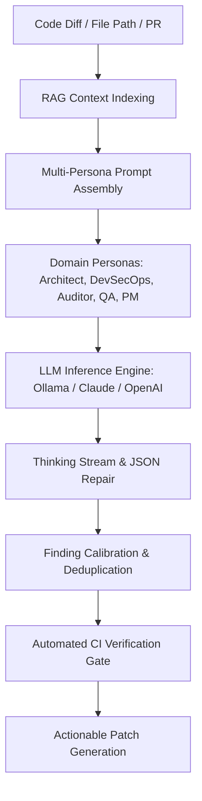

# Knowledge Base Topic: Agentic AI & Automated Code Review Systems

## 1. Overview & Domain Architecture

Agentic AI systems leverage large language models (LLMs) not merely for text generation, but as reasoning engines capable of multi-step problem solving, deterministic code inspection, closed-loop verification, and grounded domain feedback. In the `devops-cli` ecosystem, Agentic AI powers automated multi-persona code reviews (`devops review`), RAG semantic context indexing (`devops rag`), and automated instruction scaffolding (`devops ai agents`).



---

## 2. Key Concepts & Theoretical Foundations

- **Multi-Persona Code Review**: Code review quality improves substantially when diffs are evaluated from distinct cognitive perspectives rather than a single generic prompt. Personas embody specialized heuristics:
  - **DevSecOps**: CWE compliance, injection vulnerabilities, secret leakage, egress risks, subprocess safety.
  - **Architect**: SOLID principles, coupling, cohesion, interface stability, strict typing, standard library parsers.
  - **Auditor**: License obligations, log sanitization, data privacy, compliance standards.
  - **QA**: Edge cases, exception handling, mock deterministic isolation, flaky test prevention.
  - **PM**: Requirement completeness, changelog accuracy, documentation integrity.
- **Closed-Loop Feedback & Self-Improvement**:
  - **Verification & Invalidation Criteria**: Every finding is tested against explicit observable criteria in the AST and source code, eliminating theoretical or hallucinatory alerts.
  - **Confidence Calibration**: Multi-persona agreement and deterministic AST checks calibrate finding confidence scores before reporting.
  - **Self-Healing Remediations**: AI generates verifiable, syntax-valid, drop-in patches ready for immediate CI test execution.
  - **Continuous Knowledge Feedback**: Recurring patterns and architectural learnings feed back into `AGENTS.md` and RAG vector indexes, creating a continuously improving developer feedback loop.
- **Context Grounding via RAG**: Injecting semantic documentation chunks (`AGENTS.md`, architecture specs) into prompts to prevent hallucinations and align reviews with repository conventions.

---

## 3. Operational Patterns & Workflows in DevOps CLI

### Prompt Task Isolation
All system prompts, task instructions, evaluation rubrics, and persona benchmarks are stored in dedicated Markdown files under `src/devops_cli/ai/tasks/` (e.g. `architect.md`, `devsecops.md`). Prompt text is never declared inline in Python code.

### Canonical Instruction Model (`AGENTS.md`)
AI assistants operate best when provided with a single authoritative source of truth. `devops-cli` establishes `AGENTS.md` at the repository root as the canonical instruction file, while `CLAUDE.md` and `.github/copilot-instructions.md` serve as thin redirection pointers.

### Common Commands
```bash
# Review active working directory git diff with DevSecOps persona
devops review branch --persona devsecops

# Review an entire target project path
devops review path repos/my-org/my-project

# Scaffold AI agent instructions across child repositories
devops ai agents --repo repos/my-org/my-project --template

# Index codebase documentation into local RAG vector store
devops rag index docs/
```

---

## 4. Best Practice Guidance

1. **Target-Agnostic Code Analysis**: When analyzing target repositories (e.g. under `repos/`), evaluate code against universal software engineering standards (OWASP, SOLID, DRY) and the target project's own declared conventions (`AGENTS.md`) rather than coupling to host CLI assumptions.
2. **Target Path Resolution & Isolation**: All file reading, AST analysis, and security scanning on target projects must resolve paths relative to the target root directory (`target_dir`) to prevent host-workspace file collisions.
3. **Actionable AI Feedback**: Always conclude agent analyses with concrete remediation snippets, file line references, and drop-in patches.
4. **Structured JSON Output Repair**: Employ defensive parsing (`repair_json_string`) and schema validation to handle LLM markdown code blocks and conversational preambles gracefully.

---

## 5. Security Recommendations & Zero-Trust Governance

- **Prompt Injection Defense**: Sanitize all untrusted diffs and external user inputs by escaping prompt boundary tags (e.g. `<untrusted_diff>`).
- **Zero Secret Exposure**: Strip API tokens, private keys, and passwords before transmitting prompts to external LLM endpoints.
- **Offline Inference**: Support fully air-gapped local model inference via Ollama (`deepseek-r1:14b`, `qwen2.5-coder:14b`) for sensitive codebases.

---

## 6. General Standards & Engineering Guidelines

- **Task Prompt Location**: `src/devops_cli/ai/tasks/*.md`.
- **Persona Identifiers**: `devsecops`, `architect`, `auditor`, `qa`, `pm`.
- **Finding Schema**: Standardized Pydantic model (`ReviewFinding`) with strict typing.

---

## 7. Official References & Published Artifacts

- **DevOps CLI AI Review Module**: [src/devops_cli/ai/review.py](../../review/)
- **AI Task Prompt Definitions**: [src/devops_cli/ai/tasks/](../../../ai/tasks/)
- **Ollama Project**: [ollama.com](https://ollama.com/) | [github.com/ollama/ollama](https://github.com/ollama/ollama)
- **Anthropic Claude API**: [docs.anthropic.com](https://docs.anthropic.com/)
- **Model Context Protocol (MCP)**: [modelcontextprotocol.io](https://modelcontextprotocol.io/)
